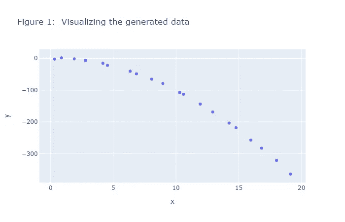
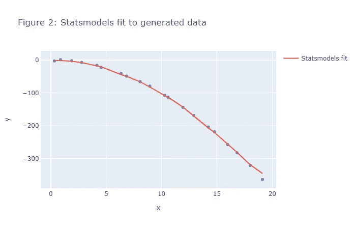
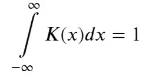
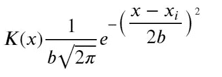
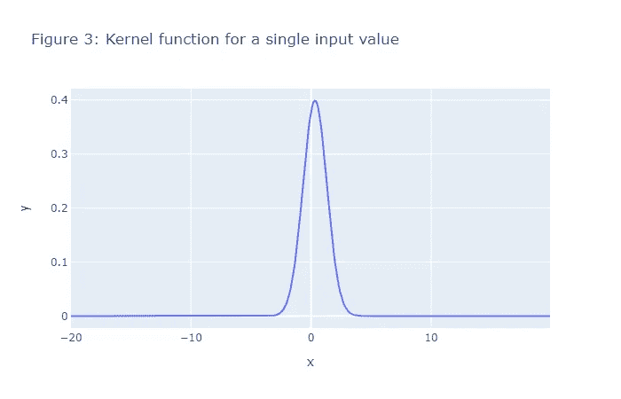
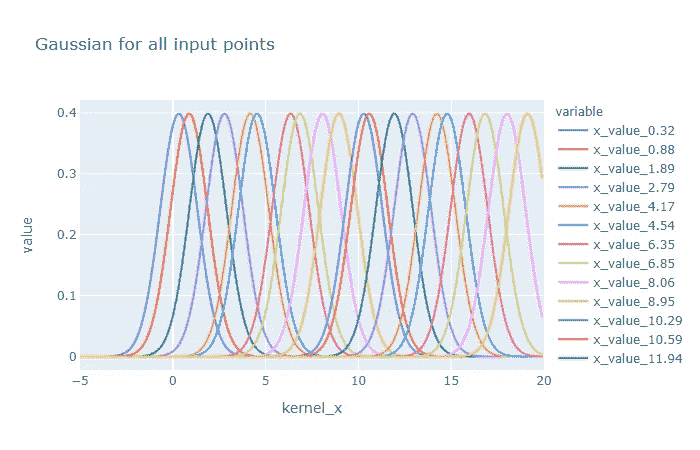
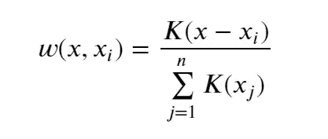
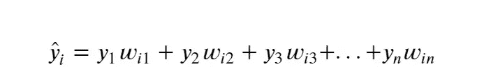
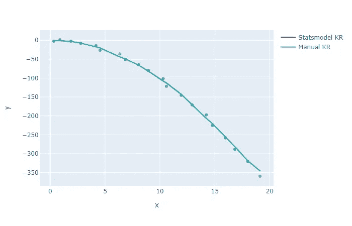

# Python 中的内核回归

> 原文：<https://towardsdatascience.com/kernel-regression-in-python-9775c05d5f66?source=collection_archive---------10----------------------->

## 如何在 Python 中手工进行内核回归

# 目录

[1 基于统计模型的核回归](http://localhost:8888/notebooks/personal_data_science_projects/Kernel_regression_example/kernel_regression_by_hand.ipynb#Kernal-Regression-by-Statsmodels)

*   [1.1 生成假数据](http://localhost:8888/notebooks/personal_data_science_projects/Kernel_regression_example/kernel_regression_by_hand.ipynb#Generating-Fake-Data)
*   [1.2 内核回归输出](http://localhost:8888/notebooks/personal_data_science_projects/Kernel_regression_example/kernel_regression_by_hand.ipynb#Output-of-Kernal-Regression)

[2 用 Python 手工回归内核](http://localhost:8888/notebooks/personal_data_science_projects/Kernel_regression_example/kernel_regression_by_hand.ipynb#Kernel-regression-by-Hand-in-Python)

*   [2.0.1 步骤 1:计算单个输入 x 点的核](http://localhost:8888/notebooks/personal_data_science_projects/Kernel_regression_example/kernel_regression_by_hand.ipynb#Step-1:-Calculate-the-Kernel-for-a-single-input-x-point)
*   [2.0.2 可视化所有输入 x 点的内核](http://localhost:8888/notebooks/personal_data_science_projects/Kernel_regression_example/kernel_regression_by_hand.ipynb#Visualizing-the-Kernels-for-all-the-input-x-points)
*   [2.0.3 步骤 2:计算每个输入 x 值的权重](http://localhost:8888/notebooks/personal_data_science_projects/Kernel_regression_example/kernel_regression_by_hand.ipynb#Step-2:-Calculate-the-weights-for-each-input-x-value)
*   [2.0.4 步骤 3:计算单个输入点的 y 预测值](http://localhost:8888/notebooks/personal_data_science_projects/Kernel_regression_example/kernel_regression_by_hand.ipynb#Step-3:-Calcuate-the-y-pred-value-for-a-single-input-point)
*   [2.0.5 步骤 4:计算所有输入点的 y 预测值](http://localhost:8888/notebooks/personal_data_science_projects/Kernel_regression_example/kernel_regression_by_hand.ipynb#Step-4:-Calcuate-the-y-pred-values-for-all-the-input-points)
*   [2.0.6 第五步:想象两种方法的区别](http://localhost:8888/notebooks/personal_data_science_projects/Kernel_regression_example/kernel_regression_by_hand.ipynb#Step-5:--Visualize-the-difference-between-the-two-methods)

[3 结论](http://localhost:8888/notebooks/personal_data_science_projects/Kernel_regression_example/kernel_regression_by_hand.ipynb#Conclusion)

[4 参考文献](http://localhost:8888/notebooks/personal_data_science_projects/Kernel_regression_example/kernel_regression_by_hand.ipynb#References)

本笔记演示了如何在 python 中手动执行内核回归。虽然 Statsmodels 为内核回归提供了一个库，但是手工进行内核回归可以帮助我们更好地理解我们是如何得到 find 结果的。

首先，我将展示如何使用 Statsmodels 完成内核回归。接下来我将展示如何手工完成，然后最后叠加两个图以显示结果是相同的。

首先，让我们通过统计模型来看看内核回归

# 1 统计模型的核心回归

我们通过使用 lambda 函数来生成 y 值。你可以改变 lambda 函数，看看会发生什么。x 值，即独立变量，由`new_x`控制，我们已经替换了 x 值，以显示您可以

# 1.1 生成虚假数据

```
 import numpy as np
import plotly.express as px
from statsmodels.nonparametric.kernel_regression
import KernelReg as kr 
import plotly.graph_objs as go
import pandas as pd 
```

# 1.1 生成虚假数据

```
np.random.seed(1)# xwidth controls the range of x values.
xwidth = 20
x = np.arange(0,xwidth,1)# we want to add some noise to the x values so that dont sit at regular intervals
x_residuals = np.random.normal(scale=0.2, size=[x.shape[0]])# new_x is the range of x values we will be using all the way through
new_x = x + x_residuals# We generate residuals for y values since we want to show some variation in the data
num_points = x.shape[0]
residuals = np.random.normal(scale=2.0, size=[num_points])# We will be using fun_y to generate y values all the way through
fun_y = lambda x: -(x*x) + residuals
```

让我们绘制数据。在这篇文章中，我们将使用 Plotly express 进行所有的绘图。

```
# Plot the x and y values 
px.scatter(x=new_x,y=fun_y(new_x), title='Figure 1:  Visualizing the generated data')
```



我们的目标是使用回归拟合上述数据点的曲线。我们该如何着手呢？使用 statsmodels 相当简单。

# 1.2 内核回归的输出

Statsmodels 非参数回归模块内核回归的输出是两个数组。

1)预测的 y 值
2)边际效应

对于单变量回归问题，边际效应本质上是预测值对独立变量的一阶导数。更多关于边际效应的信息可以在[这里](https://www.aptech.com/blog/marginal-effects-of-linear-models-with-data-transformations/)找到。

```
fig = px.scatter(x=new_x,y=fun_y(new_x),  title='Figure 2: Statsmodels fit to generated data')
fig.add_trace(go.Scatter(x=new_x, y=pred_y, name='Statsmodels fit',  mode='lines'))
```



# 2 Python 中的手工内核回归

要手工进行内核回归，我们需要了解一些事情。首先，这里是内核的一些属性。

1)内核是对称的，即

K(x) = K(-x)

2)核函数下的面积等于 1 的意义



我们将使用高斯核来解决这个问题。高斯核具有以下形式:



其中 b 是带宽，xi 是因变量的点，𝑥x 是我们定义核函数的值的范围。在我们的例子中，𝑥𝑖来自`new_x`

## 2.0.1 步骤 1:计算单个输入 x 点的内核

```
kernel_x = np.arange(-xwidth,xwidth, 0.1)
bw_manual = 1def gauss_const(h):
    """
    Returns the normalization constant for a gaussian
    """
    return 1/(h*np.sqrt(np.pi*2))def gauss_exp(ker_x, xi, h): 
    """
    Returns the gaussian function exponent term
    """
    num =  - 0.5*np.square((xi- ker_x))
    den = h*h
    return num/dendef kernel_function(h, ker_x, xi): 
    """
    Returns the gaussian function value. Combines the gauss_const and
    gauss_exp to get this result
    """
    const = gauss_const(h)
    gauss_val = const*np.exp(gauss_exp(ker_x,xi,h))
    return gauss_val# We are selecting a single point and calculating the Kernel value
input_x = new_x[0]
col1 = gauss_const(bw_manual)
col2= gauss_exp(kernel_x, input_x, bw_manual)
col3 = kernel_function(bw_manual, kernel_x, input_x)
```

我们希望显示单点 xi 的数据帧。

```
# Dataframe for a single observation point x_i. In the code x_i comes from new_x
data = {'Input_x': [input_x for x in range(col2.shape[0])],
        'kernel_x': kernel_x,
        'gaussian_const': [col1 for x in range(col2.shape[0])],
        'gaussian_exp': col2,
        'full_gaussian_value': col3,
        'bw':[bw_manual for x in range(col2.shape[0])],
        }
single_pt_KE = pd.DataFrame(data=data)
single_pt_KE
```


我们还想可视化一个单一的内核函数。

```
# Plotting a scatter plot of Kernel 
px.line(x=kernel_x, y=col3, title='Figure 3: Kernel function for a single input value')
```



## 2.0.2 可视化所有输入 x 点的内核

我们希望可视化每个𝑥𝑖xi.的内核𝐾(𝑥)K(x)下面我们计算内核函数值，并将它们存储在一个名为`kernel_fns`的字典中，该字典被转换成一个数据帧`kernels_df`。然后，我们使用 Plotly express 来绘制每个核函数。

```
## Plotting gaussian for all input x points 
kernel_fns = {'kernel_x': kernel_x}
for input_x in new_x: 
    input_string= 'x_value_{}'.format(np.round(input_x,2)) 
    kernel_fns[input_string] = kernel_function(bw_manual, kernel_x, input_x)kernels_df = pd.DataFrame(data=kernel_fns)y_all = kernels_df.drop(columns='kernel_x')
px.line(kernels_df, x='kernel_x', y=y_all.columns, title='Gaussian for all input points', range_x=[-5,20])
```



## 2.0.3 步骤 2:计算每个输入 x 值的权重

我们需要计算单个输入的权重。使用以下表达式计算重量:



上面的等式代表了`new_x`的𝑖𝑡ℎith 元素的权重，其中𝑥x 是`new_x`的所有元素。分母是`new_x`中所有点的总和。这里值得注意的是，您将使用所有输入点的核来计算权重。上面的等式基本上在 0 和 1 之间调整权重。

上面的等式已经在函数`weights`中实现，该函数给出了单个输入点的权重。。该函数采用单个输入点，并给出一行权重。它通过在实现上述等式的同时循环遍历所有输入点来做到这一点。

## 2.0.4 步骤 3:计算单个输入点的 y 预测值

我们从下式得到𝑖𝑡ℎith 点的预测值:



该等式在函数`single_y_pred`中实现。我们对从`weights`函数中得到的权重行和来自假数据的 y 值进行点积。上面的等式表示点积。

```
def weights(bw_manual, input_x, all_input_values ): 
    w_row = []
    for x_i in all_input_values: 
        ki = kernel_function(bw_manual, x_i, input_x)
        ki_sum = np.sum(kernel_function(bw_manual, all_input_values, input_x))
        w_row.append(ki/ki_sum)
    return w_rowdef single_y_pred(bw_manual, input_x, new_x): 
    w = weights(bw_manual, input_x, new_x)
    y_single = np.sum(np.dot(fun_y(new_x),w))
    return y_singleypred_single = single_y_pred(bw_manual, new_x[0], new_x)
```

## 2.0.5 步骤 4:计算所有输入点的 y 预测值

以下代码在所有输入点上循环，计算预测值并将其附加到`Y_pred`。一旦我们有了预测值，我们现在需要做的就是将它们可视化。

```
Y_pred = []
for input_x in new_x: 
    w = []
    Y_single = single_y_pred(bw_manual, input_x, new_x)
    Y_pred.append(Y_single)
```

## 2.0.6 步骤 5:想象两种方法之间的区别

现在，我们已经通过手动计算预测值获得了预测值，我们可以将我们的回归曲线与从 statsmodels 获得的曲线进行比较。我们将合身的衣服重叠在彼此的上面，并且合身到它们完全匹配。

```
data= {'x': new_x, 'y': fun_y(new_x), 'y_manual': np.array(y_all)}
fig = px.scatter(x=new_x,y=fun_y(x))
fig.add_trace(go.Scatter(x=new_x, y=pred_y, name='Statsmodel KR',  mode='lines'))
fig.add_trace(go.Scatter(x=new_x, y=np.array(Y_pred), name='Manual KR',  mode='lines'))
```



# 3 结论

本文通过一个使用生成数据的简单示例，展示了我们如何理解内核回归算法的内部工作方式。如果你从这篇文章中学到了什么，请喜欢并分享这篇文章。

感谢您的阅读！

# 4 参考文献

*   [https://www . stat . CMU . edu/~ ryantibs/adv methods/notes/kernel . pdf](https://www.stat.cmu.edu/~ryantibs/advmethods/notes/kernel.pdf)
*   [https://mccormickml.com/2014/02/26/kernel-regression/](https://mccormickml.com/2014/02/26/kernel-regression/)
*   [http://faculty . Washington . edu/yen chic/18W _ 425/le C9 _ reg 01 . pdf](http://faculty.washington.edu/yenchic/18W_425/Lec9_Reg01.pdf)