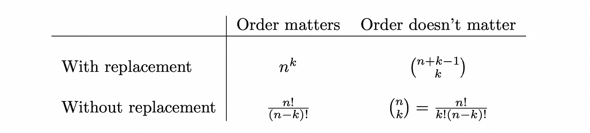

# 提高你对概率论理解的关键概念

> 原文：<https://towardsdatascience.com/key-concepts-to-improve-your-understanding-of-probability-theory-ca1d999dd6c9?source=collection_archive---------32----------------------->

## 我在 MITx 概率课程中学到的六个概念

米克·豪普特在 [Unsplash](https://unsplash.com?utm_source=medium&utm_medium=referral) 上的照片

如果我必须总结我在统计和数据科学 [MITx Micromaster 项目](https://micromasters.mit.edu/ds/)期间在概率领域学到的东西，会是什么？

我想在这里介绍的是我觉得特别有趣的一些话题，在讲座[概率——不确定性和数据的科学](https://learning.edx.org/course/course-v1:MITx+6.431x+2T2019/home)中有很好的解释。

我不会用整个课程来烦你，但我想总结一下在概率世界中非常重要的六个概念。

让我们谈论以下话题:

*   紧凑的书写约定
*   取样台
*   有条件地思考
*   转换
*   独立同分布随机变量
*   大数定律和中心极限定理

# 紧凑的书写约定

为什么重要？

一个命名约定不会帮助你理解概率论，但一定会帮助你掌握和记忆一些公式。

越简单越好。MITx 讲座中公式的书写方式使它清晰而紧凑。例如，每个随机变量用大写字母表示，密度概率函数用小写字母表示，用竖线表示，等等。

例如，下面用七个字符编写的函数将告诉您如下内容:“已知事件“A”发生时，随机变量“X”在样本点 X 的概率密度函数“f”

简洁明了。

# 取样台

当你试图回答一个问题时，比如“我可以得到多少个 k 尺寸的样本？”时，请快速跳到这个表格。

例如，一个装满三个标记为“1、2 和 3”的扑克筹码的桶可以用四种不同的方式绘制。让我们来看看它们:

*   **“用替换；顺序问题"**:替换意味着我们可以多次抽取同一个球，当顺序很重要时，像“1，1，3”这样的样本将被认为与我们抽取的“3，1，1”不同。
*   **“用替换；顺序无关紧要"**:和之前一样，但是如果我们用顺序“1，1，3”或者“3，1，1”来抽球，那就没关系了。它将被视为一个独特的样本。
*   **“无需更换；顺序问题"**:没有替换意味着我们不能多次抽取一个球，即像“1，1，2”这样的样本是不可能的。
*   **“无替换；顺序无关紧要"**:在这个场景中，我们不能多次绘制一个球，并且像“1，2，3”这样的样本会被认为是与“3，2，1”相同的样本

我们现在可以在一个表中总结所有四种情况，并计算从装满 n 个不同碎片的桶中取出 k 个碎片可以创建多少个不同的样本。该表如下所示:

# 有条件地思考

为了支持这一点，我将采用贝叶斯法则，它给出了一个事件(A)的条件概率，假设另一个事件(B)已经发生。

如果我们认为另一个事件(C)在这两个事件之前已经发生了呢？那么，在这种情况下，我们可以如下计算给定 B 和 C 的概率:

有趣的是我们如何在这个公式中加入事件 C。当我们“有条件地思考”时，我们把自己投射到一个我们知道某些事件已经发生的宇宙中。

另一个例子是独立的概念。给定 C，当两个变量(A 和 B)独立时，我们得到以下等式:

# 转换

如果我知道一个随机变量 X 的分布，但是我想知道 Y=g(X)的分布怎么办？

好吧，如果你知道 X 是如何分布的，你会很高兴听到有一个通用的“配方”来了解变量 Y 的分布。

让我们来看看这个三步食谱:

1.  计算 g(X)的反函数。这意味着为了得到 X=h(Y ),你要变换映射 Y=g(X)
2.  计算[累积分布函数(CDF)](https://en.wikipedia.org/wiki/Cumulative_distribution_function) P(y < h(y))
3.  对 CDF 求导，得到密度函数

希望你不必总是一个人做。如果函数 g(X)可微且严格递增或严格递减，可以直接应用以下公式:

有趣的是，如果你有一个包含多个随机变量的函数，比如 Z = g(X，Y)，你也可以应用同样的原理。此外，如果您的函数是一个简单的加法(g(X，Y) = X + Y)，您将得到一个卷积，如下所示:

# 独立同分布随机变量

这两个概念是概率论中的关键，因为它们是应用中心极限定理的基本条件。

让我们用一个例子从独立性的概念开始:如果我们考虑第一个事件“A”，比如“在超市购买时得到一个公平的骰子”，以及事件“B”，比如“当投掷我刚买的骰子时得到六号”。这两个变量是相互依赖的，因为骰子的公平性将影响投掷时获得数字 6 的概率。

我们会说，两个随机变量是独立的，当(且仅当)下列陈述之一成立:

这就是独立的概念。现在让我们讨论“同分布”的概念。

对于这个概念，如果两个随机变量的概率函数完全相同，则它们是同分布的。例如，如果“X1”是一个随机变量，它描述了我们投掷骰子的结果，而“X2”描述了我们第二次投掷相同骰子的结果。两个随机变量有完全相同的概率分布。

# 大数定律和中心极限定理

这些概念可能属于概率和统计中教授最多的原理。为什么这么重要？

为了回答这个问题，我想引用菲利普·里戈莱特教授的话:

> 据统计，99%的人在做一般的事情，剩下的 1%的人在做一些新奇的事情。

所以让我们从直观的开始:大数定律(LLN)。这个想法是你平均“n”个随机变量，它们彼此独立，并且遵循相同的概率分布。换句话说，你的平均“n”个自变量有一个相似的期望(假设μ)。所以你应该期望平均值的期望值也是μ。

这正是 LLN 告诉你的。当“n”趋于无穷大时，下面平均值的期望值也是μ。

中心极限定理(CLT)不太直观，但同样重要。它会告诉你你的平均值是如何分布的。

令人惊讶的是，它不依赖于你的变量(X1，…，Xn)的分布。总会收敛到一个[正态分布](https://en.wikipedia.org/wiki/Normal_distribution)。

好吧，但是我如何在实践中获得无限数量的数据点呢？

不用担心，你不需要得到这么多的数据点。

在他的讲座[统计学基础](https://www.edx.org/course/fundamentals-of-statistics)中，Philippe Rigollet 教授解释说，当“n”大于 **30** 时，你就已经对 CLT 有了一个很好的估计。他还补充说，为了评估生死攸关的情况，我们只需选择大于 50 的“n”。

# 一锤定音

在麻省理工学院在线讲座[概率——不确定性和数据的科学](https://learning.edx.org/course/course-v1:MITx+6.431x+2T2019/home)中，我们一起看到了我觉得特别有趣的六个概念。

概率论是一门庞大的学科，我给了你们一些概念，这些概念是我在研究这门学科时很高兴发现的。

总而言之，我们看到了以下概念:

*   在编写概率公式时，紧凑的编写约定对于提高效率至关重要。我也确信这将有助于你记忆它们。
*   每当我们有诸如“我能得到多少个 k 大小的样本？”这样的问题时，我们可以快速地看一下我们的“抽样表”。
*   “有条件地思考”和“转换”这两章可以帮助我们操作密度函数。
*   “独立同分布随机变量”的概念是应用大数定律和中心极限定理的基础。

好奇想了解更多关于 Anthony 的工作和项目吗？在[媒体](https://medium.com/@anthonycvn)和 [LinkedIn](https://www.linkedin.com/in/anthonycavin/) 上关注他。

*需要技术作家？将您的请求发送到*[*https://amigo CCI . io*](https://amigocci.io/blog/mlops-at-medium-scale/)*。*