# MLOps 专业化认证的关键学习点—课程 2

> 原文：<https://towardsdatascience.com/key-learning-points-from-mlops-specialization-course-2-13af51e22d90?source=collection_archive---------16----------------------->

## MLOps 专业化系列

## DeepLearning 的面向生产的机器学习工程(MLOps)课程摘要(含课堂讲稿)。艾&吴恩达

昆腾·德格拉夫在 [Unsplash](https://unsplash.com/?utm_source=unsplash&utm_medium=referral&utm_content=creditCopyText) 上的照片

虽然机器学习( **ML** )概念是必不可少的，但**生产工程能力**是在现实世界中部署和交付 ML 模型价值的关键。

深度学习。AI 和 Coursera 最近开发了 [MLOps 专业化课程](https://www.coursera.org/specializations/machine-learning-engineering-for-production-mlops)来分享如何概念化、构建和维护集成的 ML 系统。

在这篇文章中，我总结了这些课程，这样你可以跳过冗长的讲座，同时仍然获得关键的见解。

# 内容

> ***(1)***[*课程 2 概述*](#0c53)***(2)***[*重点课*](#67ed)***(3)****[*PDF 讲义*](#3e8d)*

**

*由[绿色变色龙](https://unsplash.com/@craftedbygc?utm_source=medium&utm_medium=referral)在 [Unsplash](https://unsplash.com?utm_source=medium&utm_medium=referral) 上拍摄的照片*

**本文涵盖课程****2*******4****-课程 MLOps 专业化。* [*跟随本媒体页面*](https://kennethleungty.medium.com/) *了解后续课程的最新内容。***

# **课程 2 概述**

**第二个课程(*生产中的机器学习数据生命周期)*关注**生产 ML** ，定义为生产环境中 ML 系统的部署。**

**生产 ML 结合了 ML **和**现代软件开发，因为现实世界的 ML 解决方案需要的不仅仅是训练精确的算法。**

****

**生产 ML 不仅仅是训练机器学习模型|作者图片**

**数据从业者的目标应该是构建集成的 ML 系统，该系统在生产中持续运行，自动接收和重新训练持续变化的数据，并针对计算成本进行优化。**

**本课程涵盖**生产 ML 生命周期的三个关键组成部分**:**

1.  ****收集、标记和验证数据****
2.  ****特征工程、转换和选择****
3.  ****数据旅程和数据存储****

****

**照片由[seli̇m·阿尔达·埃尔伊尔马兹](https://unsplash.com/@selimarda?utm_source=unsplash&utm_medium=referral&utm_content=creditCopyText)在 [Unsplash](https://unsplash.com/?utm_source=unsplash&utm_medium=referral&utm_content=creditCopyText) 上拍摄**

# **主要经验教训**

**本着本课程强调实际应用的精神，要点将集中在实用的建议上。这些见解是基于前面提到的**三个生命周期组成部分**组织的。**

> ****(1)收集、标记和验证数据****

*   **端到端 ML 平台对于部署生产 ML 管道至关重要。谷歌的团队使用开源的[**tensor flow Extended(TFX)**](https://github.com/tensorflow/tfx)用于生产 ML。**

**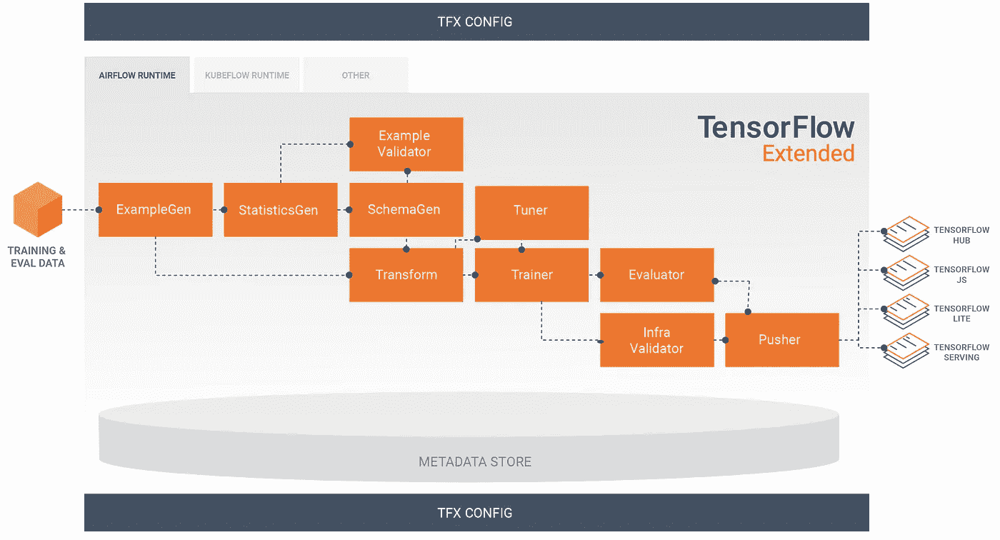**

**TensorFlow 扩展框架|在 [Apache 许可下使用的图像](https://github.com/tensorflow/tfx/blob/master/LICENSE)**

*   **TFX 流水线是为可伸缩、高性能的 ML 任务而设计的一系列组件。**

**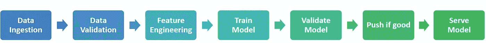**

**端到端生产 ML 平台中的组件序列|作者图片**

*   **前两个组件(数据摄取和数据验证)与**数据收集**、**标记、**和**验证任务**相关。**

## **㈠数据收集**

*   **数据团队的目标是将用户需求转化为数据问题，所以首先要评估的是数据本身。这里列出了**要问的关键问题**:**

1.  *****有什么样的/多少数据可用？*****
2.  *****有哪些详细的数据？***
    ——*数据有标注吗？如果不是，给它贴上标签有多难/多贵？
    —新数据多久进来/刷新一次？
    —是否监控数据源的系统问题和中断？***
3.  *****有哪些预测特征？*** *-数据集是否包含具有预测值的要素？***
4.  *****要跟踪的标签有哪些？*****
5.  *****衡量模型性能的指标有哪些？*****
6.  *****数据质量如何？***
    *—是否存在不一致的数据格式(如混合类型)和影响模型性能的异常值？***

## ****(二)数据标注****

*   **标签是必不可少的，因为**监督学习**(需要标签)通常在大多数商业案例中使用。**
*   **贴标方法多种多样，最常见的两种是**过程反馈**和**人工贴标**。**

**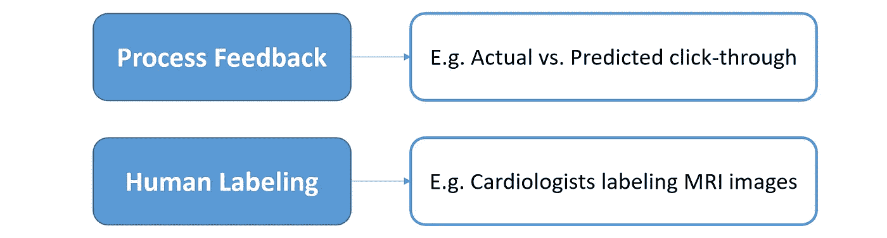**

**数据标注的两种方法|作者图片**

*   ****过程反馈**是一种通过从分析系统**日志文件**中获取信号来持续创建新的训练数据的方式，例如点击通过(即客户是否点击了**而非**点击)。这样做的一个问题是，这种情况很少发生。**
*   ****人工标记**是一种更标准的方法，我们将未标记的数据传递给人工标记者(又名**评分者**)来检查和手动分配标签。**
*   **虽然人工标记很简单，但是会出现几个问题:**

1.  **招聘可能会**昂贵**，尤其是如果项目需要专家标记，例如放射科医生标记 x 光图像**
2.  **如果评定者的数量很少，贴标可能会很慢**
3.  **如果评分者的标签标准存在差异，质量问题就会出现**

*   **我们可以通过创建清晰的说明来指导评分者，并促进标签冲突的积极解决，从而提高标签的一致性。**

## ****(三)数据验证****

*   **由于现实世界数据的不断变化，生产 ML 系统的性能会随着时间的推移而下降。**
*   **需要有一个**数据验证**工作流程来检测这些重要的数据问题。**
*   **[TensorFlow 数据验证( **TFDV** )](https://www.tensorflow.org/tfx/guide/tfdv) 是一个高度可扩展的库，通过对大规模数据的**理解**、**验证**和**监控**，帮助开发者维护 ML 管道的**健康**。**

**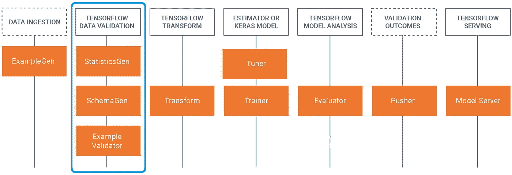**

**显示 TensorFlow 数据验证在 ML 管道中的位置|在 [Apache 许可下使用的图像](https://github.com/tensorflow/tfx/blob/master/LICENSE)**

*   **以下是需要验证的关键数据**漂移**和**偏斜**问题:**

1.  ****概念漂移**:输入和输出变量之间的关系(即映射)随时间的变化**
2.  ****模式偏斜**:训练和服务数据不符合相同的模式(例如，由于存在不同的数据类型)**
3.  ****分布偏差**:服务和培训数据的分布有显著差异(例如，由于随时间的季节性变化)。这种偏斜包括**数据集偏移**和**协变量偏移**的粒度问题。**
4.  ****特征偏斜**:训练特征值不同于服务特征值(例如，由于仅在训练集上应用的变换)**

**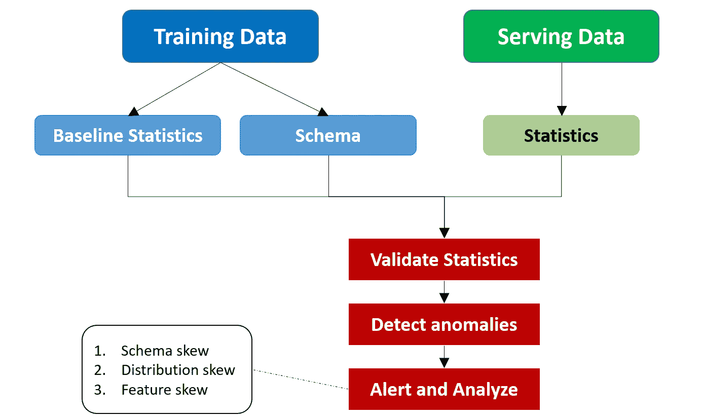**

**倾斜检测工作流程示例|作者图片**

> **(2)特征工程、转换和选择**

## **(一)特征工程**

*   **生产 ML 中的特征工程的基本目的是**减少计算资源**，这是通过将预测信息集中在更少的特征中以提高计算效率来实现的。**
*   **特征工程中的不一致性会引入**训练-服务偏斜**，导致服务模型性能不佳。出现这些不一致的原因是:**

1.  **训练和服务**代码路径**是不同的(例如，在 Python 中训练，但在 Java 中服务)，导致两者之间不同的转换**
2.  **多样的**部署场景**(例如，部署在不同环境中的模型，如移动、web 和服务器)**

## **(二)特征转化**

*   **特征转换以两种类型的**粒度**发生:**

1.  ****实例级**:只涉及实例(也就是一行数据)。示例包括**乘法**(例如，对特征求平方)和**裁剪**(例如，通过将负值更改为 0 来设置非负边界)**
2.  ****全通**:涉及整个数据集。示例包括**标准**缩放、**最小-最大**缩放和**宁滨**。**

*   **有不同的时间点来执行转换:**

1.  **在输入模型之前转换训练数据**
2.  ****在模型内变换****

*   ******每个时间点都有利弊，这些是生产**成本和效率**的基本考虑因素。******

******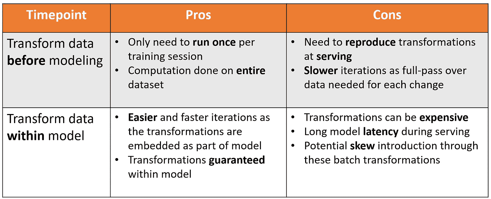******

******不同转变时间点的利弊|作者图片******

*   ******TensorFlow Transform (TFT)是一个用于预处理和转换数据的有用的库，这样的框架对于以高效和分布式的方式处理大型数据集是必不可少的。******

******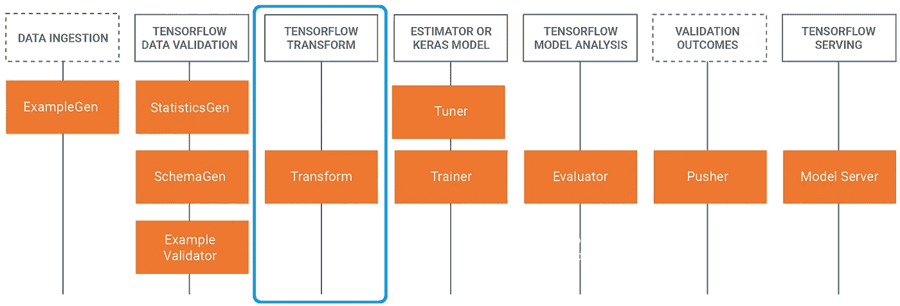******

******显示 TensorFlow Transform 在 ML 管道中的位置|在 [Apache 许可下使用的图像](https://github.com/tensorflow/tfx/blob/master/LICENSE)******

## ******(三)特征选择******

*   ******有三种主要的监督特征选择方法:过滤、包装和嵌入。******

******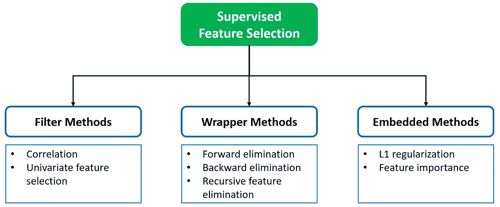******

******特征选择方法|作者图片******

*   ******除了使用性能指标(如 F1 分数、AUC)进行方法评估外，还应评估应用这些方法后的**特征数(又名特征计数)**。******
*   ******理想的情况是性能指标最大化，而特性数最小化。******

> ******(3)数据旅程和数据存储******

## ******㈠数据来源******

*   ******数据**起源(又名世系)**是对数据和模型从原始输入到输出工件的演变过程中的一系列转换的跟踪。******
*   ******理解数据旅程(以及数据来源)对于**调试**和**再现性**至关重要。如果不跟踪，则**重新创建**、**比较**或**解释** ML 模型变得不可行。******
*   ******每次管道运行都会生成有用的**元数据**，其中包含有关管道执行、训练运行和结果工件的信息。******
*   ******ML 元数据(MLMD) 是一个用于记录和检索与生产管道运行相关的元数据的库。******

******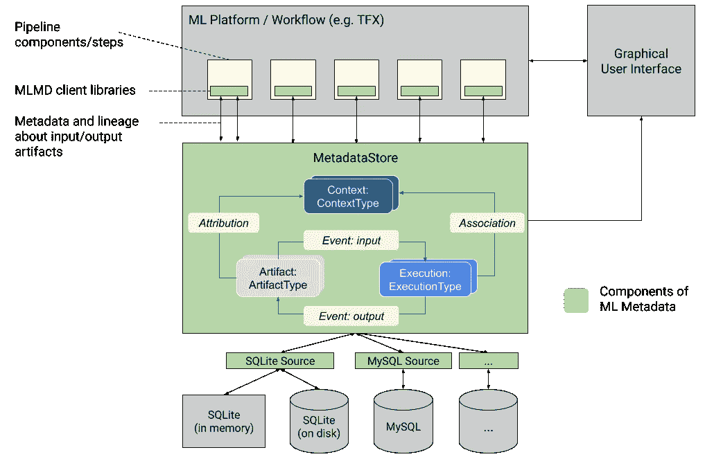******

******在 [Apache 许可下使用的 ML 元数据组件|图像的高级概述](https://github.com/google/ml-metadata/blob/master/LICENSE)******

## ******㈡数据版本化******

*   ******管理数据管道是一项挑战，因为数据在项目生命周期的不同训练运行中不断发展。******
*   ******虽然我们熟悉代码版本化(例如 Git)和环境版本化(例如 Docker)，但是**数据版本化**同样重要，并且在数据起源中起着至关重要的作用。******
*   ********数据版本化工具**开始变得可用，现有的一些例子有 [**DVC**](https://dvc.org/) 和 [**Git LFS**](https://git-lfs.github.com/) 。******

******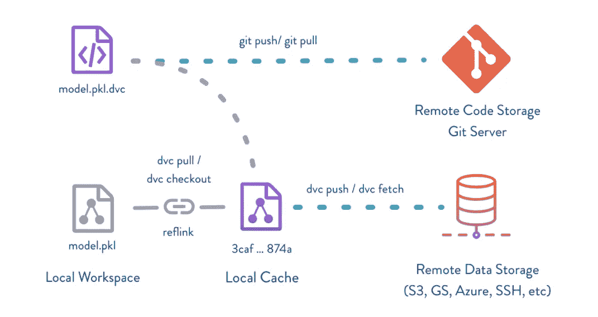******

******DVC 如何工作的流程图(与 Git 一起)|在 [Apache 许可下使用的图像](https://github.com/iterative/dvc/blob/master/LICENSE)******

## ******㈢特色商店******

*   ******特征库是一个**中央存储库**，用于存储文档化的、管理的和访问受控的数据特征，团队可以共享、发现和使用这些数据特征进行模型训练和服务。******
*   ******特征库**减少冗余工作**，因为许多建模问题使用相同或相似的特征。******
*   ******目标是提供统一、一致和持久的方法来管理高性能和可伸缩的数据特性。******

******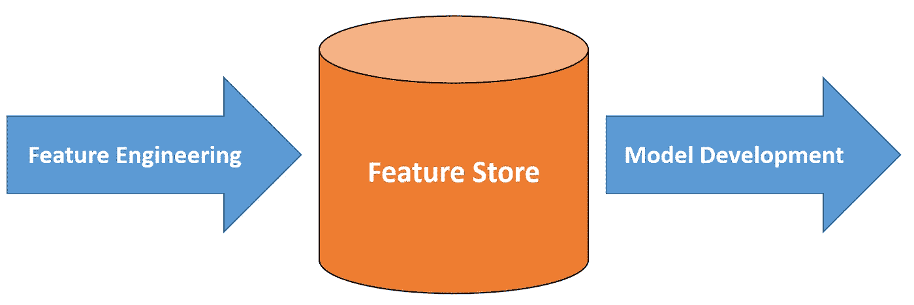******

******特征存储有助于存储工程特征，以用于后续模型开发|作者图片******

## ******㈣数据仓库与数据库和数据湖******

*   ******有几个领先的数据存储解决方案，分别是**数据库**、**数据仓库**、**数据**、**湖泊**。******
*   ********数据库**是一个有组织的数据集合，允许轻松访问和检索。******
*   ********数据仓库**是一个中央信息存储库，旨在通过分析做出明智的决策。******
*   ******一个**数据湖**是一个集中的存储库，允许你以任何规模存储你所有的**结构化和非结构化**数据。******
*   ******下面是解释这些解决方案的效用的比较:******

********数据仓库与数据库********

******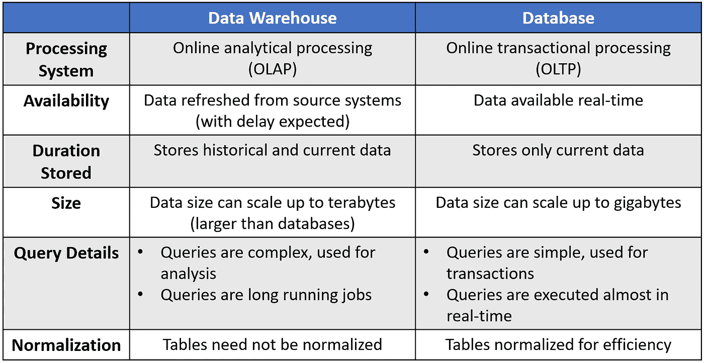******

********数据仓库与数据湖********

******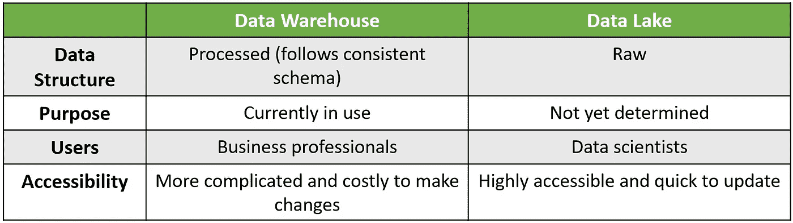******

# ******PDF 课堂讲稿******

******为了表示感谢，下面是 GitHub repo 的 [***链接，以及我根据幻灯片和抄本整理的 pdf 讲义***](https://github.com/kennethleungty/MLOps-Specialization-Notes/tree/main/2.%20Machine%20Learning%20Data%20Lifecycle%20in%20Production) 。******

******要了解后续课程的最新笔记，也可以随意给回购打个星。******

# ******准备好了吗？******

******以下是后续**课程 3** 的文章:******

****** [## MLOps 专业化认证的关键学习点—课程 3

### 来自面向生产的机器学习工程(MLOps)课程的主要见解(附课堂讲稿)

towardsdatascience.com](/key-learning-points-from-mlops-specialization-course-3-9e67558212ee) 

如果您还没有，请查看该系列的**课程 1** :

 [## MLOps 专业化认证的关键学习点—课程 1

### 面向生产的机器学习工程课程 1 的主要内容

towardsdatascience.com](/key-learning-points-from-mlops-specialization-course-deeplearning-ai-andrew-ng-5d0746605752) 

# 在你走之前

欢迎您**加入我的数据科学学习之旅！**点击此[媒体](https://kennethleungty.medium.com/)页面，查看我的 [GitHub](https://github.com/kennethleungty) ，了解更多精彩的数据科学内容。同时，享受构建生产 ML 系统的乐趣！

 [## 如何轻松绘制神经网络架构图

### 使用无代码 diagrams.net 工具通过图表可视化展示您的深度学习模型

towardsdatascience.com](/how-to-easily-draw-neural-network-architecture-diagrams-a6b6138ed875)  [## 面向数据科学和 Python 的最受欢迎的 GitHub Repos

### 发现许多数据专业人员和 Python 程序员正在关注的非常受欢迎的回购

towardsdatascience.com](/the-most-starred-forked-github-repos-for-python-and-data-science-f8bb3de47e96)******