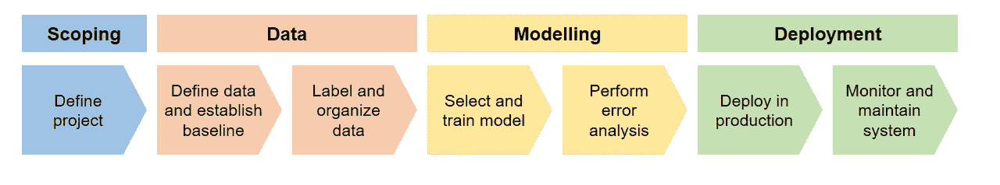
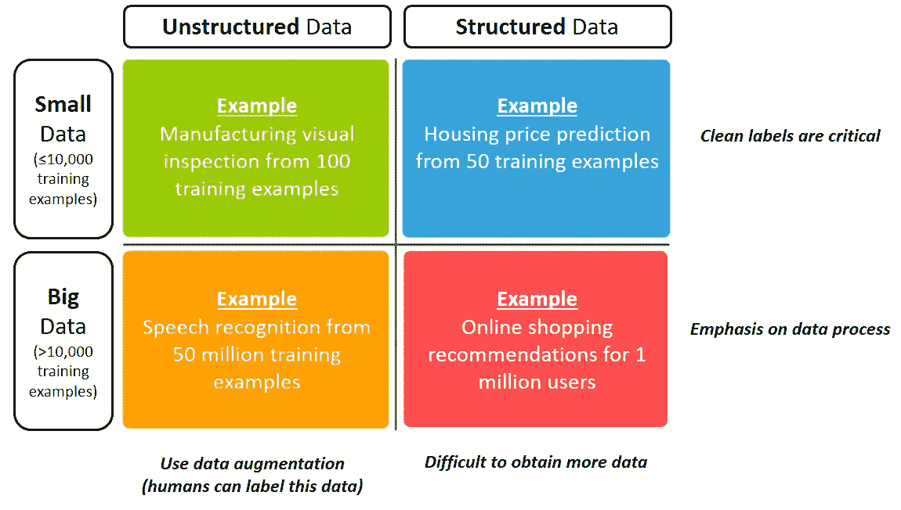
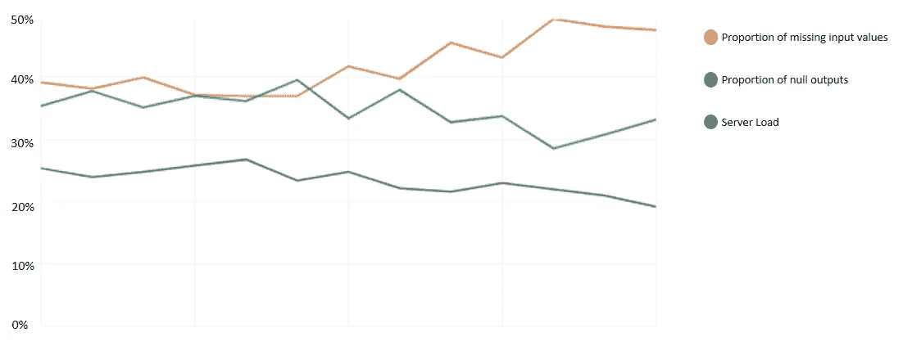
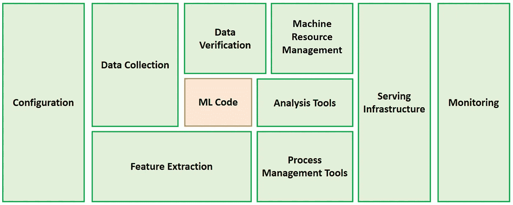

# MLOps 专业化认证的关键学习点—课程 1

> 原文：<https://towardsdatascience.com/key-learning-points-from-mlops-specialization-course-deeplearning-ai-andrew-ng-5d0746605752?source=collection_archive---------14----------------------->

## MLOps 专业化系列

## 《面向生产的机器学习工程》课程 1 (由 DeepLearning 提供)的**主要见解(附讲稿)。艾&吴恩达)**

由 [Drif Riadh](https://unsplash.com/@dux?utm_source=medium&utm_medium=referral) 在 [Unsplash](https://unsplash.com?utm_source=medium&utm_medium=referral) 上拍摄的照片

对于围绕机器学习模型的所有宣传，除非**部署到生产中**以交付商业价值，否则它们**没有用**。

吴恩达和深度学习。艾对此深有体会，创建了 [**MLOps 专精**](https://www.coursera.org/specializations/machine-learning-engineering-for-production-mlops) 分享自己在**量产化 ML 系统**上的实践经验。

在这篇文章中，我总结了经验教训，这样你就可以跳过几个小时的在线视频，同时仍然能够收集关键的见解。

## 内容

> ***(1)***[*课程概述 1*](#1475)***(2)***[*重点课*](#1685)***(3)****[*PDF 讲义*](#f43f)*

**这篇总结文章涵盖了 4 门课程的 MLOps 专业化认证的第 1 门课程。* [*跟随本页*](https://kennethleungty.medium.com) *了解后续课程的最新内容。**

# *课程 1 概述*

*MLOps 专业化的第一门课程名为*生产中的机器学习介绍，*并介绍了端到端生产化 ML 系统的**开发、部署和持续改进。***

*这门课程是围绕一个 ML 项目生命周期的组成部分组织的，我发现这是一个构建 ML 计划的有用框架。*

**

*ML 项目生命周期(改编自课程)|作者图片*

# *主要经验教训*

*本着本课程强调实际应用的精神，我将分享注重实用建议的关键要点。*

> *第 1 部分—范围界定*

## *从正确的问题开始，集中注意力*

*   *首先与企业主一起确定最有价值的**业务问题**(以及**而不是**人工智能问题或解决方案)。*
*   *一个引发讨论的好问题是“**你希望做得更好的前三件事是什么**？”。*
*   *通过参考**外部基准**(例如，文献、竞争对手)，评估人的水平表现(对于**非结构化**数据)，或查看是否有可预测结果的适当特征(对于**结构化**数据)。*
*   *技术和业务团队应就一组**通用指标**达成一致，因为 ML 团队倾向于过度关注技术指标(例如 F1 分数)，而利益相关方则关注业务指标(例如收入)。*

**

*范围界定流程(改编自课程)|图片由作者提供*

> *第 2 部分—数据*

## *针对不同数据问题的不同实践*

*   *数据问题根据数据的大小和类型进行分类:*

**

*数据问题的分类(改编自课程)。*10000 个数据大小示例的临界值是由吴恩达* **|** 作者图片定义的任意数字*

*   ***非结构化**数据:使用数据增强和人类标记来获得更多的训练数据，因为很容易生成音频或图像等数据。*
*   ***结构化**数据:使用数据扩充很难创建更多的表格数据，因此应关注数据和标签的质量。*
*   *小数据集:通过手工检查，确保例子以干净和一致的方式被标记，因为干净的标签对小数据的模型性能有巨大的影响。*
*   *大数据集:不可能手工检查标签，所以重点应该放在建立定义良好的、可扩展的数据流程上。*
*   *向与你的 ML 问题在同一个数据象限工作过的人寻求建议，因为不同的场景有不同的做法。*

## *提高标签一致性*

*   *标签一致性对于**大型**数据集也很重要，因为它们可能包含罕见事件，为了获得良好的模型性能，必须对这些事件进行准确标记，例如在大型 X 射线图像数据集中的罕见诊断。*
*   *要建立标签标准，让多个贴标机给相同的样品贴标签。在有分歧的地方，召集团队(以及主题专家)来解决这些分歧。*
*   *记得写下并**记录**这些达成一致的定义。*
*   *目标是有标准化的定义和实践，以便后续的标签任务以干净和一致的方式完成。*
*   *提高标签一致性是一个反复的过程，所以考虑重复这个过程，直到分歧尽可能得到解决。*

> *第 3 部分——建模*

## *以数据为中心，而不是以模型为中心*

*   *传统上，重点是在保持数据集固定的同时调整和改进模型代码。*

**

*人工智能系统包括数据和代码|作者图片*

*   *对于实际项目来说，采用以数据为中心的方法实际上更有用，在这种方法中，你专注于向模型提供高质量的数据，而 T4 保持模型不变。*
*   *通常情况下，一个有好数据的合理算法会做得很好，甚至会比一个有不太好数据的伟大算法做得更好。*
*   *致力于一个可行的实用系统，所以从基本的已建立的模型(例如，从现有的开源项目)开始，而不是沉迷于最新的最先进的算法。*

## *好的平均表现还不够好*

*   *如果一个 ML 系统在一组**非常重要的例子**上的性能很差，那么它就不适合部署，即使它在测试集上的平均性能很好。*
*   *对数据的**关键片段**单独评估模型性能，以确保不存在基于特定特征(如种族、性别、位置)的歧视，并且模型在罕见情况下也表现良好。*

> *第 4 部分—部署*

## *部署模式*

*   *部署不应被视为二元结果(即部署或不部署)，而应被视为一系列不同的**自动化程度。***
*   *使用的自动化程度高度依赖于用例、模型性能和业务的舒适度。*
*   *最终目标需要**而不是**完全自动化。例如，**人工参与的部分自动化**对于基于人工智能的医学扫描解释来说是一种理想的设计，在预测可信度较低的情况下，需要人工判断。*

**

*自动化程度(改编自课程)|图片由作者提供*

*   *部署 ML 系统的常用方法包括:*

1.  ***影子模式部署:**ML 模型与现有的人类工作流程并行**，作为在让它代替人类在地面上做出真正决策之前验证其性能的一种手段。***
2.  *****金丝雀部署:**最初在一小部分**(例如 5%)流量/数据上推出 ML 模型，然后在密切的性能监控下逐步提升。*****
3.  *******蓝绿部署:通过将流量/数据重新路由到**新(绿)**模型，替换**(逐渐或立即)现有的**旧(蓝)** ML 模型。*****

## ***系统监控***

*   ***在第一次部署 ML 系统**、**之后，你实际上是**离终点**只有一半路程，因为**和**还有很多工作要做。这包括系统监控、模型更新和重新训练，以及处理数据变化，例如**概念漂移**和**数据漂移**。***
*   ***对于监控，集思广益，找出可能出错的地方，并想出几个要监控的指标(最好是在仪表板中)。***
*   ***这些可以分为三大类，即**输入**指标(例如缺失值的数量)；**输出**指标(例如空输出响应的数量)，以及**软件**指标(例如服务器负载、延迟)。***
*   ***在选择一组要监控的指标后，通常的做法是为警报设置**阈值**。***

******

***监控指标示例|按作者分类的图像***

# ***课堂笔记***

***为了表示感谢，下面是 GitHub repo 的 [***链接，以及我根据幻灯片和文稿整理的 pdf 讲义***](https://github.com/kennethleungty/MLOps-Specialization-Notes) 。为了从后续课程中获得最新版本的编译笔记，请随时启动 repo。***

******

***照片由 [Cathryn Lavery](https://unsplash.com/@cathrynlavery?utm_source=medium&utm_medium=referral) 在 [Unsplash](https://unsplash.com?utm_source=medium&utm_medium=referral) 拍摄***

# ***结论***

***最后，重要的是要记住 **ML 模型代码只是成功的 ML **系统**的一小部分**(~ 5–10%)，目标应该是通过将 ML 模型投入生产来创造价值。***

******

***ML 生产系统概述|作者图片***

***不管你是否有过 ML 制作的经验，我希望这些外卖给了你一些新鲜的观点和有价值的见解。***

***这些学习要点只是许多实用建议的的**子集，所以一定要查看课程[笔记](https://github.com/kennethleungty/MLOps-Specialization-Notes)和[视频](https://www.coursera.org/specializations/machine-learning-engineering-for-production-mlops)。*****

*****欢迎您加入我的数据科学学习之旅！**关注此[媒体页面](https://kennethleungty.medium.com/)以了解更多数据科学内容(以及后续发布的 MLOps 笔记)，或者在 [LinkedIn](https://www.linkedin.com/in/kennethleungty/) 上联系我。享受学习 ML 生产系统的乐趣！***

# ***准备好了吗？***

***在这里继续第 2 部分！***

***</key-learning-points-from-mlops-specialization-course-2-13af51e22d90> ***