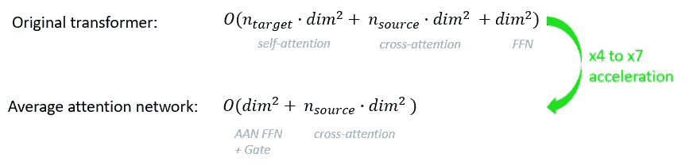

# 试卷的数学解释

> 原文：<https://towardsdatascience.com/key-mathematical-innovations-efficient-inference-for-neural-machines-translation-994ae02b0fa0?source=collection_archive---------33----------------------->

## 神经机器翻译的有效推理

有大量的新论文，通常很难理解它们背后的数学原理。作为数据科学家，了解最重要的领域总是很有趣，即使它们不属于我们最了解的领域……

照片由 [Soner Eker](https://unsplash.com/@sonereker?utm_source=medium&utm_medium=referral) 在 [Unsplash](https://unsplash.com?utm_source=medium&utm_medium=referral) 上拍摄

# **简介**

不做一些关于以前发现的故事，不了解当前的背景，就不可能解释最近发生的事情。

如今，许多公司和大学都在积极研究语言课题:

*   徐等人已经成功地做出了一个比最新语言学习速度快 6000 倍的翻译算法。
*   熊等人也开发出了很棒的方法，使[语音识别](https://www.microsoft.com/en-us/research/uploads/prod/2018/04/ms_swbd17_icassp18.pdf)。
*   Seurin 等人做了一个高效的[强化算法来识别说话人](https://arxiv.org/pdf/2008.03127.pdf)。
*   和 Yi-Te Hsu 等人也为加快 Vaswani 等人在 2017 年开发的最先进的翻译算法做出了贡献。

我们将解释 Yi-Te Hsu 等人在 2020 年撰写的论文[神经机器翻译的有效推理](https://arxiv.org/pdf/2010.02416.pdf)背后的数学机制。

2020 年 NLP 论文综述。图片作者。

但是首先，为什么拥有快速翻译系统如此重要？

# **1。** **对高效翻译系统的兴趣**

高效的语言翻译至关重要，原因如下:

-广泛使用，甚至是实时使用(如 Youtube 视频、视频会议、直接对话、网页等)。

-它拥有大量具有强大价值的数据，因为它们包含知识甚至情报。

-其数据总体质量良好，并且是音频或文本格式，即比图像或视频等其他类型的数据更轻。

然而，由于要处理的数据量巨大，翻译需要高效的算法:无论是实时语音或书面翻译，还是任何延期的翻译请求。

# **2。** **翻译系统:回到原点**

第一个机器翻译实验是 1954 年在乔治城的 IBM 公司进行的。

它基本上是一个能够由不懂俄语的人按照一套 6 条规则将**从俄语翻译成英语的系统。结果是成功的，并通过理解和应用特定的规则建立了翻译系统的基础，机器将逐步建立并自动翻译，甚至不需要事先教会它们。**

**如今，所有的规则都是自动建立的，这主要归功于使用大量翻译句子的编码器/解码器过程**，通常使用包括记忆系统的神经网络(例如: [LSTM](https://en.wikipedia.org/wiki/Long_short-term_memory) :长短期记忆，它学习单词的顺序结构)。

**编码器** **将把句子转换成潜在代码**，这仅仅是一种**高级概率语言**。

注:高级表示初始句子的压缩表示，适合解码器解释。

**解码器**将解释该高级代码，并且**通过迭代学习过程，即通过减少获得的结果和预期结果之间的误差，将其转换成目标语言**。

*自动编码器:通过减少 X-X’的二次误差来改进代码 z。图片作者。*

并且表现最好的翻译模型通过**注意机制**连接。

# **3。** **什么是注意机制？**

当我们专注于几件事情来权衡它们之间的意义时，注意力机制与我们拥有的机制是一样的。这就是我们在阅读一篇文章时所做的:我们必须检测单词之间的联系，以便从中提取知识。

注意力模型遵循同样的逻辑，它被发明出来解决长句的翻译问题。

关键元素是**上下文向量**:它计算单词彼此接近的概率。在成千上万个学过的句子**中，经常互相靠近的单词比不靠近的单词得分更高**。越近越频繁越好。

例如，如果我们将“飞机降落在没有着陆跑道的玉米地附近”翻译成法语，由于其位置，“lands”一词可能与“avion”(“飞机”)而不是“champ”(“田地”)更相关，即使“lands”可以出现在航空学(作为动词)和农业(作为名词)的词汇上下文中。

*关于单词“land”的注意机制的例子，它与“avion”(“plane”)、“piste d ' atter rissage”(“landing runway”)的联系比与“champ”(“field”)的联系多。图片作者。*

2017 年的论文[注意力是你所需要的全部](https://arxiv.org/pdf/1706.03762.pdf)描述了我们所知道的最好的注意力机制，即使是对于长句，这要感谢一个叫做**转换器**的系统。

转换器是一种自动编码器，其中编码器和解码器具有以下层:

*   自我关注层:他们通过查看其他单词来帮助翻译每个单词，以便建立相关矩阵。
*   前馈层:它们生成一个代码，即自我关注层所获得结果的简化表示。

每一层都使用一系列的数学运算，计算量随着句子长度的增加而增加。

这里有一篇[图文并茂的文章](http://jalammar.github.io/illustrated-transformer/)精确地解释了变形金刚是如何工作的。

这篇文章还包括一个实验室实验。

那么 Hsu 等人做了什么来**加速翻译处理**？

# **4。** **神经机器翻译的高效推理概述**

**推理效率是如何改进翻译步骤以降低计算时间。**

目标是在不影响翻译质量的情况下，在组件的推理级别优化翻译速度。

徐的团队有以下方法:

*   他们从一个基本的变压器架构开始，以优化每个主要组件，而无需处理因复杂性而导致的处理时间偏差。因此，他们避免使用具有原始架构的附加层。
*   他们使用最先进的解决方案来增强子组件，这看起来很简单，但实际上需要很好的理解，因为我们不能改变原始的翻译质量。

效率的评估得益于 [**双语评估替角**](https://en.wikipedia.org/wiki/BLEU) (BLEU)评分，该评分**在专业水平上衡量翻译**。

由于采用了新的架构，GPU 和 CPU 的速度分别提高了 84%和 109%,而 BLEU 得分仅下降了 2.1%。

以下是主要的改进:

*   使用最近的循环解决方案:更简单的简单循环单元(SSRU)和平均注意力网络(AAN)。
*   增强编码器/解码器的结构。
*   应用修剪注意头。

与神经机器翻译的有效推理相关的主要出版物概述。图片作者。

我们将深入探究主要的数学创新，并理解它们是如何工作的。

# **5。** **使用近期经常性解决方案**

有两项主要改进:

*   简单的简单循环单位
*   平均注意力网络

## 简单的简单循环单位

这项创新的灵感来自于 [Kim 等人(2019)的一篇论文:从研究到生产再到生产:快得离谱的神经机器翻译](https://www.aclweb.org/anthology/D19-5632.pdf)。

翻译的神经网络可以比作在每个位置具有不同可能状态并依次相互连接的溪流。来源:@panapi/gfycat

变形金刚基础版的自我关注系统使用经典的乘法矩阵来执行上下文向量。它已被递归神经网络(RNNs)所取代，递归神经网络具有相同的线性复杂度，并在输出令牌数 *n 的范围内将解码器复杂度从 *O(n )* 降低到*O(n)*。*这种改进是由于**没有矩阵乘法**，即使初始解决方案使用高度优化的矩阵乘法算法以及残差连接来改进深层计算。

基本上，rnn 是具有以下功能的神经网络:

*   记忆:在任何位置保存循环数据。
*   忘记:记下嘈杂的、罕见的或混乱的数据。

但是原始的 RNNs 需要相当多的计算，因为复杂的函数，例如涉及矩阵乘法的 tanh(参见长期短期记忆或 LSTM)。为什么？因为每一个 **tanh 的计算都要感谢泰勒级数**需要 *O(n )* :

LSTM 单元中使用的双曲正切函数的泰勒级数([来源](https://en.wikipedia.org/wiki/Hyperbolic_functions)

然后，注意机制也具有矩阵乘法来计算查询 Q、键 K 和值 v 之间的关系

dk:k 的维度，使用根函数使 QK 的值变平，否则 QK 值之间的可变性太高。

Softmax 函数:它将绝对值转换为相对值，以便能够轻松地进行比较。

**原 LSTM 中的双曲正切函数已被整流线性单元(ReLUs)** 所取代，它是 *O(n)* 但需要多几层才能达到类似的结果。事实上，几个 ReLUs 单元模拟了具有更好的灵活性以适应目标的矩阵行为。

为了对它们如何工作有一个粗略的想法，这里有一个例子来说明为什么 tanh 函数比 ReLU 需要更少的神经元。在一个经典的回归问题中，你可以使用 [Tensorflow Playground](https://playground.tensorflow.org) 来玩神经网络。你只需要在使用 tanh 和 ReLU 函数时比较结果。Tanh 将需要大约一半的 ReLU 神经元来达到相同的结果。我得到了同样的结果:

*   3 个 tanh 神经元的 1 个隐藏层。
*   2 个隐藏层，每层 3 个 ReLU 神经元。

**简单递归单元(SRU)** 通过用原始 LSTM 中的 ReLU 激活函数代替 tanh，在计算效率方面向前迈进了一大步。

SRU 也有一个“高速公路”网络。它用于简化深度网络的训练，使用重置门更快地传播到前一层。

**超级简易循环机组(SSRU)** 是简易循环机组(SRU)的一个较轻型版本，但没有高速公路网。

它具有以下结构:

SSRU 细胞。*图片作者。*

SSRU 细胞公式。*图片作者。*

每个 SSRU 单元首先基于遗忘门 *f* :其输入函数 *x* ，其权重 *W* 及其偏置 *b* 。

**在 *f* 的极限处会发生什么？**

如果 *Wx+b~0* ，那么 *f~0* 和单元格状态 *c ~Wx* 。这是一个完整的记忆过程。

如果 *Wx+b~1* ，那么 *f~1* 和单元格状态 *c(t) ~ c(t-1)* 。这是一个完全遗忘的过程，因为它采用与前一个单元状态相同的值。例如，当存在空值序列时，可能会发生这种情况。

RNN 输入像元通常基于数据集中最长短语的范围构建。较短的短语有空单元格。图片作者。

在这两个限制之外，有各种各样的配置来记忆输入中任何短语的序列。

权重在学习过程中逐步转换，以检测不同步骤之间的相关性。

## 平均注意力网络

[平均注意力网络](https://arxiv.org/pdf/1805.00631.pdf) (AAN)计算累积平均运算，为每个输入嵌入生成上下文敏感的表示。

原始转换器是自回归的(AT ),这意味着它根据以前的值进行计算。AT 很能代表一种语言顺序，但它需要很多时间，总的来说对于长句来说，因为每一个新单词的概率都是从所有以前的单词中计算出来的。

AAN 通过计算句子中所有单词的平均概率值来解决这个问题。

这背后的数理逻辑，来自于时间序列:**自回归和移动平均常用于预测题目**。

自回归与移动平均的例子。每一步都执行所有这些计算。图片作者。

**自回归**递归地使用所有之前的步骤(即单词)并执行回归，由于最小二乘近似，这需要比移动平均更多的计算，但由于其线性行为，结果更好。

**移动平均**是通过前面步骤的简单平均，但由于自动校正 AAN 权重的训练，最终会达到与自回归过程非常相似的结果。

下图是基于这个移动平均原理的计算加速度。

AAN 计算计算加速度相比，原来的变压器从纸上注意是你所需要的。图片作者。

机器神经翻译的有效推理也**移除了 AAN 门控层**。用于提高输出表现力的门控层:这个功能没有用，因为它已经被解码器执行了。

# 7.增强型编码器/解码器结构

[深度编码器/浅层解码器网络](https://arxiv.org/pdf/2006.10369.pdf)架构由 12 个编码器和 1 个编码器层组成，而不是 50/50 的层分布。

**编码器更快**因为输入计算很容易并行。

然而**解码器层有更多的计算**，因为解码器是自回归的:它解码 N 次(N 是字数)，与仅编码一次的编码器相反 *** 。

[瓦列里·安德鲁斯科](https://unsplash.com/@voodushevlyonniy?utm_source=medium&utm_medium=referral)在 [Unsplash](https://unsplash.com?utm_source=medium&utm_medium=referral) 拍摄的照片

# 8.应用修剪注意头

在翻译模型架构中，许多组件(=heads)具有非常相似的行为，可以在不影响最终结果的情况下进行删减。

[修剪注意力头方法](https://www.aclweb.org/anthology/P19-1580.pdf)仅仅**使用 **L0 范数正则化**压缩和稀疏化深度神经网络**以获得整体性能。

范数是向量之间的距离，即神经网络的权重。L0 是 0 范数，它是用非零值表示的距离。例如，向量(0，3，0，0，1)和(0，5，0，0，1)的 L0 范数为 2，因为有 2 个非零元素。

在这种情况下，正则化在于**尽可能减少 L0 范数**，以便去除零加权神经元并稀疏化神经网络。

这种方法也**减少了过度拟合**，因为较少的记忆导致更好的泛化。

# 9.BLEU 评估的限制

[**BLEU 评估有一些应该考虑的明确限制**](/evaluating-text-output-in-nlp-bleu-at-your-own-risk-e8609665a213) 。即使从 BLEU 的角度来看，有效推理有很大的效果，但对于像 medicin 这样可能包含不同语言结构的特定词汇领域，它可能是不同的。

# **结论**

自从 1954 年 IBM 的乔治敦实验以来，已经做了许多改进来将语言规则转换成概率规则。

由于神经机器翻译的有效推理，Hsu 等人已经加速了最佳翻译体系结构，应用了来自几个团队的几个证明的解决方案。

通过用较轻的功能取代较重的功能，通过改进 autoencoder 的分层结构，所有这些都在时间序列、网络架构和概率解决方案的和谐融合中实现了非常好的结果。

这不是一项容易的任务，因为算法之间可能存在依赖关系，并不总是适合在一起，但我们应该小心地在新的情况下应用这些创新，因为 BLEU 评估有一些明确的限制。

**非常感谢徐一德的反馈，他的反馈提高了基本的理解。*

# **来源:**

神经机器翻译的高效推理:[https://arxiv.org/pdf/2010.02416.pdf](https://arxiv.org/pdf/2010.02416.pdf)

乔治城-IBM 实验:[http://www.hutchinsweb.me.uk/AMTA-2004.pdf](http://www.hutchinsweb.me.uk/AMTA-2004.pdf)

从研究到生产再回来:快得离谱的神经机器翻译:[https://www.aclweb.org/anthology/D19-5632.pdf](https://www.aclweb.org/anthology/D19-5632.pdf)

你所需要的只是关注:[https://arxiv.org/pdf/1706.03762.pdf](https://arxiv.org/pdf/1706.03762.pdf)

高度并行递归的简单递归单元:[https://arxiv.org/pdf/1709.02755.pdf](https://arxiv.org/pdf/1709.02755.pdf)

简单收款单位代码:[https://github.com/asappresearch/sru](https://github.com/asappresearch/sru)

通过平均注意力网络加速神经变压器:【https://arxiv.org/pdf/1805.00631.pdf 

玛丽安-NMT:【https://marian-nmt.github.io/】T4

自训练和预训练对于语音识别是互补的:[https://arxiv.org/pdf/2010.11430.pdf](https://arxiv.org/pdf/2010.11430.pdf)

注意力和增强递归神经网络:[https://distill.pub/2016/augmented-rnns/](https://distill.pub/2016/augmented-rnns/)

深度编码器，浅层解码器:重新评估机器翻译中的速度-质量权衡:[https://arxiv.org/pdf/2006.10369.pdf](https://arxiv.org/pdf/2006.10369.pdf)

确定性非自回归神经序列迭代求精建模:[https://arxiv.org/pdf/1802.06901.pdf](https://arxiv.org/pdf/1802.06901.pdf)

分析多头自我关注:专门的头做繁重的工作，其余的可以修剪:[https://www.aclweb.org/anthology/P19-1580.pdf](https://www.aclweb.org/anthology/P19-1580.pdf)