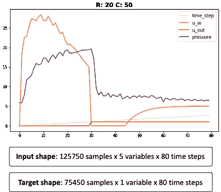
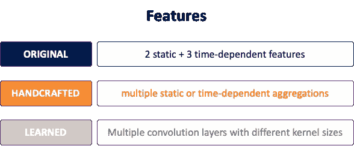
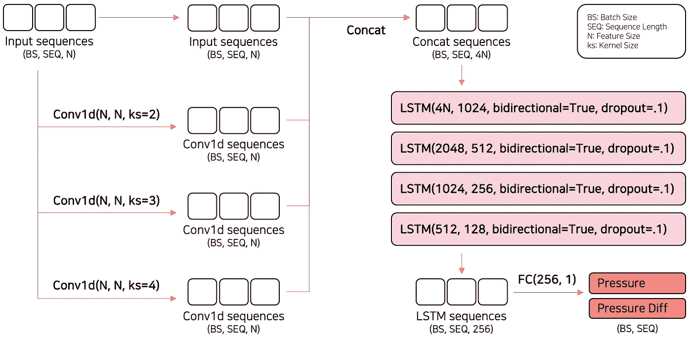
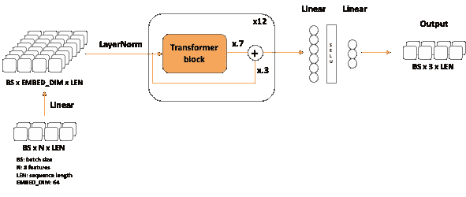
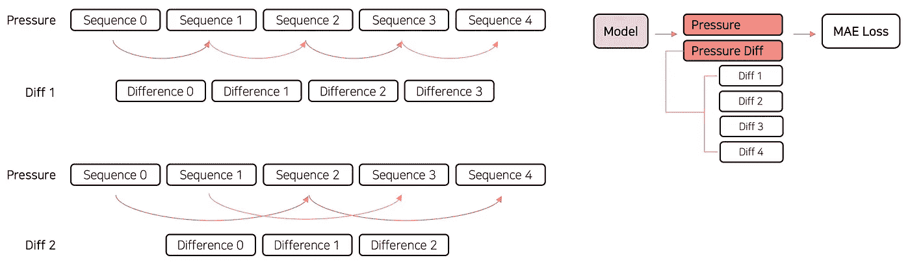
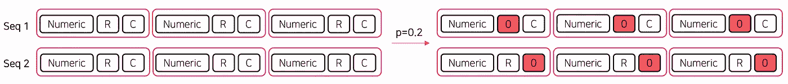
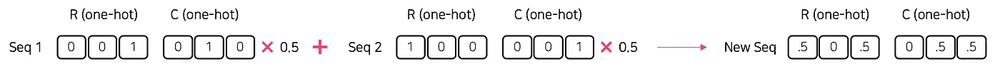

# 从 Kaggle 最近的时间序列竞赛-呼吸机压力预测中获得的关键信息

> 原文：<https://towardsdatascience.com/key-takeaways-from-kaggles-most-recent-time-series-competition-ventilator-pressure-prediction-7a1d2e4e0131?source=collection_archive---------2----------------------->

## 如何在时间序列预测中具有竞争力

布雷特·乔丹在 [Unsplash](https://unsplash.com?utm_source=medium&utm_medium=referral) 上的照片

深度学习对于时间序列预测的重要性不断增长。

神经网络第一次在 Kaggle 时间序列竞赛中进入前 3 名解决方案是在 2015 年(Rossmann 商店销售)。从那以后，在排行榜上看到神经网络越来越常见。

而且这种趋势还在继续。事实上，在上次 Kaggle 时间序列比赛中，**15 强团队使用了神经网络**。

我在 2 年前创建了[**tsai**](https://github.com/timeseriesAI/tsai)【1】深度学习库，以便于将*最先进的深度学习模型和方法*用于时序数据。上一届 Kaggle 时间序列比赛结束的时候，我很想知道顶尖队伍是如何取得优异成绩的。于是**我查看了 15 支夺金队伍贴出的所有解决方案**。以下是一些重要的发现。

# **Kaggle 时间序列竞赛**

在过去的两个月里，Kaggle 主办了谷歌大脑-呼吸机压力预测比赛。目标是模拟一个连接到镇静病人肺部的呼吸机。更具体地说，参与者必须预测每次呼吸的吸气阶段肺部的压力。

数据集由大约 125k 个模拟呼吸组成，其中 60%被标记(训练数据)。每次呼吸有 80 个不规则采样的时间步长，每个时间步长有五个特征。训练集中的每一次呼吸都有一个 80 步的顺序目标(压力)。目标是在测试数据中为每次呼吸预测这样的序列。关键指标是平均绝对误差(MAE)。

由 Ignacio Oguiza 创作

# 主要发现

## **任务定义**

这个问题是一个序列到序列的任务，其中两个序列并行发生。有趣的是，目标并不是完全连续的。每个目标步骤都是 float 类型，只有 950 个可能的值。

不出所料，大多数顶级团队将这个问题视为**回归**任务。

然而，一些金牌获得者成功地将比赛作为一项**分类**任务来处理。他们预测了 950 个类别中每个类别的概率。

我很惊讶地看到分类方法如此有效。您可能想用自己的数据集来尝试一下！(如果您的数据是连续的，您总是可以离散化目标以创建条块)。

## **特性**

顶级团队使用三种不同的方法:

*   *原来的特色只有*。只有获胜的团队在他们的一个模型中成功地使用了这种方法。为了补偿少量的特性，他们使用了大量的纪元(2.5k)。
*   *原创加手工特色*。大多数团队遵循这条路线，通常会增加数十个团队。精心设计的手工特征可以帮助模型更快地收敛，因此需要更少的历元。手工制作的功能提供了利用专业领域知识提高性能的机会。
*   *原创加手工加学来的特色*。一些团队将输入通过具有多个并行卷积层的*特征提取器*来学习新特征。每个卷积层使用不同的内核大小。

由 Ignacio Oguiza 创作

> 原始功能、领域专家设计的手工功能和学习到的功能的组合是非常强大的。

## **型号**

> LSTMs 和 transformers 主宰了这次时间序列竞赛。CNN 和 boosted 树没有竞争力。

所有顶级团队都使用了神经网络(深度学习)。不像其他领域，提升树没有竞争力。没有一个最好的解决方案包括提升树木。

顶级车型包括:

*   **堆叠式双向 LSTMs** (一种递归神经网络)主导了这场竞争。几乎所有的金牌得主都使用了 LSTM 模型的预测作为他们最终组合的一部分。如前所述，一些团队通过在 LSTM 层之前添加特征提取器来构建混合模型。

后台团队(第三位置)模型架构[2]

*   很少有**变压器**型号。一些团队提到很难让它们像 LSTMs 一样工作。然而，几个顶级团队设法让他们的工作取得了优异的成绩。Transformer 模型只使用了编码器部分，没有位置编码，因为时间已经是特性之一。两个额外的定制是在变压器模块或*跳过连接*之前添加*卷积层*。

由伊格纳西奥·奥吉扎创作。基于负压团队使用的变压器架构[3]。

有趣的是，没有一个顶级解决方案使用卷积神经网络(CNN)。

## **自定义损耗功能:多任务训练**

> 自定义损失函数对顶级团队来说有很大的不同。

使用 mae(平均绝对误差)对提交的数据进行评估。因此，大多数参与者使用 L1Loss 或相关损失(HuberLoss、SmoothL1Loss 等)。).然而，几乎所有的顶级团队都使用了带辅助损失的多任务学习。他们在原始目标的基础上增加了额外的目标，以减少过度拟合和提高泛化能力。

如前所述，这里的目标是具有 80 个时间步长的压力序列。然而，顶级团队对其进行了修改，以预测次要目标，如:

*   当前时间步长和先前时间步长之间的压力差(相隔一至四个步长)，或
*   每个时间步的累积压力，或
*   每个时间步长的压力变化

增加压力差和累积压力迫使模型学习目标、其导数和其积分，从而改善其性能。

> “公开排行榜的巨大差距可能就是因为这次失利。”(第三名的队伍)
> 
> "[自定义损失]帮助模型正确预测`pressure`及其导数和积分。这提升了 CV LB”(排名第 13 的团队)

后台团队(第三位置)模型架构[2]

## **框架&硬件**

在这场比赛中，参赛队伍使用了 *TensorFlow* 和/或 *Pytorch。大多数团队也使用 Scikit-learn，主要用于预处理和交叉验证。*

访问 TPU 或多个快速 GPU 非常重要，因为在单个褶皱上训练一个模型需要几个小时。

## **数据扩充**

> 数据扩充是减少过度拟合的最佳策略之一。

然而，很少有团队能找到增加数据的好方法。但是那些做了的人显著提高了他们的表现。本次竞赛中使用的一些有用的数据扩充策略有:

*   *附近时间步长的随机洗牌*(基于滚动窗口)。

后台团队(第三位置)模型架构[2]

*   *随机掩蔽。在训练期间，其中一个*分类变量被设置为零。

后台团队(第三位置)模型架构[2]

*   *混淆*

后台团队(第三位置)模型架构[2]

*   *剪切混合*

## **培训**

顶级团队使用大量的纪元来训练他们的模型(通常在 150 到 300 之间，尽管其中一些使用了高达 2.5k！).他们都使用了一些学习率调度程序。*余弦退火*和 *ReduceLROnPlateau* 是最受欢迎的。至少有一个团队声称使用*余弦退火和热重启*可以显著提升性能。

## **合奏**

模特合奏在 Kaggle 比赛中很常见。这一点非常重要。原因是当你使用*平均绝对误差* (MAE)来评估一个预测时，通常使用中位数比平均值更好。只有当你有很多值时，中间值才是准确的。

所有顶级团队都构建了一个或多个强大的模型并运行:

*   多重折叠(10–15+)，或
*   使用不同种子的所有训练数据，或
*   两者的结合

## **后处理**

金牌获得者使用三种主要技术:

*   四舍五入到最接近的 950 个压力值
*   总是使用中间值，或者
*   使用基于算法的预测平均值或中值

除此之外，至少有三个团队发现了一种非常巧妙的技术。这给了他们巨大的优势。他们在数据中发现了一个(合法的)漏洞，并获得了第一、第二和第四名。

## **伪标签**

一些最佳解决方案还利用未标记的数据集来生成额外的标签。与上述其他技术相比，这种技术的改进是适度的。

# 结论

> 时间序列领域遵循计算机视觉和 NLP 的道路，其中神经网络主导了景观。

神经网络加上领域专家知识可以显著提高时间序列任务的性能。
深度学习应用于时间序列的用途近年来发展迅速。它已经成熟，所以现在是开始使用它来解决时间序列问题的好时机。

最后，我要感谢 VPP 竞赛的所有参与者，特别是那些分享了他们的帖子、代码等的人。其余的。所有这些都有助于改进时间序列的预测。

**参考文献:**

[1] [tsai](https://github.com/timeseriesAI/tsai) (由 timeseriesAI 创建)是一个基于 Pytorch/ fastai 构建的开源、先进的时间序列和序列数据深度学习库。

[2]摘自 Upstage 团队模型架构([https://www . ka ggle . com/c/ventilator-pressure-prediction/discussion/285330](https://www.kaggle.com/c/ventilator-pressure-prediction/discussion/285330))。我强烈建议您阅读他们的详细解决方案。这是有据可查的。

[3]来自 UnderPressure 团队的 Chris Deotte 创作的笔记本(第 13 名完赛)[https://www . ka ggle . com/cdeotte/tensor flow-transformer-0-112？scriptVersionId=79039122](https://www.kaggle.com/cdeotte/tensorflow-transformer-0-112?scriptVersionId=79039122)