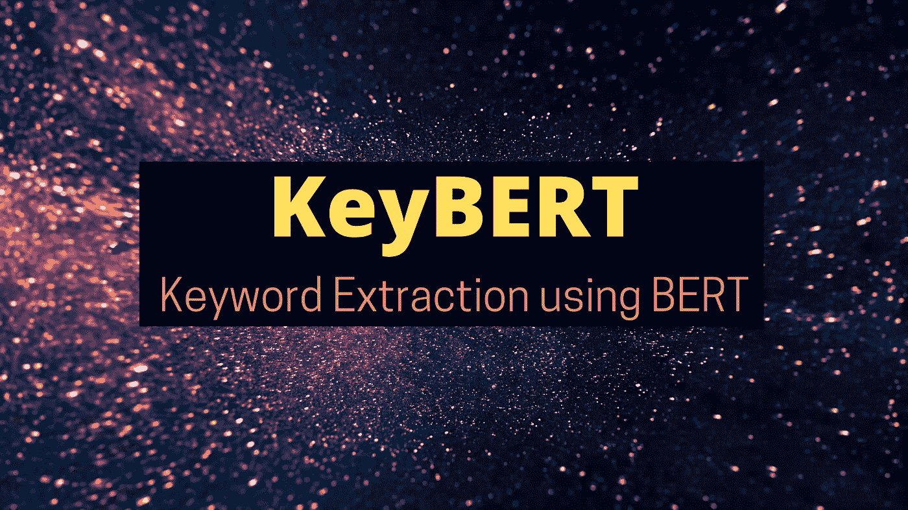
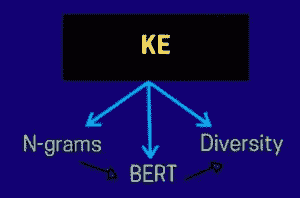
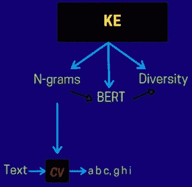
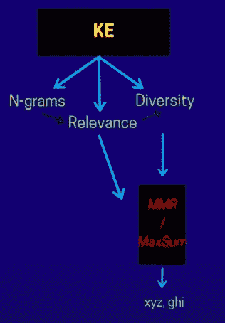

# KeyBERT:使用 BERT 提取关键词

> 原文：<https://towardsdatascience.com/keybert-keyword-extraction-using-bert-a6dc3dd38caf?source=collection_archive---------7----------------------->

## 解码 NLP 库—视觉效果和示例

来自[源](https://unsplash.com/photos/W8KTS-mhFUE)的修改图像

关键词提取的任务是识别最能代表源文档的**重要术语或短语。识别好的关键词不仅有助于准确描述文档的内容，还可以通过将关键词作为元数据存储到原始文档中来帮助**加快信息检索**。在这个领域已经做了很多研究。其中之一就是我们今天要讨论的。**

> 在这篇博客中，我们将讨论一种流行的基于 BERT 的关键字提取技术/库，称为 **KeyBERT** 。

*没时间看完整个博客？然后看这个快速的< 60 秒的 YouTube 短片—*

[多看看这样的视频](https://www.youtube.com/channel/UCoz8NrwgL7U9535VNc0mRPA)

# BERT 概述

**BERT** 又名变压器的双向编码器表示是一个仅编码器模型，旨在从未标记的文本中学习**文本段的深度双向表示。它接受了两项任务的预训练——1 . **MLM** (蒙面语言造型)2。 **NSP** (下一句预测)**

其中 MLM 的任务使得模型能够基于在其上下文中出现的单词来学习输入中每个单词/记号的表示。NSP 的任务是说，如果给两个句子，然后知道第二个句子是否跟在第一个后面。在这个预训练步骤之后，**你可以在任何下游任务**中对这个模型进行微调，比如分类等等。你可以在 [MLM vs CLM](/understanding-masked-language-models-mlm-and-causal-language-models-clm-in-nlp-194c15f56a5) 和[BERT 了解 NLP 中的 BERT](https://www.geeksforgeeks.org/understanding-bert-nlp/)中阅读更多关于掩蔽语言建模的内容。

# 基于 BERT 的关键词提取

因此 [KeyBERT](https://maartengr.github.io/KeyBERT/index.html) 是一个关键字提取库，它利用 BERT 嵌入来获取最能代表底层文本文档的关键字。此外，这个库处理这项任务的方式——你可以说这是一种从给定文本中获取关键字的**无监督提取方式。**

在很高的层面上，KeyBERT 的工作是下图所示的*—*

KeyBERT Internals |作者图片

整个步骤由 3 个连续的步骤组成。首先，我们从**开始，从提供给我们的用于提取关键词的底层文本语料库中提取 n-grams** 。n 元文法不过是字符串中 n 个连续记号的序列。作者使用 CountVectorizer 来获得候选 n 元文法的列表。CountVectorizer 根据 n 元语法在原始文档中的出现频率对其进行排序。

N-grams 作为关键字|作者图片

在此之后，使用 BERT 模型将从上一步提取的所有 n 元语法转换为它们的高维表示。下一步是计算每个 n 元语法和原始文本文档之间的**语义距离**。*相似度越高，关键词与源文档的相关性和代表性就越强。*

确保提取的关键字|作者图片的相关性

因此，在根据这些 n 元语法与底层文档的相关程度获得这些 n 元语法的排序列表后，下一步是根据 [**【最大边距相关度】**](https://www.youtube.com/watch?v=ykClwtoLER8) *(检查时间戳的描述)* **或最大和策略**对它们进行重新排序。其中这背后的核心思想是*最小化 n-gram 到原始文档的距离，但同时最大化与其他候选 n-gram 的距离*。这确保了我们不会在最终的集合中输出相似含义的 n 元语法作为可能的关键字，也就是说**确保多样性**。

确保提取关键字的多样性|按作者分类的图片

# 我的想法

看到使用上下文表示来获取相关关键词是很有趣的。虽然我觉得这将是很有趣的，看看它比非上下文化的表示好多少，以及平均起来这种方法如何优于早期基于图的关键字提取工作。但肯定的是，多元化步骤在这一研究领域发挥了至关重要的作用。

如果你感兴趣的话，可以随意阅读我不久前写的另一篇关于关键词提取的优美文章——[自然语言处理中 10 种流行的关键词提取算法](https://medium.com/mlearning-ai/10-popular-keyword-extraction-algorithms-in-natural-language-processing-8975ada5750c)

# Github 项目

[https://maartengr.github.io/KeyBERT/index.html](https://maartengr.github.io/KeyBERT/index.html)

我希望你喜欢读这篇文章。如果你愿意支持我成为一名作家，考虑注册[成为一名媒体成员](https://prakhar-mishra.medium.com/membership)。每月只需 5 美元，你就可以无限制地使用 Medium。谢谢！