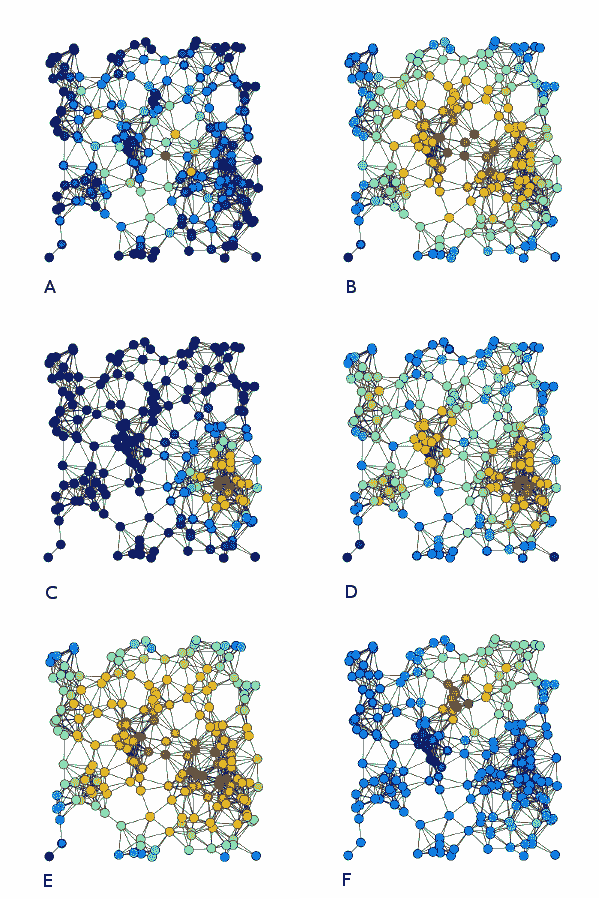
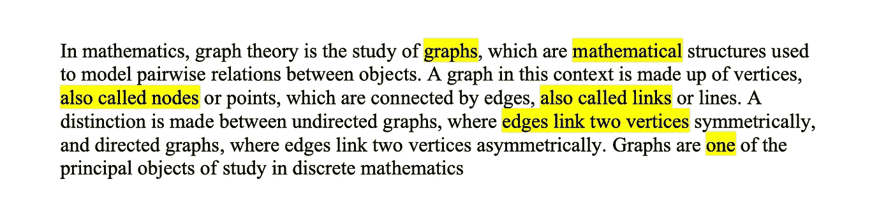
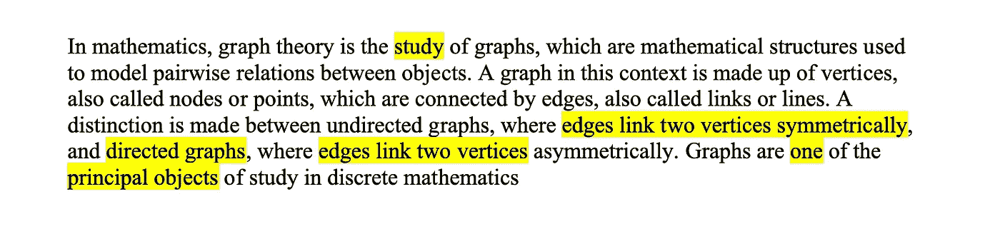

# 基于图中心性的关键短语抽取

> 原文：<https://towardsdatascience.com/keyphrase-extraction-with-graph-centrality-989e142ce427?source=collection_archive---------12----------------------->

## 利用图形表示从自由文本中提取相关短语

自由文本缺乏明确的结构和标准化。在本帖中，我们看到了如何用一个图来表示自由文本，使其结构清晰，易于下游算法管理。

在这篇文章中，我将向您展示如何使用自由文本的图形表示来解决关键短语提取的任务。顾名思义，该任务的目标是从输入文本中返回相关短语(一个或多个单词)的列表。在这种情况下，我们将仅由候选关键字(即，最相关的单字)组成的短语定义为相关短语。候选关键词由图中心性算法直接给出，该算法利用图的结构来对节点评分(在我们的例子中，节点表示文本中的单词以及它们之间的关系)。

我们将按照 3 个步骤解决这个问题(假设我们有一个来自我的[前一篇文章](https://medium.com/@diogoapnunes/structuring-text-with-graph-representations-41dd4f2a3ab3)的输入文本的图形表示):

1.  用图中心性算法对图节点(即单词)进行评分
2.  提取候选关键字(即最相关的单个单词)
3.  提取关键短语(基于候选关键字)

和上一篇文章一样，为了保持一致性，下面的文档将是我们的运行示例(改编自[维基百科](https://en.wikipedia.org/wiki/Graph_theory)):

> 在数学中，图论是对图形的研究，图形是用于建模对象之间成对关系的数学结构。在这种情况下，图由顶点组成，也称为节点或点，它们通过边连接，也称为链接或线。无向图和有向图是有区别的，在无向图中，边对称地连接两个顶点，在有向图中，边不对称地连接两个顶点。图形是离散数学的主要研究对象之一

示例文档的起始图。在这种情况下，我在创建 graph(NLTK 为英语提供的停用词列表)之前已经删除了所有停用词。请阅读我之前的文章来学习如何建造它。图片作者。

# 1.给图形节点评分

图中的每个节点代表输入文档中出现的一个术语(一个节点代表同一术语的多次使用)。在极限情况下，我们可以定义任何函数来给图中的节点评分。在这篇文章中，我将向你展示如何利用 [NetworkX](https://networkx.org) (我们用来构建我们的图)根据节点的中心性给节点打分。来自[维基百科](https://en.wikipedia.org/wiki/Centrality):

> 中心性指数是对“重要顶点的特征是什么？”答案是根据图的顶点上的实值函数给出的，其中产生的值被期望提供标识最重要节点的排序。“重要性”这个词有很多种含义，导致对中心性有许多不同的定义。

因此，在 NetworkX 上有无数的中心性算法。你可以在[这里](https://networkx.org/documentation/stable/reference/algorithms/centrality.html)查看它们，决定哪一个最适合你的问题。在这篇文章中，我们使用哪种算法并不重要，重要的是它能提供有趣的节点分数。

我们首先根据某种中心性算法计算节点得分，并从得分最高到最低对它们进行排序。得分最高的节点代表与我们的任务最相关的单个单词。

这些是前 3 个节点和相应的分数:

1.  *图形:0.56*
2.  *研究:0.43*
3.  *对象:0.35*

# 2.提取候选关键字

我们简单地将最高得分节点定义为候选关键字。您希望将多少个节点作为候选关键字取决于您的任务。我们将节点总数的三分之一定义为候选关键字的数量。

这些是我们的候选关键字(按得分从高到低的顺序排列):

在输入文档的图形表示中突出显示候选关键字(红色)。图片作者。

1.*图表*
2。*学习*学习
3。*物体*物体
4。*五棱*五棱
。*顶点*顶点
6。*二*七
。*链接*8。*授意*9
。*对称地*
10。*委托人*
11。*一个*

# 3.提取关键短语

关键短语是输入文档中的相关短语，可用于各种任务，其中之一是摘要。我们将把关键短语定义为输入文档中仅由候选关键字组成的单词序列。例如，如果“*数学*”和“*结构*”都是候选关键字，那么“*数学结构*”是关键短语，这些单词不会被单独考虑。

为此，我们将使用 [Spacy](https://spacy.io) ，它允许我们逐个标记地处理输入文档并分配定制属性。这将有助于我们在原始文档中查找候选关键字序列的任务。

算法思想如下。依次检查输入文档中的每个标记，确定它是否是候选关键字。如果是，那么将它连接到一个关键短语(如果有的话)。如果不是，那么关键短语(如果有的话)就完成了，我们可以用相同的过程继续下一个标记，从一个空的关键短语开始。值得注意的是，如果一个候选关键字属于多于一个单词的关键短语，那么它本身不应该被认为是关键短语。

这些是我们的关键短语(注意，根据我们的定义，它们仅由候选关键字组成):

1.  *边对称地连接两个顶点*
2.  *有向图*
3.  *边链接两个顶点*
4.  *主要对象*
5.  *研究*
6.  *一个*

# 使用其他中心性算法

您得到的结果将在很大程度上取决于您决定使用的算法。这是因为每个中心性算法都以非常具体的方式定义了“节点重要性”或分数。例如，*度中心性*将节点的得分定义为其所有边的总和。*度内中心性*，类似地，只考虑进来的边(在有向图中)。*外向度中心性*考虑每个节点的外向边来计算其得分。

在[维基百科关于中心性](https://en.wikipedia.org/wiki/Centrality)的文章中，一张[非常重要的图片](https://commons.wikimedia.org/wiki/File:6_centrality_measures.png#/media/File:6_centrality_measures.png)显示了关于同一图表上不同中心性度量的主题，突出了结果的差异。我邀请你来理解这个图像，以便你能更好地理解哪种中心性测量对你的问题最有效。

A) [中间中心性](https://en.wikipedia.org/wiki/Betweenness_centrality)，B) [接近中心性](https://en.wikipedia.org/wiki/Closeness_centrality)，C) [特征向量中心性](https://en.wikipedia.org/wiki/Eigenvector_centrality)，D) [度中心性](https://en.wikipedia.org/wiki/Degree_centrality)，E) [调和中心性](https://en.wikipedia.org/wiki/Centrality#Harmonic_centrality)和 F) [Katz 中心性](https://en.wikipedia.org/wiki/Katz_centrality)同一个图的例子。这张图片来自维基百科关于图的中心性的文章。[直接链接到原始图像和许可](https://commons.wikimedia.org/wiki/File:6_centrality_measures.png)。图像未被更改。

以下是使用 4 种不同的中心性度量提取的关键短语(仅突出显示任何给定关键短语的第一次出现)。

## 度内中心性

图片作者。

## 度外中心性

图片作者。

## 接近中心性

图片作者。

## 中间中心性

图片作者。

值得注意的是，一些测量提取了更有趣的短语(而不是单个单词)，例如*中间中心性*。然而，由于停用词的移除，许多短语连贯性丢失(例如，“*研究*”和“*图形*”都是单独的关键词，但是更相关的短语“*图形研究*”永远无法提取，因为的“*是被丢弃的停用词)。克服这个问题的一个可能的解决方案是用丢失的停用词(如果有的话)来注释连接两个词的图边，并且在关键短语提取中使用边注释来用丢失的停用词重新填充关键短语。*

# 总结想法

从自由文本中抽取关键短语是一项非常重要的任务，其结果在许多方面都是有用的，例如抽取摘要、索引、响应查询等。自然，有多种方法来执行这项任务:基于单词和句子的语言和统计特征、神经网络和图形表示(我在本文中介绍的方法只是基于图形执行这项任务的多种方法之一)，等等。

基于自由文本的图形表示来执行关键短语提取(和其他任务)有各种优势。最明显的一点是直观理解所应用的算法及其预期结果的简单性。另一个优点是图形表示的适应性，以包括比简单的单词共现关系多得多的关系，例如语义关系、句法依赖、引用依赖等等。包含这些信息(在本文中我们没有这样做)以显式形式丰富了表示(注意，这些关系在自由文本形式中是隐式存在的)，并允许算法独立或联合地具体利用它们。最重要的是，给定任何图，标准算法都可以毫无争议地应用(就像我们在这篇文章中所做的)。

当然，这种方法也有缺点。最突出的一点是表示的局限性，这也是我们的实现受到影响的原因。如果显式地表示自由文本中隐含的所有关系是可能的和容易的，我们甚至不会有这次讨论。但正因为不容易，我们不得不牺牲我们选择的图表形式。在我们的例子中，我们删除了停用词，这样信息流算法(即中心性)就不会考虑我们本质上知道传达很少或没有语义信息的词。这对我们来说意味着显而易见的关键短语(例如“*对图形的研究*”)没有被捕获。

从本质上来说，利用图表示可以有很大的优势，但最终会受到表示本身的限制。因此，由算法设计者来理解文本中什么类型的关系和信息与解决任务相关，并发现如何将该知识转换成节点和边。