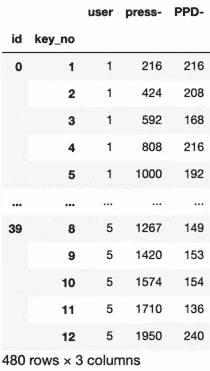

# 击键动力学分析和预测第 1/2 部分(EDA)

> 原文：<https://towardsdatascience.com/keystroke-dynamics-analysis-and-prediction-part-1-eda-3fe2d25bac04?source=collection_archive---------17----------------------->

## 每个按键都有一个故事要讲！

每个用户一生中都会击数百万次键。尽管有许多因素影响击键模式，但每个用户仍然会留下一些隐藏的击键模式签名。这是许多公司已经开始使用的验证用户身份的技术之一。此外，这种技术是非侵入性的(可能在用户不知情的情况下发生)并且是实时的。

图片来源:男高音

维基百科提到:

> **击键动力学**、**击键生物测定学**、**打字动力学**和最近的**打字生物测定学**，是指当一个人在[电脑键盘](https://en.wikipedia.org/wiki/Computer_keyboard)上[打字](https://en.wikipedia.org/wiki/Typing)时，准确描述每个键何时被按下以及何时被释放的详细计时信息。

这些动态可以为我们提供帮助认证用户的洞察力。这种认证用户的技术可以追溯到使用莫尔斯电码的时代。每个使用莫尔斯电码发送信息的特工都有一种独特的打圆点和破折号的方式。这有助于区分敌我。

# 关于技术的更多信息

通过捕捉两次按键之间的持续时间、按下按键的持续时间以及当前按键释放和下一次按键之间的持续时间，可以提供关于用户的大量洞察。下次用户登录时，通过比较他当前的输入模式和他以前的输入模式，公司可以验证登录的用户是合法的还是欺诈的。

通常击键记录者只会记录按键被按下和释放时的时间戳。现在，就其本身而言，这些时间戳将毫无意义。然而，我们可以通过创建诸如按下-按下持续时间(PPD)、保持持续时间(HD)、释放-按下持续时间(RPD)等特征来获得对用户打字模式的洞察。该图显示了按下 2 个键(A 和 b)的持续时间计算。这里，较小的键代表按键事件，较大的键代表按键释放事件。

图片来源:[“SUTD 之狼(TWOS):基于游戏化竞争的恶意内部威胁行为数据集”](https://www.researchgate.net/publication/324536760_The_Wolf_of_SUTD_TWOS_A_dataset_of_malicious_insider_threat_behavior_based_on_a_gamified_competition)

这些持续时间可用于理解用户的打字模式。为了演示这个概念，我使用了我在 Kaggle 上遇到的数据集:[击键动力学挑战 1 | Kaggle](https://www.kaggle.com/c/keystroke-dynamics-challenge-1/data)

# 示范

刚才提到的 Kaggle 数据集捕获了 110 个用户的打字尝试。每个用户已经尝试了 8 次键入字符串“united states”(两个单词的第一个字母都没有用大写字母书写以忽略按下 Shift 键的影响)，并且已经捕获了相对于第一次按键的按键和释放的相应时间戳。

首先，我们以这种方式从 csv 中读取数据:

同一用户的 5 种用户打字模式；提到的数字是时间戳，假设第一个密钥开始于时间 0 |作者的图像

如前所述，这些数据本身不能直接使用。因此，我们需要从这个数据集中生成按下-按下、保持、释放-按下持续时间的特征。我们使用以下代码来实现这一点:

接下来，我们尝试探索这些生成的数据，并尝试通过其表面价值来理解这些数据。

在进一步分析代码之前，让我们只考虑 110 个用户中的 5 个，即 5x8 = 40 个输入模式。

使用 seaborn 的*群集图*功能，我们可以为这 5 个用户生成释放-按压、按压-按压、保持持续时间的群集图。

用户发布-按下持续时间的群集图|图片由作者提供

用户按下-按下持续时间群集图|作者图片

用户持有时长群集图|作者图片

正如你从蜂群图中看到的，所有用户的按下-按下持续时间和释放-按下持续时间大致相同。因此，直接使用平均持续时间是没有帮助的。然而，保持持续时间对于每个用户来说大致不同，这是正确的，因为每个用户根据其对打字的熟悉程度而具有不同的打字速度。让我们计划使用直方图来检查是否可以识别任何变化。因为我们知道每个键入模式由 13 次击键组成，所以让我们尝试用散点图和线图来显示这些持续时间在按键事件的时间戳方面的表现。请注意，由于每种打字模式都是相互独立的，因此我们为 5 个用户中的每一个构建了 8 个线图(由 13 个数据点组成),结果得到 8×5 = 40 个线图。

# 将行要素转换为列要素以进行打印

现在，我们的数据集中的每一行都是对应于一个用户的输入模式，但是如果我们想要分析跨用户的输入模式(由线连接的时间戳)，我们需要将这些行特性放在一个单独的列中。出于这个目的，连同其他一些熊猫函数，我们需要使用熊猫的*宽到长*特性。

按-按持续时间转换为专栏特征|作者图片

现在，让我们尝试使用点和线来绘制*按压持续时间* v/s *按压时间戳*

新闻时间戳 v/s 新闻-新闻持续时间|作者图片

新闻时间戳 v/s 新闻-新闻持续时间由线连接|图片由作者

注意，这里有 40 个线图，即每个用户 8 个线图，并且考虑了 5 个用户。

**这个情节揭示了一个非常有趣的细节。**

请注意用户 4 的锯齿状线条(红线)。PPD 突然增加，然后在下一个键变得非常低。这意味着该用户在连续键入两个键之前要等待相对较长的时间。因此，我们可以说这个用户通常以 2 个键为一组进行键入。

这些是我所说的模式类型，通过简单的计算就可以揭示出来。现在，想象一下，如果我们使用复杂的算法来产生洞察力和设计认证技术，安全性会有多高。这是用户甚至不需要记住的事情。

然而，影响打字模式的因素有很多。这些因素中有一些是:

*   一天中打字的时间
*   打字时键盘的照明条件(特别是对于非触摸式打字者)
*   键盘布局(如果有人选择用其他布局替换 qwerty 布局)
*   对键盘布局的熟悉程度
*   打字的地方
*   打字者的手臂、坐姿
*   打字机的重音

但是有些公司使用多种试探法和技术来自信地认证用户。

在本文第二部分的[中，让我们探索创建可训练数据的其余技术，并在一些常用模型上进一步训练。](/keystroke-dynamics-analysis-and-prediction-part-2-model-training-a13dc353b6e4)

链接到 Kaggle 笔记本详细介绍整个代码:[击键动力学分析和预测 w/ XGB | Kaggle](https://www.kaggle.com/kartik2112/keystroke-dynamics-analysis-and-prediction-w-xgb?scriptVersionId=52021950) 。

PS: EDA 的意思是探索性数据分析

直到下一篇，干杯！:)