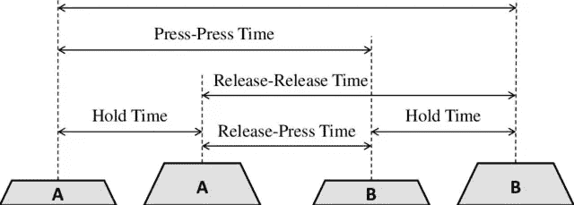
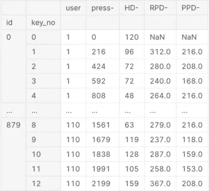
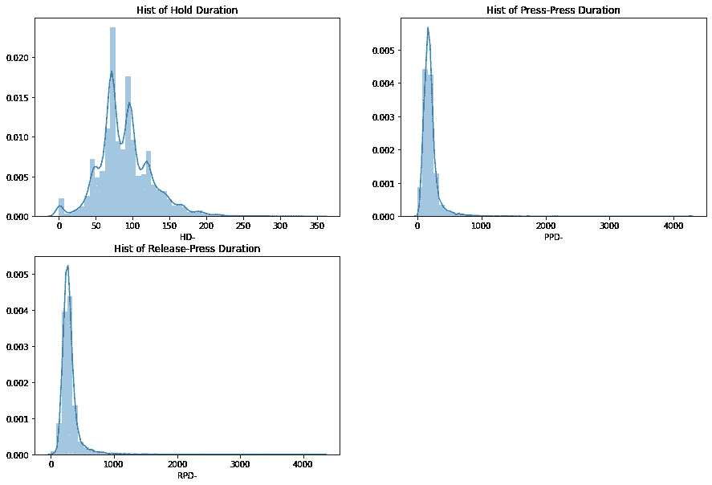
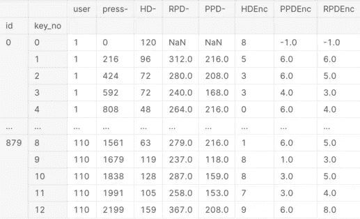
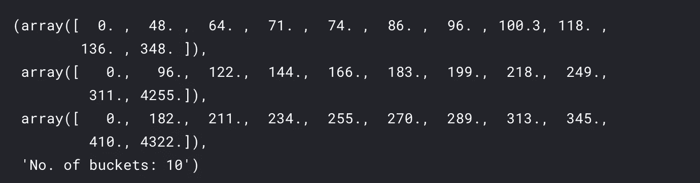
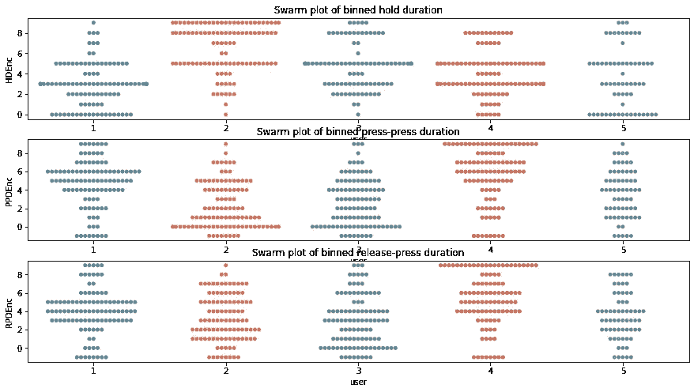
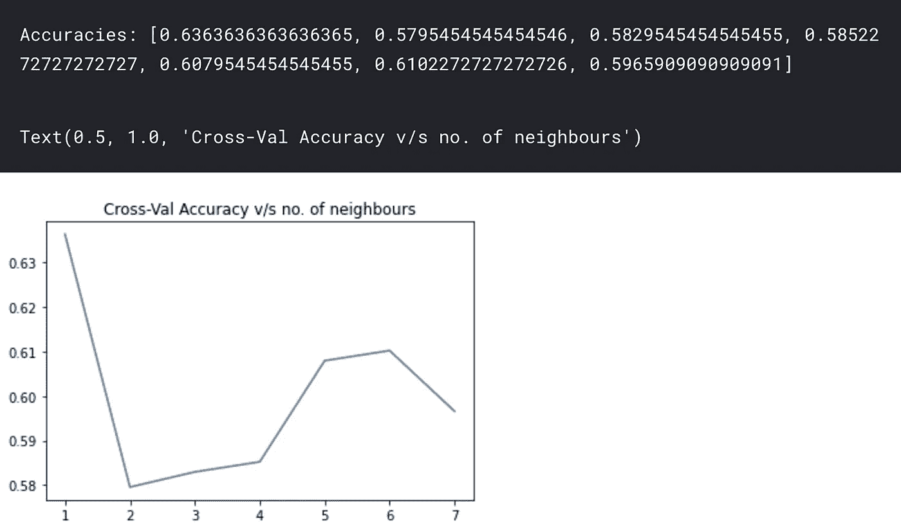
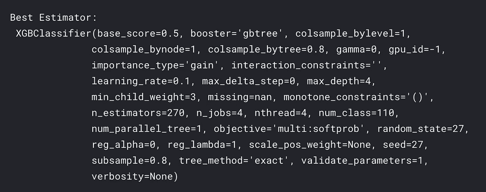
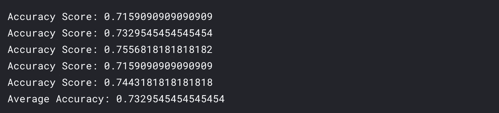

# 击键动力学分析和预测第二部分(模型训练)

> 原文：<https://towardsdatascience.com/keystroke-dynamics-analysis-and-prediction-part-2-model-training-a13dc353b6e4?source=collection_archive---------29----------------------->

如果你还没有阅读上一篇文章，请阅读[击键动力学分析和预测——第 1 部分(EDA)](https://medium.com/@kartik2112/keystroke-dynamics-analysis-and-prediction-part-1-eda-3fe2d25bac04) 。在前一篇文章中，我已经讨论了击键力学，它的目的和挑战。现在，继续讨论击键分析，让我们首先以易于训练模型的格式准备数据。我将再次提及图像以供参考。

图片来源:[“SUTD 之狼(TWOS):基于游戏化竞争的恶意内部威胁行为数据集”](https://www.researchgate.net/publication/324536760_The_Wolf_of_SUTD_TWOS_A_dataset_of_malicious_insider_threat_behavior_based_on_a_gamified_competition)

代替直接使用这些按压-按压、释放-按压和保持持续时间作为输入，我们可以将这些持续时间分组到直方图中，直方图将代表不同打字速度的组。例如，慢速打字者的击键持续时间会落在较大持续时间的直方图桶中。同时，快速打字者(或者可能是触摸式打字者)的击键持续时间会落在较小持续时间的直方图桶中。

因此，我们将通过使用这种直方图技术来转换整个训练和测试数据。注意， *wide_to_long* 函数通过将 *press-** 的所有行值排列成一列来转换数据帧。

训练组合数据帧|作者图片

# 使用直方图分桶

现在，让我们查看生成的直方图，以确定可以创建哪些存储桶，以便在它们之间均匀地分割数据。

持续时间直方图|作者图片

现在，我们可以使用另一个有趣的熊猫函数`qcut`，而不是自己确定桶。在此函数中，我们指定要对其执行宁滨/分桶的列名。该函数检查指定列中值的分布，并将分布分成具有`q`数量的仓的相等频率。这确保了每个箱具有相等的频率，并且我们可以获得更有意义的箱。

我们将`retbins`设置为 True，这样我们以后可以在我们的测试数据集上使用这些容器。对于测试数据集，由于我们已经有了这些库，我们不需要执行`qcut`。相反，我们将使用`cut`，它直接将值分配到适当的 bin 中。

我们将这些值编码到与箱对应的`HDEnc`、`PPDEnc`、`RPDEnc`中的标签 0-9。因为有 12 个 RPD、12 个 PPD、13 个 HD 值对应于打字模式中的 13 个击键，所以我们用-1 填充缺失的 RPD、PPD 值

训练数据现在看起来像这样:

训练组合数据帧|作者图片

现在，让我们来看看作为该操作的结果而创建的箱

直方图仓(已执行单元格的输出)|按作者分类的图像

这意味着，我们的 HD 直方图区间为[0，48]、[48，64]、[64，71]等等。

现在，让我们看看由这些桶形成的编码群图。在群体图中，我们在图上为每个用户绘制所有持续时间的编码值。

宁滨飓风后持续时间的群集图

从语义上来说，这表示每个用户的平均速度。例如，我们可以从 RPD 群图中看到 PPD 持续时间。例如，用户 4 在较高范围的箱中有许多编码(更多 HD、PPD、RPD)。同时，用户 2 在较低范围的箱中有更多的编码。这意味着与用户 2 相比，用户 4 打字相对较慢。

现在，为了进一步处理，我们有以下选项:

*   将每个用户的打字模式汇总到这 10 个箱中，并确定持续时间的标准化频率(概率)
*   将每个用户的打字模式汇总为每次击键的平均 bin 值
*   保留所有打字模式以训练模型并验证准确性

第一种方法最适合文本序列长度不固定的情况。例如，您正在键入一个新的字符串，而不是“美国”，我们可以将所用的时间与任何两次击键的粗略概率进行比较。

现在，当键入“united states”时，连续键击对的相对位置导致这些键击间持续时间的轻微变化。这将在第二种方法中得到固有的考虑。这是因为我们将一对击键(u&n，n&i，…)的持续时间与这些持续时间的平均时间进行了比较。

但是我们的测试数据集只有时间戳，没有用户 id。因此，为了验证我们的模型，我们需要在训练数据集之外保留一些验证数据集。如果我们使用每个用户的平均 bin 值，我们将只有每个用户 1 个值用于训练，这非常非常少。因此，我们将继续第三种方法，仅使用编码值进行训练。

# 每次击键的用户级完全收集箱

现在，以前，为了确定存储桶值，我们已经将输入模式(按行)转换成分组的列。但是为了将这些作为属性/特征进行训练，我们需要将它们转换回行。这可以帮助我们使用 KNN 来识别用户的最接近的关键动态签名。

train df _ User _ AllSampleProps data frame |图片作者

# 模型

我们将尝试在 DF: `trainDF_User_AllSampleProps`上使用 KNN，每个用户有 8 个训练示例。

## KNN

如前所述，我们需要在训练数据集之外保留一些验证。我们有 110 个用户，但每个用户只有 8 个样本，所以我们需要确保每个用户在训练集中有足够的样本。因此，在测试期间，对于每个测试用户，至少会有很少的样本。为此，我们执行`StratifiedShuffleSplit`。

在这里，我使用 *n_splits* 作为 5，这意味着将创建 5 个不同的分裂(用于 5 重交叉验证)，test_size 作为 0.2，导致(8 x 0.2) = 1.6 个测试样本，用于(8 - 1.6) = 6.4 个训练样本。

KNN 精确度|作者图片

在这里，正如您所看到的，当选择 1 个邻居时，精确度很高。但是，通常应该有一个以上的邻居在场才能确定用户。因此，6 个邻居似乎是一个很好的标准。接下来，让我们尝试另一种技术。

# XGB 模型

尽管这个数据集非常小——每个类 8 个样本和 39 个特征列，我们仍然尝试对这个数据集使用 XGB。这里，让我们也分析一下交叉验证的准确性，以确保这个模型是可靠的。

这花了大约 2.25 小时来搜索。现在，既然我们已经找到了数据集的最佳参数，让我们继续查看从 GridSearchCV 获得的最佳估计量。

找到的最佳 XGB 估算器的详细信息|图片由作者提供

现在，让我们详细了解一下精确度。我们使用从分层混洗分离获得的训练和测试数据集来确定获得的准确度，然后确定平均准确度。

XGB 模型|作者图片的准确性

因为数据集本身很小，这是我能得到的最好的精度。

总结这两篇文章，当用户在系统上工作时，击键动力学似乎是对用户进行非侵入式认证的一个有前途的选择。如果键入模式看起来明显不同，可以对当前用户进行一些二次验证/认证，以进一步验证用户。不仅仅是击键动力学，同样的概念也适用于鼠标动力学。尽管存在多重挑战，但通过大量数据和非常好的启发式方法，我们可以建立一个强大的认证系统。

我已经在 Kaggle 上执行了全部代码。你可以在这里找到 Kaggle 笔记本:[击键动力学分析与预测 w/ XGB | Kaggle](https://www.kaggle.com/kartik2112/keystroke-dynamics-analysis-and-prediction-w-xgb?scriptVersionId=52021950) 。

直到下一篇，干杯！