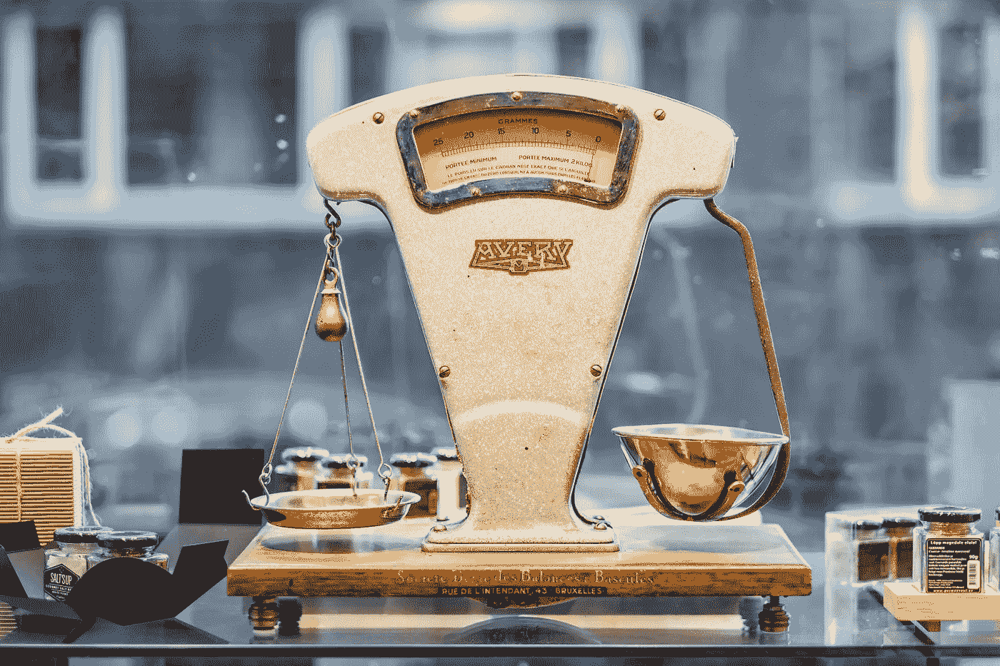
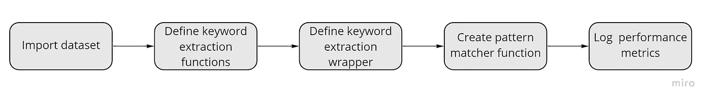
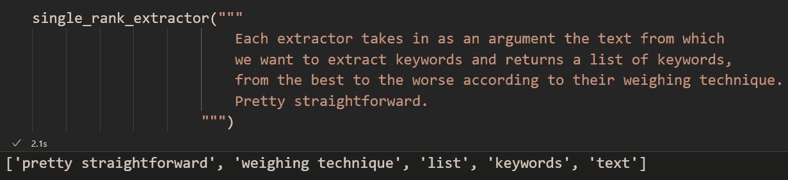
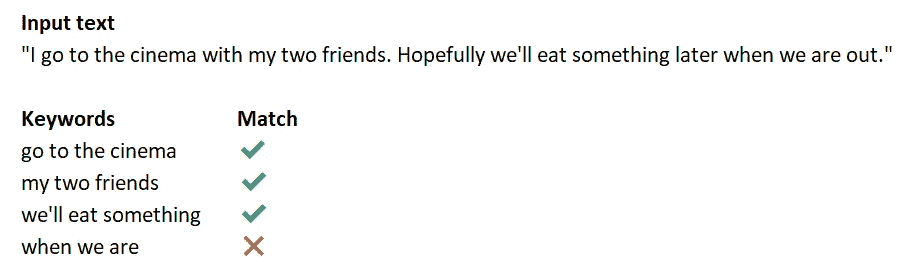
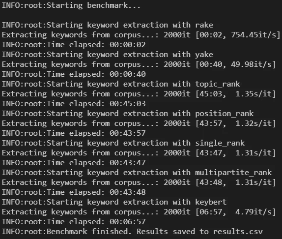
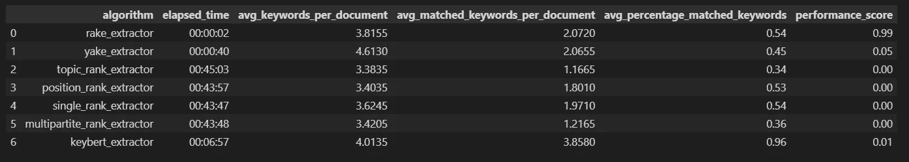
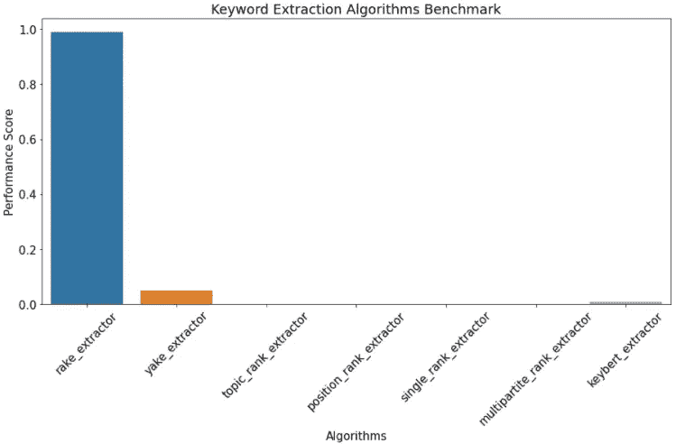
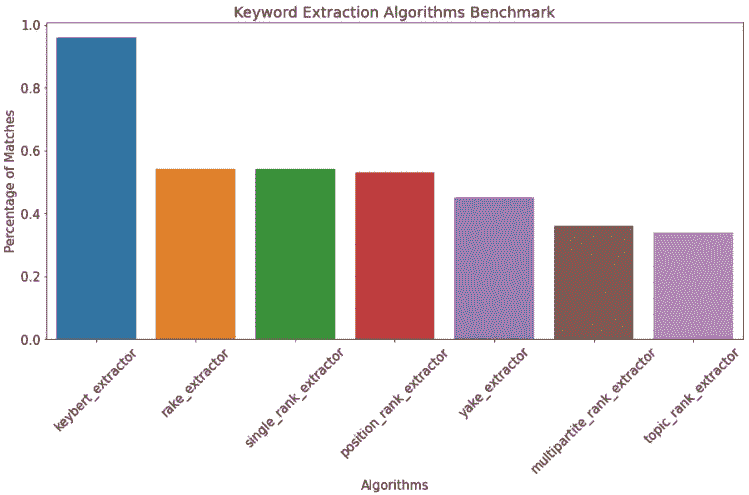

# 关键词提取 Python 中 7 种算法的基准

> 原文：<https://towardsdatascience.com/keyword-extraction-a-benchmark-of-7-algorithms-in-python-8a905326d93f?source=collection_archive---------1----------------------->

## [提示和技巧](https://towardsdatascience.com/tagged/tips-and-tricks)

## 我在一个有 2000 个文档的语料库上比较了 7 个相关的算法



由[皮雷特·伊尔弗](https://unsplash.com/@saltsup?utm_source=unsplash&utm_medium=referral&utm_content=creditCopyText)在 [Unsplash](https://unsplash.com/s/photos/weight?utm_source=unsplash&utm_medium=referral&utm_content=creditCopyText) 上拍摄

我一直在积极寻找一种有效的算法来完成关键词提取任务。我们的目标是找到一种能够在**中提取关键字的算法，一种有效的方式**，平衡提取的质量和执行的时间，因为我的数据语料库正在快速增长，达到数百万行。**其中一个关键绩效指标是提取那些即使脱离上下文也总是有意义的关键词。**

这让我测试和试验了几个著名的关键词提取机制。我在这里和你分享我的小旅程。

# 图书馆

我使用了以下库来进行研究

*   NLTK ，在预处理阶段和一些辅助函数中帮助我
*   [耙](https://pypi.org/project/rake-nltk/)
*   [雅克](https://github.com/LIAAD/yake)
*   [PKE](https://github.com/boudinfl/pke)
*   [凯伯特](https://github.com/MaartenGr/KeyBERT)
*   空间

Pandas 和 Matplotlib，以及其他通用但核心的库也被使用。

# 实验的结构

基准测试的工作方式如下



绩效评估的步骤。图片作者。

我们将首先**导入包含文本数据的数据集**。然后，我们将创建应用提取逻辑的独立函数

*_ _ algorithm _ name _ _(str:text)→[keyword 1，keyword2，…，keywordn]*

然后我们将创建一个函数，对整个语料库应用**提取。**

*extract _ keywords _ from _ corpus(算法，语料库)→{算法，语料库 _ 关键字，已用时间}*

Spacy 将帮助我们**定义一个匹配器对象**，如果一个关键字匹配一个对我们的任务有意义的语法模式，它将返回 true 或 false

最后，我们将**把一切**打包成一个函数，输出我们的**最终报告。**

# 数据集

我正在处理一系列取自互联网的小块文本。这是样品

```
['To follow up from my previous questions. . Here is the result!\n',
 'European mead competitions?\nI’d love some feedback on my mead, but entering the Mazer Cup isn’t an option for me, since shipping alcohol to the USA from Europe is illegal. (I know I probably wouldn’t get caught/prosecuted, but any kind of official record of an issue could screw up my upcoming citizenship application and I’m not willing to risk that).\n\nAre there any European mead comps out there? Or at least large beer comps that accept entries in the mead categories and are likely to have experienced mead judges?', 'Orange Rosemary Booch\n', 'Well folks, finally happened. Went on vacation and came home to mold.\n', 'I’m opening a gelato shop in London on Friday so we’ve been up non-stop practicing flavors - here’s one of our most recent attempts!\n', "Does anyone have resources for creating shelf stable hot sauce? Ferment and then water or pressure can?\nI have dozens of fresh peppers I want to use to make hot sauce, but the eventual goal is to customize a recipe and send it to my buddies across the States. I believe canning would be the best way to do this, but I'm not finding a lot of details on it. Any advice?", 'what is the practical difference between a wine filter and a water filter?\nwondering if you could use either', 'What is the best custard base?\nDoes someone have a recipe that tastes similar to Culver’s frozen custard?', 'Mold?\n'
```

大部分是与食物相关的项目。我们将从 **2000 个文档**中抽取一个样本来测试我们的算法。

我们还不会对文本进行预处理，因为有些**算法的结果是基于停用词和标点符号的存在。**

# 算法

让我们定义关键词提取函数。

每个提取器接受我们想要从中提取关键字的文本作为参数，并返回一个关键字列表，根据它们的加权技术从最好到最差。很简单。

*注意:由于某种原因，我无法初始化函数之外的所有提取器对象。每当我这样做时，TopicRank 和 MultiPartiteRank 都会抛出错误。就性能而言，这并不完美，但基准测试仍然可以完成。*



工作中的单秩提取函数示例。图片作者。

**我们已经通过传递 *pos = {'NOUN '，' PROPN '，' ADJ '，' ADV ' }-*限制了一些公认的语法模式**，这与 Spacy 一起，将确保几乎所有的关键字从人类语言的角度来看都是有意义的。我们还希望关键字至少是三元模型，只是为了有更多具体的关键字和**避免过于笼统**。查看库文档，深入了解参数及其工作原理。

# 从整个语料库中提取关键词

现在让我们定义一个函数，它将一个提取器应用于整个语料库，同时输出一些信息。

这个函数所做的就是用作为参数传入的来自提取器的数据和一系列**有用的信息填充一个字典，比如执行任务需要多长时间。**

# 语法匹配功能

这是我们确保提取器返回的关键字总是(几乎？)有道理。举个例子，



当脱离上下文阅读时，我们需要的关键词也应该总是有意义的。图片作者。

我们可以清楚的理解，前三个关键词是可以独立存在的。他们有一个意义，他们完全是感性的。*当我们是*不是——我们需要更多的信息来理解那一大块数据的意义。我们想避免这种情况。

Spacy 在 Matcher 对象中派上了用场。我们将定义一个*匹配*函数，该函数接受一个关键字，如果定义的模式匹配，则返回 True 或 False。

# 基准函数

我们差不多完成了。这是启动脚本和收集结果之前的最后一步。

我们将定义一个*基准函数*,它接收我们的语料库和一个布尔值来决定是否对数据进行洗牌。对于每个提取器，它调用*extract _ keywords _ from _ corpus*函数，该函数返回一个包含该提取器结果的字典。我们将该值存储在一个列表中。

对于列表中的每个算法，我们计算

*   **提取关键词的平均数量**
*   **匹配关键字的平均数量**
*   计算分数时要考虑到**找到的平均匹配数除以**执行操作所用的时间

我们将所有数据存储在熊猫数据框架中，然后导出到. csv 格式。

# 结果

运行基准测试就像编写代码一样简单



记录基准的进度。图片作者。

这是结果



基准数据框架。图片作者。

和一个带有绩效得分的条形图



基准测试的结果——性能分数考虑了随时间变化的准确性。图片作者。

**根据得分公式(*avg _ matched _ keywords _ per _ document/time _ elapsed _ in _ seconds*), Rake 在所有其他算法上远远胜出**。Rake 在 2 秒内处理 **2000 个文档的事实令人印象深刻**，尽管准确性没有 Yake 或 KeyBERT 高，但时间因素使其胜过其他人。

如果我们只考虑准确性，计算为*avg _ matched _ keywords _ per _ document*和*avg _ keywords _ per _ document*之间的比率，我们得到这些结果



准确性源于我们的基准测试。图片作者。

从精确度的角度来看，Rake 的表现也相当不错。考虑到执行提取所需的时间很短，获得如此高的性能分数是有意义的。

# 最终考虑

如果我们没有时间在等式中， **KeyBERT 肯定会把获胜点作为能够提取敏感关键词的最准确算法。**

这个项目的目标是找到效率方面的最佳算法**。对于这项任务，Rake 似乎占据了那个位置。**

底线是，如果你需要比其他任何东西都精确，KeyBERT 是你的解决方案，否则 Rake 或 Yake。在我没有特定目标，只是想要一个平衡的解决方案的情况下，我会使用 Yake。

很高兴你来了。希望您会发现这篇文章很有用，并在您的代码库中实现它的片段。

# 推荐阅读

对于感兴趣的人来说，这里有一个我为每个与 ML 相关的主题推荐的书籍列表。在我看来，有一些必不可少的书籍对我的职业生涯产生了巨大影响。
*免责声明:这些是亚马逊会员链接。我会收到亚马逊为你推荐这些项目的一小笔佣金。你的体验不会改变，你也不会被收取更多费用，但它将帮助我扩大业务规模，围绕人工智能制作更多内容。*

*   **ML 简介** : [*自信的数据技能:掌握处理数据的基本原理，为你的职业生涯增压*](https://amzn.to/3WZ51cE) 作者:基里尔·叶列缅科
*   **sk Learn/tensor flow**:[*使用 Scikit-Learn、Keras 和 TensorFlow*](https://amzn.to/3jseVGb) 进行动手机器学习
*   **NLP** : [*文本即数据:机器学习和社会科学的新框架*](https://amzn.to/3l9FO22) 贾斯汀·格里默著
*   **sk Learn/PyTorch**:[*用 py torch 和 Scikit 开发机器学习-Learn:用 Python 开发机器学习和深度学习模型*](https://amzn.to/3wYZf0e)Sebastian Raschka
*   **数据即** : [*用数据讲故事:商务人士数据可视化指南*](https://amzn.to/3HUtGtB) 作者:Cole Knaflic

# 有用的链接(我写的)

*   **了解如何在 Python 中执行顶层探索性数据分析**:[*Python 中的探索性数据分析——一步一步的过程*](/exploratory-data-analysis-in-python-a-step-by-step-process-d0dfa6bf94ee)
*   **学习 TensorFlow 的基础知识**:[*tensor flow 2.0 入门—深度学习入门*](https://medium.com/towards-data-science/a-comprehensive-introduction-to-tensorflows-sequential-api-and-model-for-deep-learning-c5e31aee49fa)
*   **用 Python 中的 TF-IDF 进行文本聚类** : [*用 Python 中的 TF-IDF 进行文本聚类*](https://medium.com/mlearning-ai/text-clustering-with-tf-idf-in-python-c94cd26a31e7)

如果你想支持我的内容创作活动，请随时关注我下面的推荐链接，并加入 Medium 的会员计划。我将收到你投资的一部分，你将能够以无缝的方式访问 Medium 的大量数据科学文章。

[](https://medium.com/@theDrewDag/membership) [## 通过我的推荐链接加入 Medium-Andrew D # data science

### 阅读 Andrew D #datascience(以及媒体上成千上万的其他作者)的每一个故事。您的会员费直接…

medium.com](https://medium.com/@theDrewDag/membership) 

# 参考

Campos，r .，Mangaravite，v .，Pasquali，a .，Jatowt，a .，Jorge，a .，Nunes，c .，Jatowt，A. (2020 年)。雅克！利用多种局部特征从单个文档中提取关键词。信息科学杂志。爱思唯尔，第 509 卷，第 257-289 页。 [pdf](https://doi.org/10.1016/j.ins.2019.09.013)

Campos R .、Mangaravite V .、Pasquali A .、Jorge A.M .、Nunes C .和 Jatowt A. (2018 年)。一种基于文本特征的单文档关键词自动提取方法。载于:Pasi G .，Piwowarski B .，Azzopardi L .，Hanbury A .(编辑)。信息检索进展。ECIR 2018 年奥运会(法国格勒诺布尔。3 月 26 日至 29 日)。计算机科学讲义，第 10772 卷，第 684-691 页。 [pdf](https://link.springer.com/chapter/10.1007/978-3-319-76941-7_63)

Campos R .、Mangaravite V .、Pasquali A .、Jorge A.M .、Nunes C .和 Jatowt A. (2018 年)。雅克！独立于集合的自动关键词提取器。载于:Pasi G .，Piwowarski B .，Azzopardi L .，Hanbury A .(编辑)。信息检索进展。ECIR 2018 年奥运会(法国格勒诺布尔。3 月 26 日至 29 日)。计算机科学讲义，第 10772 卷，第 806-810 页。

Csurfer。(未注明)。CSURFER/Rake-nltk:使用 nltk 的快速自动关键字提取算法的 Python 实现。检索于 2021 年 11 月 25 日，发自 https://github.com/csurfer/rake-nltk

利亚德。(未注明)。Liaad/Yake:单文档无监督关键词提取。于 2021 年 11 月 25 日从[https://github.com/LIAAD/yake](https://github.com/LIAAD/yake)检索

布丹芙。(未注明)。BOUDINFL/pke: Python 关键短语提取模块。检索于 2021 年 11 月 25 日，来自[https://github.com/boudinfl/pke](https://github.com/boudinfl/pke)

马尔滕格尔。(未注明)。MAARTENGR/Keybert:用 bert 提取最少的关键字。检索于 2021 年 11 月 25 日，来自[https://github.com/MaartenGr/KeyBERT](https://github.com/MaartenGr/KeyBERT)

爆炸。(未注明)。爆炸/空间:💫Python 中的工业级自然语言处理(NLP)。检索于 2021 年 11 月 25 日，来自[https://github.com/explosion/spaCy](https://github.com/explosion/spaCy)