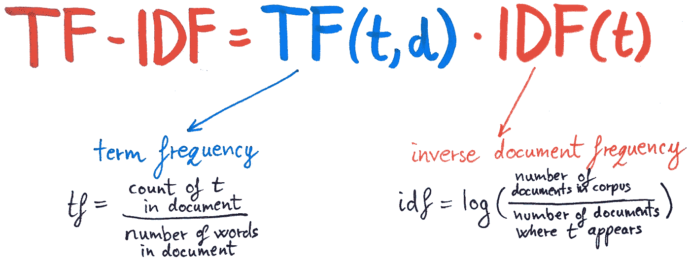
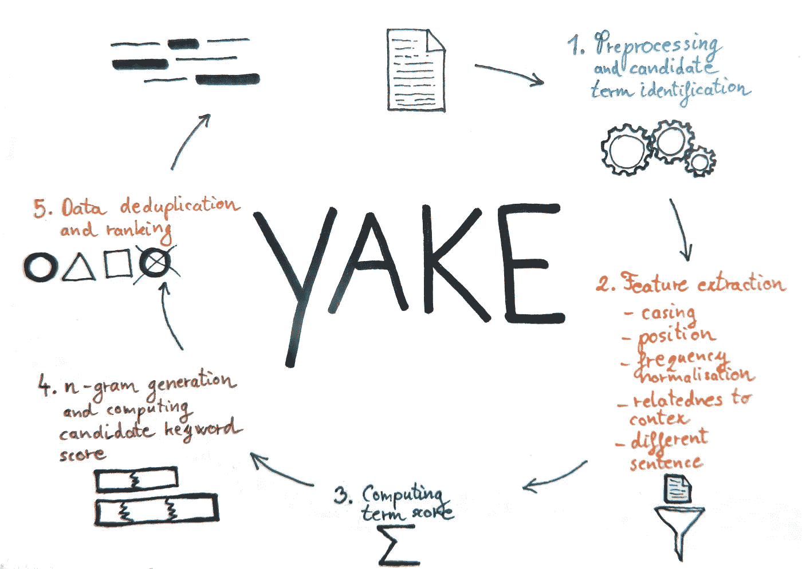
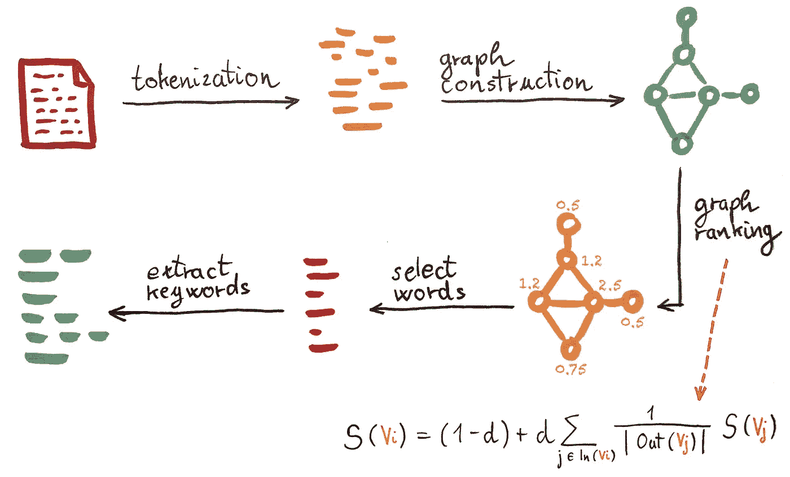
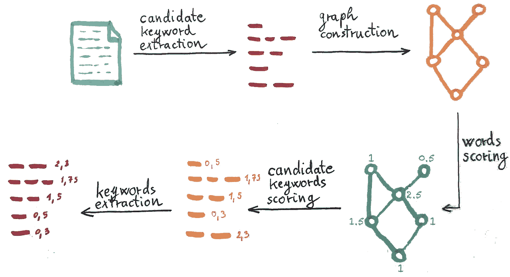

# 关键词提取方法—概述

> 原文：<https://towardsdatascience.com/keyword-extraction-methods-the-overview-35557350f8bb?source=collection_archive---------9----------------------->

## 关键词提取方法在文档中查找相关关键词。在这篇文章中，我总结了最常见的关键字提取方法。

**文章、社交媒体帖子和出版物等文本文档的数量正在增长。因为我们不能阅读所有的文档，所以我们需要一些方法来帮助我们找到相关的文档。关键词或关键短语提取方法对我们面临的问题有很大帮助。**

由 [Patric Tomasso](https://unsplash.com/@impatrickt) 在 [Unsplash](https://unsplash.com/photos/Oaqk7qqNh_c) 上拍摄的照片

## 什么是关键词提取？

关键词提取是从文本文档中检索关键词或关键短语。它们从文本文档中的短语中选择，并表征文档的主题。在这篇文章中，我总结了最常用的自动提取关键词的方法。

从文档中自动提取关键词的方法使用试探法从文本文档中选择最常用和最重要的单词或短语。我对自然语言处理领域中的关键词抽取方法进行了分类，自然语言处理是机器学习和人工智能中的一个重要领域。

关键词提取器用于提取单词(*关键词*)或组成短语的两个或多个单词的组合(*关键短语*)。在本文中，我使用术语关键字提取，它包括关键字或关键短语提取。

## 但是为什么我们需要提取关键词的方法呢？

**节省时间** —根据关键词，一个人可以决定文本的主题(如文章)是否让他感兴趣，是否阅读。关键字向用户提供文档的摘要。

**找相关文档** —今天写了成吨的文章，不可能全部看完。关键词提取算法可以帮助我们找到相关的文章。关键词提取算法还可以自动建立书籍、出版物或网络索引。

**支持机器学习的关键词提取** —关键词提取算法找到描述文本的最相关的词。它们可以在以后用于可视化或自动分类文本。

## 关键词提取方法

在这篇文章中，我将概述一些最常用的关键字提取方法。我会考虑无监督的(他们不需要训练)和领域无关的方法。我将方法分成三组:统计的、基于图的和基于嵌入的方法。

## 统计方法

统计方法是最简单的。他们计算关键字的统计数据，并使用这些统计数据对它们进行评分。一些最简单的统计方法是词频、词语搭配和共现。但是，也有一些更复杂的，如 TF-IDF 和 YAKE！。

**TF-IDF** 或**术语频率**–**逆文档频率**估计单词在文档中相对于整个语料库(更多文档的集合)的重要性。它计算每个术语在文档中的频率，并通过术语在整个语料库中的频率的倒数对其进行加权。最终，得分最高的术语被选为关键词。

TF-IDF 的方程式是

作者图片

其中`t`是观察项。该等式适用于文档中的每个术语(单词或短语)。等式的蓝色部分是术语频率，橙色部分是逆文档频率。

TF-IDF 的思想是，在文档中出现频率较高的单词不一定是最相关的。该算法偏爱在文本文档中频繁出现而在其他文档中不频繁出现的术语。

TF-IDF 的优点是速度快，缺点是需要至少几十个文档的语料库。TF-IDF 是独立于语言的。

**雅客！**(又一个关键词提取器)是一种关键词提取方法，使用单个文档的统计特征来提取关键词。它分五步提取关键词:

作者图片

1.  **预处理和候选术语识别** — 文本被分割成句子、组块(用标点符号分隔的句子的一部分)和记号。对文本进行清理、标记，并识别停用词。
2.  **特征提取** — 该算法为文档中的术语(单词)计算以下五个统计特征:a) **大小写** —统计该术语在文本中出现大写或缩写的次数(与所有出现次数成比例)。一个重要的术语通常更经常以大写形式出现。b) **术语位置** —术语在文本中的句子的中间位置。越靠近开头的术语过去越重要。c) **词频标准化**—测量文档中平衡的词频。d) **术语与上下文的相关性** — 测量候选术语与多少个不同的术语同时出现。更重要的术语与差异较小的术语一起出现。e) **术语不同句子** —测量术语在不同句子中出现的次数。较高的分数表示更重要的术语。
3.  **计算术语得分** —使用人工公式将上一步的特征组合成一个得分。好奇的读者可以在[原文](https://www.sciencedirect.com/science/article/abs/pii/S0020025519308588)中找到。
4.  **生成 n 元文法并计算关键词得分** —算法识别所有有效的 n 元文法。n 元语法中的单词必须属于同一个组块，并且不能以停用词开头或结尾。然后，每个 n 元语法通过乘以其成员分数来评分，并被归一化以减少 n 元语法长度的影响。停用词被区别对待，以尽量减少它们的影响。
5.  **重复数据删除和排序** —在最后一步算法中，删除相似的关键字。它会保留更相关的内容(分数较低的内容)。相似性是用 Levenshtein 相似性、Jaro-Winkler 相似性或序列匹配器计算的。最后，关键字列表根据它们的分数进行排序。

YAKE 的优势在于它不依赖于外部语料库、文本文档的长度、语言或领域。与 TF-IDF 相比，它在单个文档的基础上提取关键词，并且不需要大的语料库。

## 基于图形的方法

基于图形的方法从文档中生成相关术语的图形。例如，图表将文本中同时出现的术语连接起来。基于图的方法使用图排序方法，该方法考虑图的结构来对顶点重要性评分。最著名的基于图的方法之一是 TextRank。

**TextRank** 是一种基于图形的排名方法，用于提取相关句子或查找关键词。我将重点介绍它在关键词提取中的用法。该方法通过以下步骤提取关键词:

作者图片

1.  **使用词性(PoS)标签的文本标记化和标注**
2.  **单词共现图构造** —图中的顶点是具有所选词性标签的单词(作者仅选择名词和形容词可获得最佳结果)。如果两个顶点出现在文本中的 N 个单词的窗口内，则它们用一条边连接(根据作者的实验，最佳表现 N 是 2)。该图是无向和无权重的。
3.  **图排序** —将每个顶点的得分设置为`1`，在图上运行排序算法。作者使用谷歌的 PageRank 算法，该算法主要用于对网站的图表进行排名。该算法使用上图中的等式。考虑连接到节点`Vi`的顶点的权重，计算顶点`Vi`的权重`S(Vi)`。在等式中，`d`是设置为`0.85`的阻尼因子，如 PageRank 文章中所建议的。`In(Vi)`是到顶点`Vi`的入站链接，`Out(Vj)`是从顶点`Vj`的出站链接。因为我们考虑的是无向图，所以顶点的入站链接和出站链接是相同的。该算法在每个节点上运行几次迭代，直到节点上的权重收敛——迭代之间的变化低于`0.0001`。
4.  **最高得分单词选择** —单词(顶点)从最高得分到最低得分排序。最后，算法选择单词的前 1/3。
5.  **关键词提取** —在这一步骤中，如果在前面阶段选择的词一起出现在文本中，则它们被连接成多词关键词。例如，考虑句子`She only paints with bold colours` *。*如果同时选择`bold` 和`colours` 作为关键字，算法输出`bold colours`作为关键字。新构建的关键词的得分是单词得分的总和。

该算法对每个文档分别执行，并且不需要文档语料库来执行关键词提取。TextRank 与语言无关。

**RAKE** (快速自动关键词提取)是另一种基于图的关键词提取算法。该算法基于这样的观察，即关键字通常由多个词组成，并且通常不包括停用词或标点符号。

它包括以下步骤:

作者图片

1.  **候选关键词提取** —根据停用词和短语分隔符，在候选关键词上分割文本。候选关键字是介于两个停用词或短语分隔符之间的短语。例如，短语分隔符是标点符号。
2.  **关键词共现图构建** —图中的顶点是词。如果它们一起出现在候选关键字中，则它们是相连的。图表是加权的，权重是相关单词在候选关键字中一起出现的次数。该图还包括到顶点本身的连接(每个单词与其自身一起出现在候选关键字中)。
3.  **单词评分** —图中的每个单词都有一个评分:a) **单词度** `deg(w)` —单词`w`共现的单词数(包括指向顶点本身的边在内的边权重之和)。Degree 偏爱出现频率更高、关键词更长的单词。b) **词频** `freq(w)` —该词在任何候选关键词中出现的次数。频率偏爱出现频率更高的单词。c) **程度与频率的比率** `deg(w)/freq(w)` —该指标有利于主要出现在较长候选关键词中的词。建议使用词度或度与频率的比值。从这两个角度来看，这个学位更倾向于较短的关键词。
4.  **候选关键词得分** —每个候选关键词的得分是其成员词得分的总和。
5.  **相邻关键词** —候选关键词不包括停用词。因为有时停用词可能是关键字的一部分，所以在这一步添加它们。该算法在文本中查找与停用词连接的关键字对，并将它们添加到现有停用词集中。它们必须在要添加的文本中至少出现两次。新关键字的得分是其成员关键字的总和。
6.  **关键词提取** —结果，提取出 1/3 的最佳得分关键词。

RAKE 和 TextRank 的主要区别在于，RAKE 考虑候选关键字内的同现，而不是固定窗口。它使用一个更简单、更统计的评分程序，不包括优化。该算法对每个文档分别执行，因此它不需要文档语料库来执行关键词提取。

## 基于深度学习

深度学习的出现使得基于嵌入的方法成为可能。研究人员已经开发了几种使用文档嵌入的关键词提取方法(例如 [Bennani 等人](https://aclanthology.org/K18-1022/))。

那些方法主要寻找候选关键字的列表(例如，Bennani 等人只考虑由名词和形容词组成的关键字)。它们在相同的嵌入空间中嵌入文档和候选关键词，并测量文档和关键词嵌入之间的相似性(例如余弦相似性)。他们根据相似性度量选择与文档文本最相似的关键词。

如果您不熟悉文档嵌入，请阅读本文:

 [## 无需编码的文档嵌入和文本分类

### 什么是文档嵌入，如何在没有一行代码的情况下对文本进行分类？

towardsdatascience.com](/documents-embeddings-and-text-classification-without-coding-e274b4e191e9) 

## 结论

在本文中，我考虑了几种从统计、基于图和嵌入方法中提取关键字的方法。由于这个领域非常活跃，我只考虑最常见的方法。

在本文中，我只考虑了非监督方法的一个子群(它们不需要训练)。也有在带注释文档的训练数据集上训练的监督方法。它们表现很好，但在实践中很少使用，因为它们需要训练、带注释的文档数据集，并且通常仅在训练数据集中的主题上工作良好。

如果我忘记了什么，或者你对这篇文章有任何有价值的补充，请考虑在下面添加你的评论。

## 参考

[1]Bennani-Smires，Kamil 等.使用句子嵌入的简单无监督关键短语提取. *arXiv 预印本 arXiv:1801.04470* ，2018。

[1]坎波斯，李嘉图，等.雅克！利用多种局部特征从单个文档中提取关键词。*信息科学*，2020，509:257–289。

[3]琼斯，卡伦·斯波克。术语特异性的统计解释及其在检索中的应用。*文献杂志*，1972 年。

[4]米哈尔恰、拉达；保罗·塔劳。给文本带来秩序。2004.计算语言学协会。

[5] Rose，Stuart 等.从单个文档中自动提取关键词.*文本挖掘:应用与理论*，2010，1:1–20。