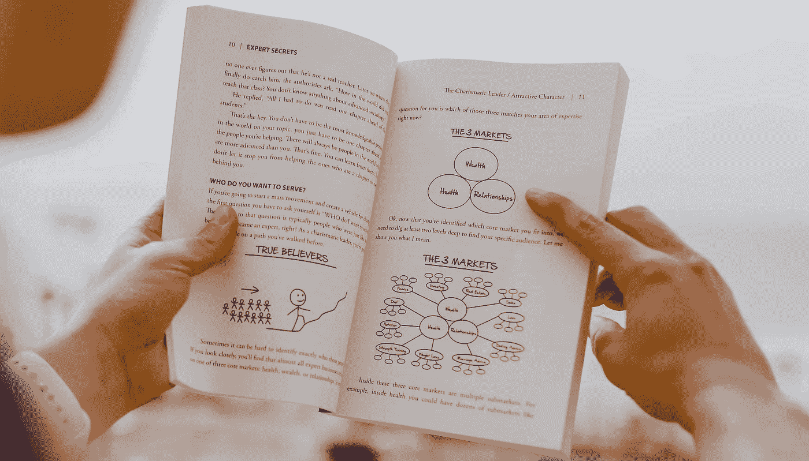

# 使用自然语言处理(NLP)的 Python 中的关键词提取过程

> 原文：<https://towardsdatascience.com/keyword-extraction-process-in-python-with-natural-language-processing-nlp-d769a9069d5c?source=collection_archive---------0----------------------->

我们将讨论 spaCy，YAKE，rake-nltk 和 Gensim 的关键字提取过程。

[奥斯汀·迪斯特尔(Unsplash)拍摄的照片](https://unsplash.com/photos/Ej_GTF0JPss)

当你早上醒来，你做的第一件事就是打开手机查看信息。你的思维已经被训练成忽略那些你不喜欢的人和团体的 WhatsApp 消息。您只需检查人员和群组名称的关键字，就可以决定邮件的重要性。

你的大脑会从 WhatsApp 群名或联系人姓名中提取关键词，并训练喜欢它或忽略它。它还取决于许多其他因素。在阅读文章、看电视或网飞连续剧等时，也可以看到同样的行为。

机器学习可以模仿同样的行为。它被称为自然语言处理(NLP)中的关键词提取。所以，阅读文章或新闻将依赖于提取的关键词，如数据科学、机器学习、人工智能等。

关键词提取过程不仅可以分离文章，还有助于节省社交媒体平台上的时间。你可以根据关键词来决定是否阅读帖子和评论。

你可以检查你的文章是否属于当前的趋势。或者你的文章会不会有趋势。在 google trends 上搜索提取的关键词就可以了。是因素之一，不是唯一因素。

每篇文章、帖子、评论都有自己重要的词，让它们变得有用或无用。关键字提取过程识别这些单词并对文本数据进行分类。

在本文中，我们将介绍帮助关键字提取过程的 python 库。

这些库是:

1.  **spaCy**
2.  ***亚克***
3.  ***Rake-Nltk***
4.  ***Gensim***

我们开始吧。

# 1.宽大的

SpaCy 是 NLP 任务的一个 python 库。但是，我们对 spaCy 的关键字提取功能感兴趣。

我们将从安装 spaCy 库开始，然后下载一个模型 en_core_sci_lg。之后，将文章文本传递到 NLP 管道中。它将返回提取的关键字。

每个型号都有自己的功能。如果一篇文章由医学术语组成，那么使用 en_core_sci_lg 模型。否则，可以使用 en_core_web_sm 模型。

找到下面的相关代码。

**观察。**

1.  文档对象的输出可以是 1 克、2 克、3 克等。你不能根据 n-gram 和其他参数来控制提取过程。
2.  对于与医学术语相关的文本，使用 en_core_sci_xx( xx= lg，sm，md)模型。它还表现在非医学术语文章上。
3.  使用 spacy.load()函数加载不同的模型。参观站点[一](https://allenai.github.io/scispacy/)和[二](https://spacy.io/)，了解更多关于这些车型的信息。

使用 YAKE python 库来控制关键字提取过程。

# 2.雅克

另一个关键词提取器(Yake)库使用文本统计特征方法从文章中选择最重要的关键词。在 YAKE 的帮助下，你可以控制提取的关键词字数和其他功能。

找到下面的相关代码。

**观察所得。**

1.  如果您想从非英语语言(如德语)中提取关键字，请使用 language='de '。文本语言和语言变量的不匹配会给你不良提取的关键字。
2.  max_ngram_size 是限制提取的关键字的字数。如果保持 max_ngram_size=3，那么关键字长度不会增加超过 3。但是，它也会有小于 3 的关键字。
3.  duplication_threshold 变量限制不同关键字中单词的重复。您可以将重复数据删除阈值设置为 0.1，以避免关键字中的单词重复。如果您将重复数据删除阈值设置为 0.9，则允许在关键字中重复单词。

示例–

对于重复数据删除，阈值= 0.1

输出将是[ 'python 和 cython '，'软件'，' ines '，'库已发布']。

对于重复数据删除，阈值= 0.9

输出将是[ 'python 和 cython '，'编程语言 python '，'自然语言处理'，'高级自然语言'，'语言 python '，'语言处理'，' ines montani '，' cython '，'高级自然'，' honnibal 和 ines '，'软件公司爆炸'，'自然语言'，'编程语言'，' matthew honnibal '，' python '，'开源软件库'，'公司爆炸'，' spacy '，'处理'，'书面']。

4.numOfKeywords 变量将确定提取的关键字的数量。如果 numOfKeywords = 20，则提取的关键字总数将小于等于 20。

其他关键字提取方法，你可以测试你的数据。

# 3.Rake-Nltk

通过将快速自动关键词提取(RAKE)算法与 NLTK 工具包结合起来，可以形成一种强大的关键词提取方法。它被称为 rake-nltk。是[这个算法](http://sujitpal.blogspot.com/2013/03/implementing-rake-algorithm-with-nltk.html)的修改版。你可以在这里了解更多 [rake-nltk。使用 pip install rake-nltk 安装 rake-nltk 库。](https://pypi.org/project/rake-nltk/)

找到下面的相关代码。

**观察。**

1.  keyword_extracted 变量保存排序的关键字数据。要限制关键字的数量，可以使用下面的代码。

keyword _ extracted = rake _ nltk _ var . get _ ranked _ phrases()[:5]

2.Rake-nltk 性能与 spacy 相当。

# 4.根西姆

Gensim 主要是为主题建模而开发的。随着时间的推移，Gensim 增加了其他 NLP 任务，如摘要、查找文本相似性等。这里我们将演示 Genism 在关键词提取任务中的使用。

使用 pip install gensim 命令安装 genism。

找到下面的相关代码。

**观察:**

1.  Genism 在提取关键词方面的性能仍然没有达到 spaCy 和 rake-nltk 的水平。Genism 在关键词提取任务上还有改进的空间。

# 结论

关键词提取过程有助于我们识别重要的词。它在主题建模任务中也很有效。你只需要几个关键词就可以知道很多关于你的文本数据。这些关键词将帮助你决定是否要阅读一篇文章。

在本文中，我解释了 4 个 python 库(spaCy、YAKE、rake-nltk、Gensim ),它们从文章或文本数据中提取关键字。您也可以搜索其他 python 库来完成类似的任务。

希望这篇文章能帮助你完成 NLP 任务。