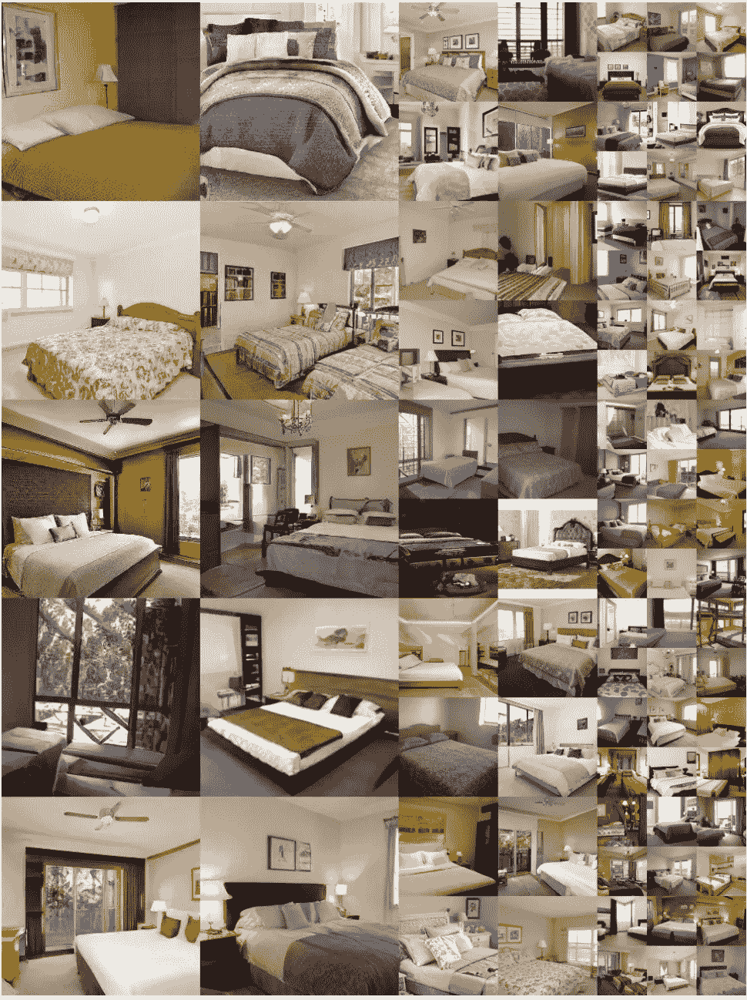

# 在你开始阅读关于 GANs 的论文之前要知道的关键词

> 原文：<https://towardsdatascience.com/keywords-to-know-before-you-start-reading-papers-on-gans-8a08a665b40c?source=collection_archive---------21----------------------->

## 初学者的深度学习

## 用简单的英语解释重要的重复出现的关键词/概念

不可否认的是，甘们很棒！如果你不知道它们是什么，看看这篇文章，我[从零开始向一个 5 岁的孩子解释 GANs](https://medium.com/swlh/how-i-would-explain-gans-from-scratch-to-a-5-year-old-part-1-ce6a6bccebbb)以及[如何在 Pytorch](https://pub.towardsai.net/step-by-step-implementation-of-gans-on-custom-image-data-in-pytorch-part-2-182f2fa16114) 中实现 GANs！简而言之，gan 属于生成模型的一个类别，它让我们生成令人难以置信的真实合成数据，与基础训练数据具有相同的质量。这意味着，如果你输入一些卧室装饰的模型图像，经过几个小时的训练，它可以为你的室内设计产生前所未见的全新想法。

[由](https://drive.google.com/drive/folders/1ToY5P4Vvf5_c3TyUizQ8fckFFoFtBvD8) [StyleGAN](https://arxiv.org/abs/1812.04948) 生成的卧室设计【根据[Creative Commons BY-NC 4.0](https://creativecommons.org/licenses/by-nc/4.0/)许可证提供】

在过去的几周里，我可能已经阅读了十几篇关于 GANs(及其变体)的论文，并在自定义图像上修补了他们的代码(由开源 Github repos 提供)。虽然这些论文中的大部分都写得很精彩，但我希望在我投入这些学术写作的手稿之前，有几个我已经知道的关键词。下面我将讨论其中的一些，并希望当你在论文中遇到它们时，它能节省你一些时间(和挫折)。先明确一点，这不是一篇深入解释这些论文甚至如何编码的文章，只是简单解释一下某些关键词在特定语境下的含义。请放心，当我读到更多内容时，我会确保更新这个列表。

至于先决条件，我假设你们大多数人已经知道什么是与 GANs 相关的鉴别器和发生器网络。也就这样了！对于那些可能需要回顾的人:

> 一个生成器网络的目标是产生看起来像真的假图像。它接受一个随机向量作为输入(比如一个来自高斯分布的 100 维数组),并输出一个足够真实的图像，看起来像是属于我们的训练集！
> 
> 鉴别器网络正确地猜测图像是假的(即由生成器生成)还是真的(即直接来自输入源)。

我们开始吧！

## 图像的潜在表示

要理解潜在表示，请这样想:我的任何高度和宽度为 100 的彩色图像都可能存储在一个形状数组(100，100，3)中。为了以某种形式表现或可视化这个图像，我需要大约 100*100*3 ≈ 300k 的维度。哎哟，太多了！

因此，现在我们试图找到一个压缩的图像表示，这样它需要少于 300k 的维度。假设我们用某种降维技术找到了一个仅使用 5 维的表示。这意味着，现在我的图像可以用一个(假设的)向量`v1 = [.1,.56,.89,.34,.90]`(其中. 1，. 56，. 89 等等)来表示。是沿着五个轴中的每一个轴的值)并且我朋友的图像可以使用向量`v2 = [.20,.45,.86,.21,.32]`来表示。这些向量被称为图像的**潜在表现**。

当然，将它们可视化仍然是一个挑战，因为五维表示更难解析。然而，实际上，我们使用了比简单的 5 更大的表示(大约 100 个)。

## 潜在空间

上面描述的两个向量(还有我的朋友、同事、家庭成员等等)。)构成了**的潜伏空间**。在这个潜在空间中，相似的图像(比如两只猫的图像)会被捆绑得更近，而显著不同的图像(猫对汽车)会被分开得更远。

简而言之，潜在空间可以被认为是一个图像的所有潜在表现都存在的空间。如果每个图像用两个元素的向量表示，这个空间可以是 2D；如果每个图像使用三元素向量表示，则为 3D；诸如此类。

这个空间被称为“潜在的”，意思是隐藏的，仅仅是因为在现实中很难想象这个空间。你能想象在你的头脑中想象出三维空间之外的任何东西吗，更不用说 100 维空间了！

> 潜在空间只是包含点(表示图像)的任何假设空间，以某种方式，生成器知道如何将潜在空间中的点转换为图像(最好看起来类似于它被训练的数据集)。

附:如果我没有链接到 [Ekin Tiu](https://medium.com/u/684d91ee6205?source=post_page-----8a08a665b40c--------------------------------) 的这篇[精彩文章](/understanding-latent-space-in-machine-learning-de5a7c687d8d)，那将是一种耻辱，这篇文章更详细地解释了潜在空间背后的直觉。此外，不要忘记看看他对包含 0-9 数字的潜在空间的特殊视觉表现。

## z 空间

根据先前对潜在空间的定义，Z 空间可以被定义为所有 Z 向量所在的空间。一个 *z* 向量只不过是一个包含来自高斯(正态)分布的随机值的向量。

z 向量通常作为输入传递给完全训练的 GAN 发生器模型，然后该模型吐出看起来真实的假图像。

如果你在 GAN 的一篇论文中遇到类似“*从 Z 空间中采样一个点*”或“*从 Z 空间中采样一个潜在代码*”的内容，请将其视为从 Z 空间中选取一个点，即正态分布的实数向量。

*附:在最初的 GANs 和 DCGAN 论文中，z 向量是 100 维的！*

## 风格代码/风格向量

在你学习完香草甘之后，你会发现一种新的甘，即 StyleGANs。虽然 GANs 充其量只能完美地复制训练数据，并产生更多看起来像它的数据，但 StyleGANs 的酷之处在于，它们允许生成高保真图像，其中有更多的变化——各种背景、雀斑、眼镜、发型等。

为此，作者实现了各种架构改进。其中之一如下:不是将 z 向量直接传递到生成器(仅供参考，有时在 StyleGANs 的论文中也称为合成网络)，而是首先通过映射网络来产生 *w 向量*又名*样式代码*又名*样式向量*。然后，这被注入到不同层的合成网络中(经过一些特定层的转换)，我们得到的输出是一个令人敬畏的高保真图像。

*p . s . StyleGAN 架构中 Z 和 W 空间的形状都是 512-D，而且 Z 的分布是高斯型的，但是 W 空间不遵循任何特定的分布。*

## W-space 和扩展 w-space (W+)

到目前为止，希望您已经理解了如何定义空间。因此，自然地，W-space 是上面定义的所有样式向量`w`的一些假设居所，这样，如果我们从这个空间中随机选取一个向量，并将其馈送到 StyleGAN 生成器，它就能够产生一个看起来很真实的假图像(比如说，I)。

潜在空间 W 在 StyleGANs 中是一个非常重要的概念，因为它是控制图像各种属性/特征的关键。这是因为 W 空间被*解开*，这意味着 512 个维度中的每一个都编码了关于图像的独特信息——例如，第一维可能控制表情，第二维控制姿势，第三维控制照明，等等。这种知识允许我们对图像进行某些修改。例如，如果我以某种方式知道向量`w`中要改变的*右*值，以生成`w’`，然后将`w’`馈送给 StyleGAN 生成器，它可以生成原始图像 I 的微笑版本(注意:我们将在教程的后面看到如何在潜在代码中找到这些要改变的“正确”值)。

很多时候，为了增加 StyleGAN 生成器的表现力(即，生成看起来与“平均”人脸不同的独特不同人脸的能力)，我们不是对所有层使用一个样式向量，而是对合成/生成器网络中的每一层使用一个独特的样式代码。这被称为 W-空间的扩展，通常表示为 W+。

## 在潜在空间中编码/投影/嵌入图像

虽然能够对 StyleGAN 生成器生成的假图像的面部特征进行修改很酷，但更酷的是，如果我们可以在你和我的真实图像上做所有这些事情。

要做到这一点，第一步是在 StyleGAN 的 W 空间中找到我的图像的潜在表示(这样我就可以修改那里的正确值来生成我的微笑/皱眉的图片)。这就是，在 W 空间中找到一个向量，当这个向量被输入到一个 StyleGAN 生成器时，它会输出我的精确图像。这就是所谓的在潜在空间中嵌入/投影/编码图像。

[研究](https://openaccess.thecvf.com/content_ICCV_2019/papers/Abdal_Image2StyleGAN_How_to_Embed_Images_Into_the_StyleGAN_Latent_Space_ICCV_2019_paper.pdf)表明，嵌入真实的输入图像在映射到预先训练的 StyleGAN 的扩展潜在空间(W+)时效果最佳。这意味着潜在表示将具有形状(18，512)，即 18 个唯一的样式代码，每个代码由 512 个元素嵌入组成。

*注意:能够以 1024 × 1024 的分辨率合成图像的 StyleGAN 发生器有 18 个样式输入层。这就是为什么 W+中的潜在代码采用(18，512)的形状。如果你的风格是以比这个更高或更低的分辨率合成图像，相应的风格输入数量可能会不同，你的潜在表现形式也会不同。*

现在回到主要问题:*我如何找到我的图像的矢量/潜在表示？*GAN 反转就是这么回事！

## GAN 反转

GAN 反转是获得给定图像的潜在代码的过程，以便当代码被馈送到生成器时，我们可以容易地重建我们的原始图像。

我不知道这对你来说是不是一个好消息，但如果不是，这里有另一种方式来思考 GAN 反转的有用性(附注:我不能对以下内容负责，我在互联网上的某个地方读到的):

> 在某种程度上，任何已经出生或将要出生的人都存在于潜在空间中。(你只需要找到正确的反演)。

文献中定义了两种用于反转图像的主要方法:

*   方法 1:选择一个随机的潜在代表，并努力优化它，直到你最小化给定图像的误差。这种方法需要更长的时间，但允许更好的重建。
*   方法 2:训练编码器，使其能够将给定图像映射到其对应的潜在代码。这种方法比它的对应方法更快，但是重新创建的图像显示出更高的失真，尽管它们被证明是高度可编辑的。

使用这两种方法中的任何一种(或两种方法的组合)，都有可能获得看起来与原始图像相当相似的 GAN 反转图像，并且失真(如果有的话)几乎不明显。这里有一个例子，一个虚构的人物，希迪阿纳贡耶，从一个好地方，由威廉·杰克森·哈珀和他的甘倒置的形象。相当了不起，不是吗！

的原图(左图)和甘的倒像(右图)。[图片由作者使用最近发布的 [e4e 编码器](https://arxiv.org/abs/2102.02766)生成]。

然而，在我看来，获得完美的娱乐不应该是你的最终目标。更重要的是一旦你有了 GAN 倒像你会怎么处理它！更重要的是，*我们能否利用反转来进行有意义的图像编辑*？接下来我们来看看！

## 语义编辑

GAN 反转后最常见的步骤之一是编辑潜在代码，这样就可以成功地处理图像中的一些面部特征。作为一个例子，这里有一个微笑的希迪阿纳贡耶，通过操纵 GAN 反转的潜在代码获得:

微笑编辑在甘倒像上的应用。[图片由作者生成]

**语义编辑**用一个重要的考虑来封装这样的编辑，即*只有*预期的特征必须被修改，而其余的特征必须保持不变。例如，在上面的例子中，改变一个人的表情不会改变他们的性别或姿势。

正是因为这个原因，我们应该瞄准一个高度解纠缠的潜在空间，正如[研究](https://openaccess.thecvf.com/content_CVPR_2020/papers/Shen_Interpreting_the_Latent_Space_of_GANs_for_Semantic_Face_Editing_CVPR_2020_paper.pdf)所指出的，与 Z 空间相比，StyleGAN 的 W 空间表现出更高的解纠缠度，主要是因为“W 不局限于任何特定的分布，可以更好地模拟真实数据的底层特征”。这就是为什么，你会遇到的大多数现有的研究论文会试图在 W 空间而不是 Z 空间找到一个新图像的潜在表示。

## 潜在空间插值

用投影潜在代码实现的另一个有趣的功能是与另一个潜在代码结合使用。怎么会？你可能会问！

简单地采取两个潜在的代码，这可能是你和你最喜欢的名人的图像代码。现在在一个发展良好的潜在空间，这两点会很远，因为很可能，你看起来一点也不像你最喜欢的名人。但是，您可以在这两个点之间选择一个点(在空间中)，将其馈送到生成器并创建一个中间输出。有点像你和你喜欢的名人的混搭，(或者可以说是私生子)!这就是**潜在空间插值**的全部内容——潜在空间中两个潜在代码之间的平滑过渡。

这里有一个由麻省理工学院研究人员发布的视频短片，可以帮助你形象化插值的概念。在这里，我们可以看到一把带扶手的宽椅子是如何变成一把没有扶手的高椅子的。

线性空间内插【视频在[公共领域](https://www.youtube.com/watch?v=mfx7uAkUtCI&t=64s&ab_channel=ChengkaiZhang)可用】

最简单的线性插值可以使用简单的矢量算法来实现。也就是说，给定两个潜在向量:`a`和`b`(都具有(18，512)的形状)，分别对应于你和你的名人迷恋的潜在表示:

*   如果我们正好在中途进行插值，我们将使用公式
    `a_b_half = a * 0.5 + b * 0.5`
    得到一个新的点。在将`a_b_half`输入生成器后，合成的图像看起来 50%像你，50%像你喜欢的人。
*   如果我们插入两者之间距离的四分之一，新的点可以使用公式
    `a_b_quarter = a * 0.25 + b * 0.75`
    获得。在将`a_b_quarter`输入到生成器后，结果图像看起来更像你的暗恋对象(我们提取了`b`的 75%的潜在代码)，而不太像你。

> 线性空间插值是显示两幅图像之间的过渡和探索 GAN 生成的潜在空间的好方法。这种探索有助于发展直觉，并确保甘所了解的潜在空间不是古怪的东西。

## 潜在方向/语义边界

回到处理面部属性的话题，我答应解释如何在图像的潜在表示中找到“正确”的值来修改。需要注意的重要一点是，需要修改的值将取决于您要修改的属性，如微笑姿势、照明等。

现在找到这个值类似于在潜在空间中找到一个移动的方向，(很像做一些自由式插值)来看看是什么让一张脸从微笑变成皱眉，或者从睁开眼睛变成闭上眼睛，等等。

> 属性`A`的潜在方向/语义边界是一个向量，当其被添加到图像的潜在代码时，生成一个新的图像，其属性`A`被添加到原始图像。

有多种方法(有监督的和无监督的)来学习这些潜在的方向，但对我们来说幸运的是，这些方向通常由许多研究人员开源提供(在这里你可以找到[样式根](https://github.com/genforce/interfacegan/tree/master/boundaries)和[样式根 2](https://twitter.com/robertluxemburg/status/1207087801344372736) 模型的方向)。

如果您想自己生成这些方向(比如“年龄”属性)，实现细节已经在 [InterfaceGAN](https://openaccess.thecvf.com/content_CVPR_2020/papers/Shen_Interpreting_the_Latent_Space_of_GANs_for_Semantic_Face_Editing_CVPR_2020_paper.pdf) 文件中提供:

*   来自预训练 GAN 模型(可以是 PGGAN、StyleGAN、StyleGAN2 等)的 W 空间的样本潜在代码。)并使用代码生成少量图像。
*   将生成的图像通过预先训练的年龄分类器，这样每张图像都有一个标签，其中包含`A`是老还是年轻的信息。
*   现在训练一个线性 SVM 分类器，将潜在代码作为输入，标签作为输出。
*   SVM 学习的权重对应于年龄的潜在方向。

*备注:通常情况下，学习到的方向在 Github repo 中存储为* `*.npy*` *文件或* `*.pt*` *文件。*

## 结论

在本教程中，我们解释了 GANs 领域中几个常见术语/概念/关键词的含义，如潜在空间、插值、反演、扩展潜在空间等。希望当你在文学中偶然发现这些术语时，你会对它们的解释有一个公平的想法。

从现在开始，我认为你已经准备好正面处理 GAN 的大部分论文了。我强烈建议您阅读其中的一些文章(我目前最喜欢的是[这](https://arxiv.org/abs/2102.02766)、[这](https://arxiv.org/abs/2008.02401)和[这](https://arxiv.org/abs/2012.11856))，因为其中的实现和架构细节超出了任何文章或博客的覆盖范围。像往常一样，如果我忽略了一些重要的东西，或者你有更简单的解释，请随时告诉我。

直到下次:)