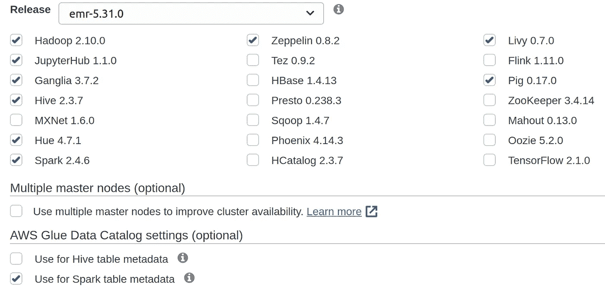
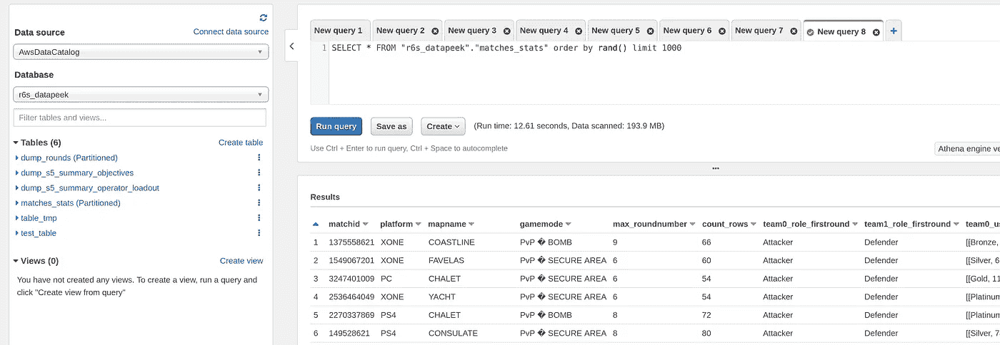
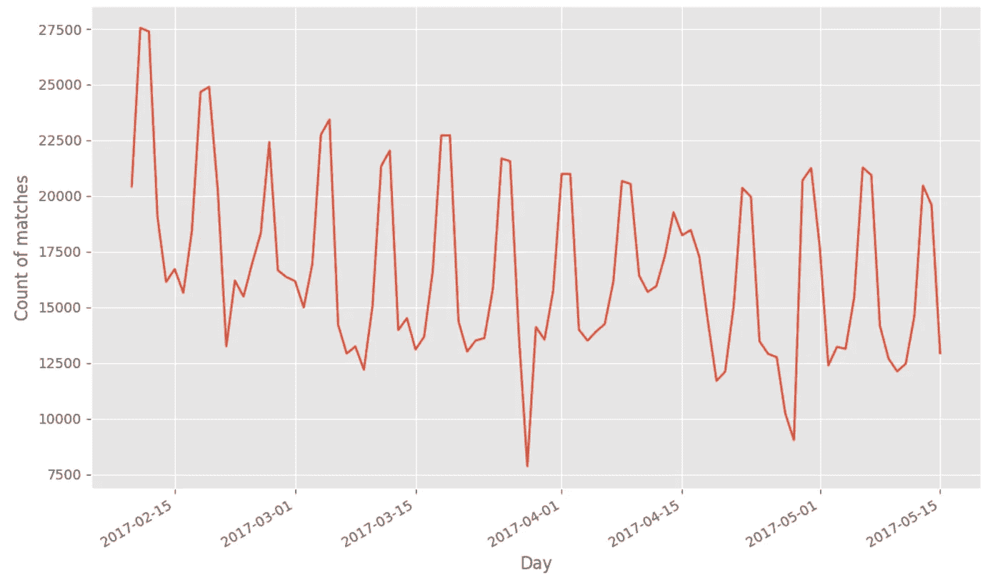
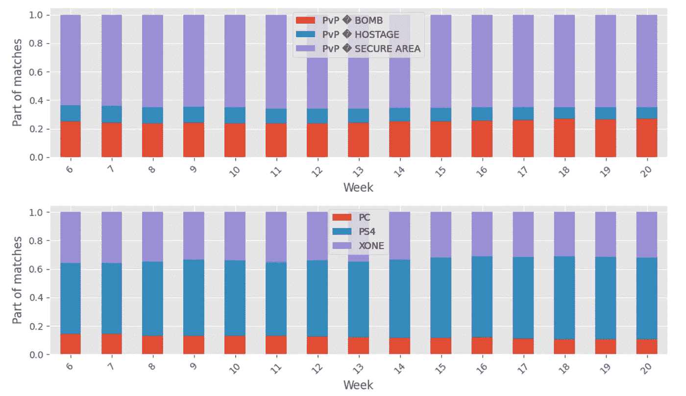
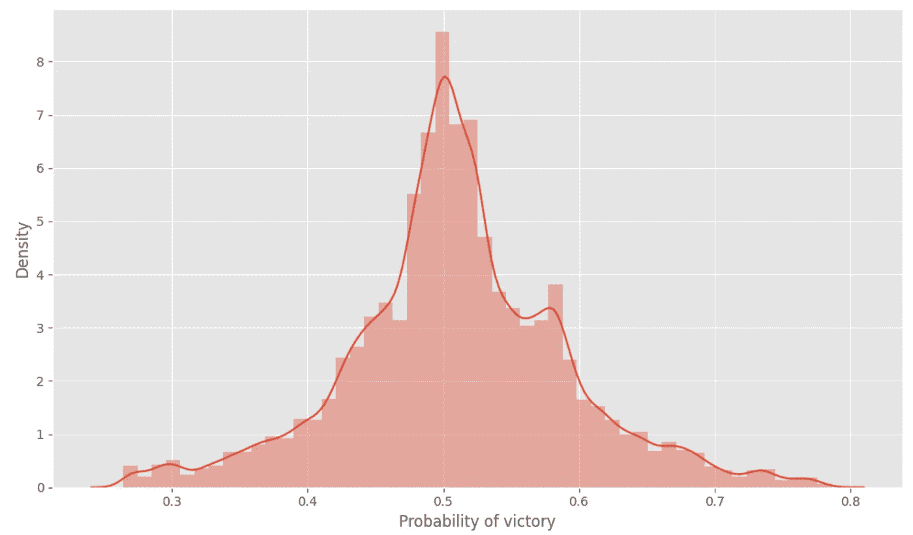
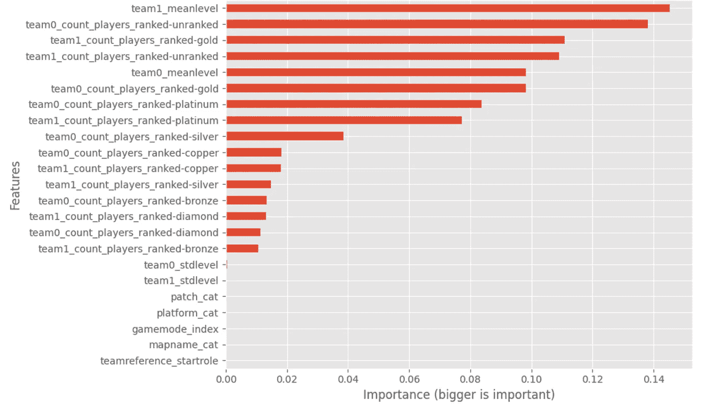
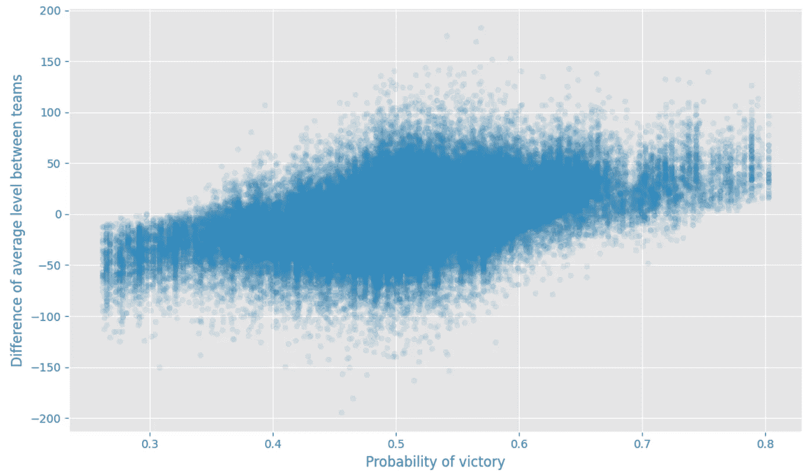

# 利用 AWS EMR 和 Pyspark 启动大数据项目

> 原文：<https://towardsdatascience.com/kickstart-a-big-data-project-with-aws-emr-and-pyspark-38da9b34564a?source=collection_archive---------38----------------------->

## 利用亚马逊网络服务上的视频游戏数据进行可扩展的数据分析和机器学习

读者们好，我想写一篇关于我在日常工作中使用的 AWS 服务的文章，名为 [EMR](https://aws.amazon.com/emr) 。这项服务曾经“轻松运行和扩展 Apache Spark、Hive、Presto 和其他大数据框架。”。在本文中，我将在一个开源数据集上利用这个服务，用 Pyspark 做一些 ETL 工作和简单的分析/预测。

# 数据设置

对于这个实验，还有什么比育碧开源数据集更好的呢？有一个叫做[的数据偷窥](https://www.ubisoft.com/en-us/game/rainbow-six/siege/news-updates/2fQ8bGRr6SlS7B4u5jpVt1/introduction-to-the-data-peek-velvet-shell-statistics)(来源:育碧网站，从细节上看人们可以免费使用，没有提到许可证)可以完成这项工作。我将画一个简短的设置描述，但我会邀请你阅读[的文章](https://www.ubisoft.com/en-us/game/rainbow-six/siege/news-updates/2fQ8bGRr6SlS7B4u5jpVt1/introduction-to-the-data-peek-velvet-shell-statistics)解释更多的数据。

这个项目使用的数据来自对游戏[彩虹六号围攻](https://www.ubisoft.com/en-us/game/rainbow-six/siege)的跟踪，这是一款由育碧蒙特利尔工作室开发的在线战术第一人称射击游戏，于 2015 年 12 月发布，目前仍在一个重要的社区中直播(该游戏在一个月前达到了[7000 万玩家](https://venturebeat.com/2021/02/09/rainbow-six-siege-2/))。本文将不会详细介绍彩虹六号围攻的游戏是如何构建的(但它看起来像一个反恐精英游戏，其中的角色被称为具有独特能力和装载的操作员)。尽管如此，我还是邀请你看看这个视频来理解其中的逻辑。

新的内容会定期添加到每三个月一次的季节中，并带来新的角色、化妆品、地图、模式(今年[有计划](https://www.youtube.com/watch?v=a_UdQGvKVAc)😄).在本文中，收集的数据将集中在第二年的第一季，称为[天鹅绒壳](https://www.ubisoft.com/fr-ca/game/rainbow-six/siege/game-info/seasons/velvetshell)行动。

在这一季中，增加了两个新的运营商和一个新的地图。

在赛季期间，有几个补丁(在游戏中更新以调整/修复一些东西)已经部署([来源](https://www.reddit.com/r/Rainbow6/wiki/patchnotes)):

*   [2017 年 2 月 7 日更新 2.1.0:天鹅绒外壳](https://rainbow6.ubisoft.com/siege/en-us/game-info/seasons/velvetshell/index.aspx)
*   [2017 年 2 月 21 日更新 2.1.1](https://forums.ubi.com/showthread.php/1580736)
*   [2017 年 3 月 15 日更新 2.1.2:季中增援](https://rainbow6.ubisoft.com/siege/en-us/game-info/seasons/velvetshell/reinforcements.aspx)
*   [BattlEye 更新](https://forums.ubi.com/showthread.php/1631242-PC-Server-Maintenance-18APR2017)2017 年 4 月 18 日，针对 PC
*   [2017 年 4 月 19 日更新 2.1.3](http://forums.ubi.com/showthread.php/1636409-PS4-XB1-PC-Maintenance-19-04?s=00f594100e7fa7d203f9187cad674d35)
*   [热修复](https://forums.ubi.com/showthread.php/1638512-PS4-Server-Maintenance-4-21-2017)2017 年 4 月 21 日，针对 PS4
*   [热修复](https://forums.ubi.com/showthread.php/1644863-Completed-PC-Server-Maintenance-26Apr2017)2017 年 4 月 26 日，针对 PC
*   [热修复](https://forums.ubi.com/showthread.php/1646550-COMPLETE-PS4-XB1-Maintenance-28-04)2017 年 4 月 28 日，针对主机
*   [维修](https://forums.ubi.com/showthread.php/1651426-PS4-XB1-PC-Server-Maintenance-5-2-2017)2017 年 5 月 2 日
*   [热修复](https://forums.ubi.com/showthread.php/1663425-COMPLETE-PS4-XB1-PC-Server-Maintenance-5-10-2017)2017 年 5 月 10 日

在本文中，我将重点关注包含分级模式下匹配配置的大数据(19 Gb 文件)。

# EMR 设置

使用 EMR，您可以非常快速地生成一个称为集群的机器舰队，以高效的方式使用大数据框架(著名的分布式计算)。我是一个 more Spark 用户(pyspark for life ),来介绍一下我在这种情况下的设置。

随着时间的推移，已经发布了各种版本的 EMR ,但目前主要有两个分支:

版本之间的两个主要区别是 6.x 上的 Pypsark 版本是 spark 的第 3 版，而 5.x 上的版本仍然是第 2 版。火花的 x。请注意，每个版本都有其优点和缺点，所以请记住这一点(例如，在 S3 管理的文件类型)。

在这种情况下，用于测试的版本 [EMR 5.31.0](https://docs.aws.amazon.com/emr/latest/ReleaseGuide/emr-release-5x.html) (我试图使用 5.32，但它不能很好地与 EMR 笔记本配合使用)。有一个安装在工作机器上的软件列表。

作者图片

可能有很多软件(甚至 Tensorflow)，但就我而言，更有用的是 Spark、Hadoop。

因为主要是为了测试，所以我只使用 M5 . XL 大型机器(一个主机和三个内核)。配置是相对的，很小，但我不需要更多(老实说，我正在使用这种方法，但我确信一台机器足以处理这些数据#showoff)。

在设置机器的步骤中，可以选择为将在这个集群上运行的应用程序添加一些[配置参数](https://docs.aws.amazon.com/emr/latest/ReleaseGuide/emr-configure-apps.html)；这叫分类(你可以在这里找到我的)。在这个配置文件中，有:

*   一个与访问胶合数据目录相关的关键是轻松地构建和保存配置单元表(我将在后面解释)
*   Livy 配置避免了(至少延迟了)spark 应用程序著名的会话超时，如果 Spark 应用程序什么都不做，就会发生这种超时。

当集群启动时，您可以修改您的应用程序，但是这样，每次您正在生成时，一切都将准备就绪(小建议，如果您使用此功能将文件存储在 S3，本地编辑器不太方便更新此配置字典)

作为 EMR 领域的数据科学家，我发现一个非常有用的附加功能是 [EMR 笔记本](https://docs.aws.amazon.com/emr/latest/ManagementGuide/emr-managed-notebooks.html)，您可以将它附加到一个集群，以便在 jupyter/lab 环境中利用 spark 内核。如果集群终止，所有的笔记本都会保存下来(之前我使用的是安装在集群上的 jupyterhub 软件，这很好，但是如果集群关闭，你会失去一切。

EMR 上的 notebook 的一个优点是能够快速建立一些探索所需的正确库；有一个[很棒的资源](https://aws.amazon.com/blogs/big-data/install-python-libraries-on-a-running-cluster-with-emr-notebooks/)正在介绍使用这个特性的方法。

既然设置很简单，那么让我们在分析数据之前先看看处理阶段。

# 抽取、转换、加载至目的端（extract-transform-load 的缩写）

需要进行一个[预处理阶段](https://github.com/jeanmidevacc/aws-emr-datapeek/blob/main/emr_notebooks/0_collect.ipynb)来转换配置单元表中的 CSV 文件。要开始这一步的处理，需要做两件事:

*   将 CSV 文件复制到 s3 bucket 中(在特定的子文件夹中)
*   构建一个指向另一个 s3 位置的数据库，以存储预处理的文件，这些文件将成为配置单元表的数据。

对于这个实验，由 hive 表组成的文件的格式将是 parquet，但是也可以存储为其他类型。我使用笔记本来构建表，这些新数据可以从 AWS Athena 等其他服务中访问。

作者图片

包含关于由 dateid(游戏服务器中数据的创建日期)划分的玩家的玩家信息的表格有助于赛季数据的导航。一些图表显示了可用的匹配数、平台上的重新分配和游戏模式，以说明新构建的表。

作者图片

作者图片

从对构建的新数据的第一次分析中可以注意到:

*   9187971 发子弹有 1588833 个匹配
*   在 PS4 上的这个摘录中有更多的比赛(# sonyrepresents)
*   最流行的游戏模式是 PvP 安全区

正如我们所看到的，这个数据集中有大量的匹配和数据要使用，但是我想应用一个健全性检查阶段来确定

*   好的比赛:两队从第一轮到最后一轮看起来都一样)并且每方有五名队员
*   拉基维特比赛:一个队至少失去一名队员，但每个队至少有五名队员
*   不良匹配:匹配不符合前面的类别

您可以在这里找到包含所有处理过程的笔记本，但在数据处理过程中需要牢记的是:

*   决定每场比赛的最后一轮
*   汇总每支队伍与每轮玩家等级和等级相关的信息(有一个玩家的唯一标识符，所以我们将评估如果队伍等级和技能等级不变，队伍是相同的)
*   对比一下第一轮和最后一轮的队伍。

无论如何，从这个处理过程中，有 10%的匹配被认为是好的，27%是不匹配的，剩下的是坏的。

您可以在这个文件中找到[关于每次匹配所计算的信息的摘录；有了这些关于比赛的信息，就可以进行更深入的分析了。](https://github.com/jeanmidevacc/aws-emr-datapeek/blob/main/data/match_stats.csv)

# 公平性分析

在对匹配做了一些度量计算之后，我想看看在好的和不公平的匹配的设置中是否有一些公平性。在一个在线游戏中，团队和队友的选择背后，有一个被称为匹配的系统，它结合了玩家的知识、当前的在线设置(位置、连接质量等)。)等一些参数。

我在配对方面的知识并不丰富，但如果你感兴趣，我将邀请你看看微软在这些主题上的工作，包括以下论文 [Trueskill](https://www.microsoft.com/en-us/research/project/trueskill-ranking-system/) 、 [Trueskill II](https://www.microsoft.com/en-us/research/publication/trueskill-2-improved-bayesian-skill-rating-system/) (更侧重于开发玩家的排名指标)和 [True match](https://www.microsoft.com/en-us/research/project/truematch/) (侧重于利用玩家知识等。为了建立更好的匹配，在 GDC 2020 上有一个关于这个主题的精彩演讲。

但是从一个玩家的角度来看，我并不觉得匹配很公平(有时是#badplayer，)，所以我想看看，例如，在彩虹六号的可用数据上，我们是否可以看到匹配选择中的一些问题。为了进行这种估计，我开始构建团队参考(在本例中是团队 0)的胜利预测器，基于:

*   每个团队水平的平均值和标准差
*   技能等级重新划分之间的欧几里德距离(对于每个团队，我计算团队中出现的每种技能等级的团队数量)
*   比赛的配置(平台，补丁版本，游戏模式，地图)

用于进行该预测的模式是来自 Spark 中 mllib 的[随机森林回归器，在 80%的 good/ragequit 匹配中进行训练，并对剩余的 20%进行评估(此处的代码](https://spark.apache.org/docs/latest/ml-classification-regression.html#random-forest-regression)[为](https://github.com/jeanmidevacc/aws-emr-datapeek/blob/main/emr_notebooks/2_analysis.ipynb))。预期是，由于有一个匹配系统，所有比赛的胜利预测应该在 50%左右。

作者图片

很高兴看到现有的系统似乎是公平的(或者至少没有太多的极端值，我认为匹配有时可以扩展研究的范围，因为缺乏适合良好匹配的可用玩家)。

为了更深入地了解这个模型，一个图表显示了这个模型中使用的特性的重要性。

作者图片

我们可以注意到，平均水平和黄金等级的数量是本质特征；我们想快速查看一下预测与各队平均水平之间的差异。我们可以看到经验的不同(你期望什么)之间的关系。

作者图片

尽管如此，所有这些分析都是在没有太多论述的情况下完成的:

*   比赛的确切执行，老实说，通过玩游戏，你可以认识到，预测比赛的输出只基于选定的功能并不是最好的办法(也许会在另一个版本更回合的基础上工作)
*   不知道玩家的经验(地图，操作者，历史比赛)和当前赛季不是最佳的(不知道他当前的心情如赢得比赛，不知道他是否和他的常规球队一起比赛，等等。)

无论如何，这是一个用 pyspark 构建的非常简单的估计器，有很多问题可以构建和回答。

# 结论

本文提供了一个 AWS 服务的机会，它可以帮助启动一些大数据框架的测试。有几个元素我在这个项目中没有用到，但可能对你的实验有用:

*   有了 EMR，你可以衍生和停止集群，但你能做的是生成一个机器的集群，执行特定的脚本(称为 step)并关闭机器；如果我们看到以无服务器的方式更多地使用集群(以节省成本)，这种方法会很有帮助
*   如果 EMR 集群的当前设置非常有限，您可以通过使用一个名为 [bootstrap actions](https://docs.aws.amazon.com/emr/latest/ManagementGuide/emr-plan-bootstrap.html) 的元素来安装特定的库，基本上，bags 脚本将安装库、软件(如 git)或文件夹来存储数据(完全值得，但对我来说不是必需的)
*   如果您想要运行命令行脚本(例如，spark 作业的 spark-submit)，您可以在集群生成时设置一个 ssh 密钥，以便在 ssh 中建立连接，并作为 Hadoop 用户运行命令

就像事情做得很好一样，EMR 和 Sagemaker 之间有很好的联系，这里有一个很棒的文档，但是我会建议你遵循以下步骤(在他们的情况下，他们希望人们将它添加到生命周期中):

*   添加与 sagemaker 笔记本关联的角色的[跟随策略](https://github.com/jeanmidevacc/aws-emr-datapeek/blob/main/sagemaker_connection/policy.json)(并注意 sagemaker 笔记本的安全组)
*   要启动集群并将其连接到您的笔记本，需要这个[笔记本](https://github.com/jeanmidevacc/aws-emr-datapeek/blob/main/sagemaker_connection/build_connect_emr.ipynb)和一个 [bash 脚本](https://github.com/jeanmidevacc/aws-emr-datapeek/blob/main/sagemaker_connection/connect_emr_cluster.sh)(由笔记本触发)

如果您对使用 EMR for Spark 不感兴趣，您可以将它与另一个框架一起使用，例如 dask(这里有一个使用 yarn 与 dask [和](https://yarn.dask.org/en/latest/))的设置)。在你不知道 dask 的情况下，有一个很好的解释它是什么(以及与 Spark 的区别)。

另一个方面，第一人称射击游戏中没有太多围绕电子游戏和在线比赛的数据集，所以我会建议人们看一看[育碧](https://www.ubisoft.com/en-us/game/rainbow-six/siege/news-updates/2fQ8bGRr6SlS7B4u5jpVt1/introduction-to-the-data-peek-velvet-shell-statistics)的这个数据集。即使他的原表单上的数据集不好用，你也可以在 Kaggle 上找到类似[这里](https://www.kaggle.com/maxcobra/rainbow-six-siege-s5-ranked-dataset)的更为消化的版本。

*原载于 2021 年 4 月 5 日 https://www.the-odd-dataguy.com***。**