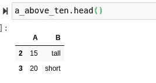
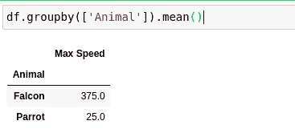

# Python 程序员的黑仔数据处理技巧

> 原文：<https://towardsdatascience.com/killer-data-processing-tricks-for-python-programmers-99dd3d703607?source=collection_archive---------1----------------------->

## 在 Python 编程语言中，我最喜欢的一些改变数据的方法。


(src =[https://unsplash.com/photos/1K6IQsQbizI](https://unsplash.com/photos/1K6IQsQbizI)

# 介绍

T 在过去的几年里，Python 编程语言在数据科学领域内迅速走红。这是有充分理由的，因为 Python 提供了许多现成的工具，这些工具凭借其轻量级语法，在使数据处理、分析和机器学习变得非常容易和容易方面取得了令人难以置信的成功。这是由令人难以置信的生态系统进一步编排的，该生态系统支持 Python 在该领域的自然能力。

Python 数据管理的世界是广阔的，并且还在不断扩展，所以通常很难确切地知道如何处理每种情况并掌握 Python 中的数据处理。然而，在使用这种语言时，有些知识可以用来应对任何挑战。也就是说，有几个简单的函数和模块肯定可以增强使用 Python 处理数据的体验。

> [笔记本](https://github.com/emmettgb/Emmetts-DS-NoteBooks/blob/master/Python3/Data%20Processing%20Tricks.ipynb)

# 绘图

我想讲的第一个技巧是映射。这是因为在我个人看来，映射是 Python 中经常用到的东西。在有大量数据的情况下尤其如此，因为 map 方法在处理几乎任何数据问题时都非常有效。除了所有这些好处之外，这个函数使用起来相对简单。

使用这种方法的第一步是创建一个要映射的函数。我们可以通过通常的方式定义一个新函数，或者使用 Python 的 lambda 快速生成一个表达式。使用后者，我们甚至可以在一行中完成一个映射调用——这使得映射代码可能非常简洁，同时仍然非常强大。首先，我们需要注意，map 只适用于单参数函数。考虑以下列表:

```
data = [5, 10, 15, 20]
```

我们使用这个列表的目的是将一个数学变化映射到它上面。在这个例子中，我将使用五的加法。我们将快速创建一个函数来实现这一点:

```
def add5(x):
    return(x + 5)
```

现在，如果我们试图把我们的数据放入这个函数，我们会得到一个错误，因为我们不能添加一个整数到一个列表中。我们的目标是对整个列表执行这种算法，所以让我们考虑使用 map()方法。map 方法将我们想要映射的函数以及一个 iterable 作为位置参数。

```
newdata = map(add5, data)
```

这将返回一个新的“地图”类型。然后，我们可以通过将列表类型转换到这个映射，将这个类型转换到一个应用了映射的列表中:

```
list(newdata)
```

或者，我们可以只用一行代码完成同样的运算，而不用编写函数，而是为函数提供一个由 lambda 生成的表达式:

```
newdata = list(map(lambda x : x + 5, data))
```

如果你想了解更多关于 lambda 和它在 Python 中的作用，我不久前写了一篇文章，你可以看看:

</scientific-python-with-lambda-b207b1ddfcd1>  

# 熊猫面具

处理数据的另一个很好的工具是使用 Python 的 Pandas 模块屏蔽条件的能力。该模块提供了将位数组类型传递到 get index 调用中的能力。换句话说，我们可以用一个条件索引一个数据框，以便根据属性分离数据。这对于数据分析尤其有价值。这是一种在一行简单而简洁的 Python 代码中快速有效地从总体中获取样本的好方法。

```
import pandas as pd
```

考虑以下数据帧:

```
df = pd.DataFrame({"A" : [5, 10, 15, 20],
                   "B" : ["tall", "short", "tall", "short"]})
```

我们可以用任何条件语句来索引这个数据帧。当然，就列表或 Pandas 系列类型而言，我们可以期望任何 bool 类型的操作符返回一个位数组。位数组只是一个布尔列表，这个名字取自别处——我真的不知道 Python 怎么称呼这些东西。我们可以使用这些位数组来索引 Pandas 数据帧，如下所示:

```
a_above_ten = df[df["A"] > 10]
```

现在看看这个数据帧的开头:

```
a_above_ten.head()
```



(图片由作者提供)

如果您想了解更多关于条件掩码的内容，以及我喜欢在 Pandas 模块中使用的其他一些很酷的技巧，这篇文章可能会让您感兴趣:

</20-great-pandas-tricks-for-data-science-3a6daed71da0>  

# 熊猫分组依据

除了一些激进的条件屏蔽，Pandas 还有许多打包在 DataFrame 类中的强大函数。其中一个工具是 group by，它将根据某一列的类或连续权重对数据中的观察值进行排序。考虑以下新数据框:

```
df = pd.DataFrame({'Animal': ['Falcon', 'Falcon',
                              'Parrot', 'Parrot'],
                   'Max Speed': [380., 370., 24., 26.]})
```

我们可以根据这些不同类别的属性对所有这些数据进行分组。例如，我们可以根据平均值将所有的 falcon 和 parrot 类浓缩成一个观察值:

```
df.groupby(['Animal']).mean()
```

使用该函数不仅可以节省大量内存，还可以节省大量时间。不用说，分析不同类别的平均值以及这些特性之间的关系对于真正理解这些问题中的分类非常有用。例如，在上面的数据框中，我们可以快速评估出猎鹰比鹦鹉飞得快得多。



此功能的替代方法是将这些特征放入单独的列表或数据框中，然后计算平均值。不用说，在这种情况下，利用 groupby()函数无疑节省了大量时间。

# Zip()

在编程中有很多时候，人们可能希望同时对两个列表中的 dim 执行算术运算。为此，Python 为我们提供了 zip()迭代器。这个迭代器将接受两个都是可迭代的位置参数。当然，这意味着由于 zip()是一个迭代器，我们很可能用一个迭代循环来调用它。考虑以下两个列表:

```
a = [5, 10, 15, 20]
b = [5, 10, 15, 20]
```

我们将假设我们的目标是得到列表中每个 dim 的总和。如果没有 zip，在 Python 中可能会这样:

```
for it in range(0, len(a)):
    a[it] += b[it]
```

这无疑是一种有效的做事方式。然而，这种方法可能会留下一些不尽人意的地方，并且在处理比本例中提供的更多的数据时会使事情变得更加复杂。另一种方法是使用 zip()迭代器将两个列表合并成一个迭代器，同时遍历两个列表。

```
empty = []
for ai, bi in zip(a, b):
    z = ai + bi
    empty.append(z)
```

# 单行循环

我认为我们在处理数据时应该考虑的最后一个 Pythonic 技巧是单行迭代循环。我认为这非常有用的原因主要是因为它不同于大多数迭代。在大多数迭代循环中，我们不期望从循环中得到回报。当以这种方式完成时，这种期望就改变了。这意味着我们在那个 zip 循环中创建的空列表实际上并不需要存在，我们可以修改那个循环，改为以这种方式循环，以便完全避免添加空循环。

我们可以告诉 Python，我们想通过用方括号将它分隔开来做到这一点。在这些方括号内，我们实际上是向后写循环。这样做有很多好处。第一个优势是我们提到的，回报。然而，这种方法的另一个显著优点是在利用迭代的同时加快了速度并节省了内存。让我们使用这种方法重新创建上面的 zip 循环:

```
empty = [ai + bi for ai, bi in zip(a, b)]
```

不用说，这在很多情况下都会派上用场。虽然在 Python 中，我们可以使用 Pandas 来改变一个系列的类型，但在某些情况下，这些循环甚至可以在单独进行造型时派上用场。至少，在朱莉娅身上肯定是这样。

# 结论

在我看来，本文中列出的不同方法是数据处理中最基本的 Python 技巧。以我的经验来看，这些工具不仅派上了用场，而且基本上是 Python 编程世界中的必备工具。希望这篇文章和其中处理数据的方法是有用的，我希望至少这是一个有趣的阅读！谢谢你看我的文章！