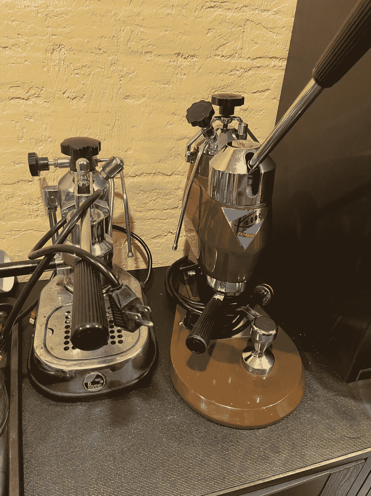
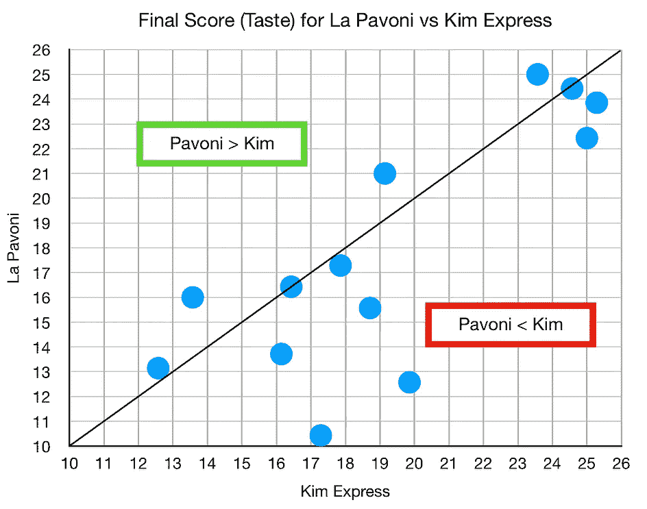
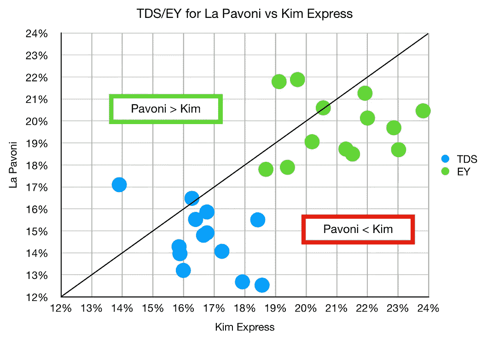
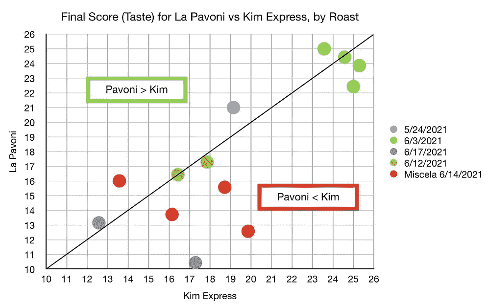
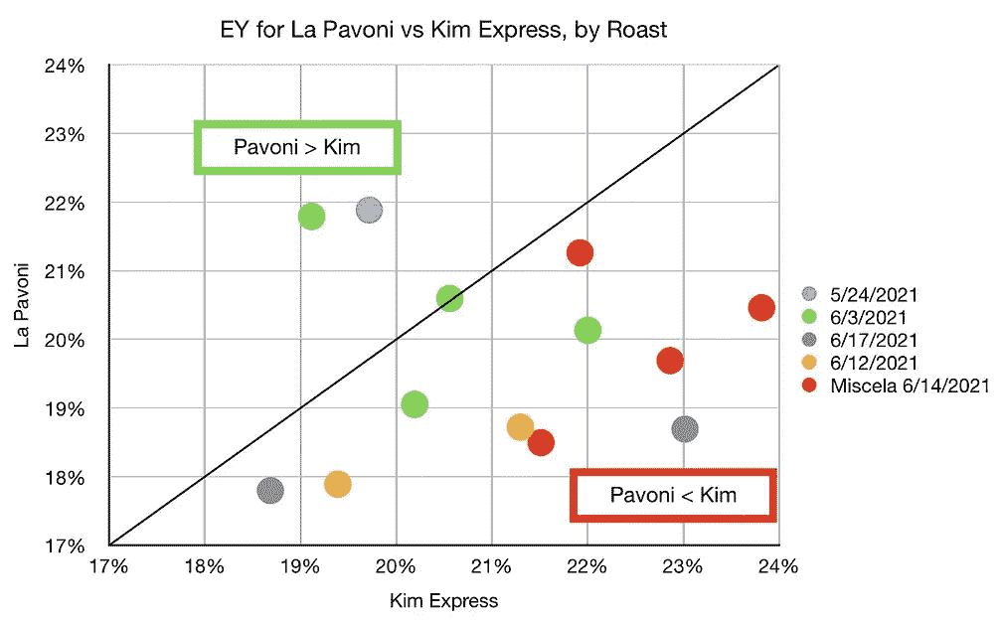
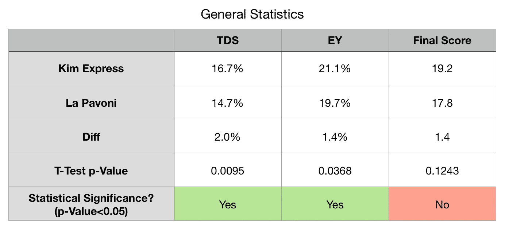

# 金快车 vs 拉帕沃尼:浓缩咖啡对决

> 原文：<https://towardsdatascience.com/kim-express-vs-la-pavoni-espresso-face-off-5c37158dc3b3?source=collection_archive---------12----------------------->

## 咖啡数据科学

## 对杠杆的热爱

在我姻亲家的地下室找到 la Pavoni 后，我得到了我的第一张 Kim Express。这些年来，我使用 Kim 的次数要多得多，我一直认为它的性能更好，但直到现在我也没有好的数据。

所有图片由作者提供

我不小心把另一个金快递送到了我的亲家那里，那是我的帕沃尼的住处。所以我决定离开金快车，我把拉帕沃尼带回了加州。我想我可以更多地使用这台机器，并更好地使用它。

几个星期后，我开始回头看我的拍摄数据，我有足够的重叠拍摄相同的烘烤相似的时间从两台机器。所以我把最好的照片排了出来，进行了比较。

需要注意的一点是，它们的表现不同有三个原因:

1.  剂量大小不同(la Pavoni 为 14 克，Kim Express 为 21 克)
2.  过滤篮(la Pavoni 的常规篮，Kim Express 的精密篮)
3.  取消拍摄(2000 张给金快线)

# 绩效指标

我使用两个指标来评估技术之间的差异:最终得分和咖啡萃取。然后，我使用相关性来了解这两个指标与其他变量的关联程度。

[**最终得分**](https://towardsdatascience.com/@rmckeon/coffee-data-sheet-d95fd241e7f6) 是记分卡 7 个指标(辛辣、浓郁、糖浆、甜味、酸味、苦味和回味)的平均值。当然，这些分数是主观的，但它们符合我的口味，帮助我提高了我的拍摄水平。分数有一些变化。我的目标是保持每个指标的一致性，但有时粒度很难确定。

</coffee-solubility-in-espresso-an-initial-study-88f78a432e2c>**使用折射仪测量总溶解固体量(TDS)，这个数字结合咖啡的输出重量和输入重量用于确定提取到杯中的咖啡的百分比，称为**提取率(EY)** 。**

# **摊牌**

**这些散点图比较成对的镜头。当机器具有相似的性能时，点应该在直线上。线以上表示拉帕沃尼表现更好，线以下表示金快车表现更好。**

********

**Kim Express 在这些指标上表现得更好，我还想比较每种烤肉，看看是否有 La Pavoni 表现更好的特定烤肉。**

********

**就一般统计学而言，除了最终得分(味道)之外，其他都显示出统计学差异。更多样本的最终得分可能存在统计差异。**

****

**我很乐意承认我更多地使用了 Kim，如果我以同样的方式使用 la Pavoni，也许我将能够得到那台特定机器的一些更微妙的部分。这项研究让我想起了几年前，当时我正在使用视频来尝试比较机器，现在我有了一些关于这个主题的数据。**

**如果你愿意，可以在推特、 [YouTube](https://m.youtube.com/channel/UClgcmAtBMTmVVGANjtntXTw?source=post_page---------------------------) 和 [Instagram](https://www.instagram.com/espressofun/) 上关注我，我会在那里发布不同机器上的浓缩咖啡照片和浓缩咖啡相关的视频。你也可以在 [LinkedIn](https://www.linkedin.com/in/robert-mckeon-aloe-01581595?source=post_page---------------------------) 上找到我。也可以关注我在[中](https://towardsdatascience.com/@rmckeon/follow)和[订阅](https://rmckeon.medium.com/subscribe)。**

# **[我的进一步阅读](https://rmckeon.medium.com/story-collection-splash-page-e15025710347):**

**[我未来的书](https://www.kickstarter.com/projects/espressofun/engineering-better-espresso-data-driven-coffee)**

**[浓缩咖啡系列文章](https://rmckeon.medium.com/a-collection-of-espresso-articles-de8a3abf9917?postPublishedType=repub)**

**[工作和学校故事集](https://rmckeon.medium.com/a-collection-of-work-and-school-stories-6b7ca5a58318?source=your_stories_page-------------------------------------)**

**个人故事和关注点**

**[乐高故事启动页面](https://rmckeon.medium.com/lego-story-splash-page-b91ba4f56bc7?source=your_stories_page-------------------------------------)**

**[摄影飞溅页面](https://rmckeon.medium.com/photography-splash-page-fe93297abc06?source=your_stories_page-------------------------------------)**

**[改善浓缩咖啡](https://rmckeon.medium.com/improving-espresso-splash-page-576c70e64d0d?source=your_stories_page-------------------------------------)**

**[断奏生活方式概述](https://rmckeon.medium.com/a-summary-of-the-staccato-lifestyle-dd1dc6d4b861?source=your_stories_page-------------------------------------)**

**[测量咖啡研磨分布](https://rmckeon.medium.com/measuring-coffee-grind-distribution-d37a39ffc215?source=your_stories_page-------------------------------------)**

**[浓缩咖啡中的粉末迁移](https://medium.com/nerd-for-tech/rebuking-fines-migration-in-espresso-6790e6c964de)**

**[咖啡萃取](https://rmckeon.medium.com/coffee-extraction-splash-page-3e568df003ac?source=your_stories_page-------------------------------------)**

**[咖啡烘焙](https://rmckeon.medium.com/coffee-roasting-splash-page-780b0c3242ea?source=your_stories_page-------------------------------------)**

**[咖啡豆](https://rmckeon.medium.com/coffee-beans-splash-page-e52e1993274f?source=your_stories_page-------------------------------------)**

**[浓缩咖啡用纸质过滤器](https://rmckeon.medium.com/paper-filters-for-espresso-splash-page-f55fc553e98?source=your_stories_page-------------------------------------)**

**[浓缩咖啡篮及相关主题](https://rmckeon.medium.com/espresso-baskets-and-related-topics-splash-page-ff10f690a738?source=your_stories_page-------------------------------------)**

**[意式咖啡观点](https://rmckeon.medium.com/espresso-opinions-splash-page-5a89856d74da?source=your_stories_page-------------------------------------)**

**[透明 Portafilter 实验](https://rmckeon.medium.com/transparent-portafilter-experiments-splash-page-8fd3ae3a286d?source=your_stories_page-------------------------------------)**

**[杠杆机维修](https://rmckeon.medium.com/lever-machine-maintenance-splash-page-72c1e3102ff?source=your_stories_page-------------------------------------)**

**[咖啡评论和想法](https://rmckeon.medium.com/coffee-reviews-and-thoughts-splash-page-ca6840eb04f7?source=your_stories_page-------------------------------------)**

**[咖啡实验](https://rmckeon.medium.com/coffee-experiments-splash-page-671a77ba4d42?source=your_stories_page-------------------------------------)**