# KITTI 坐标变换

> 原文：<https://towardsdatascience.com/kitti-coordinate-transformations-125094cd42fb?source=collection_archive---------2----------------------->

## 关于如何在 KITTI 的不同传感器坐标系之间导航的指南。

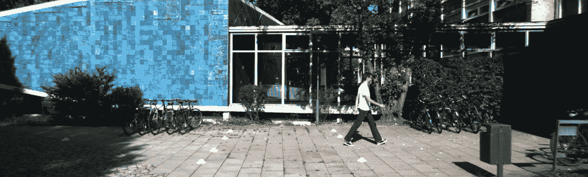

**(上)** KITTI 数据集左 RGB 相机图像。**(下)** KITTI 数据集左 RGB 相机图像，带 3D 边界框([源](http://www.cvlibs.net/datasets/kitti/eval_object.php?obj_benchmark=3d))

# **KITTI 数据集概述**

在处理多传感器项目时，根据所使用的传感器，会出现各种坐标框架。在 KITTI 数据集的情况下，有 3 个传感器(相机、激光雷达和 GPS/IMU)。下图描述了 KITTI 数据集的传感器设置。

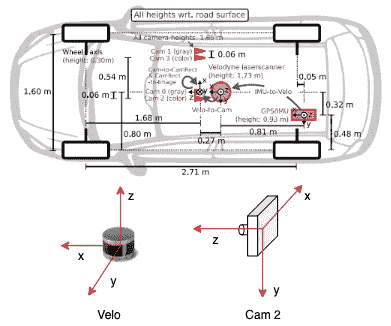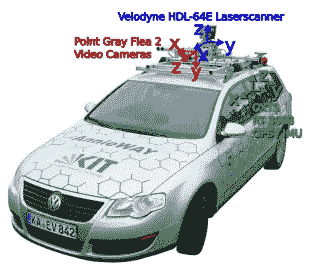

图 1: **(左)** KITTI 传感器设置。**(右)**各种涉及的坐标框架([来源](http://www.cvlibs.net/publications/Geiger2013IJRR.pdf))

有三种不同的传感器，因此在处理 KITTI 数据集时会涉及三种不同的坐标系。上图和下表显示了这些传感器坐标框架之间的关系。

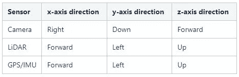

# **KITTI GT 注释详情**

KITTI 数据集的地面实况注释已在相机坐标框架(左 RGB 相机)中提供，但要在图像平面上可视化结果，或训练仅激光雷达 3D 对象检测模型，有必要了解从一个传感器到另一个传感器时起作用的不同坐标变换。下表描述了 KITTI GT 注释的详细信息。
**GT 标注** =(类型|截断|遮挡| alpha | 2D bbox |尺寸|位置|分数)

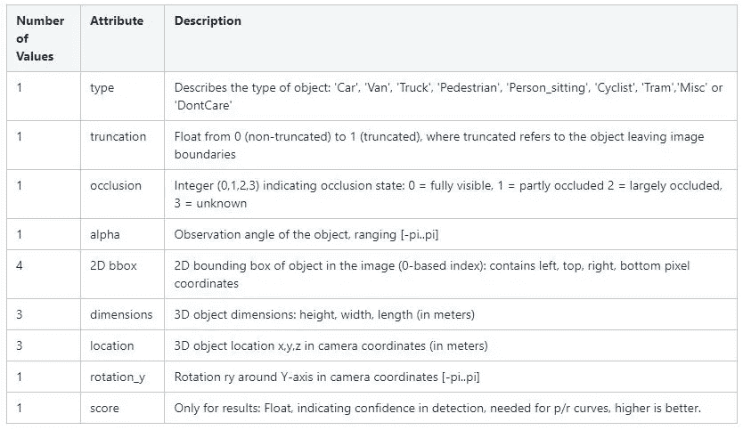

# **坐标转换细节**

KITTI 数据集提供了所有 4 个摄像机的摄像机图像投影矩阵、用于校正摄像机之间平面对齐的校正矩阵以及用于不同传感器之间刚体变换的变换矩阵。下图显示了使用激光雷达数据时涉及的不同投影。

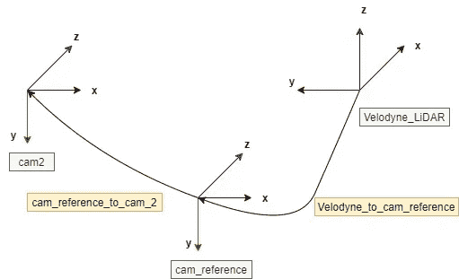

图 2: KITTI 传感器坐标转换(作者)

威力登激光雷达坐标中的 3D 点 **x** 被投影到第 I 幅相机图像中的点 **y** 上，如下所示:

**y**= P(I)@ R(0)@**T**velo _ cam @**x**

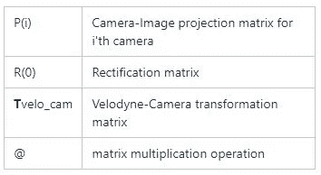

3D 边界框从一个坐标框架到另一个坐标框架的各种变换以及所涉及的步骤在下面提到。

# 相机-激光雷达 3D 包围盒变换

以下步骤描述了首先使用偏航角在相机坐标系中旋转长方体，然后将其投影到激光雷达坐标系的方法。

1.  ***【3D 包围盒角坐标计算(摄像机坐标框)***

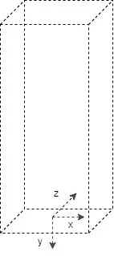

图 3: 3D 边界框:相机坐标系(作者提供)

x 轴->右(长度)，y 轴->下(高度)，z 轴->前(宽度)
3B bb 角坐标在摄像机坐标系中，坐标系是在盒子的底部中心。

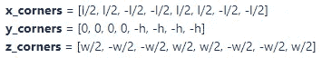

2.***3D BB 角的旋转由 rotation_y angle(摄像机坐标框架)协调***

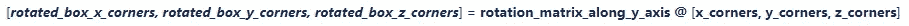

3. ***通过质心坐标平移框(摄像机坐标框)***

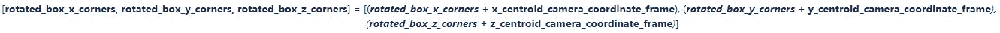

4. ***3D BB 角坐标从相机坐标投影到 LiDAR 坐标框架***

a.*逆矫正处理* ***R(0)_homo 描绘了从原点 R(0)矩阵创建的 4×4 同质矩阵*** *(没有任何平移)。通过添加所需的 0 和 1，已将* ***框角从笛卡尔坐标转换为同质坐标*** *。*

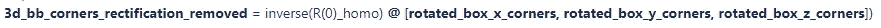

b.*逆刚体变换*

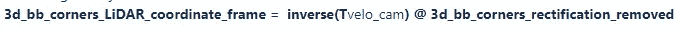

# 激光雷达-相机 3D 包围盒变换

下面提到的步骤定义了将 3D 边界框从激光雷达坐标框架转换到相机坐标框架的过程。

1.  ***从激光雷达坐标系到摄像机坐标系的 3D BB 形心(x，y，z)投影***

a.*刚体变换*

b.*整改处理*

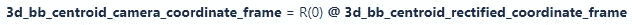

2. ***航向/偏航角变换***

航向/偏航角是激光雷达坐标系中的 w.r.t z 轴，对应于相机坐标系中的-(y 轴)

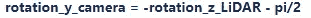

3.***【3D 边界框角坐标计算】(摄像机坐标框)***

图 4: 3D 边界框:相机坐标系(作者提供)

x 轴->右(长度)，y 轴->下(高度)，z 轴->前(宽度)【3B bb】角坐标在相机坐标系中，坐标系是在盒子的底部中心。

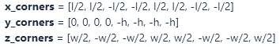

4.***3D BB 角的旋转由旋转坐标 _y 角(相机坐标帧)***

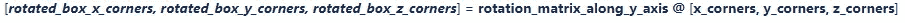

5. ***通过质心坐标平移框(摄像机坐标框)***

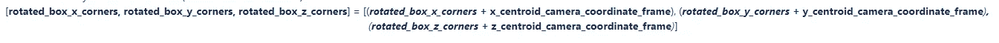

# 相机图像 3D 包围盒变换

下面提到的步骤定义了将 3D 边界框从相机坐标框架转换到图像坐标框架的过程。

1.  *3D BB 角点从相机坐标系到图像坐标系的投影。* ***框角已通过追加所需的 0 和 1 从笛卡尔坐标转换为同质*** *。*

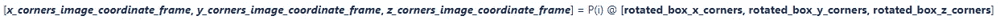

2.*使用 z 坐标归一化*

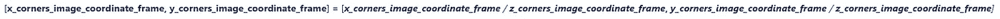

# **结论**

本文简要介绍了 KITTI 数据集，并试图解释将 KITTI GT 转换为各种传感器坐标框架的步骤。

这里介绍的大部分信息摘自 [KITTI 数据集网站](http://www.cvlibs.net/datasets/kitti/)，鼓励读者通过引用的参考文献获取更多信息。

***这个博客也被收录到了 KITTI vision 的原始数据页面:****[*http://www.cvlibs.net/datasets/kitti/raw_data.php*](http://www.cvlibs.net/datasets/kitti/raw_data.php)*

# *参考*

1.  *[相机-激光雷达投影:在 2D 和 3D 之间导航](https://medium.com/swlh/camera-lidar-projection-navigating-between-2d-and-3d-911c78167a94)*
2.  *[视觉遇上机器人:KITTI 数据集——Andreas Geiger](http://www.cvlibs.net/publications/Geiger2013IJRR.pdf)*
3.  *[KITTI 数据集](http://www.cvlibs.net/datasets/kitti/)*