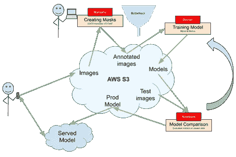
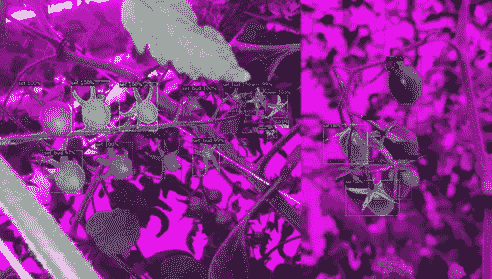
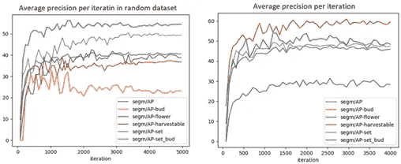
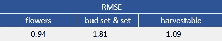
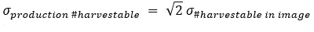
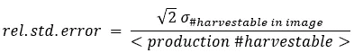
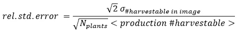

# 了解你的作物的现在和未来

> 原文：<https://towardsdatascience.com/knowing-the-present-and-future-of-your-crop-1ce20abb37b9?source=collection_archive---------24----------------------->

## [行业笔记](https://towardsdatascience.com/tagged/notes-from-industry)

## *我们如何使用计算机视觉来了解番茄作物的状态，从而预测其产量*

[托马斯·伊斯基耶多·加西亚·法利亚——中](https://medium.com/@tomas.izquierdo.garciafaria)、[菲特·皮耶曼](https://medium.com/@fetze.pijlman)(表示研究)

# 摘要

用于作物监测的计算机视觉是精准农业的重要组成部分。在本文中，我们将分享我们设计计算机视觉解决方案的经验，从番茄生命周期不同阶段的图像中收集特征。看完这篇文章，你会确信你可以使用实例分割来精确地计算一个番茄桁架的果实和花朵的数量。希望所做的决定将有助于您的下一个实例分割任务，并且它可能会鼓励您使用计算机视觉的力量来解决类似的任务。

# 介绍

价值 120 亿美元[1]的精准农业正变得越来越重要，正在彻底改变农业部门。为了预测这些精准农业系统的收成，基于大数据和人工智能的算法正在开发中。精准农业的一个关键组成部分是作物状态的登记。作物状态被用作预测算法的输入，并用于评估这种算法的性能。今天，作物的登记(监测)仍然是由种植者自己完成的手工过程，但预计计算机视觉将开始发挥重要作用。

温室番茄种植者通常通过监测选择的植物来跟踪生长过程。通过给植物桁架贴标签来进行监控(1，2，3，…)。因此，定期登记每束花、座果和可收获果实的数量。在这一过程中，种植者面临的挑战是在整个登记过程中保持一致:例如，一个水果在被归类为可收获之前应该有多红？不一致会导致水果产量看似激增或下降。当一个人在整个季节进行监控时，这些影响是可以避免的。然而，当在温室之间进行比较时，或者当单个温室经历人员或班次的变化时，问题就出现了。

# 计算机视觉是流水线的一部分

用于估计作物状态的一致性问题使得计算机视觉方法成为感兴趣的方法，并且是如下的潜在过程

1.  移动应用程序用于拍摄标记桁架的照片。
2.  收集的图片被上传到云端，在那里计算机视觉模型对标记的桁架进行分类。
3.  特定的计算机视觉问题是预测出现在桁架中的每种作物类型的实例的数量，该桁架主要出现在由移动电话拍摄的图像中。

在这个过程中，与固定相机相比，使用手持相机的优点是标记桁架的图像不会被番茄植株的叶子遮挡。

在该计算机视觉任务中分析的相关生长阶段(被视为类)是:芽、花、集芽(小绿番茄)、集(绿番茄)和可收获(红番茄)。由于 tomato truss 生命周期的性质，桁架只能有特定的实例组合。例如，桁架不能同时有可收获的果实和花朵。

本文的目的是研究计算机视觉模型可以达到的精度水平。

# 调查解决方案

设计的管道使客户能够通过使用手机应用程序拍摄番茄桁架的照片，然后预测桁架的状态(如图 1 所示)。

同样的管道也用于构建训练数据集。通过使用相同的手机应用程序，照片被捕获并自动上传到云数据库。

*图 1 调查了服务和训练计算机视觉模型的管道。(*图片由作者提供)

# 移动应用程序

移动应用程序是使用 React-Native [3]构建的。该应用程序通过要求每个标记桁架的高质量图片来指导用户完成作物注册过程。每张图片都被直接上传到数据库(AWS S3 桶)，之后通过 API 调用，来自计算机视觉模型的预测被提供给用户。这允许用户在出现明显错误的情况下纠正预测。此外，将专家知识纳入循环对于生产绩效的反馈非常重要，也有助于为未来的模型迭代标记图像。

# 计算机视觉模型:Mask-RCNN 和 Detectron 2

为了预测桁架中每种类型(花蕾、花、集蕾、集、可收获)出现的实例数量，使用了一种实例分割方法，该方法使用掩模 RCNN 模型[4]和脸书的框架，[检测器 2](https://github.com/facebookresearch/detectron2) [6]。由于推理时间与用例无关，因此选择了 Mask-RCNN 模型，该模型使用具有 FPN 体系结构的 Resnet-101 模块作为主干。Detectron2 在 ImageNet 数据库上提供预训练的权重，通过在小数据集上进行训练来实现高性能。

# 注释图像

注释图像是系统的主要瓶颈。有几个开源工具可用于注释图像分割。CVAT [5]导致了几个与图像方向相关的问题(很可能元数据被 CVAT 错误地解释了)。因此，考虑使用 Coco-Annotator [2]。Coco-Annotator 提供了关于实例数量、它们的分布以及标记整个数据集所花费的时间的统计数据。后者在试图了解数据集的平衡程度以及对其进行注释所花费的时间时非常有用。对于这个任务，116 张图像被标记，每张图像花费大约 20 分钟。

# 训练模型

令人惊讶的是，当在小数据集上训练时，该模型在没有实质性修改的情况下已经给出了不错的性能。使用来自 ImageNet 数据库的权重，在 30 幅图像上进行初始训练，而没有对模型的头部(RoI、分割头部或分类头部)进行任何超参数调整或改变。训练是使用 Nvidia 1080ti 11GB GPU 和 AMD ryzen 7 CPU 完成的。每 80 步/迭代，该模型针对由 16 幅图像组成的验证数据集运行。每 80 次迭代花费不到 3 分钟，平均训练 3000-5000 次迭代。目视检查性能；典型结果如图 2 所示。

*图二。左图显示检测到桁架的实例，而忽略背景中的实例。右图显示了遮挡情况下比预期更好的性能。(*图片由作者提供)

在分析中，考虑了两个指标:平均精度(AP)和均方根误差(RMSE)。后者是根据下列分组类型计算的:花，(已发芽&已结果)和可收获的果实。

在初始训练之后，使用超参数调整来进一步提高性能。通过分析平均精度、概率阈值、学习速率、冻结层数、感兴趣区域框的大小和学习调度进行了优化。发现最佳值是:概率阈值 0.8，冻结层数 2，ROI 框大小[32，64，128，256，512]。对于学习速率，观察到最佳值 0.0025，从第 1000 次迭代开始，每 500 次迭代，基于步长的衰减为 0.1。收敛通常是在 2000–3000 次迭代后发现的，耗时约 1.5 小时。

*图三。两个不同数据集训练时的平均精度收敛。数据集之间的差异是在训练和测试之间进行随机分割。*

还探索了图像增强以进一步提高性能。考虑了诸如随机裁剪、随机改变对比度、随机改变亮度和随机旋转的增强技术。然而，这些增强并没有导致任何改善，这可能是由于图像的性质及其对相机焦点和颜色的依赖。

在完全优化了模型之后，获得了表 1 中列出的 RMSE 性能。这些值表明花和可收获的果实比组芽集&集更容易检测。

*表 1。就分组类型的 RMSE 而言，已实现的性能*

# 使用训练好的模型来衡量每周的收成

当使用计算机视觉模型来测量每周的收获量时，要考虑观察到的几周之间可收获的水果数量之间的差异。假设两次观测的误差不相关是合理的

其中，左边是(每周)可收获产量的标准误差，右边是在图像中计算可收获产量的标准误差。相对误差取决于一株植物(茎)的可收获数量。对于像 Merlice 这样的一些番茄品种，每株(茎)的典型周产量是 4.5 倍。这给出了相对生产误差

通过包括更多的植物，可以通过对多个测量值(图像)进行平均来进一步减小误差。人们发现，由于植物之间的误差预计是不相关的

人们可能希望以一定的相对误差来测量产量。表 2 给出了各种误差和设备数量的一些典型数字。从表中可以看出，当在 10 株植物上进行登记时，10%的相对生产误差要求可收获果实的数量的 RMSE 约为 1.0。这接近于训练模型所达到的 RMSE(表 1)。

*表二。需要 RMSE 的实现一定的误差生产的收获。*

# 结论

本文展示了计算机视觉如何帮助植物注册，以便持续监控生长情况，并帮助种植者优化其生长策略。使用移动电话应用程序来捕捉桁架的照片，这些照片被上传到 AWS 环境，在该环境下进行计算机视觉预测。用 Mask-RCNN 模型结合 Detectron2 训练数据，在 100 张图像上获得了用于计数花的约 0.9 的 RMSE、用于计数芽集和集的 1.8 的和用于可收获果实的 1.1 的。通过使用该模型来测量 10 个计数植物上可收获果实的周产量，发现 Merlice 番茄的相对标准误差约为 10%。每周生产更多水果的番茄类型将导致更低的相对误差。

研究了图像增强以进一步改善计算机视觉模型的性能，但是没有导致精确度的增加。建议考虑其他形式的图像增强，如参考文献[7]中讨论的简单复制粘贴增强。

# 参考

[1] Bhutani，a .，& Wadhwani，P. (2019，4 月)。*精准农业市场| 2019–2025 年统计报告*。全球市场观察公司[https://GM Insights . com/industry-analysis/precision-farming-Market](https://gminsights.com/industry-analysis/precision-farming-market)

[2]布鲁克斯，J. (2021 年 4 月 28 日)。 *COCO-Annotator* 。GitHub。[https://github.com/jsbroks/coco-annotator](https://github.com/jsbroks/coco-annotator)

[3]脸书。(2019 年 8 月 16 日)。 *facebook/react-native* 。GitHub。[https://github.com/facebook/react-native](https://github.com/facebook/react-native)

[4] He，k .，Gkioxari，g .，Dollár，p .，& Girshick，R. (2017 年)。*屏蔽 R-CNN* 。ArXiv.org。[https://arxiv.org/abs/1703.06870](https://arxiv.org/abs/1703.06870)

[5]b . Sekachev(2021 年 4 月 29 日)。 *openvinotoolkit cvat* 。GitHub。[https://github.com/openvinotoolkit/cvat](https://github.com/openvinotoolkit/cvat)

[6]吴，杨，&(2020 年 5 月 26 日)。Facebook research/detector 2。GitHub。[https://github.com/facebookresearch/detectron2](https://github.com/facebookresearch/detectron2)

[7] Ghiasi，g .，Cui，y .，Srinivas，a .，Qian，r .，Lin，T.-Y .，Cubuk，e .，Le，q .，& Zoph，B. (2020 年)。*简单的复制粘贴是一种强大的数据扩充方法，用于实例分割*。[https://arxiv.org/pdf/2012.07177.pdf](https://arxiv.org/pdf/2012.07177.pdf)