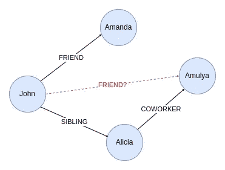
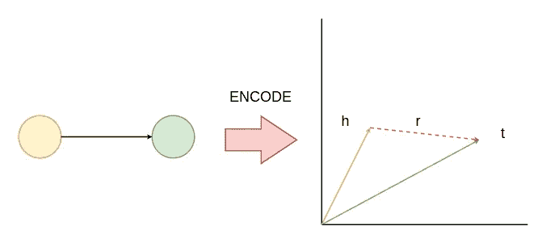
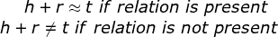
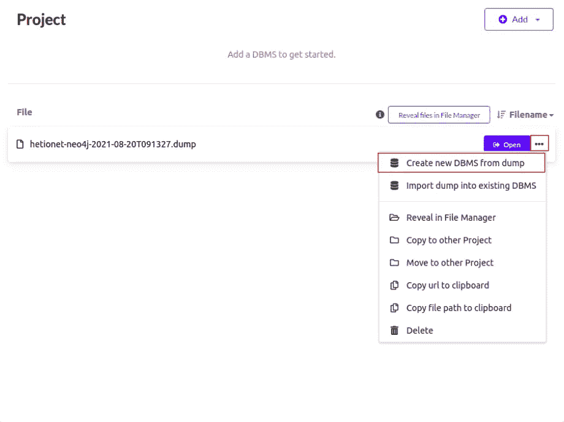
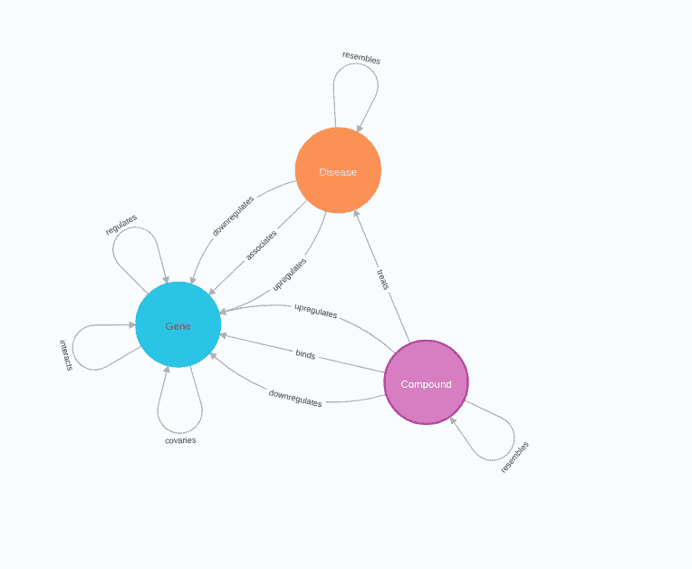
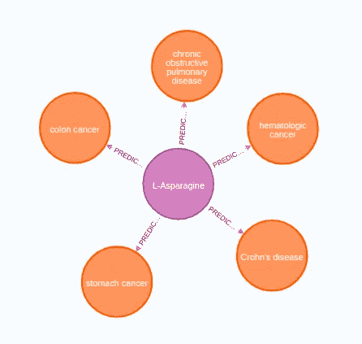
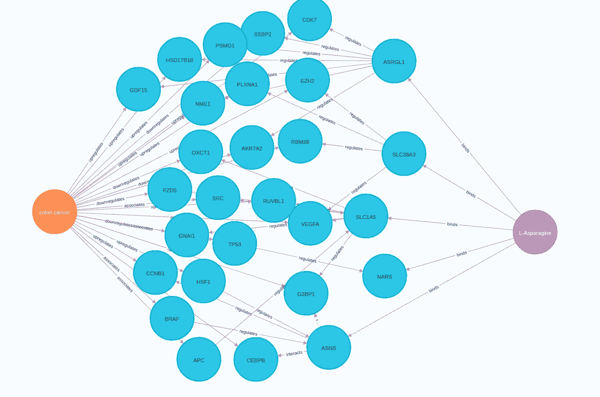

# 用 PyKEEN 和 Neo4j 完成知识图

> 原文：<https://towardsdatascience.com/knowledge-graph-completion-with-pykeen-and-neo4j-6bca734edf43?source=collection_archive---------1----------------------->

## 使用知识图嵌入模型集成 PyKEEN 库和 Neo4j 用于多类链接预测

几周前，我遇到了图表数据科学顾问 Francois Vanderseypen。我们决定联合起来，开始一个图形机器学习博客系列。这篇博客文章将介绍如何执行知识图完成，这只是一个多类链接预测。我们不只是预测一个链接，我们还试图预测它的类型。



知识图补全示例。图片由作者提供。

对于知识图完成，底层图应该包含多种类型的关系。否则，如果您只处理单一类型的关系，您可以使用不考虑关系类型的[标准链接预测技术](/a-deep-dive-into-neo4j-link-prediction-pipeline-and-fastrp-embedding-algorithm-bf244aeed50d)。示例可视化只有一个节点类型，但实际上，您的输入图也可以包含多个节点类型。

我们必须将知识图嵌入模型用于多类链路预测流水线，而不是普通的节点嵌入模型。
你可能会问，有什么区别。
节点嵌入模型仅嵌入节点，而知识图嵌入模型嵌入节点和关系。



通过知识图嵌入模型嵌入节点和关系。图片作者。

描述模式的标准语法是，起始节点称为 head (h)，结束或目标节点称为 tail (t)，关系为 r。

像 [TransE](https://proceedings.neurips.cc/paper/2013/file/1cecc7a77928ca8133fa24680a88d2f9-Paper.pdf) 这样的知识图嵌入模型背后的直觉是，如果关系存在，头部加上关系的嵌入接近于尾部的嵌入。



图片由作者提供。

那么预测就很简单了。例如，如果您想要预测特定节点的新关系，您只需对该节点加上关系嵌入求和，并评估是否有任何节点接近嵌入和。

要了解更多关于知识图嵌入模型的详细信息，我建议你去看看 Jure Leskovec 的以下讲座。

## 议程

如果你读过我以前的博客文章，你可能知道我喜欢使用 Neo4j，一个原生的图形数据库，来存储数据。然后，您将使用 Neo4j Python 驱动程序获取数据，并将其转换成一个 [PyKE](https://github.com/pykeen/pykeen) EN 图。PyKEEN 是一个 Python 库，其特点是知识图嵌入模型，并简化了多类链接预测任务的执行。最后，您将把预测存储回 Neo4j 并评估结果。

我已经准备了一个 [Jupyter 笔记本](https://github.com/tomasonjo/blogs/blob/master/pykeen/Hetionet%20-%20RotatE.ipynb)，里面包含了这篇帖子的所有代码。

## 在 Neo4j 桌面中准备数据

我们将使用 [Hetionet](https://het.io/) 数据集的子集。如果你想了解更多关于数据集的知识，请查阅[原始论文](https://www.ncbi.nlm.nih.gov/pmc/articles/PMC5640425/)。

为了跟随本教程，我建议您下载 Neo4j 桌面应用程序。

<https://neo4j.com/>  

一旦安装了 Neo4j 桌面，就可以[下载数据库转储](https://drive.google.com/file/d/1u34cFBYvBtdBsqOUPdmbcIyIt88IiZYe/view?usp=sharing)并使用它来恢复数据库实例。



在 Neo4j Desktop 中恢复数据库转储。图片作者。

如果您在恢复转储文件方面需要更多的帮助，大约一年前，我写了一篇关于它的博客文章。

如果您成功地恢复了数据库转储，您可以打开 Neo4j 浏览器并执行以下命令。

```
CALL db.schema.visualization()
```

该过程应显示以下图表模式。



图形模型。图片作者。

我们的 Hetionet 图子集包含基因、化合物和疾病。它们之间有许多关系，你可能需要在生物医学领域才能理解它们，所以我不会深入细节。

在我们的例子中，最重要的关系是化合物和疾病之间的**治疗**关系。这篇博文将使用知识图嵌入模型来预测新的 **treats** 关系。你可以把这个场景想象成一个药物再利用的任务。

## 皮基恩

PyKEEN 是一个不可思议的、简单易用的库，可用于知识图完成任务。
目前，它拥有 35 个知识图嵌入模型，甚至支持开箱即用的超参数优化。
我喜欢它是因为它的高级接口，使得构建 PyKEEN 图和训练嵌入模型变得非常容易。
查看其 GitHub 知识库了解更多信息。

<https://github.com/pykeen/pykeen>  

## 将 Neo4j 转换为 PyKEEN 图

现在我们将进入这篇文章的实际部分。

首先，我们将把 Neo4j 图转换成 PyKEEN 图，并分割训练测试数据。首先，我们必须定义与 Neo4j 数据库的连接。

函数执行一个密码查询，并以 Pandas 数据帧的形式返回输出。PyKEEN 库有一个`from_labeled_triples`,它接受一个三元组列表作为输入，并从中构造一个图。

这个例子有一个通用的 Cypher 查询，可以用来获取任何 Neo4j 数据集并从中构造一个 PyKEEN。注意，我们使用节点的内部 Neo4j ids 来构建三元组数据帧。出于某种原因，PyKEEN 库希望三元组元素都是字符串，所以我们简单地将内部 id 转换为字符串。在[官方文档](https://pykeen.readthedocs.io/en/stable/reference/triples.html)中了解更多关于如何构建三元组和可用参数的信息。

现在我们有了 PyKEEN 图，我们可以使用`split`方法来执行训练测试数据分割。

没有比这更容易的了。我必须祝贺 PyKEEN 的作者开发了如此简单的界面。

## 训练知识图嵌入模型

现在我们有了可用的训练测试数据，我们可以继续训练知识图嵌入模型。在本例中，我们将使用[旋转](https://arxiv.org/abs/1902.10197)模型。我不太熟悉嵌入模型的所有变体，但是如果你想了解更多，我会推荐我上面链接的 Jure Leskovec 的讲座。

我们不会执行任何超参数优化，以保持教程简单。我选择使用 20 个历元，并将维度大小定义为 512。

*附注:我后来了解到，在一个大型复杂的图上，20 个时期可能不足以获得有意义的训练；尤其是在如此高的维度下。*

## 多类链接预测

PyKEEN 库支持多种方法进行多类链接预测。您可以找到网络中的前 K 个预测，或者您可以更具体地定义特定的头节点和关系类型，并评估是否有任何新的预测连接。

在本例中，您将预测**L-天冬酰胺**化合物的新 **treats** 关系。因为我们使用内部节点 id 进行映射，所以我们首先必须从 Neo4j 中检索 L-天冬酰胺的节点 id，并将其输入到预测方法中。

## 将预测存储到 Neo4j

为了更容易地评估结果，我们将把前五个预测存储回 Neo4j。

您现在可以打开 Neo4j 浏览器并运行下面的 Cypher 语句来检查结果。

```
MATCH p=(:Compound)-[:PREDICTED_TREATS]->(d:Disease)
RETURN p
```

*结果*



L-天冬酰胺与五大疾病之间的预测治疗关系。图片由作者提供。

由于我不是医学博士，我不能说这些预测是否有意义。在生物医学领域，关联预测是产生假设而不是盲目相信结果的科学过程的一部分。

## 解释预测

据我所知，知识图嵌入模型对解释预测没那么有用。另一方面，您可以使用图中现有的连接将信息呈现给医生，让他决定预测是否有意义。

例如，您可以使用以下 Cypher 查询来调查**L-天冬酰胺**和**结肠癌**之间的直接和间接路径。

```
MATCH (c:Compound {name: "L-Asparagine"}),(d:Disease {name:"colon cancer"})
WITH c,d
MATCH p=AllShortestPaths((c)-[r:binds|regulates|interacts|upregulates|downregulates|associates*1..4]-(d))
RETURN p LIMIT 25
```

*结果*



L-天冬酰胺和结肠癌之间的间接途径。作者图片

左边是结肠癌，右边是 L-天冬酰胺结。在可视化的中间有连接两个节点的基因。

出于好奇，我在谷歌上搜索了 L-天冬酰胺与结肠癌的结合，看到了这篇 2019 年的文章。

<https://www.ncbi.nlm.nih.gov/pmc/articles/PMC6412063/>  

虽然我外行的眼睛并不真正理解是否应该增加或减少天冬酰胺来帮助治疗疾病，但至少看起来两者之间似乎有关系。

## 结论

大多数时候，您会处理具有多种关系类型的图。因此，知识图嵌入模型对于多类链接预测任务非常方便，在这种情况下，您需要预测新的链接及其类型。例如，如果预测的链接类型是 **treats** 或 **causes** ，则差别很大。

从 Neo4j 到 PyKEEN graph 的转换是通用的，可以在任何数据集上工作。因此，我鼓励您尝试一下，并给我一些反馈，告诉我您对哪些用例感兴趣。

和往常一样，代码可以在 [GitHub](https://github.com/tomasonjo/blogs/blob/master/pykeen/Hetionet%20-%20RotatE.ipynb) 上获得。

## 参考

*   Bordes，a .，Usunier，n .，Garcia-Duran，a .，Weston，j .，和 Yakhnenko，O. (2013 年)。为多关系数据建模转换嵌入。在*神经信息处理系统的进展*。柯兰联合公司..
*   生物医学知识的系统整合优先考虑药物的再利用。 *eLife* 第 6 卷 e26726。2017 年 9 月 22 日，doi:10.7554/eLife.26726
*   Ali，m .，Berrendorf，m .，Hoyt，c .，Vermue，l .，Galkin，m .，Sharifzadeh，s .，Fischer，a .，Tresp，v .，和 Lehmann，J. (2020)。将光明带入黑暗:统一框架下知识图嵌入模型的大规模评估*。arXiv 预印本 arXiv:2006.13365* 。
*   孙志清，智，建，。(2019).旋转:通过复杂空间中的关系旋转嵌入知识图。
*   杜，冯等。“SOX12 通过调节天冬酰胺合成促进结直肠癌细胞增殖和转移。”*细胞死亡&疾病*第 10 卷，3 卷 239 页。2019 年 3 月 11 日，doi:10.1038/s 41419–019–1481–9