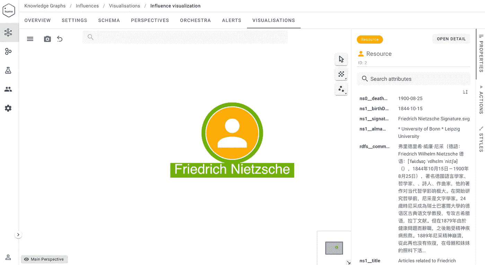

# 知识图视角

> 原文：<https://towardsdatascience.com/knowledge-graph-perspectives-88b69c7b1921?source=collection_archive---------19----------------------->

## [KGS 洞察](https://towardsdatascience.com/tagged/kgs-insights)

## 搭建从资源描述框架到标记属性图的桥梁


KG 代表 DBpedia(休谟工具)中可用的哲学家的影响链—图片由作者提供

*我的原创文章发表在 GraphAware 网站的以下链接:*[https://graph aware . com/Hume/2021/09/23/kg _ perspectives _ RDF _ to _ lpg . html](https://graphaware.com/hume/2021/09/23/kg_perspectives_RDF_to_LPG.html)

从生物技术到电子商务，从情报和执法到金融科技，知识图已经成为各领域实体间关系建模的最有力工具之一。从 2012 年谷歌提出的第一个版本开始，现代 KGs 的功能已经在各种应用程序中使用，包括搜索引擎、聊天机器人和推荐系统。

KGs 至少有两个特征。第一个视角关注知识表示，其中图被编码为使用*资源描述框架* (RDF)数据模型形式化的语句集合。它的目标是标准化 Web 上的数据发布和共享，确保语义互操作性。在 RDF 领域中，智能系统的核心是基于在可用语句的语义层上执行的推理。

第二个视角关注图的结构(属性和关系)。这个愿景在所谓的*标记的属性图* (LPG)中实现。它强调了图形数据的特征，在数据分析、可视化和以图形为动力的机器学习系统的开发方面实现了新的机会，以推断进一步的信息。

在加入 GraphAware 之前，我在学术界的大部分经验都致力于使用 RDF 和本体论开发的知识。在本文中，我想描述采用 LPG 来改进和扩展 RDF 标准和技术中可用的功能的机会。为了具体分析这样的机会，我使用了 Neo4j 的[新语义](https://neo4j.com/labs/neosemantics/4.3/)组件。将使用 [Hume](https://graphaware.com/products/hume/) 平台的可视化组件显示结果。

# 探索新语义特征

KGs 的两种观点背后的愿景对用户体验有着直接的影响。在 RDF 图的情况下，不同类型的用户(如开发人员和数据分析师)与序列化为语句的数据进行交互。因此，在图上执行的任何操作都意味着操纵这样的语句，在使用 SPARQL(RDF 图的语言查询)时也是如此。在 LPG 中，Cypher 查询语言在节点、边和相关属性方面与图结构有更透明的交互。

这种细微的差异对用户体验和性能有重大影响。在 LPG 的情况下，数据的冗余性大大降低，因为所有表示数据属性(作为对象的文字值)的语句(或三元组)都变成了节点的属性。作为一个主要的结果，如果在 RDF 域中有多个语句，每个语句对应一个数据属性，那么对于 LPG 来说，有一个唯一的数据结构，它是带有属性的节点。考虑下面的构造查询，从与 Friedrich_Nietzsche 相关的 DBpedia 中获取包含数据属性(也称为文字值)的所有三元组:

```
PREFIX dbpedia: <http://dbpedia.org/resource/>
CONSTRUCT { 
    dbpedia:Friedrich_Nietzsche ?prop ?value .
}
WHERE {
    dbpedia:Friedrich_Nietzsche ?prop ?value .
    FILTER isLiteral(?value)
}
```

该查询检索 98 条语句，每条语句对应一个数据属性。然而，如果我们使用 Neosemantic 插件在 Neo4j 中上传所有这些语句，我们会看到图中只创建了一个节点。

在数据导入之前，我们可以为图形数据库设置一个初始配置:

```
CALL n10s.graphconfig.set({
        handleMultival: 'ARRAY',
        multivalPropList : [ 
            '[http://dbpedia.org/ontology/abstract'](http://dbpedia.org/ontology/abstract'),
            '[http://www.w3.org/2000/01/rdf-schema#comment'](http://www.w3.org/2000/01/rdf-schema#comment'),
            '[http://www.w3.org/2000/01/rdf-schema#label'](http://www.w3.org/2000/01/rdf-schema#label')]
});
```

这种配置设置有利于信息的一致性。新语义的默认行为是为每个属性只加载一个值。但是，在像 DBpedia 这样的多语言和大规模的 kg 中，多个值可以与一个数据属性相关联。例如,_ rdfs:label _ 通常包括一个特定实体的所有标签，该实体在维基百科上可用的每种语言都有一个标签。在这个初始配置之后，我们可以使用 Neosemantics 获取过程将数据加载到 Neo4j 中。我们从前面介绍的构造查询开始。

```
CALL n10s.rdf.import.fetch("https://dbpedia.org/sparql","Turtle", {
headerParams: { Accept: "application/turtle"},
payload: "query=" + apoc.text.urlencode("
    PREFIX dbpedia: <http://dbpedia.org/resource/>
    CONSTRUCT {
        dbpedia:Friedrich_Nietzsche ?prop ?value .
    }
    WHERE {
        dbpedia:Friedrich_Nietzsche ?prop ?value .
        FILTER isLiteral(?value)
    }
  ")
});
```

我们使用 Hume 的图形可视化特性来查看结果:



休谟形象化——作者的形象

正如您在 Hume visualization 系统中看到的，一个带有相关属性的节点被添加到画布中。正如所料，当前的获取过程添加了来自不同语言的属性值，以保持信息的一致性(在下面的示例中，我们将看到如何将过滤器应用于英语)。

通过分析 RDF 和 LPG 的特点，我们注意到，当比较等价的 SPARQL 和 Cypher 查询时，冗余也减少了。为了观察这种差异，首先，我们定义了一个 SPARQL 构造查询，它在不同的哲学家之间创建了“影响”链。我们还设置了一个配置，只保留英文标签。使用 Neosemantics 获取过程将该查询的结果加载到 Neo4j 中:

```
CALL n10s.rdf.import.fetch("https://dbpedia.org/sparql","Turtle", {
    handleVocabUris: "IGNORE",
    languageFilter: "en",
    headerParams: { Accept: "application/turtle"},
    payload: "query=" + apoc.text.urlencode("
        PREFIX dbo: <http://dbpedia.org/ontology/>
        PREFIX dbp: <http://dbpedia.org/property/>
        CONSTRUCT {
            ?parent dbo:influenced ?child .
            ?parent a dbo:Philosopher .
            ?child a dbo:Philosopher .
            ?parent dbp:birthDate ?birthDate1 .
            ?child dbp:birthDate ?birthDate2 .
            ?parent rdfs:label ?label1 .
            ?child rdfs:label ?label2 .
        }
        WHERE {
            ?parent dbo:influenced ?child .
            ?parent a dbo:Philosopher .
            ?child a dbo:Philosopher .
            ?parent dbp:birthDate ?birthDate1 .
            ?child dbp:birthDate ?birthDate2 .
            ?parent rdfs:label ?label1 .
            ?child rdfs:label ?label2 .
    }")
});
```

事实证明，设置语言过滤器特别有用。几乎 80%的 RDF 三元组已经被删除:2005 个加载的三元组对 10000 个解析的三元组(10000 是网上可用的 DBpedia 端点的结果限制)。然后，从这个影响图开始，我们想要检索在弗里德里希·尼采之上的第三个影响级别(3 跳)的所有哲学家，按照他们的出生日期排序。相关的 SPARQL 查询如下:

```
PREFIX dbo: <http://dbpedia.org/ontology/>
PREFIX dbp: <http://dbpedia.org/property/>
PREFIX dbpedia: <http://dbpedia.org/resource/>
SELECT DISTINCT ?child3 ?label3 ?birthDate3 {
    ?child3 dbo:influenced ?child2 .
    ?child2 dbo:influenced ?child1 .
    ?child1 dbo:influenced dbpedia:Friedrich_Nietzsche .
    ?child3 a dbo:Philosopher .
    ?child2 a dbo:Philosopher .
    ?child1 a dbo:Philosopher .
    ?child3 rdfs:label ?label3 .
    ?child3 dbp:birthDate ?birthDate3 .
    FILTER (lang(?label3) = 'en') .
} ORDER BY DESC(?birthDate3)
```

相应的密码查询如下:

```
MATCH (s:ns0__Philosopher
)-[:INFLUENCED*3]->(nietzsche)
WHERE nietzsche.uri = 'http://dbpedia.org/resource/Friedrich_Nietzsche'
RETURN s
ORDER BY s.ns1__birthDate
```

从这个例子中可以看出，与 SPARQL 查询相比，Cypher 查询要紧凑得多。主要原因是 SPARQL 不是一个图遍历引擎，您必须显式地指定所有的跳数，操作语句。这一方面决定了对查询性能的重要影响。使用 SPARQL，开发人员定义了如何遍历图来检索他需要的信息。这决定了查询的执行严格依赖于查询内容，如果没有结构化或者没有正确排序，查询内容的效率会非常低。

另一方面，Cypher 背后的逻辑是定义*做什么*，以一种非常接近人类思考图结构导航的方式指定检索什么数据。因此，性能取决于查询引擎实现，直接计算图遍历策略。另一个有趣的元素是，在 SPARQL 查询中，我们必须使用下面的表达式指定标签的语言:*过滤器(lang(？label3) = 'en')* 。关于 Cypher，我们不定义标签语言，因为它已经在图形配置程序中设置好了。

# 新语义学观感

从我个人使用 RDF 的经验开始，我已经测试了新语义的许多特性，还有一些我想在将来探索的特性。我发现图形配置程序非常有用。正如我前面提到的，考虑到用户的特定需求，这个功能允许对 RDF 图应用转换。传统上，Web 上可用的通用 RDF 图为单个数据属性提供多个值，例如， *rdfs:label* 。在这种情况下，我们可以在不同的语言中使用不同的标签。如果最终用户只对英语标签感兴趣(没有语言标签)，您可以将此行为设置为一个配置参数。

另一个功能配置与移除 RDF 名称空间有关，我将在以后进一步探讨。当组合覆盖相同领域的不同本体以区分相似属性或类的起源时，名称空间特别有用。然而，这一特性有可能只为企业 kg 创建冗余信息，而这些信息通常是使用唯一的私有本体构建的。

我还欣赏将 RDF 图加载和导入 Neo4j 的动态方式，并彻底研究了从 SPARQL 结果中获取数据的过程。然而，用户也可以从 Web 上或他们自己的系统上的静态文件中加载 RDF 数据。我相信这些导入策略涵盖了文件加载有问题的所有情况，并且避免了为导入数据编写粘合代码。Hume Orchestra 组件采用了类似的原理，它允许您转换来自多个分布式源(S3 桶、Azure Blob 存储、第三方 API、RDBMS 表等)的数据。)转换成由 KG 表示的单个和连接的源。

另一个特性是 RDF 图模型和 LPG 图模型之间的映射。这个特性允许将 RDF 词汇表映射到图元素(标签、属性名、关系名)，并保持两个域中使用的词汇表是不同的。例如，我们可以将 RDF 中的 SKOS:narrow 映射到 LPG 中的:CHILD 关系类型。RDF 专家非常熟悉映射语言的概念:万维网联盟(W3C)已经创建了标准来形式化关系数据库模式和 RDF 表示之间的映射(参见:[https://www.w3.org/TR/r2rml/](https://www.w3.org/TR/r2rml/))。

# 结论

总之，我的总体印象是新语义允许保留 RDF 领域的所有特性。高级别的可配置性将使用户能够根据他们的需求选择这些功能的子集，同时利用所有的 LPG 功能。正如我在本文中所展示的，这些功能使您能够更透明地与图形数据结构进行交互。RDF 语句可以被直接视为图的节点、关系和属性，可以利用 Cypher 语言的简单性和表达能力来研究。

*如果你喜欢我的文章，你可以支持我使用这个链接*[](https://medium.com/@giuseppefutia/membership)**成为一名中等会员。**