# 自然语言处理中的知识图@ ACL 2021

> 原文：<https://towardsdatascience.com/knowledge-graphs-in-natural-language-processing-acl-2021-6cac04f39761?source=collection_archive---------2----------------------->

## 最先进的，2011 年夏天

## 你的 KG 相关的 NLP 研究指南，ACL 版

欢迎来到我们关于知识图的 NLP 论文的第三次常规综述，这次发表在 [ACL 2021](https://2021.aclweb.org/) ！今年你不想错过的流行趋势是什么？👀

米尔科维在 Unsplash 上拍摄的背景照片，由作者改编

ACL'21 仍然是最大的 NLP 场地之一:今年[接受了 700+完整论文和 500+ACL 论文的研究结果](https://2021.aclweb.org/blog/acceptance-decision/)📈。除此之外，不要忘记通常有影响力的短论文和广泛选择的[研讨会](https://2021.aclweb.org/program/workshops/)和[教程](https://2021.aclweb.org/program/tutorials/)。我试图从所有这些曲目中提炼出一些 KG 的论文，放到一个帖子中。以下是今天的话题:

*   [神经数据库&检索](#3683)
*   [KG-增强语言模型](#ea5b)
*   [KG 嵌入&链接预测](#0c08)
*   [实体对齐](#044d)
*   [KG 构建、实体链接、关系提取](#aa43)
*   [KGQA:时间、会话和 AMR](#77f2)
*   [TL；博士](#af08)

对于数据集爱好者，我用💾，因此您可以更轻松地进行搜索和导航。话虽如此，你可能想要在🧭.这个高质量内容的海洋中导航

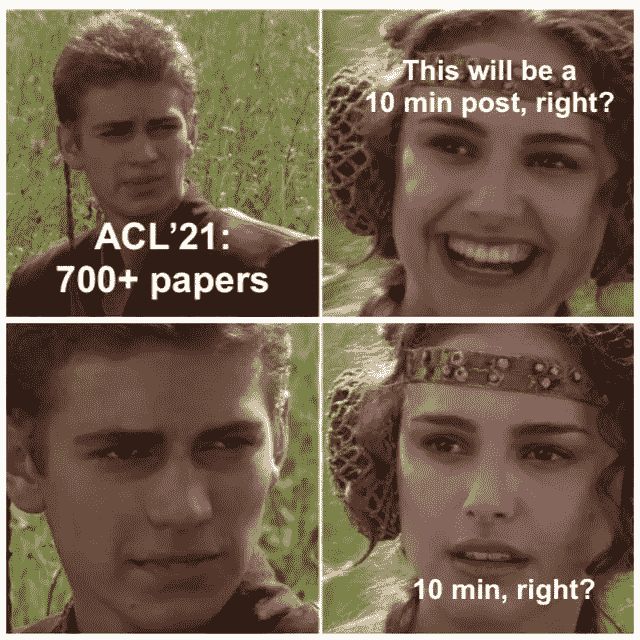

我尽力了，我保证。作者迷因

# 神经数据库和检索

神经修复仍然是发展最快和最热门的领域之一🔥NLP 中的主题:它现在可以处理 100+ GB 规模的数十亿个向量和索引。如果 NLP 栈足够成熟，我们能否从神经方面接近数据库研究的圣杯，嗯，*数据库*？🤨

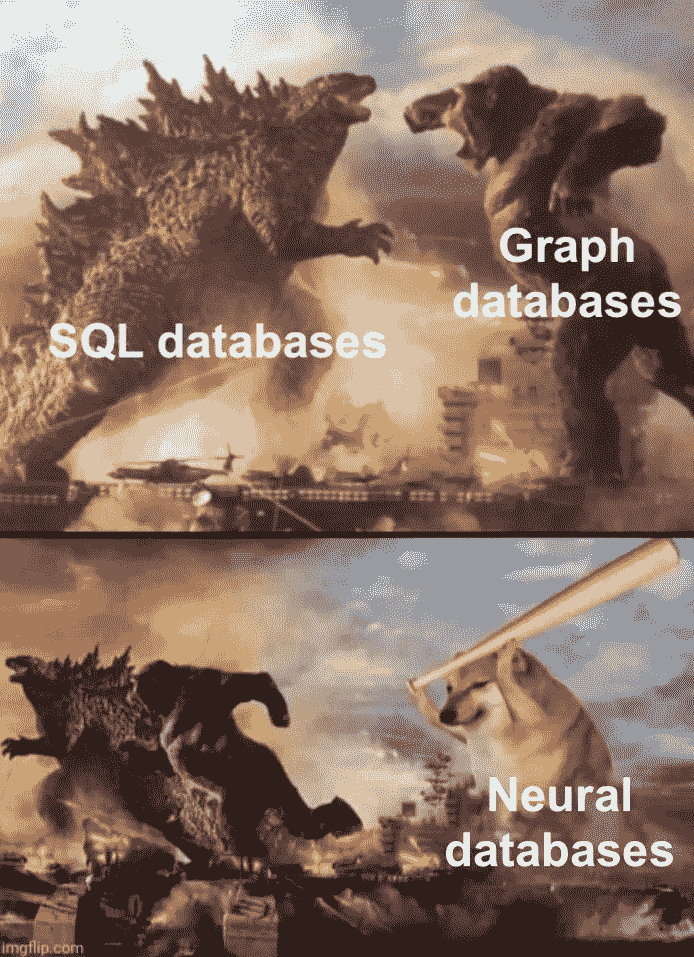

作者迷因

是啊！ [**Thorne 等人**](https://arxiv.org/pdf/2106.01074.pdf) 引入了*自然语言数据库*(表示为 [NeuralDB](https://github.com/facebookresearch/NeuralDB) ) *:* 没有预定义的严格模式，相反，你可以在写作时将事实存储为文本话语。

注意:如果你更喜欢数据库，并把“合适的数据库场所”排在更高的位置，那么基本原则也在同一组作者最近的[VLDB 21 论文](https://dl.acm.org/doi/10.14778/3447689.3447706)中有所阐述。

它是如何工作的？什么是查询引擎？有什么连接吗？(没有联接—不是数据库！)

一个引入的 NL 数据库由 K 个文本**事实**(本研究中为 25-1000 个)组成。本质上，对文本事实的查询回答任务被框架化为检索🔎+提取质量保证📑+聚合🧹(to 支持*最小/最大/计数*查询)。给定一个自然语言问题，我们首先要*检索*几个相关事实(**支持事实**)。然后，有了一个查询和 *m* 个支持集，我们执行一个连接( **select-project join** ，SPJ 操作符，好了，现在它有资格成为一个数据库了😀)对每一对(查询、支持)寻找答案或确认其不存在(抽取式 QA)。最后，通过简单的后处理来聚合连接结果。

🧱Can:我们只是把所有的 k 个事实连接起来，放在一个大的转换器里？从技术上来说，是的，但是作者表明，当数据库大小超过 25 个事实时，效率相当低。相比之下，多阶段方法允许并行处理和更好的缩放。目前看来，NL 数据库的症结在于检索机制——我们不想创建一个包含所有可能组合的强大集，而是只提取相关的组合。到目前为止，这是通过类似 DPR 的密集检索(**支持集生成器**)来完成的，它是针对每个查询的带注释的支持集来训练的。

说到注释和训练，作者用一组新的数据集支持 NLDBs💾Wikidata 中的 KG 三元组在句子中被动词化了(并且你可以生成你自己的 DB 来改变许多事实)。

🧪实验表明，T5 和 Longformer(具有更大的上下文窗口)在给定黄金检索结果时只能在最小的图上与神经 SPJ 算子竞争。否则，在 25 个以上事实的较大数据库上，它们的性能会迅速恶化，而 SPJ + SSG 则稳定得多。这篇论文对 NLP 的普通读者来说非常容易理解，绝对是我今年的最爱之一👍！

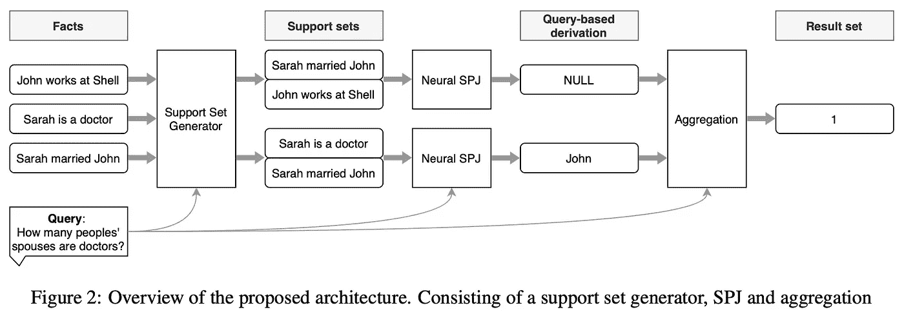

神经数据库架构。来源: [**索恩等人**](https://arxiv.org/pdf/2106.01074.pdf)

随着检索变得越来越重要(即使不是在神经数据库的环境中)，ACL'21 围绕开创性的[密集段落检索](https://github.com/facebookresearch/DPR)及其相关检索器家族拥有丰富的新方法集合。

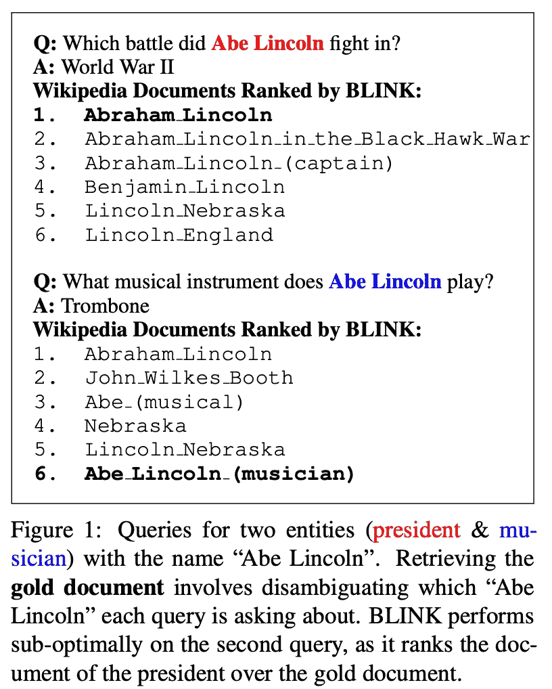

来源:

[**陈等**](https://arxiv.org/pdf/2106.06830.pdf) 解决了*实体消歧*的一个常见且重要的信息检索问题，即你有许多实体，它们共享相同的名称(表面形式)但具有不同的属性(👈亚伯·林肯——政治家和亚伯·林肯——音乐家)。

为了更系统地评估寻回犬，作者设计了一个新的数据集💾[琥珀色](https://github.com/anthonywchen/AmbER-Sets)(歧义实体检索)收集自维基百科-维基数据页面对齐。具体来说，数据集强调🌟“受欢迎程度差距”🌟:在大多数情况下，检索器会退回到其索引中最突出的实体(例如，被查看次数最多、内容更多的页面)，我们希望量化这种转变。Wikidata 实体和谓词被用作参考 KG 集合，以生成新的复杂消歧任务(称为*琥珀集*)。

AmbER 由两部分组成: **AmbER-H** (消除人类歧义)和 **AmbER-N** (非人类，如电影、乐队、公司)，并在 3 个任务中测量性能:QA、槽填充和事实检查。

🧪在实验中，作者表明目前的索塔猎犬确实遭受了低效的歧义消除——在涉及稀有实体的任务中的表现下降了 15-20 分📉。也就是说，要提高检索器的精度还有很多工作要做。

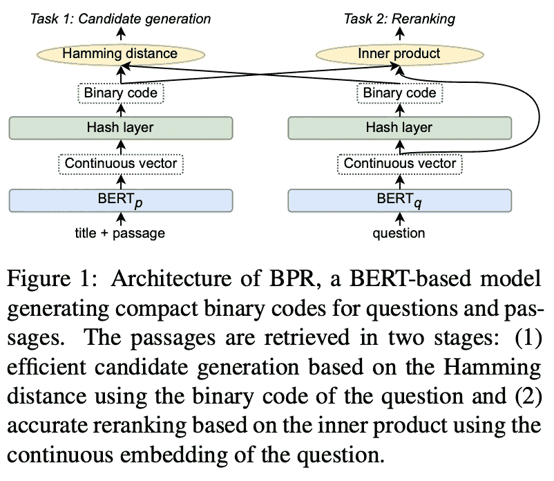

来源: [**山田等人**](https://arxiv.org/abs/2106.00882)

现代寻回犬的一个常见计算问题是它们的索引大小:拥有 2100 万个条目的 DPR 占用了大约 65GB 的内存。 [**Yamada 等人**](https://arxiv.org/abs/2106.00882) 提出了一个优雅的解决方案:使用*学习散列*的思想让我们训练一个近似**符号函数**的散列层，使得连续向量变成+1/-1 的二进制向量。然后，我们可以使用高效的 CPU 实现[汉明距离](https://en.wikipedia.org/wiki/Hamming_distance)来计算粗略的 top-K 候选(文中为 1000)，而不是昂贵的点积(索引上的 MIPS)。然后，我们可以很容易地计算一个问题和 1000 个候选项之间的点积。

[BPR](https://github.com/studio-ousia/bpr) 方法(二进制段落检索器)有几个优点:1️⃣索引大小减少到大约 2 GB(从 66GB 减少到 66gb！)而没有大的性能下降(预计只有前 1 名的准确度受到影响)；2️⃣业务流程再造在[效率质量挑战](https://efficientqa.github.io/)中名列前茅👏。总的来说，这是一篇有影响力的短文的很好的例子！

📬最后，我将从会议中概述一些更多的以检索为中心的作品: [**Sachan 等人**](https://arxiv.org/pdf/2101.00408.pdf) 检验了逆向完形填空任务和掩蔽显著跨度的预训练如何提高 DPR 在开放领域问答任务中的表现。 [**美拉德、卡普欣等人**](https://aclanthology.org/2021.acl-long.89.pdf) 设计一🌐*通用寻回犬*🌐，一个经过多任务训练的检索器，适用于许多 NLP 任务，并在结合 QA、实体链接、槽填充和对话任务的 [KILT 基准](https://ai.facebook.com/tools/kilt/)上进行评估。 [**Ravfogel 等人**](https://aclanthology.org/2021.acl-demo.25.pdf) 展示了一个[很酷的神经提取搜索系统的演示](https://spike.apps.allenai.org/datasets/cord19/search?neural#welcome)(通过新冠肺炎数据)供大家玩。

# kg-增强语言模型:🪴🚿

BERTology 的一个主要趋势是探索大型 LMs 的事实知识，例如，输入查询*“史蒂夫·乔布斯出生在[面具]”*以预测*“加利福尼亚”*。然后，我们可以使用各种基准来量化这些探针，如 [LAMA](https://github.com/facebookresearch/LAMA) 。换句话说，我们是否可以将*语言模型视为知识库？到目前为止，我们有证据表明 LMs 可以正确预测一些简单的事实。*

但是真的，他们能吗？🤔

> 我们的发现强烈质疑先前文献的结论，并证明当使用基于提示的检索范式时，当前的 MLMs 不能作为可靠的知识库。——[**曹等人**](https://arxiv.org/pdf/2106.09231.pdf)

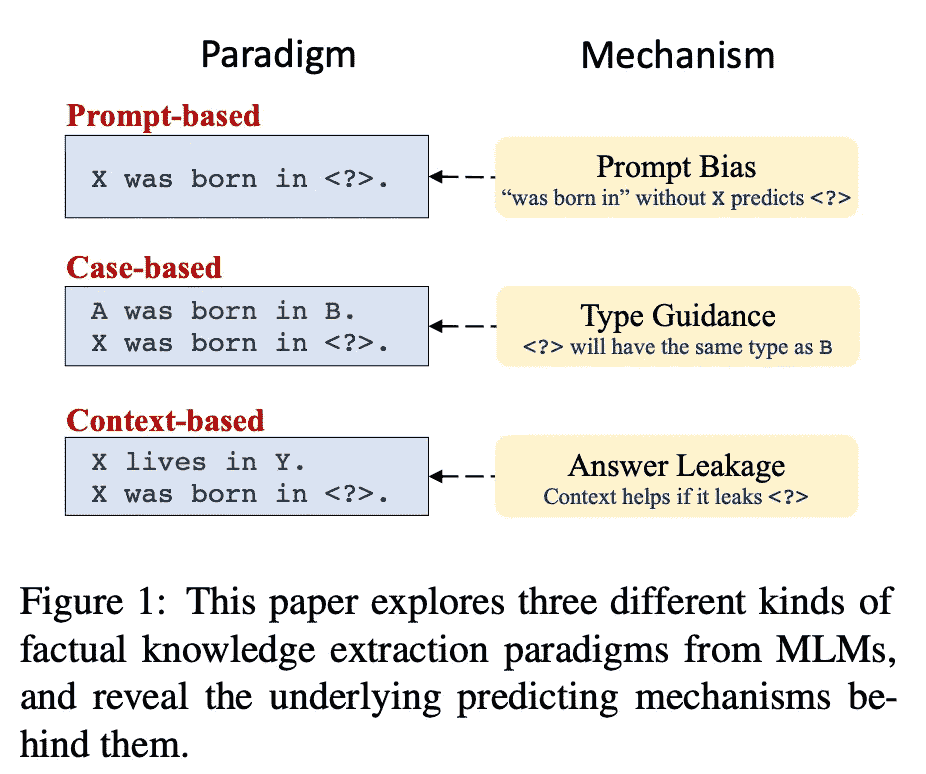

来源: [**曹等人**](https://arxiv.org/pdf/2106.09231.pdf)

[**曹等人**](https://arxiv.org/pdf/2106.09231.pdf) 的工作几乎给整个领域泼了一盆冷水——他们发现，大部分报告的表现都可以归因于**🥴的虚假相关性，而不是实际的“知识”。作者研究了 3 种类型的探测(图示👈):*提示*、*案例*(又名少拍学习)和*上下文*。在所有场景中，LMs 表现出许多缺陷，例如，*案例*只能帮助识别答案类型(人、城市等)，但不能指向该类中的特定实体。这篇论文非常容易阅读和理解，并且有很多说明性的例子，🖌，所以我建议即使对于那些不积极从事这方面工作的人也要好好读一读。**

**有趣的是，在 ACL'21 的 [**Wang 等人**](https://arxiv.org/pdf/2106.01561.pdf) 也报道了开放域问答中的类似结果。他们分析了巴特和 GPT-2 的性能，得出了几乎相同的结论。是时候反思我们如何在 LMs 中打包显性知识了？🤔**

****

**当你意识到 LMs 一直在作弊。来源: [gfycat](https://gfycat.com/ru/capitalcleanfossa)**

**从前面的帖子中，我们知道存在相当多的 Transformer 语言模型，这些模型中包含了来自知识图的事实。让我们欢迎两位新家庭成员！👨‍👩‍👦‍👦**

**[、王等人、](https://openreview.net/pdf?id=CLnj31GZ4cI)提出 *K-Adapters* ，一种基于预训练 LMs 之上的知识注入机制。有了 K-Adapters，你就不需要从头开始训练一个大的变压器栈了。相反，作者建议在已经预先训练好的冷冻模型(他们用 BERT 和 RoBERTa 做实验)的层间放置几个*适配器层*，例如，在第 0 层、第 12 层和第 23 层之后。冻结的 LM 功能与可学习的*适配器功能*连接在一起，并在一组新任务上进行训练——在这里，它是基于对齐的维基百科-维基数据文本三元组的 [T-REx 数据集](https://aclanthology.org/L18-1544.pdf)的 1️⃣关系预测；2️⃣依赖树关系预测。实验表明，这种方法提高了实体分类、常识问答和关系分类任务的性能。**

**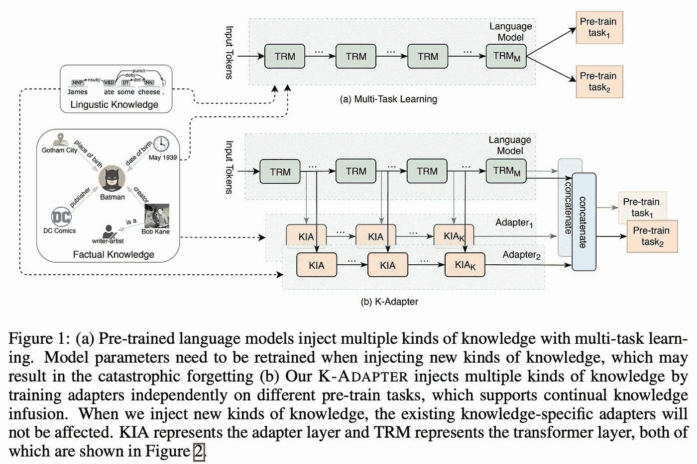**

**来源: [**王等人**](https://openreview.net/pdf?id=CLnj31GZ4cI)**

**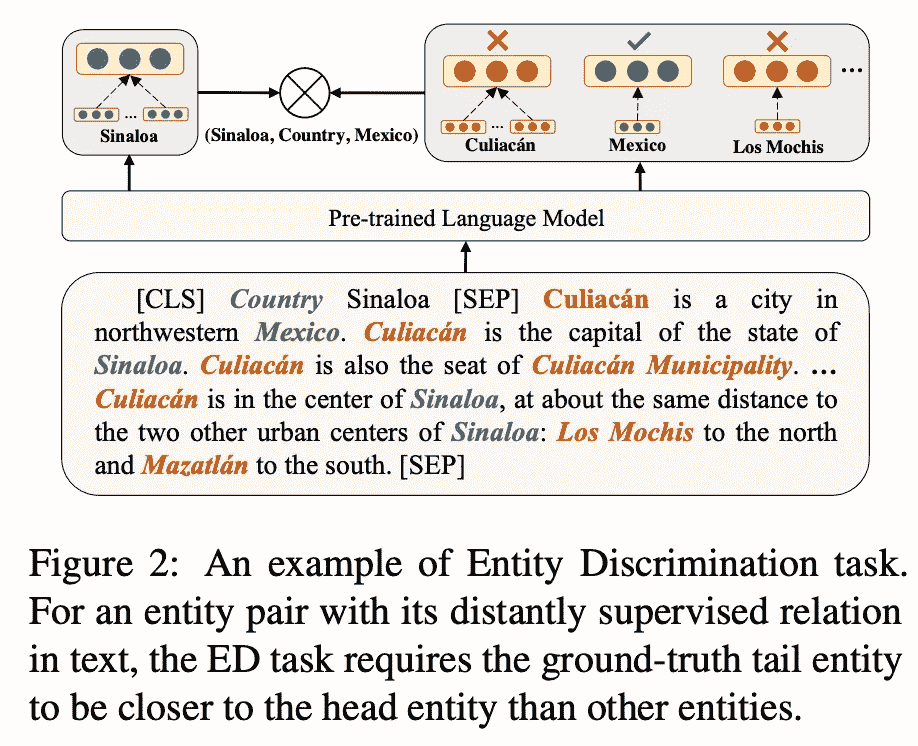**

**艾丽卡预训练任务。来源: [**秦等人**](https://arxiv.org/pdf/2012.15022.pdf)**

****秦等** 设计 *ERICA* ，一种用实体和关系信息丰富 LMs 的对比机制。具体来说，他们增加了两个更多的损失标准传销:实体歧视(🖼👈)和关系歧视。在实体辨别的例子中，预训练文档具有成对的注释🍏 🍏实体跨度。要求该模型产生真实对的更高余弦相似度🍏 🍏而不是消极的🍏 🍅通过对比损失项。ERICA 在关系预测和多跳 QA 任务中的低资源微调场景(1–10%的训练数据)中表现特别好。**

# **KG 嵌入和链接预测**

**多关系 KG 嵌入模型的长处可以是自身容易受到对抗性攻击的弱点吗？一群算法经常被用来比较它们捕捉某些关系模式的能力，比如对称、反转、组合等等。一个简短的回答是*是* :/**

**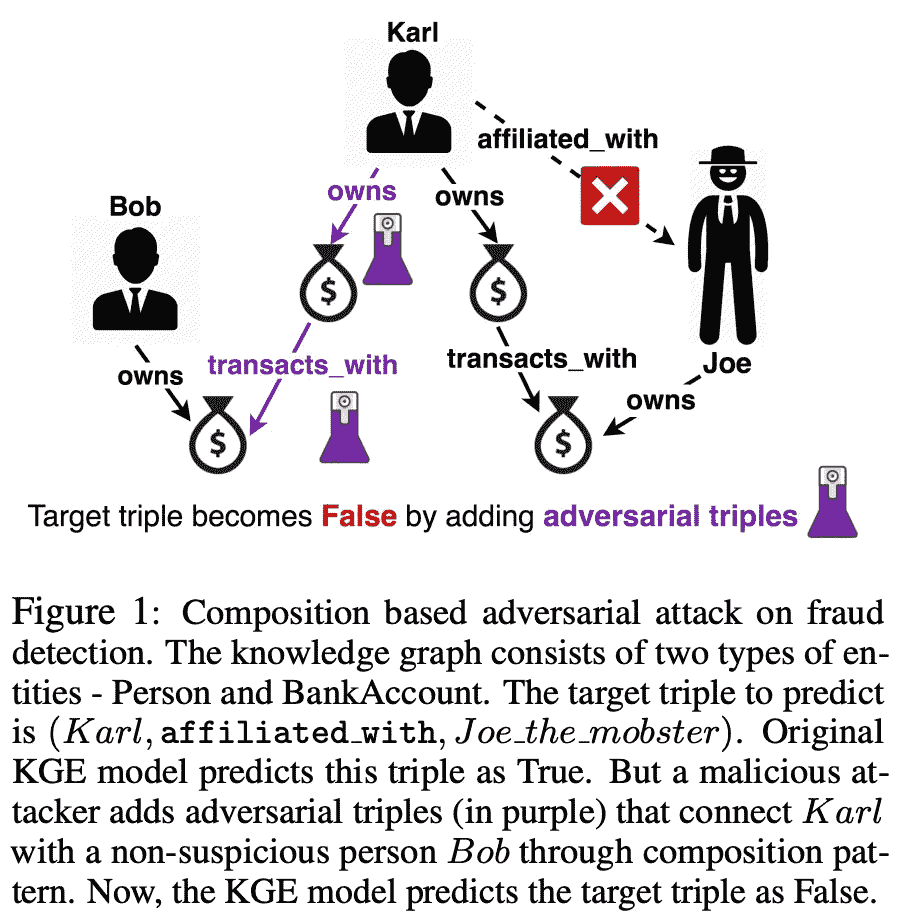**

**来源: [**巴德瓦杰等人**](https://github.com/pykeen/pykeen#models-31)**

**Bhardwaj 等人 的一部颇有见地的著作研究了各种类型和方向的中毒🔫通过添加*对抗性三元组*嵌入模型(查看示例说明👈).它确实假设我们都可以访问预训练的权重，并且可以执行前转呼叫(*白盒*设置)。在[提出搜索**敌对关系**和潜在**诱饵实体**的几种方式](https://github.com/PeruBhardwaj/InferenceAttack)后，实验表明最有效的攻击利用了**对称性**🦋模式(至少在标准 FB15k-237 和 WN18RR 图上)。有趣的是，没有几何或平移先验的卷积模型 ConvE 看起来对设计攻击最有弹性🛡，即普通的 TransE 或 DistMult 中毒更严重。**

**⚖️本人还概述了 [**Kamigaito 和 Hayashi**](https://arxiv.org/pdf/2106.07250.pdf) 对用于训练 KG 嵌入模型的两个流行损失函数家族的理论相似性的长期预期研究: *softmax 交叉熵*和*负采样*，特别是*自我对抗负采样*。在众多的研究中(例如[无耻之徒](https://www.researchgate.net/profile/Asja-Fischer/publication/342436015_Bringing_Light_Into_the_Dark_A_Large-scale_Evaluation_of_Knowledge_Graph_Embedding_Models_Under_a_Unified_Framework/links/5f00cd9f45851550508b2aaa/Bringing-Light-Into-the-Dark-A-Large-scale-Evaluation-of-Knowledge-Graph-Embedding-Models-Under-a-Unified-Framework.pdf)或[来自 ICLR 的 Ruffinelli 等人](https://openreview.net/pdf?id=BkxSmlBFvr)20)，我们已经看到受过这样或那样损失训练的模型表现出相似的性能。最后，在这项工作中，作者通过 [Bregman 散度](https://en.wikipedia.org/wiki/Bregman_divergence)的透镜来研究它们的理论性质。看完这篇文章你想带回家的两个重要信息:1️⃣ *自我对立的负采样*与*带标签平滑的交叉熵*非常相似。2️⃣ *交叉熵*模型可能比*负抽样*模型更适合。如果你忘记用更多的损失函数进行实验，你现在可以引用这篇论文😉**

**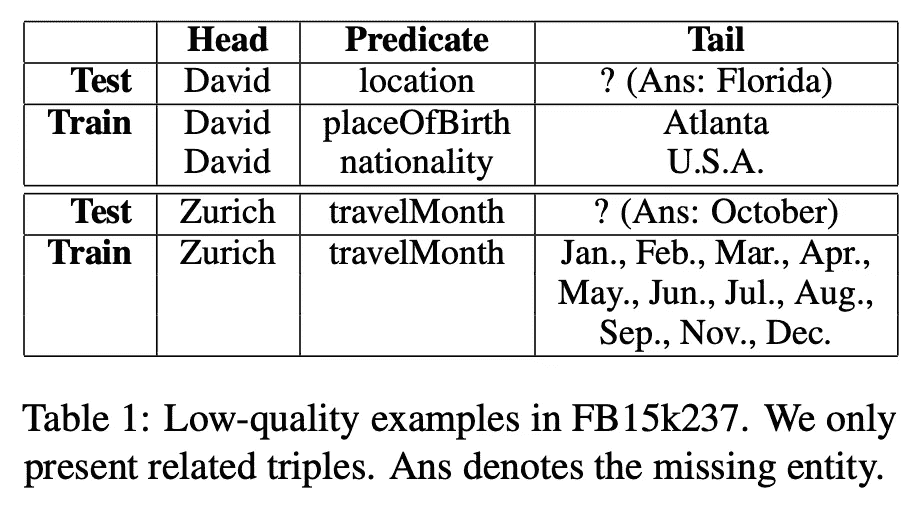**

**来源: [**曹等人**](https://aclanthology.org/2021.acl-long.534.pdf)**

**🚨**新 LP 数据集警报**🚨Freebase 和 Wordnet 图表作为基准已经存在太久了，作为一个社区，我们最终应该采用偏差更少、规模更大的新数据集作为 2021-2022 测试套件。 [**曹等**](https://aclanthology.org/2021.acl-long.534.pdf) 探究 FB15k-237 和 WN18RR 的测试集并发现(如图👈)通常，测试三元组要么对人类来说是不可预测的，要么没有太大的实际意义。受此激励，他们创建了一组新的数据集💾[**infer wiki 16K&infer wiki 64K**](https://github.com/TaoMiner/inferwiki)(基于维基数据😍)其中测试案例在列车组中有接地。他们还为三元组分类任务创建了一组*未知的*三元组(除了真/假)。🧪The 的主要假设在实验中得到证实——当测试三元组在训练中确实有基础时，嵌入模型确实在*非随机分裂*上运行得更好。**

**让我们欢迎👋链路预测的几种新方法。1️⃣[BERT-ResNet](https://github.com/justinlovelace/robust-kg-completion)by[**lovelace 等人**](https://arxiv.org/pdf/2106.06555.pdf) 通过 Bert 对实体名称和描述进行编码，并通过 resnet 风格的深度 CNN 传递三元组，随后进行重新排序和提炼(相当多的内容都放在那里！).该模型产生了很大的改进📈在常识风格的图形上，如 SNOMED CT Core 和 ConceptNet，大量知识编码到文本描述中。接下来， [**Chao 等人**](https://arxiv.org/pdf/2011.03798.pdf) 提出了 [PairRE](https://github.com/alipay/KnowledgeGraphEmbeddingsViaPairedRelationVectors_PairRE) ，这是 RotatE 的一个扩展，其中关系嵌入被分成特定于头部和特定于尾部的部分。PairRE 在 [OGB](https://ogb.stanford.edu/docs/leader_linkprop/#ogbl-wikikg2) 数据集上展示了极具竞争力的结果。顺便说一下，模型已经在 [PyKEEN](https://github.com/pykeen/pykeen) 库中可用，用于训练和评估 KG 嵌入模型。😉 [**李等**](https://aclanthology.org/2021.acl-long.365.pdf) 设计聚类，用于时态 KG 链接预测的模型。CluSTeR 在第一个*线索搜索*阶段使用 RL，在第二个阶段在它们上面运行 *R-GCN* 。4️⃣:最后，我很高兴看到更多关于超关系知识的研究！🎇(在这里找到我的[评论文章](/representation-learning-on-rdf-and-lpg-knowledge-graphs-6a92f2660241))。 [**王等人**](https://arxiv.org/pdf/2105.08476.pdf) 在 Transformer 的基础上构建了他们的 [GRAN](https://github.com/PaddlePaddle/Research/tree/master/KG/ACL2021_GRAN) 模型，采用了包括限定词交互在内的改进的注意机制。我很想看看它在我们新的 WD50K 超关系基准测试中的表现！**

# **实体对齐:2 个新数据集💾**

**在*实体对齐(EA)* 的任务中，你有两个图(可能共享相同的关系集)，这两个图具有两个不相交的实体集，比如来自英文和中文 DBpedia 的实体，你必须确定一个图中的哪些实体可以映射到另一个图中。**

**多年以来⏳⌛️，实体对齐数据集意味着两个图之间存在完美的 1-1 映射，但这对于现实世界的任务来说是一个相当人工的假设。最后， [**孙等人**](https://arxiv.org/pdf/2106.02248.pdf) 通过*悬空*实体(那些没有各自映射的实体)的概念更正式地研究这种设置。**

**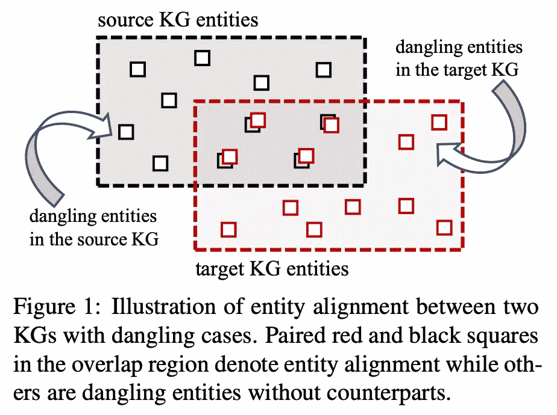**

**来源: [**孙等人**](https://arxiv.org/pdf/2106.02248.pdf)**

**作者建立了一个新的数据集💾， **DBP 2.0** ，其中只有 30–50%的实体是“可映射的”，其余的是*悬空*。因此，这意味着您的对齐模型必须学习一种方法来决定一个节点是否可以被映射——作者探索了 3 种可能的方法来做到这一点。**

**由于大多数 EA 基准已经在非常高的值附近饱和，所以看到添加“嘈杂的”实体急剧下降是很有趣的📉整体表现。朝着更实用的设置又迈进了一步！**

**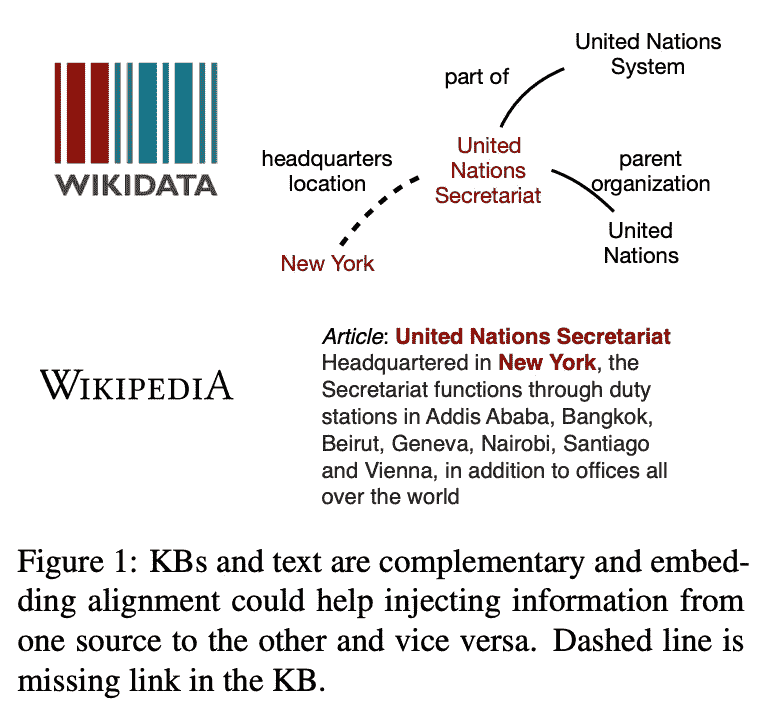**

**来源: [**帕胡贾等人**](https://arxiv.org/pdf/2106.01586.pdf)**

**通常，如果一个图的一些边可以隐式地包含在一些文本中，那么我们就说 *KG-Text* 对齐。特别是，我们感兴趣的是是否有任何方法可以用文本嵌入来丰富图形嵌入，反之亦然。 [**Pahuja 等人**](https://arxiv.org/pdf/2106.01586.pdf) 通过设计一个新颖的数据集，提供了对这个问题的[大规模研究](https://github.com/dki-lab/joint-kb-text-embedding)💾源自全英文维基百科和维基数据:1500 万个实体和 2.61 亿个事实🏋。作者分析了 4 种对齐方法(例如，通过将 KG 嵌入投影到文本嵌入空间)并联合训练 KG /文本嵌入。**

**🧪任务方面，作者测量了少量链接预测(超过 KG 三元组)和类比推理(超过文本部分)的性能。事实上，与单一模态相比，所有 4 种对齐方法确实提高了两项任务的质量，例如，在类比推理中，融合 KG 信息的最佳方法带来了超过 [Wikipedia2Vec](https://github.com/wikipedia2vec/wikipedia2vec) 基线的 16%的绝对提高💪。在链路预测任务中，融合可以产生高达 10%的命中@ 1 的绝对改进。**

**值得注意的是，该方法假设两个独立的模型进行联合训练。绕过校准问题，在这个新任务中探索 KG 增强 LMs(一个在 KG 上预训练的模型)肯定是有趣的。**

# **KG 构建，实体链接，关系抽取**

**从文本中自动构建🧩kg 是一项非常重要且受欢迎的任务，适用于许多工业应用。**

**[**蒙达尔等人**](https://arxiv.org/pdf/2106.01167.pdf) 提出了从 [ACL 选集](https://aclanthology.org/)(例如，本文所评论的所有论文都属于该文集)中 KG 构造 NLP 论文的工作流程。得到的图形称为 [SciNLP-KG](https://github.com/Ishani-Mondal/SciKG) 。它并不完全是标题中所说的端到端的(作者在第 5 节中通过错误传播来证明)，而是由 3 个阶段组成(🖼👇)围绕关系抽取。SciNLP-KG 建立在[之前的研究](https://aclanthology.org/2021.eacl-main.59/) (NAACL'21)的基础上，提取**任务**、**数据集**和**指标** (TDM) **的提及。**KG 模式有 4 个不同的谓词: *evaluatedOn* 、 *evaluatedBy* 、*co reference*和 *related* 来捕获 TDM 实体之间的链接。作者构建了两个版本的 SciKG:一个小型 MVP 和一个具有 5K 个节点和 15K 条边的成熟版本。这种方法的一个优点是，自动构建的大 SciKG 与代码为的[论文有很大的重叠(大约 50%的实体)！](https://paperswithcode.com/)**

**是的，这只是一个受限领域中的 4 个关系，但这是一个良好的开端——毫无疑问，更多可扩展的端到端方法将随之而来。**

**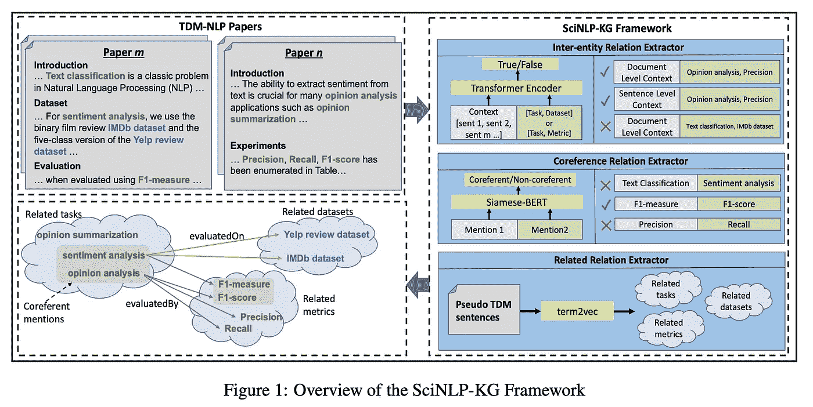**

**来源: [**蒙达尔等人**](https://arxiv.org/pdf/2106.01167.pdf)**

****

**对已知任务的非传统方法。来源: [Reddit](https://www.reddit.com/r/interestingasfuck/comments/if592f/next_time_you_see_a_croc_floating_towards_you/)**

**在像 [BLINK](https://github.com/facebookresearch/BLINK) 和这样的神经实体链接器的时代，**江、Gurajada 等人** 的一部作品对这个问题采取了非正统的观点:让我们在一个加权的基于规则的框架([逻辑神经网络](https://arxiv.org/pdf/2006.13155.pdf))中将文本启发与神经特征结合起来。事实上，*LNN-埃尔*是更大的神经符号 *NSQA* 系统的一个组成部分，但在下面的 KGQA 部分会有更多的介绍。**

**📝该方法*LNN-埃尔*，要求实体提及与目标 KG 的前 K 名候选人已经在那里。一些文本特征可以是，例如，提及和候选之间的 Jaro-Winkler 距离或基础 KG 中的节点中心性。眨眼和神经方法也可以作为特性插入。然后，专家创建一组具有权重的规则，例如，将 *w1* 分配给 Jaro-Winkler，将 *w2* 分配给 BLINK，并且通过边际损失和负采样来学习权重。**

**🧪 LNN-EL 的表现与 BLINK 相当，并返回一个可解释的加权规则树。此外，它可以推广到使用相同的底层 KG 的其他数据集👏**

**➖There 也存在一些缺点:看起来眨眼实际上是整体表现中的关键因素，占规则总权重的 70-80%。因此，自然的问题是——制定复杂的专家规则实际上值得吗？🤔其次，作者使用 [DBpedia lookup](https://lookup.dbpedia.org/) 来检索 top-K 候选项，并“假设类似的服务存在或者可以在其他 kg 上实现”。不幸的是，情况往往并非如此——事实上，这种候选检索系统只存在于 DBpedia 和(部分)Wikidata 中，而对于其他大型 kg 来说，创建这样的机制非常重要。然而，LNN-EL 为 KGQA 的神经符号实体链接奠定了坚实的基础。**

****

**当盒子嵌入尺寸过小时。资料来源:gifsboom.net**

**实体链接通常是紧密相连的🤝使用实体类型。 [**Onoe 等人**](https://arxiv.org/pdf/2101.00345.pdf) 用[框嵌入(Box4Types)](https://github.com/yasumasaonoe/Box4Types) 解决了*细粒度*实体类型化(当你有成百上千个类型时)的问题。通常，细粒度的实体被建模为向量，具有编码的提及+上下文向量和所有类型向量的矩阵之间的点积。相反，作者建议从矢量转向📦方框(d 维超矩形)。此外，不是“只是盒子”，而是 [Gumbel(软)盒子(neur IPS’20)](https://arxiv.org/pdf/2010.04831.pdf)，当“只是盒子”不相交时，允许在角落情况下进行背面投影。🖼👇给出了一个很好的直觉:本质上，我们将所有的相互作用建模为几何运算符📦将它们的体积标为 1 会给概率解释带来额外的好处。**

**🧪实验表明，盒子至少和更重的基于向量的模型一样好，在某些情况下甚至超过它们 5-7 个 F1 分👏。除此之外，还有许多具有洞察力的定性实验。总的来说，我很喜欢阅读这篇论文——强烈推荐它作为一篇优秀论文的范例。**

**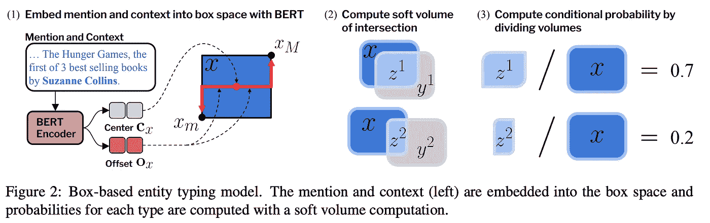**

**来源: [**Onoe 等人**](https://arxiv.org/pdf/2101.00345.pdf)**

**让我们在**关系提取**论文上补充几句，这些论文在几个基准测试中略微改进了 SOTA。 [**胡等**](https://aclanthology.org/2021.acl-long.359.pdf) 研究预训练的 KG 实体嵌入如何帮助进行包级关系抽取(实际上只是一点点)，并创建新的[数据集 BagRel-Wiki73K](https://github.com/zig-kwin-hu/how-KG-ATT-help) 💾基于维基数据的实体和关系！ [**田等**](https://aclanthology.org/2021.acl-long.375.pdf) 提出了一个**透视图、 *SteREoRel、*关于 re 的任务，即段落中的实体、关系、词语都可以建模为一个 3D 立方体。一段的 BERT 编码被发送到几个解码器，以重建正确的关系三元组。最后， [**纳德格里等人**](https://arxiv.org/pdf/2106.00459.pdf) 提出了 *KGPool* ，其中来自句子的已知实体诱导出具有后续 GCN 层和池的局部邻域。****

# ****基于 KGs 的问题回答:时态、会话、AMR****

****当代 KGQA 主要关注经典静态图，即当你有一组固定的实体和边，而问题没有任何时间维度时。****

****⏳但是时候到了！ [**Saxena 等人**](https://arxiv.org/pdf/2106.01515.pdf) 介绍了一个对时态 kg 进行 *QA 的大规模任务，那些在边上有时间戳的 kg 像`(Barack Obama, position held, POTUS, 2008, 2016)`一样表示其有效性。它开启了一系列全新的简单和复杂的问题，围绕着*时间*维度:“奥巴马之前/之后谁是总统？”、“奥巴马当总统的时候谁演钢铁侠？”诸如此类。作者创建了一个新的数据集💾CronQuestions (基于维基数据😍)具有超过 KG 的 410K 个问题，具有 123K 个实体、大约 200 个关系和 300K 个三元组，并带有时间戳。*****

***🧐毫不奇怪，BERT 和 T5 不能以任何像样的准确性处理这样的问题，所以作者将 ***EmbedKGQA*** (我们在之前的 ACL 评论中强调的来自 ACL'20 的方法[)与预先训练的时态 KG 嵌入 ***TNT-ComplEx*** (来自 ICLR'20 评论](/knowledge-graphs-in-natural-language-processing-acl-2020-ebb1f0a6e0b1#1e21)的[)结合起来，看，通过这个系列，您可以与大多数最新的好东西保持同步😉)在一款新的](https://mgalkin.medium.com/knowledge-graphs-iclr-2020-f555c8ef10e3#762b) [CronKGQA](https://github.com/apoorvumang/CronKGQA) 中。本质上，我们将一个句子的 BERT 嵌入作为一个关系嵌入，并将其传递给静态的&时态评分函数，如下所示。
🧪Experimentally，CronKGQA 对简单问题的命中率约为 99%,但对更复杂的问题仍有改进的空间。对于 KGQA 社区的其他人:看，有一个新的非饱和基准👀！***

***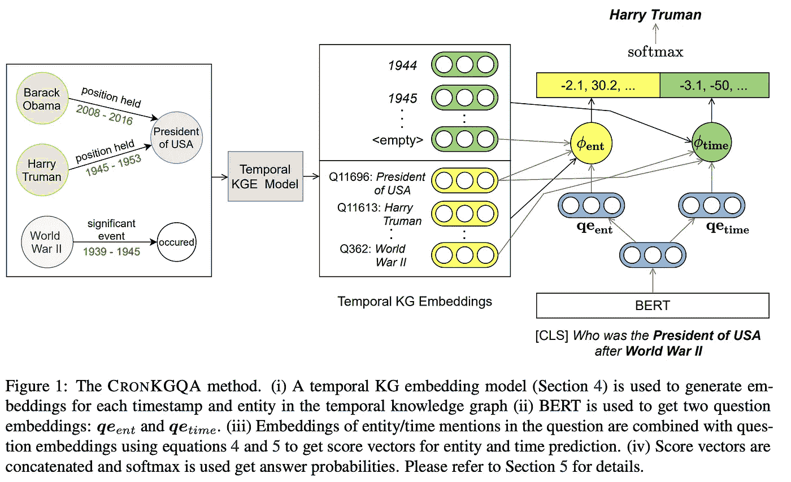***

***来源: [**萨克森纳等人**](https://arxiv.org/pdf/2106.01515.pdf)***

***🗣对话式 KGQA 处理连续的*问答*步骤，其中在生成对底层 KG 的查询和形成预测时，上下文和对话历史具有更高的重要性。在对话式 KGQA 中，**后续问题**往往是最难处理的。传统上，对话历史被编码为一个向量，并且没有对最近实体的特殊处理。此外，后续问题中的显式实体命名经常被省略(因为人类通常擅长共指消解)，所以自然的问题是:我们如何才能跟踪当前对话中最相关的实体？***

***🎯蓝和江提出了焦点实体的概念，焦点实体是一个在对话中被讨论的实体，我们很可能会提出后续的问题。[方法](https://github.com/lanyunshi/ConversationalKBQA)假设我们可以访问 SPARQL 端点来动态查询 KG(显然，这不是端到端的神经网络，而是我们可以对整个 Wikidata 的规模更大的图进行操作)。***

***主要的想法是，我们可以通过计算一个**实体转移图中实体的分布，动态地改变正在进行的对话的焦点。1️⃣** 首先，我们通过围绕对话的起始节点扩展图形(1-2 跳)来构建这样一个 ETG。2️⃣然后，ETG 通过 GCN 编码器获得更新的实体状态。3️⃣更新的实体状态与*焦点实体预测器*(见下图)中的对话历史聚集在一起，该预测器建立关于作为焦点实体的实体分布。4️⃣最后，更新的分布被发送到现成的答案预测器，该预测器返回对当前话语的答案。***

***改变焦点实体的🧪The 想法在[对话问题](https://convex.mpi-inf.mpg.de/)和 [CSQA](https://amritasaha1812.github.io/CSQA/) 的对话版本上产生了显著的收益(平均超过强基线 10 分)💾！最大的误差来源源于不正确的关系预测，因此肯定有改进的空间。***

***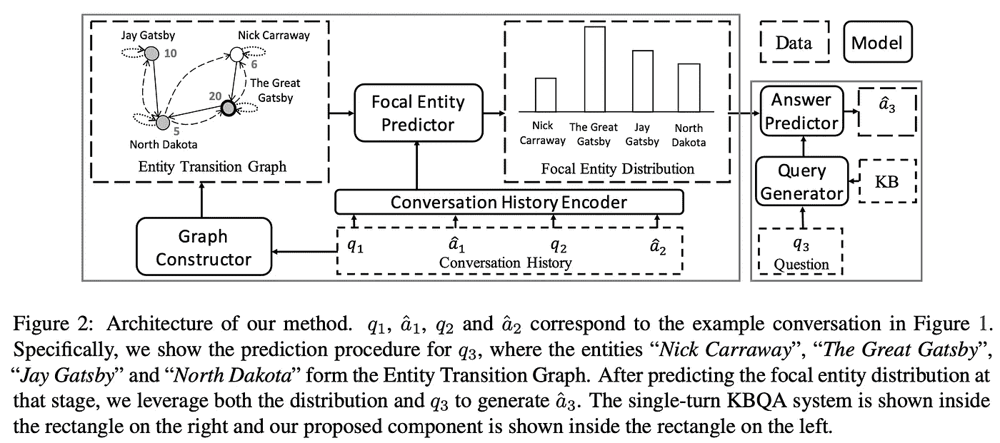***

***来源: [**兰和姜**](https://aclanthology.org/2021.acl-long.255.pdf)***

***最后，让我们用一个问题来讨论一下普通的 KGQA 用一个图表给出一个答案。Kapanipathi 和来自 IBM Research 的另外 29 个人提出了一个巨大的神经符号 KGQA 系统， *NSQA* ，围绕 **AMR 解析**构建。NSQA 是一个流水线系统，有专门定制的组件🧩.也就是说，输入的问题首先被解析成 AMR 树(预训练组件 1️⃣)，然后树中的实体被链接到背景 KG (2️⃣就是上面描述的*lnn-El**！).通过 AMR 树的基于规则的 BFS 遍历来构建查询图。而关系链接是一个单独的组件 *SemRel* (3️⃣在另一篇 ACL'21 论文中由 [**Naseem 等人**](https://aclanthology.org/2021.acl-short.34.pdf) 提出)。****

****NSQA 严重依赖 AMR 帧及其互连来更好地将树解析为 SPARQL 查询，例如，*“AMR-unknown”*节点将是查询中的变量。当然，为了处理 AMR 输出，在精心创建的规则中投入了大量工作👏另一方面，所有其他组件都以某种方式使用变压器。长得相当漂亮的*的确像极了*！🧪实验表明，AMR 解析在 [LC-QuAD 1.0](https://github.com/AskNowQA/LC-QuAD) 基准上的准确率约为 84%(与人类专家创建的结果相比)，而整体 NSQA 将 F1 度量提高了约 11 个点。亲爱的 IBM，一些公开可用的源代码会非常方便😉****

****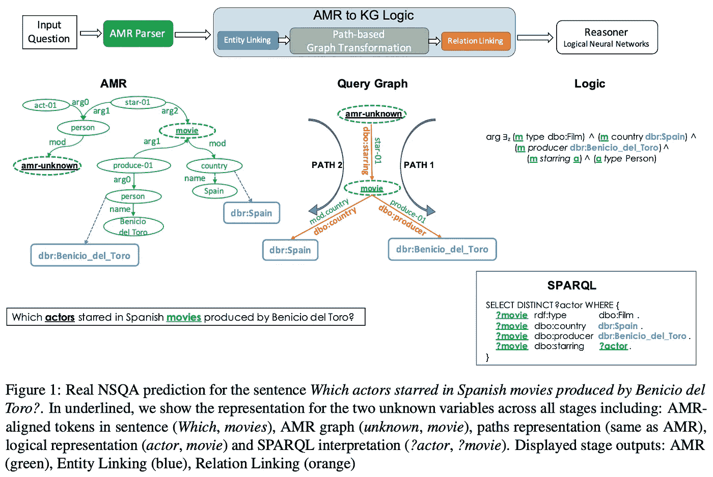****

****来源: [**卡帕尼帕蒂等人**](https://arxiv.org/pdf/2012.01707.pdf)****

# ****TL；博士；医生****

****你进入了最后一部分！无论是从目录还是在阅读了一些相关章节后，感谢您的时间和对这一领域的兴趣😍。请在评论中让我知道你对这整个努力和总体形式的看法！****

****从神经数据库到问题回答，知识库正被应用于比以往更多的任务中。总的来说，我认为这是一个做 KG 研究的好时机:你总是可以找到一个合适的位置，解决理论和实践的挑战，这可能会被社区中成千上万的人使用。****

****期待我们在下一次会议上看到的！****

********

****下一堆文件！资料来源:tenor.com****