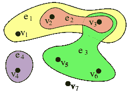
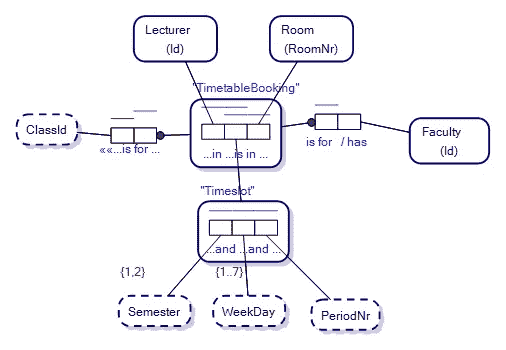
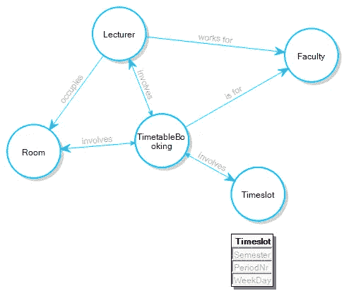
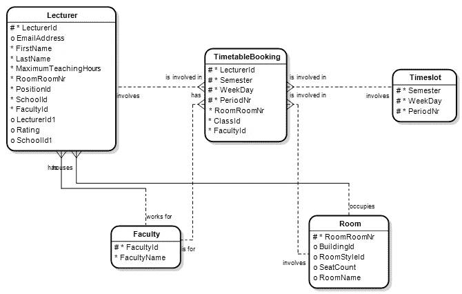

# 知识超图和对象-角色建模

> 原文：<https://towardsdatascience.com/knowledge-hypergraphs-object-role-modeling-ef0f58f38066?source=collection_archive---------21----------------------->

## 当两个世界已经合二为一时，它们却发生了碰撞

通过世界各地各种项目的努力，知识超图已经获得了关注，并且看起来各种技术正在汇聚到一个基本思想上。

超图被定义为一种边可以链接到多个顶点的图。在接受《走向数据科学》采访时，人工通用智能(AGI)研究员 Ben Goertzel 将元图描述为扩展超图(或完全不同的东西),其中边也可以链接到其他链接。事实上，[在与麻省理工学院的莱克斯·弗里德曼的一次采访中，【Mathematica 和 Wolfram Alpha fame 的】史蒂夫·沃尔夫勒姆将超图描述为“任何数量的事物之间可以有联系”。这将使元图和超图成为同样的东西，因此我们在本文中坚持使用术语*超图*。](https://www.youtube.com/watch?v=YGNaRFEa8PI&t=77s)

在更详细地描述超图以及它们如何被[对象-角色建模](https://en.wikipedia.org/wiki/Object-role_modeling)涵盖之前，有趣的是 Goertzel 为 AGI 设计的 OpenCog 架构有一个名为 [*AtomSpace*](https://github.com/opencog/atomspace) 的超图模型，Wolfram 开始与 Fridman 谈论宇宙的基本性质是由[“原子……以及它们之间的联系”](https://www.youtube.com/watch?v=YGNaRFEa8PI)组成的。

与其说我们深入物理学，不如说我们认识到概念模型可以分解成基本的(或原子的)原理和组成部分。

让我们来看一个超图:

超图。图片来自维基媒体。[知识共享许可](https://commons.wikimedia.org/wiki/File:Hypergraph-wikipedia.svg)。

绿色斑点代表连接顶点 V3、V5 和 V6 的*超边*。

在[图论](https://en.wikipedia.org/wiki/Graph_theory)的标准图中，你只会有连接两个顶点的边(就像上面的棕色斑点)。

超图，特别是如果扩展到元图的概念，更进一步，有连接边的边。现在让我们看一个例子:

一个注入超图性质的对象-角色模型。图片作者。

边 TimetableBooking 链接讲师、时间段和房间的概念，其中到时间段的链接是到链接学期、工作日和周期的边的链接。所以我们有边连接边。当然，这个模型是一个为大学预订讲座的时间表预订模式。我们正在看一个对象-角色模型。

在弗里德曼对沃尔夫拉姆的采访中，弗里德曼问道，“一个 hypgraph 可以映射到一个 graph…这只是一种方便的表示？”Wolfram 回答说，“没错。”

那是什么意思？好吧，如果我们把我们的对象-角色模型转换成一个属性图模式(就像你在图数据库中使用的那样)，我们会得到:

转换为属性图模式的 Hypergraph。图片作者。

**NB** 在我们从超图到属性图模式的转换中，我们的三元边以其自身的权利成为节点/顶点。所谓的边，时间表预订和时隙，现在变成了节点/顶点。

在大量发表的关于对象-角色建模的研究中，我还没有看到对象-角色建模和超图之间的联系。事实上，我敢说反之亦然。因此，我们正站在两个世界正在碰撞的关头。随着超图越来越受欢迎，它总是存在，但在其他观察世界的方法和方式中变得模糊不清。

## 两个世界总是一体的

关于这个练习最有趣的事情可能是对象-角色建模最初是为关系数据库的分析和设计而设计的。我们示例中的关系模型如下所示:

关系模型的实体关系图。图片作者。

请注意，在我们的关系模型中，我们在时间表预订中的边现在跨越四(4)个概念，讲师 Id、学期、工作日和周期 NR…即，时间表预订的主键随着我们的边加入我们的超图对象角色模型中的边而完善。对象-角色建模可以追溯到关系数据库兴起的时候，所以我们的核心概念实际上已经有 30 年或更久了。

[Wolfram 在他与 Fridman](https://youtu.be/YGNaRFEa8PI?t=113)、*的采访中说:“认识到你可以用那种方式(使用超图)做事情，打破了我在看到这是如何工作之前在模型中感觉到的某些类型的任意性”。如果 Wolfram 以前从未见过对象-角色建模，那么在研究超图时就很容易理解灯泡是如何打开的。*

## 对象角色建模和 AGI 的未来

在早期的一篇文章中，我讨论了对象角色建模在人工智能未来的价值，以及以最原子的方式呈现的模型非常适合 AGI 解决方案，这些解决方案需要原子事实作为 AGI 算法运算的基础数据。随着我研究得越来越多，对我来说似乎很清楚的是，许多研究正在转向对日常图形和图论的超图研究。

对象-角色建模对于超图的研究是理想的，因为 ORM 将模型分解为元素/原子部分。我描绘了一个世界，其中 OpenCog 的 AtomSpace 使用对象-角色建模来可视化，并且 ORM 在对 AGI 中心数据模型的建模和解释中占据了自然的位置。

感谢阅读。如果时间允许，我会写更多关于对象角色建模、超图和人工智能的文章。

———————End—————
勘误表:早先，er 图实体 TimetableBooking 的主键跨 5 个字段/列，而不是 4 个(20210523)。