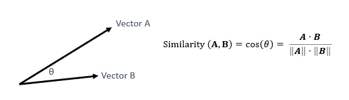
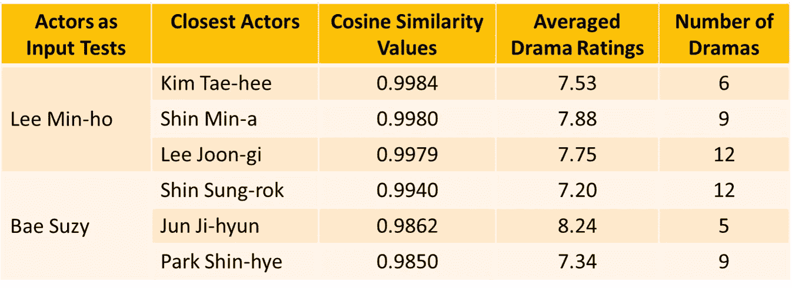

# 如何用机器学习找到韩国演员狂看

> 原文：<https://towardsdatascience.com/korean-actor-recommendation-using-machine-learning-e7ba26e3926?source=collection_archive---------46----------------------->

## 让我根据你目前最喜欢的韩国演员来给你找出下一个你最喜欢的韩国演员

安德鲁·海默尔(安德鲁夫)在 [Unsplash](https://unsplash.com?utm_source=medium&utm_medium=referral) 上拍摄的照片

几个月前，一部来自韩国的电视剧《乌贼游戏》迅速走红，引起了全世界人们的关注。根据 FlixPatrol 的数据，它在网飞已经进入全球最受关注的[前十名](https://flixpatrol.com/title/squid-game/)。不仅如此，一些标志性的东西甚至游戏本身现在也在现实生活中被改编(但不是以一种残酷的方式)。

从这部电视剧的受欢迎程度来看，似乎现在世界对韩国文化和电视剧更加熟悉了。现在，由于韩剧越来越受欢迎，在各种平台上访问韩剧变得更加容易。这也意味着韩国演员在全球获得更多曝光率。

有时候，在看了很多电视剧之后，你可能会想你应该看什么电视剧。或者，也许，你想知道和你看过的演员有相似经历的其他演员。你瞧，我来分享一下，你是如何根据主演过的剧的某些特征找到相似的演员的；)

# 数据是如何得出的

## 获取 k 剧列表

首先，为了得到尽可能多的 k 剧列表，我在这里查阅了维基百科。从这个链接中，使用 BeautifulSoup 检索了所有的戏剧名称和年代。

之后，下一步就是获取每部剧的电影 ID。为此，我们通过搜索和匹配之前收集的戏剧标题和年份来调用 IMDbPy。棘手的是，这部剧的名字有可能和其他剧相似。在这种情况下，我们收集所有的电影 id。

## 过滤和收集信息

收集完电影 id 后，下一步就是检查并剔除那些没有找到电影 id 的剧集。我们还必须检查该剧是否来自韩国，以防检索到同名的非韩剧。对找到的每个戏剧和每个电影 ID 执行这些步骤(如果收集了多个电影 ID)。在这些过程之后，与该剧相关的信息，如演员、评级、流派等被检索出来。

对于任何没有分级的戏剧，分级将被平均流派分级所替代。在进行替换之前，对于每个可用的类型，我们计算了属于该类型的所有戏剧的平均评分。然后，对于缺失的戏剧评分，由于戏剧可以有多种类型，该值将通过对相应戏剧类型的平均评分来填充。

清洗和预处理后的 K-Drama 数据集

不仅 K-Drama 数据集被处理，而且由演员姓名和 id 组成的数据帧也被产生用于特征处理。对于这种情况，将只包括每部戏剧中列出的前十名演员，假设列出的前十名演员是每部戏剧中出现次数最多的角色。因此，出现不久的字符将被避免。我们想让演员的选择更加具体化。

# 你怎么知道谁和谁最亲近？

如上所述，IMDbPy 为我们提供了戏剧及其演员的细节或完整描述。因此，我们可以利用这些细节来创造特色。

## **剧数和平均收视率**

对于每个演员，我们会统计他/她出演了多少部剧，累计他/她的剧评分。然后再用累计的剧收视率除以剧数。

## 最近主演戏剧的演员

每个演员在决定出演电视剧时都有自己的时间和偏好。有些演员你可以经常在银幕上看到。其他人可能一年做一次，或者他们可能在几年后从上一部戏剧中出现。

基于这个条件，应该有一些特征来衡量一个演员在戏剧中出演的频率/最近。为此，我们尝试计算当前年份(2021 年)与该剧上映年份之间的差异。这将对每个演员进行累加，并存储在“最近”变量中。

## 领不领？

我也注意到一些演员频繁出演配角。其他人可能会出演配角，但在其他剧中会成为主角。考虑到这种情况，我们将使用在 IMDb 上市的 cast 的顺序。对于每部戏剧，提到的前三名演员将被赋予 2 的权重。然后，其余的造型被赋予一个权重。

## 每个流派的平均评分

从数据集观察，剧可能有多个流派，当然演员也演过无数剧名。因此，对于每个演员，我们将计算(或累积)属于某些类型的戏剧和评级的总数。

例如，如果演员 X 主演了类型为 Y 和 Z 的戏剧，则类型 Y 的戏剧计数为 1，Z 也为 1。但是，如果同一演员还主演了另一部类型为 W 和 Z 的戏剧，则该演员的总戏剧数对于类型 W 为 1，对于 Y 为 1，对于 Z 为 2。类似的计算也适用于每个类型的总评级。

在此之后，对于每个演员，他/她的每个流派的累积戏剧评级将除以他/她主演的独特戏剧的数量，作为一种标准化形式。

## 通过余弦相似度找到最接近的演员

为了找到哪些演员与输入的演员最接近，我们使用了 Scikit Learn 的余弦相似度。余弦相似度在自然语言处理中被广泛用于寻找相似的文档或信息。它测量两个向量之间角度的余弦，因此值在-1 和 1 之间。如果两个向量重叠(这意味着非常相似或精确)，则值为 1。如果方向相反或不同，余弦相似度为-1。从公式上讲，余弦相似性是两个向量的点积除以向量长度的乘积。

余弦相似度(图片由作者提供)

为了实现这一点，我们使用来自 Scikit Learn 的成对余弦相似度。该函数将返回一个矩阵，该矩阵由输入中所有样本之间的成对相似性组成。当然，输入是经过上述预处理和特征选择后得出的 actorFeatures 数据框。

我们用两个韩国演员的名字来测试一下这个吧！下面，你可以找到三个最接近的演员，给出两个演员的名字。对于这个案例，我们先用李敏镐( [*)后嗣*](https://en.wikipedia.org/wiki/The_Heirs) 、 [*少男过花丛*](https://en.wikipedia.org/wiki/Boys_Over_Flowers_(TV_series)) 、 [*王者:永恒君主*](https://en.wikipedia.org/wiki/The_King:_Eternal_Monarch) )和裴苏西( [*初创*](https://en.wikipedia.org/wiki/Start-Up_(South_Korean_TV_series)) 、 [*浪子*](https://en.wikipedia.org/wiki/Vagabond_(TV_series)) 、 [*趁你熟睡*](https://en.wikipedia.org/wiki/While_You_Were_Sleeping_(2017_TV_series)) )来测试一下。

三位最接近李敏镐和裴苏西的演员(图片由作者提供)

根据上面的结果，如果你是李敏镐的粉丝，你可以查看由以下明星主演的电视剧:

1.  金泰熙( [*嗨再见，妈妈！*](https://en.wikipedia.org/wiki/Hi_Bye,_Mama!)[*)*](https://en.wikipedia.org/wiki/Stairway_to_Heaven_(South_Korean_TV_series))
2.  *Shin Min-a ( [*家乡恰恰恰*](https://en.wikipedia.org/wiki/Hometown_Cha-Cha-Cha) 、 [*哎呀我的维纳斯*](https://en.wikipedia.org/wiki/Oh_My_Venus) )*
3.  *李准基( [*恶之花*](https://en.wikipedia.org/wiki/Flower_of_Evil_(TV_series)) *，* [*月亮恋人:猩红之心 Ry* eo](https://en.wikipedia.org/wiki/Moon_Lovers:_Scarlet_Heart_Ryeo) )*

*如果你想看类似裴苏西主演的电视剧，你可以看看这些演员的电视剧:*

1.  *申成洛( [*凯罗斯*](https://en.wikipedia.org/wiki/Kairos_(TV_series)) *，* [*末代皇后*](https://en.wikipedia.org/wiki/The_Last_Empress_(TV_series)) )*
2.  *俊智贤()**[*《蓝色海洋的传说》*](https://en.wikipedia.org/wiki/Legend_of_the_Blue_Sea) )***
3.  **朴信惠( [*西西弗斯:神话*](https://en.wikipedia.org/wiki/Sisyphus:_The_Myth) ， [*继承人*](https://en.wikipedia.org/wiki/The_Heirs) )**

**如需进一步参考，可以查看下面我的 Github。**

** [## GitHub-in tanday/K-Actors:关于 K 剧和演员的探索

### 此时您不能执行该操作。您已使用另一个标签页或窗口登录。您已在另一个选项卡中注销，或者…

github.com](https://github.com/intandeay/K-Actors)**