# KPI 进度:使用 Tableau 的可视化(营销数据)

> 原文：<https://towardsdatascience.com/kpi-progress-visualization-with-tableau-marketing-data-529812d13ba3?source=collection_archive---------27----------------------->

## 通过可视化效率和效果，帮助创建更好的决策过程

使原始数据有意义的第一步是将其转换成正确有效的可视化。最好的可视化有一个明确的目的，必须能够很容易地回答最相关的问题。

**效率和效果可视化**

在传媒业的世界里，效率和效果是成功的两个主要衡量标准，旨在帮助企业做出决策。今天我们将学习在**画面中构建一个关于这个主题的可视化场景。**

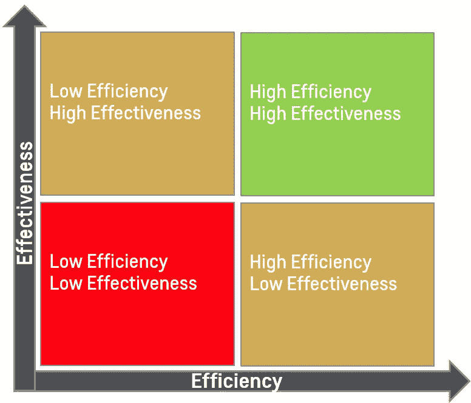

**效率和效果可视化—** 作者提供的图片

## 问题陈述

我们是一个分析团队，希望分析与受众定位相关的营销活动。在 Q1 开展了不同的活动，采用了转换 KPI，我们希望向我们的企业主展示观众的表现，并提供一个涵盖以下问题的美观高效的可视化效果:

1-这些目标观众的表现如何？
2-是否有任何策略表现不佳，需要削减预算？对于在下一季度使用这些策略，有什么建议吗？

**假设:**这里我们假设所有的初始步骤都已经完成，这意味着数据已经导入并在 Tableau 中可见，我们已经准备好创建我们的可视化。

**好了，我们开始吧！**😊💪

**步骤 1:在 Tableau** 中，首先计算你的效率和效果指标。
在我们的活动示例中:

**CPA(效率指标):**每次行动的成本-转化率 **CVR(效率指标):**点击转化率

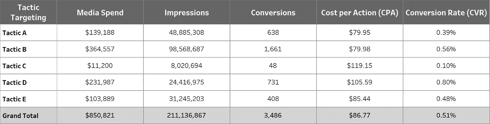

**第二步:**将*每次行动成本(CPA)* 拖动到**列**中，将*转换率(CVR)* 拖动到**行**中。

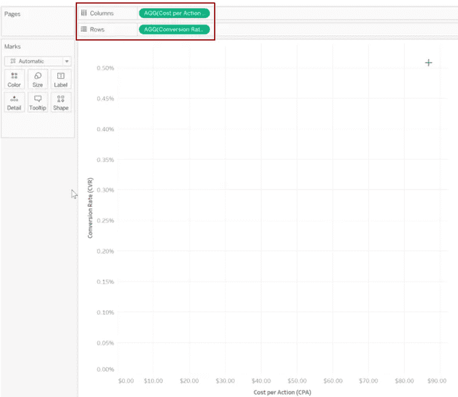

作者图片

**第三步:**拖动*战术瞄准(观众)*到**形状**(标记部分下)

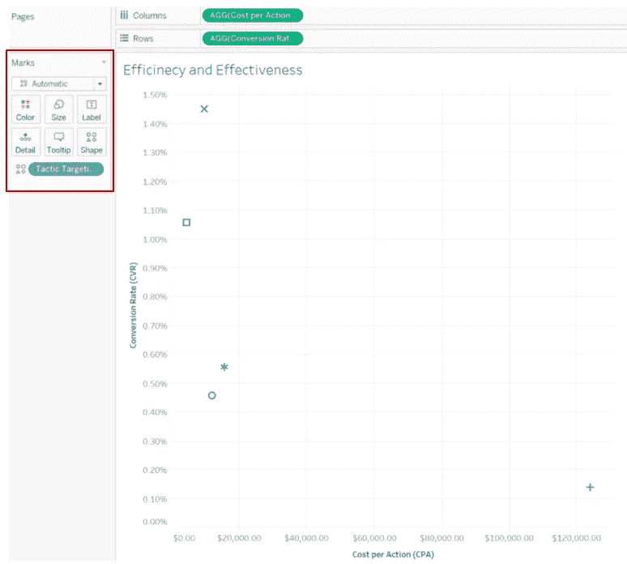

作者图片

**第四步:**右击**每动作轴成本**，选择**编辑轴**并在刻度段下勾选“**反转**

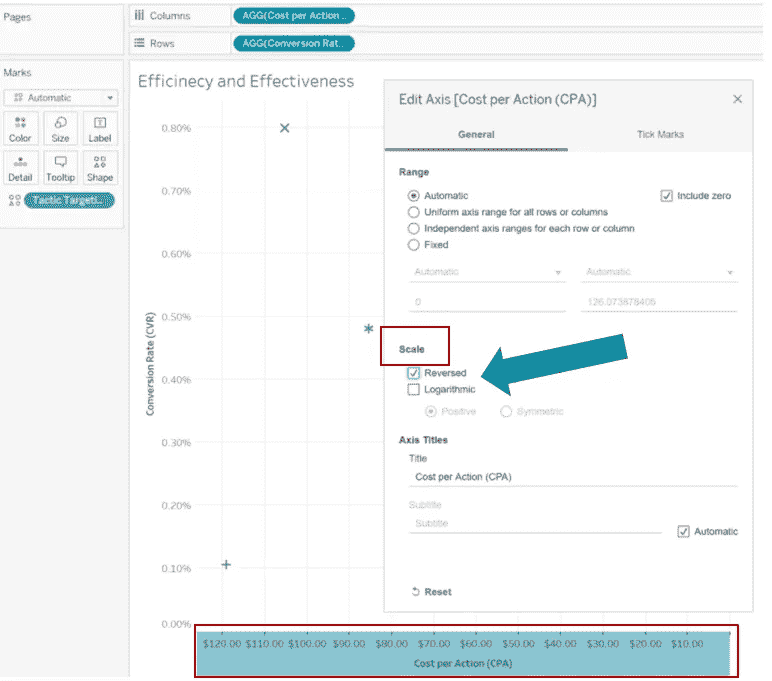

作者图片

**第五步:**我们要添加显示各轴平均值的参考线。在每个轴上单击右键，选择“**添加参考线**，选择下图详细信息:
**下划线部分:
值:**转换率/每动作成本
**标签:**值

**在格式部分-线条:**下选择任意线条类型和颜色

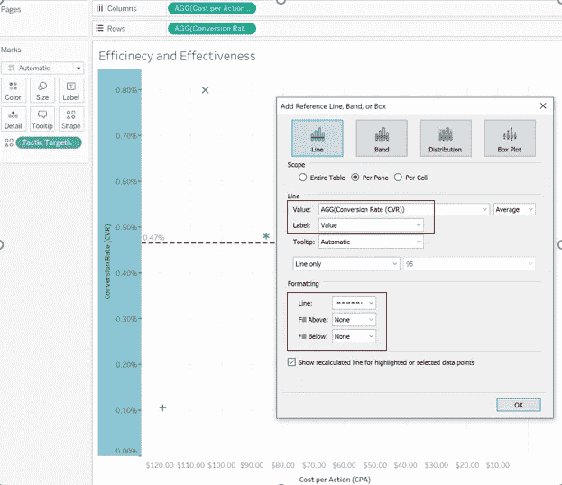

作者图片

**第六步:**右键点击每条参考线的平均值，选择**格式，**然后你可以很容易地改变字体和阴影，使数值更明显。

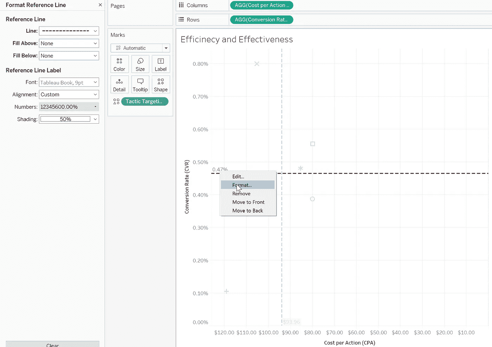

作者图片

**步骤 7:** 从标记部分选择**形状**，然后选择数据项，将其形状更改为您想要的任何形状。

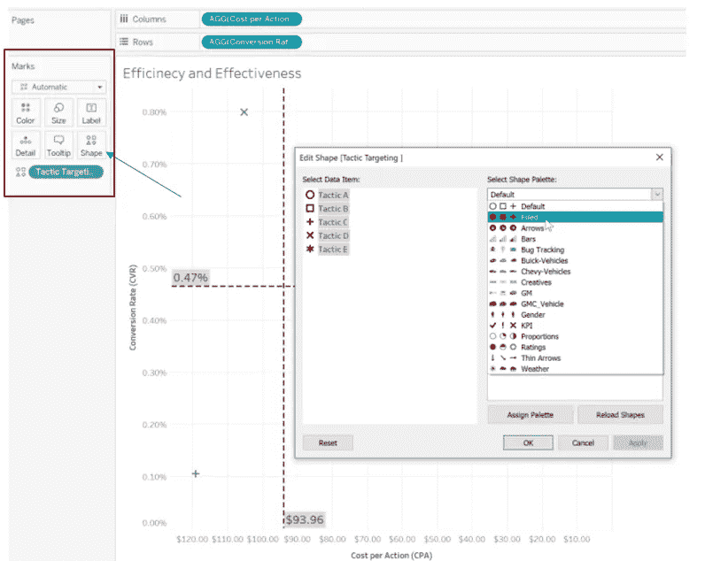

作者图片

您可以通过在标记部分使用 S**size**来使这些战术的形状更大一些。

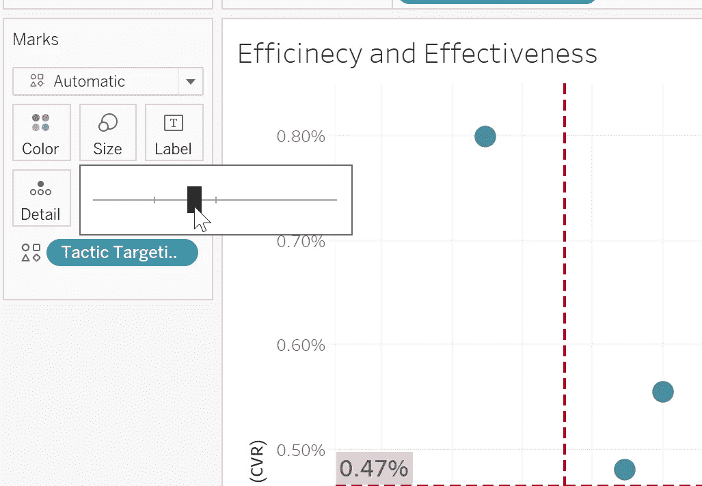

作者图片

**步骤 8:** 将*“媒体花费”*拖动到**形状**中，现在气泡的大小显示了每个战术收到的花费金额。

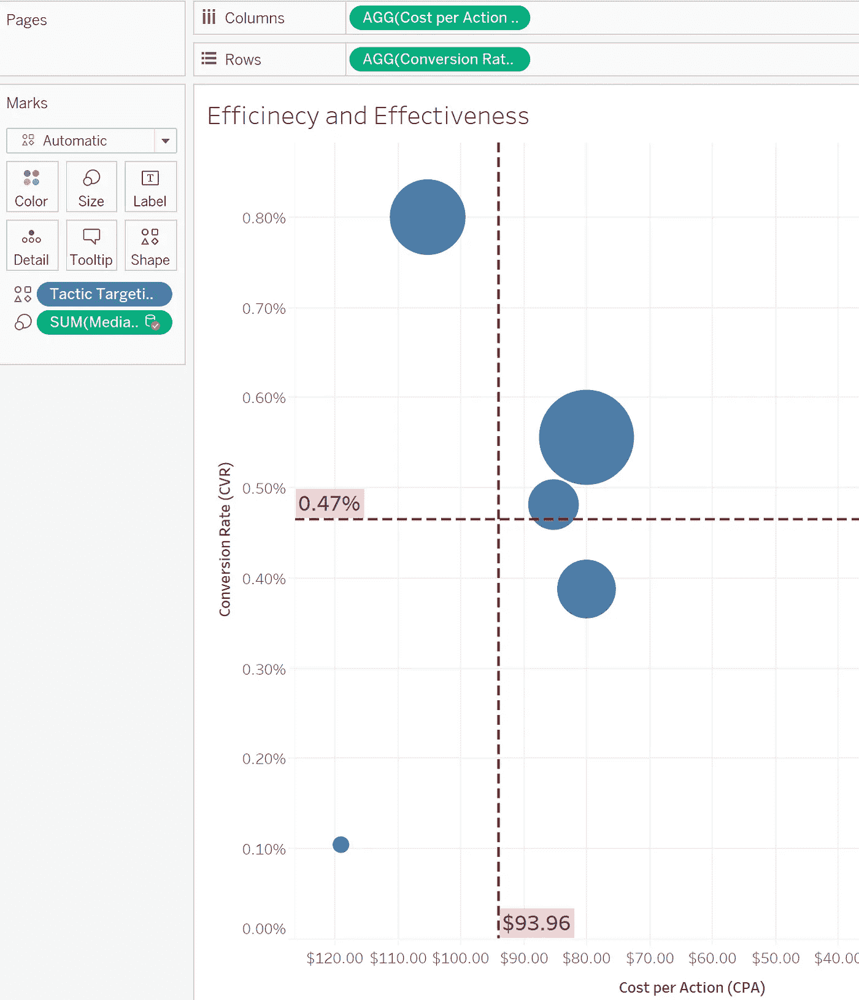

作者图片

**第 9 步:**让我们将颜色编码添加到我们的图表中，为此我们必须将*“转换”*拖动到 Marks 部分下的 **Color** 中，以映射每个战术的转换量。

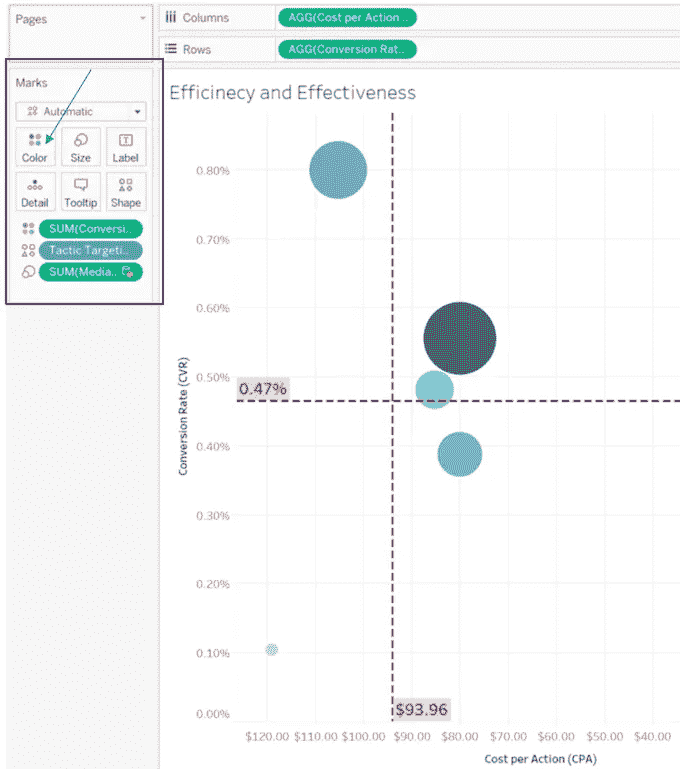

作者图片

**步骤 10:** 将*战术瞄准、CPA 和 CVR* 拖动到 Marks 部分下的**标签**中，并尝试调整标签使其更具可读性。

作者图片

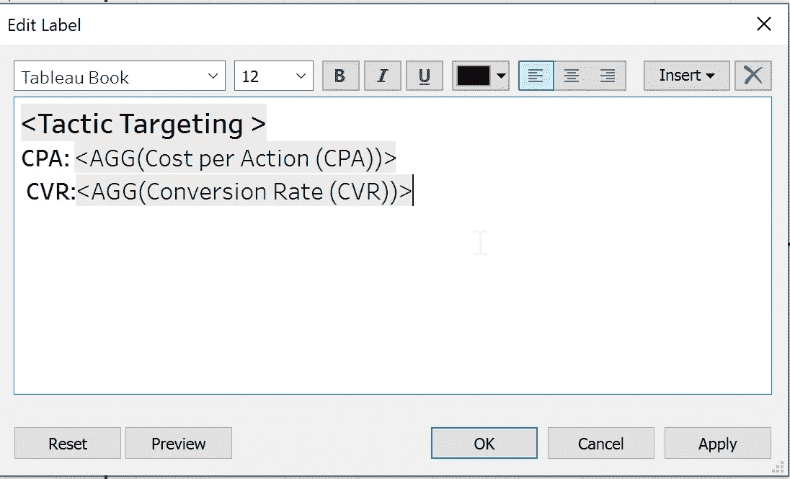

**第 11 步:**让我们去掉背景网格线，右击图表(任何带有网格线的白色区域)并选择**格式，**然后在线条部分下，将网格线改为“无”

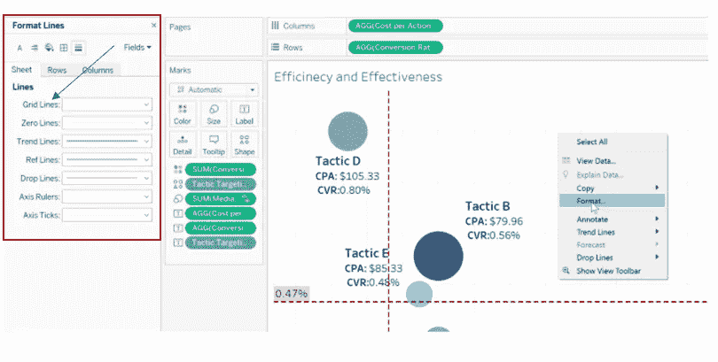

作者图片

最后，您将能够看到下图:

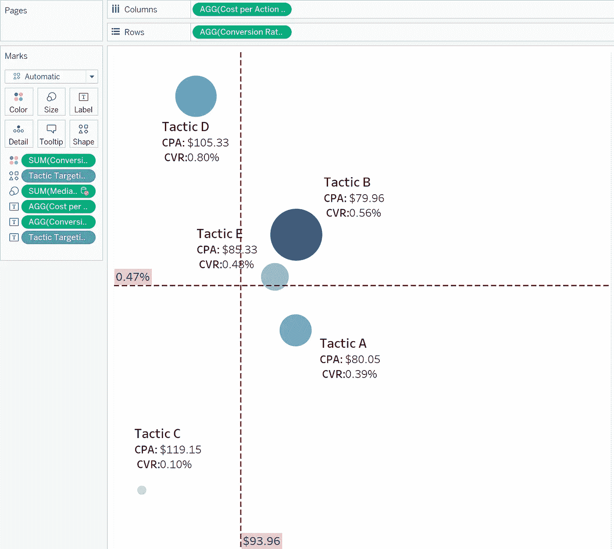

作者图片

第 12 步:现在，让我们把这张图表复制到 PowerPoint 中，让我们的企业主更容易理解。瞧，瞧！😉

作者图片

**现在，是时候向我们的企业主解释这个图表了:**

*   在这个图表中，我们从效率(CPA)和效果(CVR)两个方面比较战术表现。
*   纵轴表示 CVR，横轴表示我们的 CPA。
*   泡泡的大小显示了每种战术的花费。
*   颜色强度显示转化量。
*   右上角的方块代表我们效率和效果最高的区域，另一方面，左下角代表表现最差的区域。
*   任何在右上区域结束的战术都表现良好，同样，任何在左下区域结束的战术都是表现最差的。
*   位于左上角和右下角的任何战术都需要优化。

**外卖:**

*   **策略 B** 是最有效率和效果的策略，具有更好的 CPA 和 CVR，具有最高的投资，并推动了更高的转化量。
*   在**策略 E 和 A** 花费几乎相同的情况下，策略 E 是我们质量领先的驾驶员，具有更高的 CVR，他们的 CPA 没有显著差异。
*   **战术 D** 产生了确实很高的 CVR，但是，其 CPA 还有提升的空间。
*   **战术 C** 是 CVR 较低而 CPA 较高的效率和效果最低的战术。

**推荐:**

减少不良战术的预算或增加性能更好的战术将有助于提高我们的活动性能。

**最后一点—** 我希望这篇文章能帮助您了解可视化数据结果。欢迎任何反馈，因为它让我获得新的见解。
多谢！😊💪