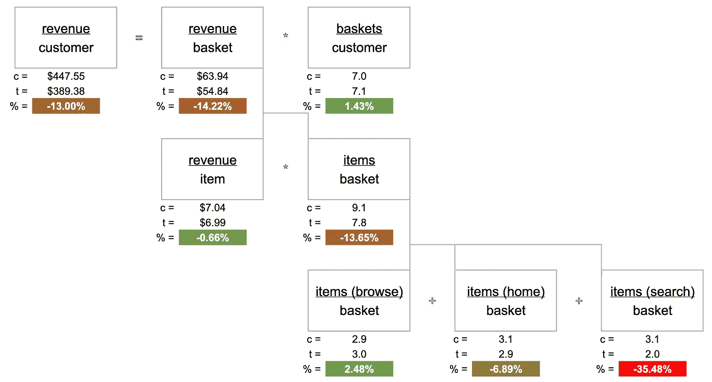
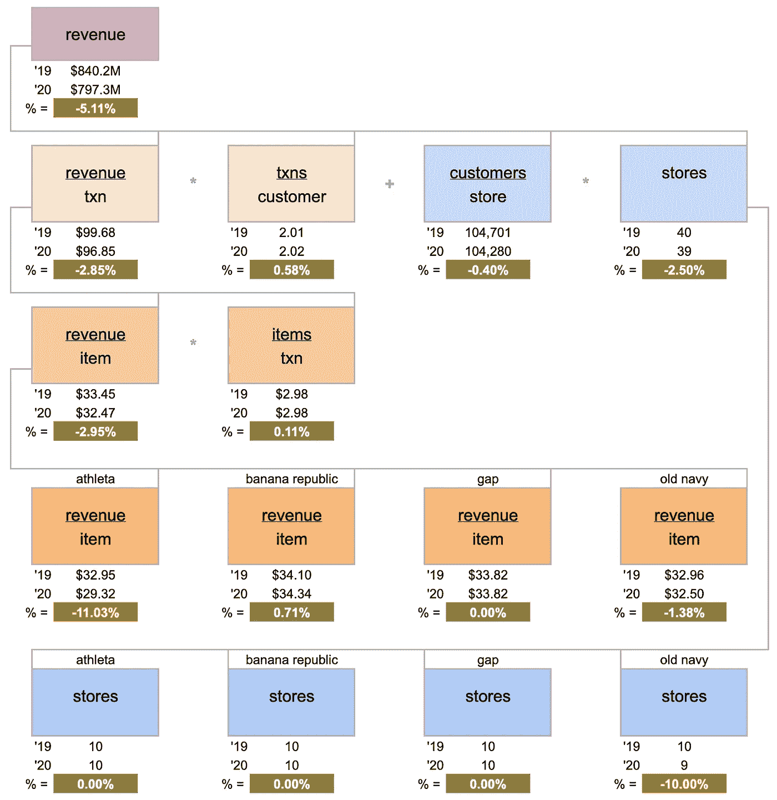

# 用于根本原因分析的 KPI 树

> 原文：<https://towardsdatascience.com/kpi-trees-for-root-cause-analysis-59e8d930544a?source=collection_archive---------24----------------------->

KPI 树是了解系统性能变化的一个非常强大的工具。它非常容易实现，并且具有广泛的应用范围。这里我们来看两个例子:

1.  在线实验中每个用户的收入下降，以及
2.  Gap Inc .年收入下降(模拟数据)

# 在线 A/B 测试

我们正在进行 A/B 测试，注意到每位客户的收入下降了 13%。

以下是我们正在收集的数据示例:

我们注意到:

*   每个客户的收入=每个篮子的收入*每个客户的篮子
*   每个购物篮的收入=每个项目的收入*每个购物篮的项目
*   每个购物篮中的项目可以根据项目是从哪个页面添加的进一步细分，这里是:浏览页面、主页或搜索。

现在我们可以构建 KPI 树了:

每个客户的收入下降最终是由测试变体中从搜索中购买的商品减少所驱动的

所以我们得出结论:

1.  每客户收入的下降(-13%)是由每篮子收入的下降(-14.22%)推动的
2.  每篮子收入的下降是由每篮子商品数量的下降推动的(-13.65%)
3.  每个购物篮中商品数量的下降主要是由测试变量中从搜索中添加的商品数量的下降(35.48%)造成的

# 零售店同比业绩

Gap Inc .的销售额下降了 5.1%，管理层希望了解原因。

这是销售数据的一个例子:

我们注意到:

*   收入=每个客户的收入*客户
*   每个客户的收入=每个交易的收入*每个客户的交易
*   顾客=每家商店的顾客*商店数量
*   每笔交易的收入=每项收入*每笔交易的项目
*   如果需要，我们可以按品牌进一步划分这些指标

同样，我们可以构建 KPI 树:

收入下降是由于 a)Athleta 的平均商品价格下降，以及 b)一家旧海军商店的关闭

因此，总之，(模拟)收入的下降可以追溯到两个非常具体的原因:一个老海军商店的关闭，加上 Athleta 商店平均商品价格的下降。

KPI 树在将原始数据转化为既可解释又可操作的故事方面非常强大。正如这里所展示的，它们也有广泛的应用。在你的工作中享受使用它们的乐趣！

## 原始数据+视觉效果

[https://docs . Google . com/spreadsheets/d/1 akudtnb _ wf 37 wjof 6 lvbd 7 cyosikn 7 io ycs 8 ubz 5 vji/edit？usp =共享](https://docs.google.com/spreadsheets/d/1akudtNb_WF37WjoF6lVBD7cYoSIKn7IOyCS8uBZ5VJI/edit?usp=sharing)

## r 脚本生成原始数据