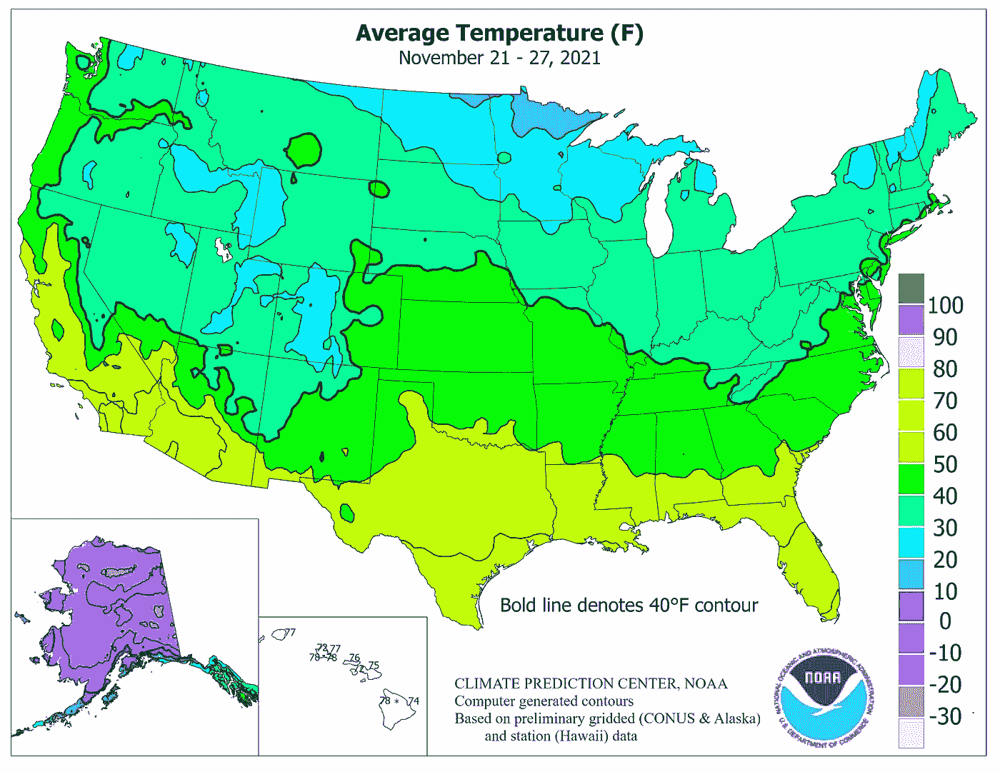
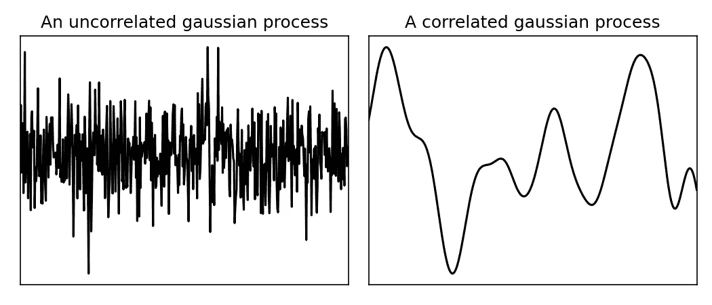
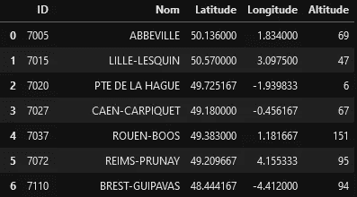
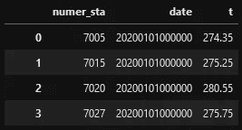
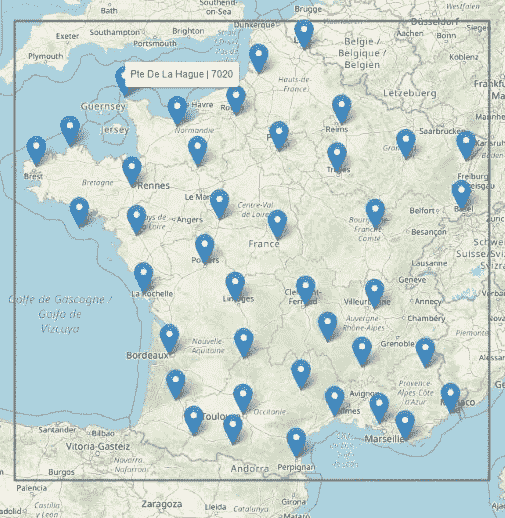
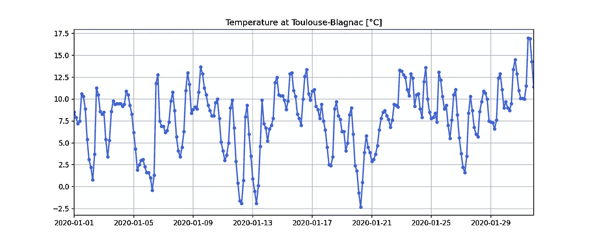
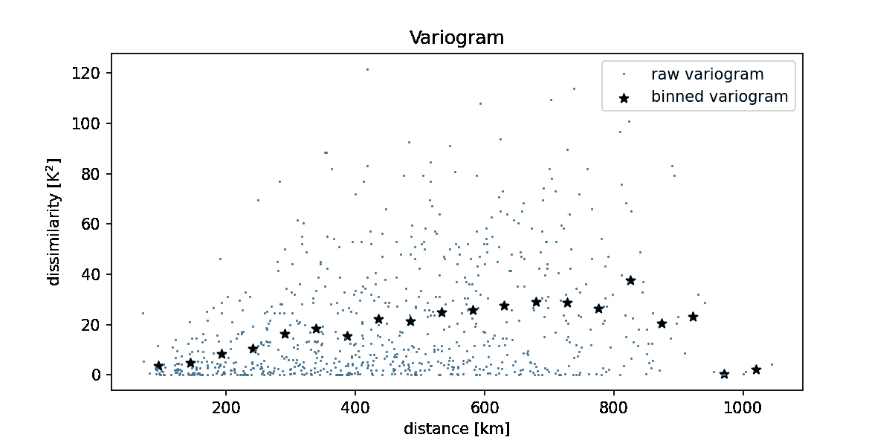
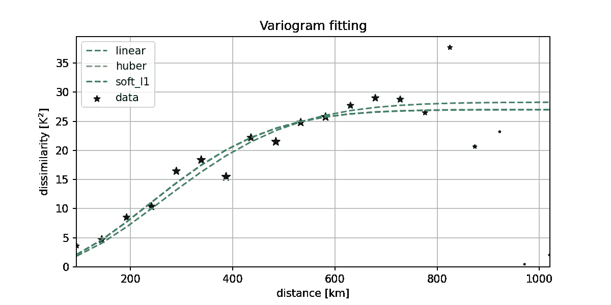
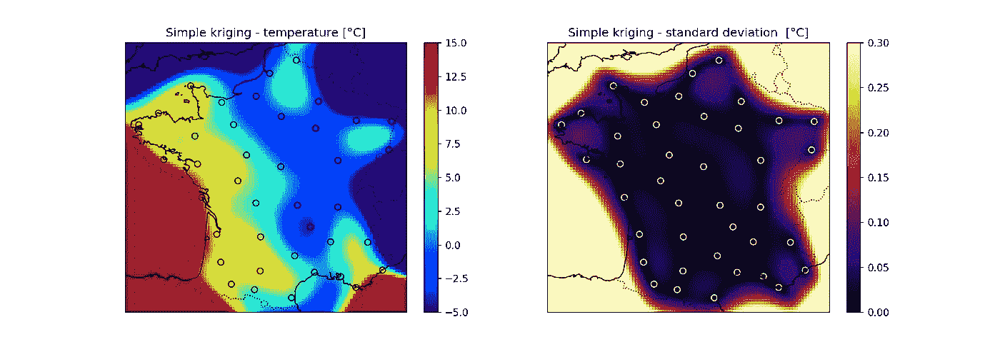
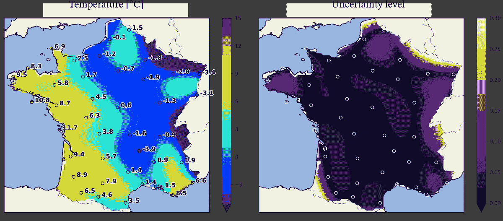

# 克里金法法国气温

> 原文：<https://towardsdatascience.com/kriging-the-french-temperatures-f0389ca908dd?source=collection_archive---------9----------------------->

## 简单克里金法教程，从开源数据到温度图可视化

美国典型的气温图——图片由国家气象局提供。

你有没有想过电视天气预报中的温度图是如何制作出来的？它们对我们来说似乎是显而易见的，因为我们已经如此习惯于每天观察它们。它们很容易阅读:地图上的每个像素用一种颜色(通常从蓝色到红色)表示温度水平，并让你知道你所在的地方明天会有多冷或多暖。

地图上的一个像素代表一个 10 公里 x 10km 公里的区域。为了创建地图，您的第一直觉可能是，在您的国家中，向北和向东每隔 10 公里安装一个气象站，收集所有的温度，然后为每个测量值绘制一个像素。

然而，你肯定不会每隔 10 公里就发现一个气象站。如果你住在农村，你可能离他们中的一个都很远！想想这个:例如法国大陆面积是 544000 平方公里。如果你需要每 10 公里 x 10km 公里一个站点，这实际上意味着必须部署 5440 个站点的网络，完美地网状覆盖整个国家。但这不是你在现实生活中会发现的:网络的几何结构既不规则，也不那么密集。

那么，如果气象站没有定期覆盖整个国家，如何创建温度图呢？这样做的技术一般被称为**插值**。总体思路如下:一个像素表示

*   或者是*精确的*测量值(如果一个站存在于其相应的地理坐标上),
*   或者是一个*插值*值，这意味着该值是基于附近站测量的“猜测”值。

## 如何插值温度？

在一个国家这么大的区域内(例如法国大陆)，有两个重要的事实需要记住。

*   想象你住在巴黎。你知道现在这里有多热。然而，仅凭简单的直觉，你无法准确猜测 650 公里外的马赛有多热。波尔多、图卢兹等也是如此。因此，我们可以说**温度在长距离**上变得*随机*…
*   …现在，如果你还在巴黎，你可以准确地猜出几公里外的巴黎有多热(例如 T21 的凡尔赛宫或巴黎)，因为你知道那里的气温几乎一样。事实上，我们可以合理地说，在短距离上，温度场是高度相关的。物理学表明它是空间的连续函数。

通过适当的概率模型，解释具有这两个特征的物理模型(*随机性*和*空间相关性*)是可能的。其中使用最多的叫做**高斯过程。**

图 1 —比较两种高斯过程:不相关(左)和局部相关(右)。图片作者。

如果没有相关性，该过程只是具有独立样本的高斯噪声。但是如果该过程与相邻样本相关，那么该过程就变得平滑了！

正是这种平滑性让我们可以进行插值。实际上，假设该场仅在 20 点处测量。有可能在这些点之间插入场吗？

图 2-通过简单克里金法在线上进行插值。图片作者。

**答案是肯定的！正如你在上面看到的，这 20 个点的插值有助于提供真实场的一个很好的猜测。这里使用的插值方法称为**克里金法**【1，2，3】。请注意，在已知样本数量和插值精度之间存在权衡。在测量点较少的区域，插值具有更多的*不确定性*，并且可能不太准确。然而，在已知值的点上不确定性为零。**

# 这篇文章的目的

在这里**我给出了基于开源数据通过克里金法**制作你自己的温度地图的简单指南。在本文中，我宁愿**远离数学**，因为许多资源已经很好地完成了这项工作【1，2，3，4】。我的目的不是介绍高斯过程和克里金法的理论，而是给你一个从数据预处理到可视化使用这些工具的实用教程。

[**在我的 GitHub 页面上可以找到重现结果的完整 Python 笔记本。**](https://github.com/cvanwynsberghe/tds-kriging)

> 声明:我不是气象学家，本教程只不过是信号处理爱好者的游乐场！尽管 T21 提到了克里金法在温度、湿度、风和压力的处理中的应用，但我不知道我在制作专业级地图时所做的所有误导性的近似。

# 教程

在本教程中，我们将制作一张法国大陆的温度地图，其中[的开源数据由法国梅特奥公司](https://donneespubliques.meteofrance.fr/)提供。我们将关注免费的资源:[概要数据库，每 3 小时更新一次](https://donneespubliques.meteofrance.fr/?fond=produit&id_produit=90&id_rubrique=32)。

我鼓励你同时下载并关注[Python 笔记本](https://github.com/cvanwynsberghe/tds-kriging)。

## A.获取数据

首先，您需要两个下载 2 csv 文件:

*   [站点列表](https://donneespubliques.meteofrance.fr/donnees_libres/Txt/Synop/postesSynop.csv)及其地理坐标和唯一标识符(ID)，

图 SYNOP 台站的 csv 表。图片作者。

*   一个文件包含所有站点的温度时间序列。每个时间序列包含一个月内每 3 小时一个点。这里,“numer_sta”索引对应于上表中的“ID”。

图 4-每个站点每 3 小时一个月的 csv 温度文件。图片作者。

首先，过滤表中的电台以保留进入大陆的电台。让我们用[叶](https://python-visualization.github.io/folium/)在地图上显示他们的位置。

图 5-保留的天气观测站。温度将被插值到灰色矩形内。图片作者。

我们还预测我们希望绘制地图的界限。让我们暂时选择灰色矩形，并保留一点额外的土地。

在唯一标识符的帮助下，可以获取一个特定站点的数据点。例如，“图卢兹-布拉尼亚克”由数字 7630 标识。

图 6-2020 年 1 月图卢兹-布拉尼亚克温度时间序列。图片作者。

我选择了 2020 年 1 月的档案，但你可以选择任何你想要的月份。**小心:**有些存档文件包含 [NaNs](https://en.wikipedia.org/wiki/NaN) ，可能是因为站点或通信链路有时会出现故障。

**从现在开始，**我们还必须选择一天的&小时来关注，因为地图只描述了一个特定时间的空间波动。以下处理后的数据对应于 2020 年 1 月 1 日凌晨 3 点。

## B.选择相关的高斯过程模型

克里金之前至关重要的一步是选择好概率模型，因为整个克里金插值都依赖于它。记住高斯过程的两个特征:**随机性**和**空间相关性**。

信号的随机性是你天生无法捕捉的。但是，您可以根据数据预测信号的空间相关性。如果你想象两点之间的距离*对这两点的温差*，你会得到一个叫做**变差图**的图。

图 7-2020/01/01 凌晨 3 点的变差函数。图片作者。

我所称的温度“差异”实际上对应于图 7 中的恒定平方差——如果你想掌握总体思路，这仍然是一个细节。**此处最重要的**是您可以通过变异函数的分析函数进行回归，从该点云中获取空间相关性的级别。

图 8-变异函数回归。图片作者。

存在不同的分析变异函数，正确选择其中一个函数需要一些经验…我选择了高斯核函数的“默认”选择[3，幻灯片 22]来描述空间相关性。

## C.通过简单克里金法对温度进行插值

一旦选择了高斯过程模型，我们就拥有了进行克里金法的所有元素。基本上，您需要的输入是:

*   采样点的测量值，
*   采样点的几何坐标，
*   要插值的目标点的几何坐标，
*   “校准的”概率模型，具有通过步骤 b 中的数据获得的空间相关性

由此，克里金法给出了两个输出:

*   目标点处的估计值，
*   目标点的估计不确定性(估计理论中称为*方差*)。

笔记本中给出了进行简单克里金法的代码，如果你想了解估计量是如何导出的，我再次鼓励你阅读[1，第 6 章]。如果你很好奇，想尝试不同的克里金法，看看 [PyKrige](https://geostat-framework.readthedocs.io/projects/pykrige/en/stable/) ！

## D.在地图上画画

为了用 Python 轻松绘制地图，我使用了 [cartopy](https://scitools.org.uk/cartopy/docs/latest/) 和 matplotlib。Cartopy 自动绘制国家，边界和海洋。更重要的是，它在 matplotlib 图形中创建适当的投影，以便绘制由经纬度坐标引用的地图。因此，不需要在笛卡尔坐标系和地理坐标系之间进行任何繁琐的转换。

下面是期望值(左)和标准差(右)的原始结果，标准差是方差的平方根。

图 9-原始结果:简单克里金法插值(左)和标准偏差不确定性水平(右)。图片作者。

你可以看到地图在大陆内看起来很好。然而，一旦插值点远离采样点，获得的值很快就变得毫无意义，不确定性水平飙升。

这是正常的:克里金法擅长在采样区域内进行插值，但在采样区域外却非常糟糕。请记住，高斯过程首先是一个随机过程！只要内插点被附近的采样点很好地包围，空间相关性就有帮助。然而，自然不可能在离每个采样点太远的地方进行估计。

最后，我裁剪了法国以外的地图部分，因为克里金值与该地区无关。为此，你需要[划定国家](https://github.com/gregoiredavid/france-geojson)边界的多边形，[找到位于这个多边形](https://automating-gis-processes.github.io/2016/Lesson3-point-in-polygon.html)内的所有地图点。最后，我使用等高线而不是连续的色图来观察温度四舍五入到最接近的程度。

图 10-最终结果:简单克里金法插值(左)和标准偏差不确定性水平(右)。图片作者。

## 参考

[1]安德烈亚斯·利希滕斯特恩。 [*空间统计中的克立格方法*](https://mediatum.ub.tum.de/1173364) (2014)。【2】鲁道夫·勒·里奇。 [*克里金法简介*](https://hal.archives-ouvertes.fr/cel-01081304) (2014)。鲁道夫·勒·里奇。 [*克里金法概述*](https://hal.archives-ouvertes.fr/cel-02285439v2) (2019)。
【4】渔歌诗。 [*高斯过程，不太适合假人*](https://yugeten.github.io/posts/2019/09/GP/) (2019)。