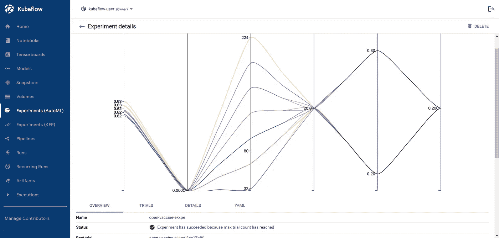

# Kubeflow 1.3 会让你爱上 MLOps

> 原文：<https://towardsdatascience.com/kubeflow-1-3-will-make-you-fall-in-love-with-mlops-cf68131193f9?source=collection_archive---------11----------------------->

## 利用新的 Kubeflow 功能来加速您的机器学习模型工作流。

[HalGatewood.com](https://unsplash.com/@halacious?utm_source=unsplash&utm_medium=referral&utm_content=creditCopyText)在 [Unsplash](https://unsplash.com/s/photos/plan?utm_source=unsplash&utm_medium=referral&utm_content=creditCopyText) 上拍照

Kubeflow 是一个开源项目，致力于使 ML 项目的部署更加简单、可移植和可伸缩。来自[的文档](https://www.kubeflow.org/):

> Kubeflow 项目致力于使在 Kubernetes 上部署机器学习(ML)工作流变得简单、可移植和可扩展。我们的目标不是重新创建其他服务，而是提供一种简单的方法来将 ML 的最佳开源系统部署到不同的基础设施上。无论你在哪里运行 Kubernetes，你都应该能够运行 Kubeflow。

库伯流 101

Kubeflow 由许多组件组成，您可以结合使用或作为独立工具使用:

*   [**笔记本服务器**](https://www.kubeflow.org/docs/components/notebooks/why-use-jupyter-notebook/) 让您置身于一个熟悉且可扩展的工作环境中。
*   [**kube flow Pipelines**](https://www.kubeflow.org/docs/components/pipelines/overview/pipelines-overview/)**使您能够基于 Docker 容器构建和部署可移植和可扩展的机器学习(ML)工作流。**
*   **[**MLMD**](https://www.kubeflow.org/docs/components/metadata/)**方便了跟踪和管理您的实验产生的元数据的过程。****
*   ****[**Katib**](https://www.kubeflow.org/docs/components/katib/overview/)**通过超参数调优和神经架构搜索优化你的模型。******
*   ******[**KFServing**](https://www.kubeflow.org/docs/components/kfserving/)**允许您毫不费力地将模型作为可伸缩的 API，甚至可以发布金丝雀版本。********

******这些组件是 Kubeflow 的主要支柱，当你将所有东西汇集在一起时，你所获得的力量是无与伦比的。******

******本周，Kubeflow 1.3 候选版本(1.3-rc)上线了，这个故事将带您了解这个主要且功能丰富的版本中的新内容。******

> ******[Learning Rate](https://www.dimpo.me/newsletter?utm_source=medium&utm_medium=article&utm_campaign=kubeflow_13) 是为那些对 AI 和 MLOps 的世界感到好奇的人准备的时事通讯。你会在每周五收到我关于最新人工智能新闻和文章的更新和想法。订阅[这里](https://www.dimpo.me/newsletter?utm_source=medium&utm_medium=article&utm_campaign=kubeflow_13)！******

# ******Kubeflow 1.3 的新增功能******

******正如我们所说，Kubeflow 1.3 是一个重要的功能发布，它旨在使 Kubeflow 更接近数据科学家，使其成为在 Kubernetes 上进行 ML 的首选。******

******首先，有新的和更新的用户界面(ui)。有人会说*“如果没有用户界面的改变，那么就没有更新。”*这当然是个笑话；然而，Kubeflow 1.3 为 Katib 引入了一个更新的皮肤，其中充满了关于您的超参数调优实验的细节。******

************

******Katib 更新的用户界面******

******另一个新增功能是卷管理器，它让您可以从图形用户界面管理您的存储。最后，Tensorboard Web 应用程序使您能够可视化您的训练过程产生的日志，并做出明智的决策。******

******其他主要特性包括更新的图像和对新 ide 的支持。Tensorflow 2.0 和 PyTorch 的新示例图像让您快速入门，同时引导一个安全稳定的工作环境，而 Visual Studio Code 和 R Studio 等新 ide 让您有宾至如归的感觉。******

******最后，对 KFServing 进行了许多改进；现在，通过流量分流创建金丝雀部署比以往任何时候都更容易。现在，您将能够以一种受控的方式推出对您的模型的更新，从而实现从试运行到生产的平稳过渡。******

******其他改进包括:******

*   ********多模型服务:**同一基础设施上的更多模型******
*   ******Pod affinity:** 避免不必要地使用 GPU 加速器或大型 CPU 节点****
*   ******gRPC 支持:**消息越少，KFServing 工作负载的带宽越少****
*   ******Katib 试用模板:**简化定制模型的超参数调整设置****
*   ******Katib 提前停止:**停止无效的超参数调整试验****
*   ******管道步骤缓存:**重用以前运行的步骤的结果****
*   ******多用户管道:**非 GCP 环境的用户和资源隔离****
*   ****清单重构:简化了 Kubeflow 的安装和升级****
*   ******Istio 升级:**改进的安全性、第 2 天操作、兼容性和支持****

****如果您想在不到 10 分钟的安装时间内轻松开始使用 Kubeflow，请查看以下故事:****

****</kubeflow-is-more-accessible-than-ever-with-minikf-33484d9cb26b>  </kubeflow-is-your-perfect-machine-learning-workstation-91c5d26d4790>  </mini-kubeflow-on-aws-is-your-new-ml-workstation-eb4036339585>  

在有了一个有效的 Kubeflow 安装之后，您可能想尝试几个例子。一个很好的方法是遵循下面的教程之一:

*   [从笔记本到 Kubeflow 管道](/jupyter-is-ready-for-production-as-is-b36f1d1ca8f8)
*   [数据集版本化和管理](/the-way-you-version-control-your-ml-projects-is-wrong-42910cba9bd9)
*   [在 Kubeflow 中调试](/how-to-use-time-travel-to-debug-your-ml-pipelines-efb5263372c0)
*   【Katib 和 Kale 简化了超参数调整
*   [在 Kubernetes 上为模特服务的最简单方式](/the-simplest-way-to-serve-your-ml-models-on-kubernetes-5323a380bf9f)

# 结论

Kubeflow 是一个开源项目，致力于使 ML 项目的部署更加简单、可移植和可伸缩。

几天前，Kubeflow 1.3 候选版本上线了，这个故事将带您了解这个主要且功能丰富的版本中的新内容。

新的用户界面、工具、库集成和安全升级使 Kubeflow 1.3 成为迄今为止最好的版本。新的 MiniKF 版本将在几周内发布，为您的本地工作站带来 Kubeflow 的新功能。我等不及要看你会用它做什么了！

## 关于作者

我叫 [Dimitris Poulopoulos](https://www.dimpo.me/?utm_source=medium&utm_medium=article&utm_campaign=kubeflow_13) ，我是为 [Arrikto](https://www.arrikto.com/) 工作的机器学习工程师。我曾为欧洲委员会、欧盟统计局、国际货币基金组织、欧洲央行、经合组织和宜家等主要客户设计和实施过人工智能和软件解决方案。

如果你有兴趣阅读更多关于机器学习、深度学习、数据科学和数据运算的帖子，请在 Twitter 上关注我的 [Medium](https://towardsdatascience.com/medium.com/@dpoulopoulos/follow) 、 [LinkedIn](https://www.linkedin.com/in/dpoulopoulos/) 或 [@james2pl](https://twitter.com/james2pl) 。请访问我的网站上的[资源](https://www.dimpo.me/resources/?utm_source=medium&utm_medium=article&utm_campaign=kubeflow_13)页面，这里有很多好书和顶级课程，开始构建您自己的数据科学课程吧！****