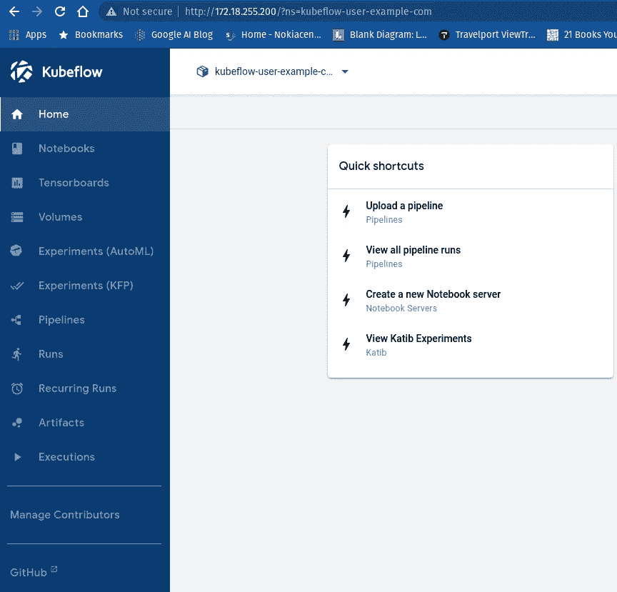
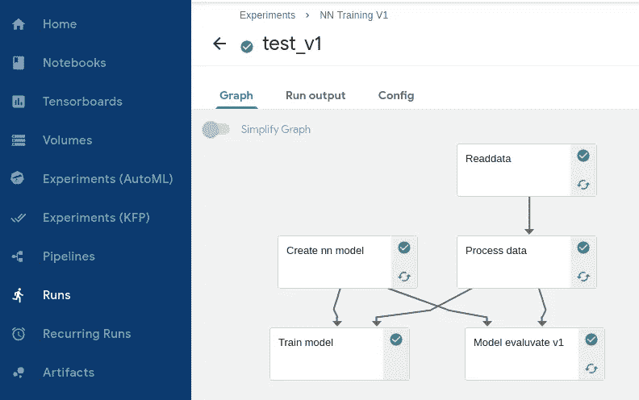
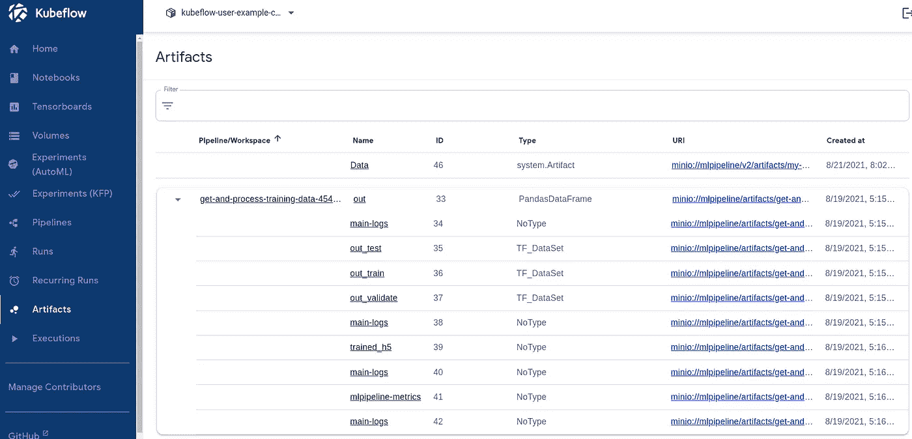
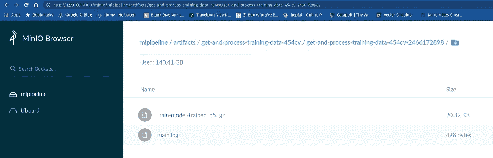
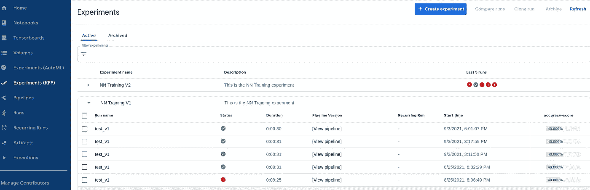

# 库伯弗洛:一个 MLOps 的观点

> 原文：<https://towardsdatascience.com/kubeflow-an-mlops-perspective-17d33ac57c08?source=collection_archive---------8----------------------->

## [行业笔记](https://towardsdatascience.com/tagged/notes-from-industry)

## ML 管道和 ML 组件

## MLOps 和 DevOps —连接

在设计新技术时，几乎总是会做出牺牲一些特性来换取另一些特性的选择。理解这些选择以及它们如何影响或不影响您的用例是很重要的。通常，当选择技术或框架而不是其他技术或框架时，这样的研究永远不会完成；或者有时候没有选择。

例如，我们有像 Kubernetes 这样设计良好的平台，无论是最具技术性的，都不会出错；或者至少。当然，虽然它仍在发展中，对于硬多租户之类的事情可能有更好的解决方案，但现在一般用户并不太关心这些。它已经成为任何云原生应用的事实上的执行引擎。

这导致了传统软件开发的许多变化。而不是编译一个或多个操作系统的源代码并为其创建安装程序或打包程序；开发人员需要将他们的代码容器化，并创建相关的人工制品——如服务、配置图、秘密；入口和 Kubernetes 特定标记语言(YAML)中的类似内容。现在这已经成为惯例和常规。

对于一个开发者来说；将您的微服务包装在容器中，并部署在 pod 中；保证它将执行相同的操作；在任何有足够资源的 Kubernetes 集群上。人们不必担心 pod 联网或调度的内部复杂性，也不必担心与控制组或名称空间等相关的 Linux 内部问题。当然，这是一种简化；就好像你正在安装一个主机卷，并对底层的 Linux 操作系统做了一个假设，那么这样的假设可能会被打破；但是这些都是离群值，而不是技术必须使用的方式。

这是件好事。您希望其他技术也有类似的抽象；比如数据库；如果不了解数据存储的内部原理；人们可以有效地存储和检索数据。例如，为快速访问而存储的 DB 可能不擅长快速更新；令人惊讶的是，许多开发人员并不知道；直到特性需求中途暴露出系统的隐藏特征。基本上，当系统被用于其设计的用例时，系统开始以一种意想不到的方式运行。

所有这些因素与我们要讨论的内容有什么关系？

我们在 Kubeflow 中寻找的是抽象的无泄漏性——借用 [*乔尔·斯波尔斯基*](https://www.joelonsoftware.com/2002/11/11/the-law-of-leaky-abstractions/) *的一个术语。*

借用一个被广泛使用或误用的陈词滥调，我们在 Kubeflow 中寻找的是“云原生”的程度。基本上，执行被安排在 Kubernetes 集群边缘集群或数据中心。此框被勾选，因为 Kubeflow 是为 Kubernetes 设计的。不像说 ml flow—[https://mlflow.org/](https://mlflow.org/)。其他竞争者 TFX，ZenML 截至目前

在我们进入 Kubeflow 之前，让我们检查一下它适合的环境。

MLOps 流程应该有助于确保 ML 项目的生产质量。

用您的 ML 项目制作一个容器并部署到 Kubernetes 上就足够了吗？还是有其他事情需要处理？CI 是怎么做的？测试是如何执行的？和测试评估？

来自一篇被大量引用的论文；似乎 ML 代码在生产中部署时意义最小。

来自这篇优秀博客的例子→[https://cloud . Google . com/architecture/mlops-continuous-delivery-and-automation-pipeline-in-machine-learning](https://cloud.google.com/architecture/mlops-continuous-delivery-and-automation-pipelines-in-machine-learning)


*管理信息系统的要素。改编自* [*隐藏在机器学习系统中的技术债务*](https://papers.nips.cc/paper/5656-hidden-technical-debt-in-machine-learning-systems.pdf) *。*

作者可能夸大了让我们注意到系统的其他部分，我们往往会错过；也可能不是。

作者可能会更多地考虑结构化数据和依赖于特性的经典 ML 方法；非结构化数据，比如音频、视频或图像分析和深度神经网络

MLOps 和 DevOps 一样，似乎又是一个术语，对许多不同的人以许多不同的方式表示许多不同的事情。我们需要定义我们所说的 MLOps 是什么意思。

DevOps 一般已确定更多地代表 CI/CD 部分-[https://aws.amazon.com/devops/what-is-devops/](https://aws.amazon.com/devops/what-is-devops/)；与开发人员对其组件进行端到端开发、部署和操作的原始概念相比，这是开发人员和他们的部署之间更多反馈的原则。这可能就像主动检查来自客户部署的错误日志，以发现可能的问题，甚至在错误出现之前。这肯定不仅仅是 CI/CD；尽管它与开发和管理文化的联系比技术过程更紧密。

毫不奇怪，现在许多公司都有一个“DevOps”团队来担当这一角色，为 CI/CD 提供工具和服务，并为更好地从部署中获得反馈提供工具和基础架构，如监控、日志记录等。

## MLOps —需要关注的几个主要特征

MLOps —类似于微服务的 DevOps。但是这有更多与 ML 相关的方面，不仅仅是算法，像数据和模型管理，模型版本控制，模型漂移等等。至少这是承诺，我们在这个领域有如此多的工具和服务，商业的和开源的，除非我们有一些选择标准，否则真的很容易混淆和陷入困境。

浏览[这里](https://github.com/EthicalML/awesome-production-machine-learning)或者[这里](https://landscape.lfai.foundation/?category=platform&grouping=category)你会得到一些想法；一些作者将这种扩散称为 MLOps 项目的[寒武纪大爆发](https://en.wikipedia.org/wiki/Cambrian_explosion)。然而，我们可以把它简化为几个主要阶段和许多相似的角色。像 Hadoop 生态系统这样的一些参与者已经相当老了，准备退出舞台，我们可以放心地忽略它。此外，类似的简单技术，如 S3 胜过更复杂的技术，如 Ceph。

我们在 MLOps 特定工具中寻找什么特征？

**云原生** —系统应该设计用于基于容器和 pod 的执行；而不是改装成和 Kubernetes 一起工作。气流的例子 XCom 可能不是最好的管道组件(容器)传递数据-[https://medium . com/the-prefect-blog/why-not-air flow-4c fa 423299 C4](https://medium.com/the-prefect-blog/why-not-airflow-4cfa423299c4)。类似的 MLFlow 可以被容器化，但可能不是最适合基于 Kubernetes 的系统。

**开源** —如果可以的话，我们不想被某个特定的供应商所束缚。这需要很多工具——像 Pachyderm 这样的数据管理工具

**ML 工程师易于整合—** 为 ML 问题创建 Jupyter 笔记本原型后，需要做大量工作才能投入生产。尽管如此，除了他们的业务领域——数据工程、模型开发和调优，我们不希望我们的 ML 工程师知道更多关于 Kubernetes、Docker 文件之类的东西。

**可扩展—** 这是云原生和基于 Kubernetes 的设计的一个特征。像分布式训练和全状态负载平衡这样的事情非常复杂，我们暂时不考虑这些事情。

## ML 工程和 ML 运营——不同的阶段

在我们继续之前，最好先看一下 MLOps 的主要阶段。工具会随着时间而变化，这更加主观[https://valohai.com/blog/the-mlops-stack/](https://valohai.com/blog/the-mlops-stack/)。

需要有一个好的**数据分析工具**或者 [OLAP 数据库](https://www.holistics.io/blog/the-rise-and-fall-of-the-olap-cube/)。类似于 Apache Presto 可以从多个数据存储或传统数据库中获取数据。类似于 Google BigQuery，但是在开源空间。数据科学家或 ML 工程师可以使用简单的 SQL 类型查询来分析大量数据；这对算法选择和进一步的 ML 工作将是重要的。

这本身就是一个完整的基础架构，但实际上可以被排除在 MLOps 之外，因为它更多地出现在(大)数据基础架构的预览中。我们可以把这个放在**数据工程**的一边，在以后的帖子里再讨论这个问题。有时 ML 项目可以从较少的数据开始；但是当收集和分析数据并用于更好地训练模型时，应该选择可扩展的数据分析系统。这里是生态系统的快照[https://raw . githubusercontent . com/Alex CPN/learn ove/master/ml flow . png](https://medium.com/data-science-engineering/data-engineering-for-machine-learning-5c6b53b31e12)

然后是**模型开发环境**以及相关的——语言和框架。例如，像 Pandas、Scikit Learn 这样的 python 库，以及编程语言——Python、R. ML 框架(如 TensorFlow 或 PyTorch)和数据格式(如简单的 CSV 或更高效的格式，如 Apache Parquet)。这部分将自己与开发环境联系起来，开发环境通常是 Jupyter Notebook。尽管大多数数据分析都基于 Python 及其库，但对于视频分析之类的东西，它可能是 C++、Go 和相关库——GStreamer、OpenCV 等。

每个从业者都清楚这一点。现在开始了一个在开始时看起来并不明显的部分。**模块化组件**通过数据流图或**管道连接。这正是像 Kubeflow 这样的项目适合的地方。为什么需要这样做？来自 Kubeflow 网站**

[https://www . kube flow . org/docs/about/kube flow/# the-kube flow-mission](https://www.kubeflow.org/docs/about/kubeflow/#the-kubeflow-mission)

> 我们的目标是通过让 Kubernetes 做它擅长的事情，尽可能简单地扩展机器学习(ML)模型并将其部署到生产中:
> 
> 在多样化的基础设施上进行简单、可重复、可移植的部署(例如，在笔记本电脑上进行试验，然后迁移到本地集群或云)
> 
> 部署和管理松散耦合的微服务
> 
> 基于需求的扩展

第一句话就说明了一切——**便捷**、**可重复**和**便携。**因此，我们不是创建一个整体的 python 代码或笔记本，而是将它分割成独立的组件；每个任务做一部分，这些步骤是可移植的——可以在其他项目中重用。我们正在创建 ***ML 微服务*** ，并使用工作流调度器来协调这些微服务。

这是 MLOps 画面的一个重要部分。通过管道，你可以确保不会形成一个整体。这里有一个类似堆栈的维护者的类似观点[https://towardsdatascience . com/why-ml-should-be-write-as-pipelines-from-the-get-go-b2d 95003 f998](/why-ml-should-be-written-as-pipelines-from-the-get-go-b2d95003f998)

Kubeflow 是否使创建这样的模块化 ML 组件变得容易和高效，我们将在后面看到。但是是的，它使事情变得简单；尽管效率不高，因为组件之间的所有数据都通过 Python pickle 机制序列化和反序列化到磁盘。因此，如果您编写的是普通 CSV 格式，而不是 Apache Parquet 格式；或者在代码中不使用 TFData 或类似的高效数据表示形式；你可以试试。通过像 GRPC 或 REST 这样的接口机制传递这一点不会太难，但是 Kubelow 必须将组件之间的输入/输出数据作为人工制品持久化。所以它也需要存储数据。

我们还需要什么对 MLOps 至关重要的东西。

**模型训练**——跟踪训练参数。真正的训练是通过 Tensorflow、Pytorch 等模型框架完成的；这里还有更复杂的框架，如 Horvod，它使用 MPI 等并行编程框架进行分布式培训[https://github.com/horovod/horovod](https://github.com/horovod/horovod)，或使用[https://developer.nvidia.com/nccl](https://developer.nvidia.com/nccl)进行基于 Tensorflow 的分布式培训。注意，对于像用于图像或视频分析的非常深的神经网络；培训将需要一个带有 CUDA 内核的 NVIDIA GPU ，而对于数据分析来说，CPU 可能就足够了。

**实验跟踪** —这可能有助于从历史上检查数据和模型的准确性、精确度、混淆矩阵或类似指标，并连接到测试集的模型验证阶段。也许在 ML 的 CI-CD 管道中比在开发中更有用。

**模型上菜—**TF 上菜，Seldon，KF 上菜之类的。最重要的是确保模型与应用程序分离，并且可以通过 CI/CD 进行版本控制和独立更新。另一件要注意的事情是，在媒体分析等用例中，通常需要将大量数据传递给模型。因此，模型和业务微服务应该位于同一个 Kubernetes 节点中，并通过负载平衡层进行扩展。

**模型监控—** 在传统的开发运维中，对运维或开发人员的反馈是通过矩阵进行的，这些矩阵是通过 [Prometheus](https://prometheus.io/) 或类似工具从部署中收集的，并显示在 [Grafana](https://grafana.com/grafana/dashboards) 仪表盘中。类似的方法也可用于模型监控。但是，为了检查模型的预测是否准确，应该在预测-分析循环中加入一些手动检查或操作员参与或客户反馈。或者更高级的 **A/B 测试**与其他模型，并使用复杂算法比较结果，如[多臂土匪](https://www.ijntr.org/download_data/IJNTR06090006.pdf)。还需要用可用的较新数据来验证模型，以检测模型漂移。模型监控无疑是更高水平的 MLOps 熟练度，这将需要非常强大的基础设施来实现。

**模型、数据和实验共享**——你需要在不同的团队之间有一个集中的、访问受控的共享；为此，需要一些模型或数据注册。

我还漏掉了其他部分。**模型调整**可能是其中之一，我们有流行的软件，如 Optuna 或 Katib。可能还有其他重要的原因，我现在还不知道。请在评论中注明。

## kube flow m lops 管道组件

Kubeflow 是一个伞状项目；有多个项目与它集成，一些用于可视化，如张量板，另一些用于优化，如 Katib，然后是用于训练和服务的 ML 操作符等。但主要指的是库伯流管道。这是 Kubeflow 项目的核心，管道任务集成到各种其他项目中。注意，Kubeflow 中的所有东西都运行在 Kubernetes 集群上。Kubernetes 是资源供应商和执行引擎。

Kubeflow 基于 Kubernetes。这是它的长处。然而，这意味着内部的一切都必须作为容器运行。

然而，让 ML 科学家或 ML 工程师接触通过 Docker 文件和 K8s 部署文件创建容器映像的复杂性并不是最佳选择。公司会有工程师团队来做这件事。但是，有没有一种方法可以促使 ML 科学家或 ML 工程师开发他们的 ML 程序作为谨慎的组件，而不需要他们了解太多的 Kubernetes 或容器技术？正如我们之前所描述的，这是库巴流的一个主要存在理由。

因此，我们要做的是采用常规的基于 Jupyter 笔记本的 ML 开发，并尝试将其转换为 Kubeflow 系统，但采用模块化的方式。

下面是我们借鉴的 Colab 项目[[1]https://Colab . research . Google . com/gist/Alex CPN/fa8b 3207 FBC 72 f 471 BDB 72433102344 c/heart attack-prediction-TF data . ipynb](https://colab.research.google.com/gist/alexcpn/fa8b3207fbc72f471bdb72433102344c/heartattack-prediction-tfdata.ipynb)

我们将使这款 Jupyter 笔记本符合 Kubeflow 标准。

**安装 Kubeflow**

Kubeflow 使用服务网格 Istio。这意味着设置这是一个挑战。这肯定会由“MLOps 团队”来完成。如果你有一台基于 Linux 的现代笔记本电脑；你可以使用[类](https://kind.sigs.k8s.io/)集群来设置。

请遵循这个；如果您还没有准备好 Kubeflow 集群，或者您想要使用 Kind cluster[https://gist . github . com/Alex CPN/f 7068 ba 5b 7205 e 75 b 955404 F2 fc 24427](https://gist.github.com/alexcpn/f7068ba5b7205e75b955404f2fc24427)在 Linux PC 或笔记本电脑上创建一个快速集群。

请注意，如果您使用的是 GKE 集群，请确保您的节点有足够的 CPU 和内存，因为部署中设置了资源请求。此外，如果你打算使用 GKE 自动驾驶模式，至少现在它不工作，因为 Istio 不被支持。

请注意，我们使用清单方法从 Kubeflow 清单报告安装 kube flow-`https://github.com/kubeflow/manifests`

**创建一个 Jupyter 笔记本**

如果您成功安装了 Kubeflow，您将在 Kubeflow 仪表板中获得一个 Jupyter 笔记本，在这里可以查看大多数默认的“组件”



## 任务一—连接到 Kubeflow 管道服务器

让我们创建一个 Jupyter 笔记本实例；以下代码用于连接 Kubeflow 管道服务器。

## 任务二——用 Python 代码创建一个 Kubeflow 组件

我们将使用`**create _ component _ from _ func _ v2**` SDK helper 方法来创建 Python 组件的部署

在这里列出 python 组件；

让我们更详细地看看这个组件。

**从 Python 函数创建组件并发布它**

我们在上面做的事情非常简单；接受一个 URL 并使用 Pandas 库读取一些数据。如果你看到原来的 Colab Jupyter 笔记本[【1】](https://colab.research.google.com/gist/alexcpn/fa8b3207fbc72f471bdb72433102344c/heartattack-prediction-tfdata.ipynb)你可以看到我们正在**将阅读部分拆分成不同的功能。**

这个函数有一个字符串类型的 URL 输入。因为这是 Python 中的内置数据结构，所以可以按原样提供。我们将输出一个熊猫数据帧作为输出。

一旦我们使它成为一个组件，它就成为一个容器映像，并在 Docker 中作为一个容器运行。所以所有功能的输入输出都需要通过某种接口。Kubeflow 使用文件接口-K8s 持久卷。Kubeflow (v1)有这个*输入路径和输出路径*组件助手函数，它接收数据并使用 Python [pickle](https://docs.python.org/3/library/pickle.html) 函数序列化到磁盘。

请注意，您可以将 PVC 附加到组件上并向其写入。但这违背了库伯流使用原则；因为添加 PVC 的那一刻，组件不再变成**不可重复使用**。您可能需要将此用于外部可视化，如张量板可视化。

完整代码在这里

[https://colab . research . Google . com/drive/1f _ p 4 evkret 57j 4 maz 4 vrfhccj _ qvv 03 w？usp =共享](https://colab.research.google.com/drive/1f_p4EVKReT57J4Maz4vRfhccJ_qVv03W?usp=sharing)

以下片段:

让我们看看这个组件是如何创建的。如您所见，基础映像和要安装的包在*create _ component _ from _ func*方法中给出，Rest 是 Kubeflow magic，用于创建 Pod 部署。

您可以在这个 Kubeflow 仪表板快照中看到输入和输出是如何表示的

注意，我也可以把它写到一个组件中，并说把它放在一个组件存储中，然后从存储中加载组件

我刚刚把这个上传到 gist，你可以看到我从 URL 中读取的第二个片段。任何有权访问的人都可以通过将输入数据更改为他们自己的数据，为他们的流重用相同的组件。

其他[组件](https://gist.github.com/alexcpn/e9a0c4bd79ae59ac8e822c121fbcce80)遵循类似流程。

**将元件接线在一起**

现在让我们看看这些组件是如何连接在一起的。

在第二个代码片段中，您可以看到 *read_data* 输出通过管道传输到 *process_data* 的输入

让我们看看在 *process_data* 函数中发生的奇迹

```
#Lets use output or target as preiction label
def process_data( pandas_parquet: InputPath("PandasDataFrame"),
                 out_train_path: OutputPath("TF_DataSet"),
                 out_test_path: OutputPath("TF_DataSet"),
                out_validate_path:OutputPath("TF_DataSet")
                ):
    import pandas as pd
    import sklearn as sk
    import numpy as np
    import tensorflow as tf

    from tensorflow import keras
    from tensorflow.keras import layers
    from tensorflow.keras.layers.experimental import preprocessing
    from sklearn.model_selection import train_test_split

   ** df = pd.read_parquet(pandas_parquet)**
```

我们读入拼花文件作为输入，并转换成熊猫数据帧。所以是的——没有魔法；类似地，您可以看到我们在一个组件中取出 h5 Keras 模型，并在另一个组件中读取该模型。

这是您在必须分成不同组件时所做的权衡。也许 Kubeflow 的未来版本会为其中一些提供 GRPC 接口，这可能会加快速度。但是这个例子也是一个玩具例子，你不需要把所有东西都分成组件。

**数据流的可视化**

Kubeflow 提供了数据流的交互式下钻可视化。如果豆荚还在 Kubernetes，你可以看到豆荚日志。T



投入/产出假象在 S3 持续存在。Kubeflow 默认运行基于 Minio 的 S3 存储桶。



您可以通过端口转发直接访问 Minio

```
kubectl port-forward svc/minio-service -n kubeflow  9000:9000
```

默认-minio/minio 123



有点像穷人的藏物店。注意，你也可以用它来输出张量板矩阵；尽管我还不能连接运行在名称空间中的 Tensorboard Pod，以便从仪表板 UI 正确地到达 S3 URL。

**实验可视化**

Kubeflow V1 管道中组件的输出可以从仪表板中可视化。然而，到目前为止，它还不是一个非常强大的 GUI。在 V2 版本中，似乎对此有更好的支持；然而，我测试过的版本似乎有问题(库伯弗洛 V2 正在测试中)

和输出



您也可以在运行之间进行比较；在你暴露的矩阵上

**优化**

Kubeflow 内部整合了 Katib 但是需要用 docker 容器等指定完整的 YAML 文件-[https://www.kubeflow.org/docs/components/katib/experiment/](https://www.kubeflow.org/docs/components/katib/experiment/)。与 Optuna 不同，我猜 Katib 首先是 Kubernetes，因此很复杂。

**参考**

[https://cloud . Google . com/architecture/mlops-连续交付和自动化-机器学习管道](https://cloud.google.com/architecture/mlops-continuous-delivery-and-automation-pipelines-in-machine-learning)