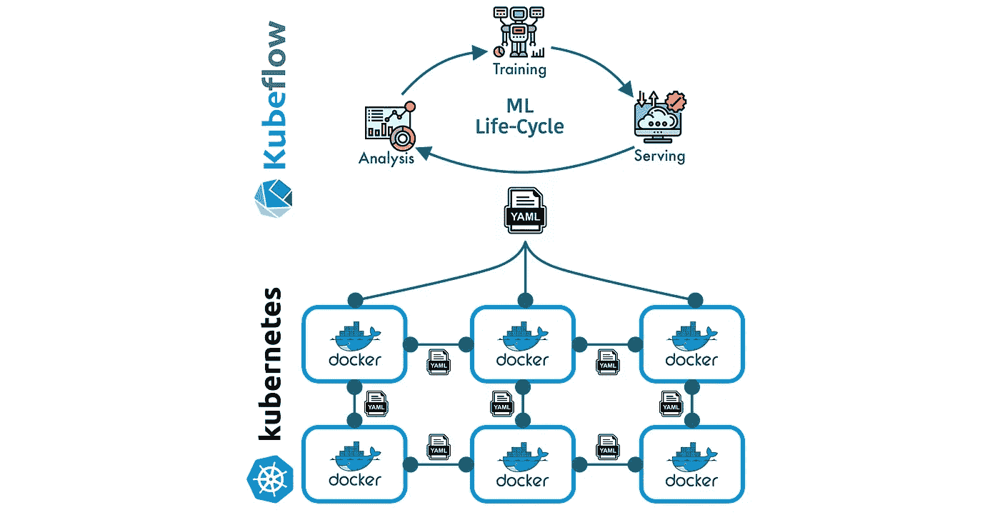
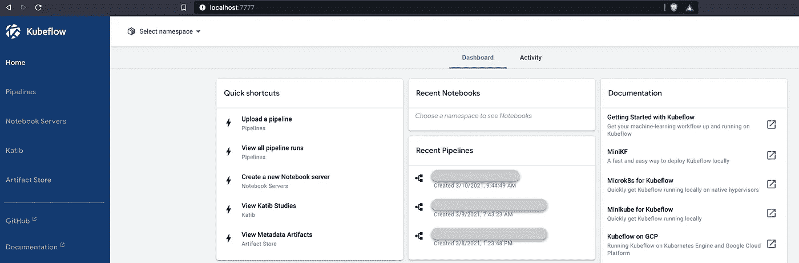

# Kubeflow:如何在本地机器上安装和启动 Kubeflow

> 原文：<https://towardsdatascience.com/kubeflow-how-to-install-and-launch-kubeflow-on-your-local-machine-e0d7b4f7508f?source=collection_archive---------7----------------------->

## 在本地机器上安装和配置每个 kubeflow 组件的分步指南。



图一。Kubeflow & Kubernetes 互动|作者图片|图标由[桉树](https://www.flaticon.es/autores/eucalyp)制作

Kubeflow [ [1](https://www.kubeflow.org/) ]是 google 开发的一个开源平台，用于包含机器学习模型开发生命周期。Kubeflow 由一套工具组成，这些工具处理构成机器学习生命周期的每个阶段，例如:*数据探索*、*特征工程*、*特征转换*、*模型实验*、*模型*、*训练、模型评估、*、*模型调优*、*模型服务*和*模型版本化*。kubeflow 的主要属性是它被设计为在 kubernetes [ [2](https://kubernetes.io/) ]之上工作，也就是说，kubeflow 利用了 kubernetes 集群提供的好处，比如*容器编排*和*自动伸缩*。

虽然 kubernetes 是容器编排的标准技术，但对于*数据科学家*或*机器学习工程师*来说，直接在 kubernetes 集群中配置和协调*机器学习生命周期*的每个阶段可能是一个复杂而耗时的过程。因此，kubeflow 作为一个平台，提供了在 kubernetes 集群**，**中配置、开发、自动化和部署机器学习生命周期的每个阶段的工具，避免了*数据科学家*或*机器学习工程师*花费时间直接在 kubernetes 集群中配置和应用更改。

在这篇博客中，我们将了解如何在您的本地机器上安装和配置 kubeflow，以便能够在本地使用 kubeflow，而不需要云提供商。因此，本博客将分为:

*   **要求**
*   **Minikube 安装**
*   **Kubeflow 安装**
*   **创建 Kubeflow 项目**
*   **访问 Kubeflow 界面**

# 要求

要在我们的本地机器上安装和运行 kubeflow，我们需要一组基本组件。首先，我们需要一个 kubernetes 集群，kubeflow 服务将在这里安装*和部署*。由于 kubernetes 需要大量的资源，因此不建议在我们的本地机器上安装 kubernetes，建议为模拟 kubernetes 集群的*使用一个面向本地测试的更轻便的替代方案，在这种情况下，我们将使用 minikube [ [3](https://minikube.sigs.k8s.io/docs/start/) ](尽管还有其他替代方案，如: [microk8s](https://microk8s.io/) 、 [kind](https://kind.sigs.k8s.io/) 和 [k3s](https://k3s.io/) )。除了 minikube，我们还需要一个虚拟机管理程序，它将允许我们在我们的*小型集群*中生成虚拟环境，在这种情况下，我们将使用 hyperkit [ [4](https://minikube.sigs.k8s.io/docs/drivers/hyperkit/) ](尽管您可以使用其他替代产品，如 [VirtualBox](https://www.virtualbox.org/) 、linux 的 [kvm2](https://minikube.sigs.k8s.io/docs/drivers/kvm2/) 和 windows 的 [Hyper-V](https://docs.microsoft.com/en-us/virtualization/hyper-v-on-windows/about/) )，最后是 kubeflow 包。***

> *免责声明:因为我在 MacOS 上工作，所以使用的命令是针对那个操作系统的，但是在每个组件的文档中，你可以找到它在 Linux 或 Windows 上的对等物*

# *迷你库贝装置*

*要在 MacOS 上安装 minikube，只需键入:*

```
*$ brew install minikube*
```

*安装完成后，`kubectl`命令将被添加到`$PATH`中。`kubectl`是与 kubernetes 微型集群交互的命令。然后，我们将需要一个虚拟机管理程序来在我们的 kubernetes 小型集群中创建虚拟环境，为此我们将使用`hyperkit`，它可以按如下方式安装:*

```
*$ brew install hyperkit*
```

*很好，要启动我们的 kubernetes 小型集群，只需键入:*

```
*$ minikube start --driver=hyperkit*
```

*上面的命令将使用`hyperkit`作为虚拟环境的管理程序来初始化一个 kubernetes 小型集群。要验证我们群集的信息，让我们键入以下命令:*

```
*$ kubectl cluster-info*
```

*您将得到类似于以下的内容:*

```
*> Kubernetes control plane is running at [https://192.168.64.5:8443](https://192.168.64.5:8443)*
```

*很好，现在我们已经有了开始安装和配置 kubeflow 所必需的组件，让我们开始吧！*

# *库伯流装置*

*对于 kubeflow 的安装，我们将定义一些环境变量，我们将下载 kubeflow 项目，然后继续安装。那么，让我们定义一些变量:*

```
*$ PLATFORM=$(uname)
$ export PLATFORM
$ mkdir -p ~/bin
$ export KF_TAG=1.0.1
$ KF_BASE="https://api.github.com/repos/kubeflow/kfctl/releases"*
```

*`KF_TAG`变量指的是我们将要使用的图像版本，您可以使用最新的版本，在这种情况下，我将使用版本`1.2.0`。然后我们将定义`URL`，下载并解包项目，然后我们将把`kfctl`二进制文件移动到上一步中创建的二进制文件目录中。*

```
*$ KFCTL_URL=**$(**curl -s ${KF_BASE} |**\**
	      grep http |**\**
	      grep "${KF_TAG}" |**\**
	      grep -i "${PLATFORM}" |**\**
	      cut -d : -f 2,3 |**\**
	      tr -d '\" ' **)**
$ wget "${KFCTL_URL}"
$ KFCTL_FILE=${KFCTL_URL##*/}
$ tar -xvf "${KFCTL_FILE}"
$ mv ./kfctl ~/bin/*
```

*最后，我们将删除 kubeflow 包(不再需要保留它)，并将 kubeflow 路径`~/bin`(包含命令`kfctl`)添加到我们的`$PATH`:*

```
*$ rm "${KFCTL_FILE}"
$ export PATH=$PATH:~/bin*
```

*`kfctl`命令应该准备好了，为了测试它，我们将键入:*

```
*$ kfctl version
kfctl v1.2.0-0-gbc038f9*
```

*`kfctl`命令将允许我们与 kubeflow 组件进行交互，特别是定义清单并将其应用到我们的 kubernetes 集群。到目前为止，我们已经准备好 kuberentes 小型集群和 kubeflow 安装，接下来是使用`kfctl`命令生成我们的第一个 kubeflow 项目，让我们开始吧！*

# *创建 Kubeflow 项目*

*正如我们已经知道的，kubeflow 工作在 kubernetes 之上，因此两个平台之间的交互将通过*清单*或`yaml`文件进行。因此，为了生成 kubeflow 项目，我们必须通过一个`yaml`文件来完成，该文件定义了必须部署到 kubernetes 小型集群中的所有服务。*

*首先，我们将生成一些环境变量，这些变量定义我们将要安装的 kubeflow 版本，然后我们将定义 kubeflow 项目部署的每个服务的所有配置和`yaml`文件将被分配到的目录，最后我们将获得在我们的 kubernetes 小型集群中部署 kubeflow 项目的`yaml`。*

*因此，让我们定义一些与我们安装的 kubeflow 版本相对应的环境变量:*

```
*$ MANIFEST_BRANCH=${MANIFEST_BRANCH**:-**v1.2-branch}
$ export MANIFEST_BRANCH
$ MANIFEST_VERSION=${MANIFEST_VERSION**:-**v1.2.0}
$ export MANIFEST_VERSION*
```

*然后，我们定义项目名称并创建目录，每个服务的配置和`yaml`文件将被分配到该目录:*

```
*$ KF_PROJECT_NAME=${KF_PROJECT_NAME**:-**hello-kf-${PLATFORM}}
$ export KF_PROJECT_NAME
$ mkdir "${KF_PROJECT_NAME}"
$ pushd "${KF_PROJECT_NAME}"*
```

*然后，我们定义存储库，从中获取清单并将其分配给一个环境变量:*

```
*$ manifest_root=https://raw.githubusercontent.com/kubeflow/manifests
$ FILE_NAME=kfctl_k8s_istio.${MANIFEST_VERSION}.yaml
$ KFDEF=${manifest_root}${MANIFEST_BRANCH}/kfdef/${FILE_NAME}*
```

*正如您所看到的，我们使用的是`ISTIO`(kubernetes 的一个服务网格实现)的清单。最后，我们应用清单来部署我们的 kubeflow 项目。*

```
*$ kfctl apply -f $KFDEF -V*
```

*部署过程可能需要大约 30 分钟。*

*要验证安装是否成功，可以使用以下命令验证所有服务是否都处于`RUNNING`或`COMPLETED`模式。*

```
*$ kubectl get pods --all-namespaces -w*
```

*如果某些服务处于`error`状态，您可能需要为您的 kubernetes 小型集群(minikube)分配更多内存，并重新应用部署清单。如果一切进展顺利，我们现在可以在浏览器中查看我们的 kubeflow 项目了。让我们去吧！*

# *访问 Kubeflow 用户界面*

*由于我们是在本地服务器上安装，要访问 kubeflow UI，只需进行如下的端口转发:*

```
*$ kubectl port-forward svc/istio-ingressgateway -n istio-system 7777:80*
```

*上面的命令是用`kubectl`执行的，它公开了名称空间为`istio-system`的`istio-ingressgateway`服务的端口 7777，允许我们访问 kubeflow UI。最后，如果您转到:`http://localhost:7777`，您将被重定向到 kubeflow UI，如图 2 所示。*

**

*图二。Kubeflow UI |作者拍摄的屏幕截图*

# *结论*

*在这篇博客中，我们看到了如何下载、配置和安装 kubeflow 及其要求(在 MacOS 操作系统上)。*

*通过本教程，你将能够从 UI 开始与 kubeflow 进行交互。正如我们所看到的，kubeflow 提供了一套工具来开发机器学习模型的生命周期，在未来的博客教程中，我们将了解 kubeflow 的每个组件以及管道的生成！*

# *参考*

*[1] [Kubeflow](https://www.kubeflow.org/)*

*[2] [Kubernetes](https://kubernetes.io/)*

*[3] [迷你库贝](https://minikube.sigs.k8s.io/docs/start/)*

*[4] [Hyperkit](https://minikube.sigs.k8s.io/docs/drivers/hyperkit/)*