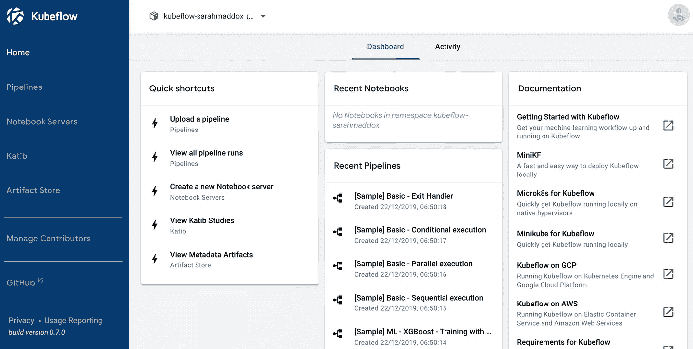
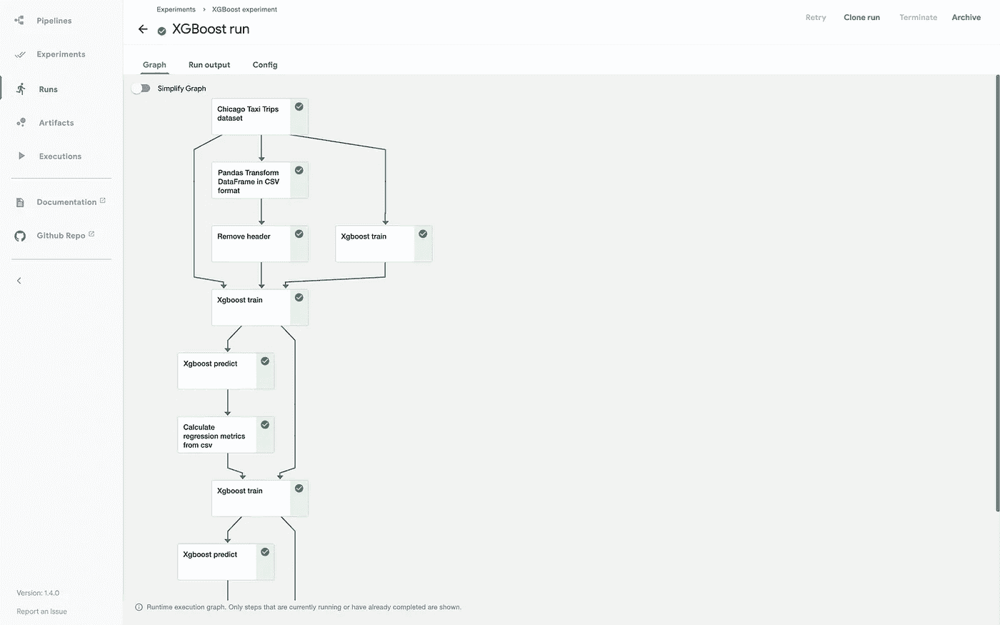
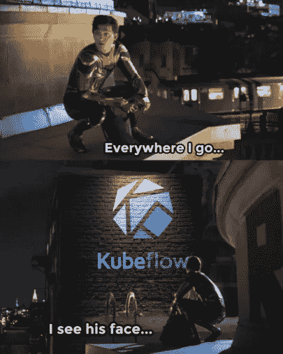

# Kubeflow(不是)为假人设计的

> 原文：<https://towardsdatascience.com/kubeflow-is-not-for-dummies-414d8977158a?source=collection_archive---------15----------------------->

## 在 EKS 部署和摧毁 Kubeflow 只需一个脚本，不费吹灰之力



图一。Kubeflow 仪表板(来源: [Kubeflow 文档](https://www.kubeflow.org/docs/components/central-dash/overview/)

工具、库、框架的创建是为了让我们的工作更容易。它们引入了新的功能，简化了代码，减少了样板文件，实现了自动化。

想象一下你的项目没有依赖关系，想象一下你需要用你自己的代码来替换一个函数调用(例如 *yaml.safe_load* )。所有这些工具都使应用程序更容易构建、维护、开发和部署。但是如果这些工具本身很难部署呢？哎哟。

# Kubeflow 简介

我不会说谎——在我写完工具很难部署之后，我马上介绍了 Kubeflow，这不是巧合。女士们，先生们，来认识一下 Kubeflow — **这是我多年来使用过的最流行也是最烦人的工具之一** (CMake，兄弟，我永远不会忘记你)。

[Kubeflow](https://www.kubeflow.org/) 是最近 ML 和 MLOps 领域最热门的东西之一，大约有 [30 个积极开发的存储库](https://github.com/kubeflow/)，拥有来自 GitHub 用户的近 20，000 颗星。*“Kubernetes 的机器学习工具包”*是否让你认为这是可能的，并做了几乎所有的事情？好吧，那你说得很对。Kubeflow 有几个关键组件:

*   使用 YAML 模板或 SDK 创建管道，使用 GUI(图 2)可视化管道执行及其结果，
*   Jupyter 笔记本服务器，
*   katib——超参数优化或神经结构搜索，
*   藏物店，
*   Dashboard(图 1) web 应用程序管理所有这些以及更多内容。



图二。Kubeflow 管道(来源:[管道快速启动](https://www.kubeflow.org/docs/components/pipelines/pipelines-quickstart/))

最重要的是，Kubeflow 运行在 Kubernetes 之上。因此，如果我们谈到 Kubeflow Jupyter 笔记本电脑，这些笔记本电脑运行在可扩展的 Kubernetes 集群中。Pipelines 和 Katib 也是。与目前可用和使用的其他工具相比，这提供了一个巨大的优势。如果你需要大规模训练和管理 ML 模型，当然可以。

用例的官方列表可以在 [Kubeflow 文档](https://www.kubeflow.org/docs/about/use-cases/)中找到。

# Kubeflow(不是)为假人设计的

与其他 ML 工程工具不同，例如 [MLFlow](https://mlflow.org/) 或 [DVC](https://dvc.org/) ，安装 Kubeflow 并不容易，而且 *pip install* 也不够。差远了。首先，您需要一个将部署 KF 的 Kubernetes 集群。这是你在项目中尝试 Kubeflow 的第一个障碍。

它既可以部署在本地集群中，也可以部署在云中。当然，在本地部署它有它的缺点(例如，资源有限)，但也可以便宜得多。在云中设置 Kubeflow 的成本会很高，尤其是如果有些事情不太对劲，并且您需要重复部署几次。

去过那里。我进行了几次尝试，最终在 AWS 云上设置了 Kubeflow(将其部署在亚马逊 EKS 集群中)。**试了几次，后来发现大约 70 美元。**


图 3。图片由 Ariel Biller ( [@LSTMeow](https://twitter.com/lstmeow) )提供

因此，在阅读了其他人像我一样努力部署 Kubeflow 后，我决定提出一个解决方案，让我在下次部署 KF 时能够最大限度地减少错误和工作量。我还希望清理环境像设置环境一样快速简单。

我做到了，现在让我来展示一下。

# 亚马逊 EKS +地形

尽管亚马逊 EKS 集群可以使用 AWS 控制台在几分钟内完成配置，但我决定选择另一种方式来完成，这样我就可以对自己创建(和删除)的资源有更多的控制。

遵循[基础设施即代码](https://en.wikipedia.org/wiki/Infrastructure_as_code)的方法，我使用 [Terraform](https://www.terraform.io/) 从零开始建立整个 EKS 集群，包括 EC2 实例、VPC 和其他必要的资源。由于这一点，我写了一次 Terraform 脚本，我就能够**建立基础设施，然后只用一个命令**就可以拆除它，我非常确定所有的资源都会被很好地清理。这样我周末不自觉留下的 EC2 就不会被收费了。

不仅如此，IaaC 还让我有可能在我的 [GitHub 库](https://github.com/mtszkw/kubeflow-deploy)中存储版本控制下的构建指令。我可以跟踪和恢复对基础设施所做的任何更改，如果我只是不停地点击亚马逊控制台 UI 中的按钮，这几乎是不可能的。

# 在 EKS 集群中部署 Kubeflow

一旦配置了 EKS 集群，Kubeflow 就可以最终部署到其中了。这可以使用 shell 从头到尾地完成，但是我需要做一些微小的改变来使它工作(例如，替换 YAML 文件中的区域或集群名，特别感谢 *sed* )。

如果你只是想拥有你的小游乐场(并且你不在乎隐私和良好的基础设施设计)，没有太多的变化要介绍。所有调整都保存在回购协议中我的 [delpoy_kubeflow](https://github.com/mtszkw/kubeflow-deploy/blob/main/aws-terraform/deploy_kubeflow.sh) 脚本中。

然后，可以使用脚本中的 [kfctl](https://github.com/kubeflow/kfctl) CLI 工具部署 Kubeflow。这需要几分钟时间，希望能顺利完成。当所有窗格和服务准备就绪时，您应该可以使用仪表板 UI 了。

类型

```
kubectl get service istio-ingressgateway -n istio-system
```

去看看哪里。当使用我的脚本进行部署时，Dashboard 在本地主机(使用节点端口)上对我可用，并且不需要负载平衡器服务。



图 4。图片由 Ariel Biller ( [@LSTMeow](https://twitter.com/lstmeow) )提供

# 一下子:deploy_kubeflow.sh

如果你想在 EKS 上享受 Kubeflow 组件的乐趣，并想跟随我的脚步，只需简单地[克隆这个 repo](https://github.com/mtszkw/kubeflow-deploy/tree/main/aws-terraform) 并查看 README 文件中的说明。

先决条件:使用管理员权限配置 AWS CLI 和配置文件。

所有需要的变量必须在 *set_env_variables* 脚本中设置。然后就可以开始了，只需要执行 deploy_kubeflow.sh。所需依赖项和操作的完整列表在 README 中。

# 笔记

*   我想保持它的简单性，并且只在我的私人目的上使用 Kubeflow，所以我不关心 IAM 或认证。我**不会在任何真实的项目中使用这些代码**但是我认为这可能是一个很好的基础，
*   创建 EKS 集群和在 AWS 上部署 Kubeflow 还有其他方法，根据您的需求，您可以使用 [CloudShell](https://github.com/mtszkw/kubeflow-deploy/tree/main/aws-cloudshell) 、eksctl 或其他工具。
*   **如果你预算有限，就在本地玩 KF**:这里是[我对 WSL](https://github.com/mtszkw/kubeflow-deploy/tree/main/minikube) 的说明，这里是我的同事[pawei](https://github.com/pyxelr)为 Windows 写的类似的[教程，](https://github.com/pyxelr/kubeflow-deploy-on-windows)
*   整个 KF 部署是**相当大并且相当昂贵**(我不得不使用两个 m5.xlarge 实例来处理它，我在更便宜的机器上没有成功)，
*   如果你只需要 Kubeflow 管道，[你可以拥有它](https://www.kubeflow.org/docs/components/pipelines/installation/standalone-deployment/)。Pipelines 只是整个 KF 系统的一小部分，因此如果使用独立部署，可以使用更便宜的实例，
*   我知道我在这篇文章中用了太多次 Kubeflow 这个词，抱歉。