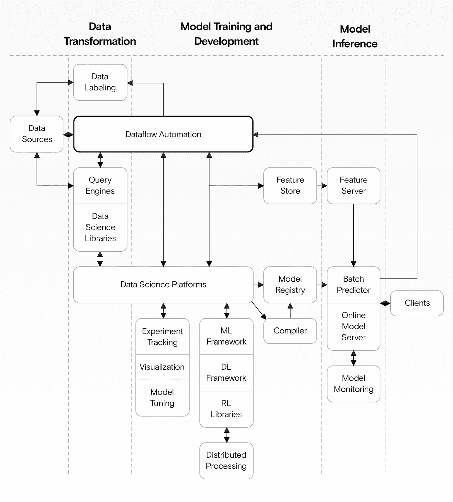
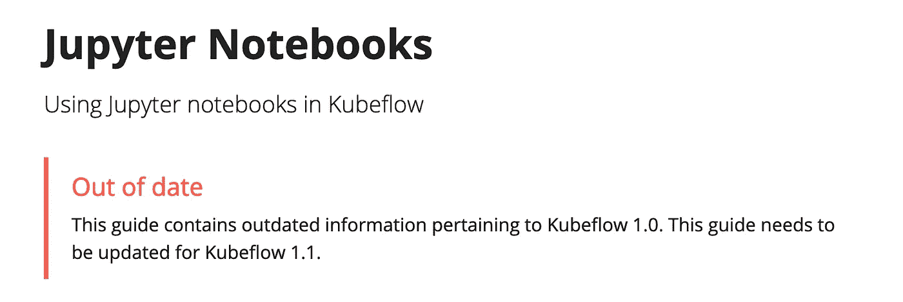

# Kubeflow:还没准备好生产？

> 原文：<https://towardsdatascience.com/kubeflow-not-yet-ready-for-production-9037ce2f3d35?source=collection_archive---------34----------------------->

## 为什么我们放弃 Kubeflow，转而采用我们的机器学习参考架构

来源:作者

我们正在构建一个**参考机器学习架构:**一组免费的文档和脚本，将我们选择的开源工具组合成一个可重用的机器学习架构，我们可以应用于大多数问题。

kube flow——一个建立在 Kubernetes 基础上的机器学习平台，有许多相同的目标——在开始时似乎非常适合我们的项目。我们尝试了几个星期，但在面临几个挑战后，我们现在决定**完全放弃它**。

这篇文章描述了我们的 Kubeflow 体验。我们的目标是帮助其他人比我们更早地看到 Kubeflow 可能还不是它所宣称的那样。

需要明确的是:Kubeflow 有一些缺点，这些缺点阻止了我们在这个项目中依赖它。也就是说，我们仍然尊重 Kubeflow 的目标，我们希望随着项目的成熟和解决其中的一些问题，我们可以在未来重新考虑使用它的想法。

# 库伯弗洛:好的部分

我们先来看看我们最初为什么会被库伯弗洛吸引。所有生产机器学习项目都由许多组件组成，这些组件可以大致分为三类:

*   **数据转换:**训练前扯皮清洗数据；
*   **模型训练和开发:**基于处理后的数据训练和准备模型；
*   **模型推理:**为训练好的模型服务，根据新数据进行预测。

如果我们将机器学习项目的组成部分视为 Andreessen Horowitz 描述的，Kubeflow 可以用于所有三个类别——至少在理论上是这样。拥有一个内聚的工具来执行这些不同的任务在理论上绝对是有吸引力的。

我们需要一个工具来组合许多不同的组件，但是 Kubeflow 没有达到我们的期望。来源:作者

由于我们已经开始使用 Kubernetes，并且只希望使用开源工具，Kubeflow 看起来非常适合。

不幸的是，Kubeflow 设置起来很挑剔，不可靠，而且很难配置。它还依赖于许多过时的组件和库。最后，许多文档已经损坏或过时，如果不依靠一些简单的解决方法，我们无法将它与 AWS 和 GitHub 很好地集成。

我们将在下面详细讨论这些问题。

[**注册订阅我们的时事通讯:**](https://www.datarevenue.com/signup) 把我们下一篇关于我们用什么代替 Kubeflow 的文章直接发到你的收件箱。

# 库伯弗洛:缺点

# 初始安装的问题

甚至在我们采用 Kubeflow 之前，我们就已经知道会有一个陡峭的学习曲线。但是我们在团队中有丰富的 Kubernetes 经验，我们认为我们能够很快地完成初始安装并运行。

在我们第一次尝试的几天后，我们仍然在与 KFDef 和 Kustomize 清单相关的错误作斗争。提供的清单失败了很多次，没有明确的错误消息，所以我们必须手动检查每个安装组件，并试图找出哪些组件损坏了。

我们的目标是将 Kubeflow 与 GitHub 身份验证集成在一起，但是为 AWS 和 OpenID Connect (OIDC)提供的清单也包含一个涉及 Kubeflow 入口点的 bug。为了解决这个问题，我们必须手动更新入口以使用所需的 OIDC 信息。

总的来说，虽然 Kubeflow 运行在 Kubernetes 之上，并且是云不可知的，但是我们在 AWS 上运行 Kubeflow 遇到了许多问题。如果我们选择 GCP，这个过程可能会更顺利。因为 Kubeflow 是由谷歌构建的，所以它通常默认使用 GCP，并且还不能与其他云提供商很好地合作——尤其是在认证和权限管理方面。

# 集成组件的问题

Kubeflow 由许多不同的松散耦合的组件组成。这种松散耦合很好，因为理论上它允许我们选择使用哪些组件。但是它也有缺点。不同的组件依赖于相同依赖项的不同版本，这带来了更多的麻烦。

在我们的测试运行中，我们发现升级一个组件经常会破坏另一个组件。例如，升级 KFServing 组件需要升级*Istio*——Kubernetes 服务用来相互共享数据的网格服务平台。此升级中断了对仪表板的访问，因为较新的 Istio 版本与 AWS 身份验证不兼容。

结果是一组不兼容的版本，唯一的恢复方法是重新安装 Kubeflow。

我们还必须直接从笔记本上创建我们的管道，但即使使用了一些简单的变通方法，这也被证明是不可能的 Kubeflow 仍然存在未解决的问题。正如一位 AWS 工程师[在 GitHub](https://github.com/kubeflow/pipelines/issues/4440#issuecomment-687199444) 上所说，“在这个阶段不支持从笔记本到 Kubeflow 管道的集群内通信。”

# 文件方面的问题

许多文档页面都被标记为“过时”，包括重要的 Kubeflow 组件，如 Jupyter 笔记本。

来源:作者

更糟糕的是，一些也是为老版本的 Kubeflow **编写的文档页面并没有被标记为**“过时”所以当我们调试时，很难知道什么时候信任文档——试图找出什么时候我们做错了什么，什么时候问题是过时的文档。这让一切都慢了下来。

文档中的许多链接也返回“找不到页面”或“该页面尚不存在”的错误，这使得体验总体上令人沮丧。

# Kubeflow 的未来？

10 月，一篇题为“[库伯弗洛死了吗？](https://medium.com/mlops-community/is-kubeflow-dead-d82aadba14c0)“注意到 Kubeflow 的发展似乎在放缓，一些首席工程师弃船到其他公司任职。

正如本文所观察到的，感觉速度变慢的部分原因是开发正在从主存储库转移到子存储库。也就是说，我们也发现社区中的其他人反映了我们自己的许多担忧和经历。卢克·马斯登说:

“我在 Kubeflow 1.1 上遇到了困难，在我看来，它真的缺乏对最终用户体验的关注，这比它需要的要困难得多。”

克莱夫·克洛斯说:

“Kubeflow 是一个生态系统，有些项目比其他项目使用得更多。我认为他们发现将所有东西整合成一个有凝聚力的整体很有挑战性。”

# 挑选 Kubeflow 组件？

Kubeflow Pipelines 是 Kubeflow 的主要关注点，可以只使用这个组件而不使用其他组件。但是，即使当我们试图使用更小的组件时，我们也会遇到问题——并不总是清楚哪些组件是必需的，哪些是可选的。考虑到文档的状态，通过反复试验来解决这个问题是一个耗时且容易出错的过程。

这就是为什么我们决定现在不集成任何 Kubeflow 组件。我们还没有决定用什么来代替它。由于 Kubeflow 有如此广泛的目标，我们可能需要使用几种不同的工具来代替它。很可能我们会使用[perfect](https://www.prefect.io/)作为工作流工具，我们会写另一篇关于我们的经验的文章。

# 你在制作设置中用过 Kubeflow 吗？

如果你在 Kubeflow 上有过类似或矛盾的经历，我们很想听听它们——或者[你对本文的任何其他反馈](https://www.datarevenue.com/en-contact)。