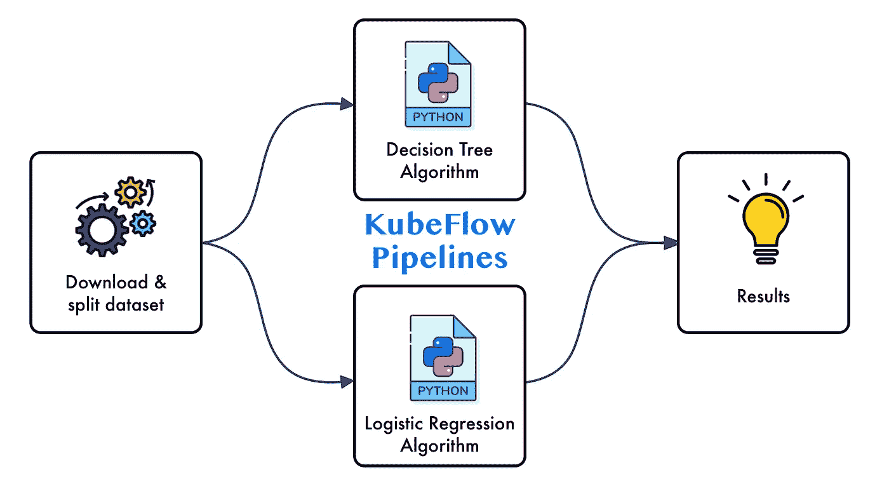
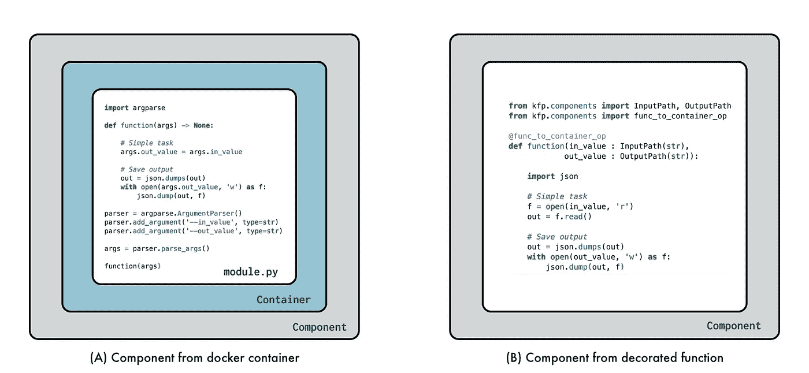
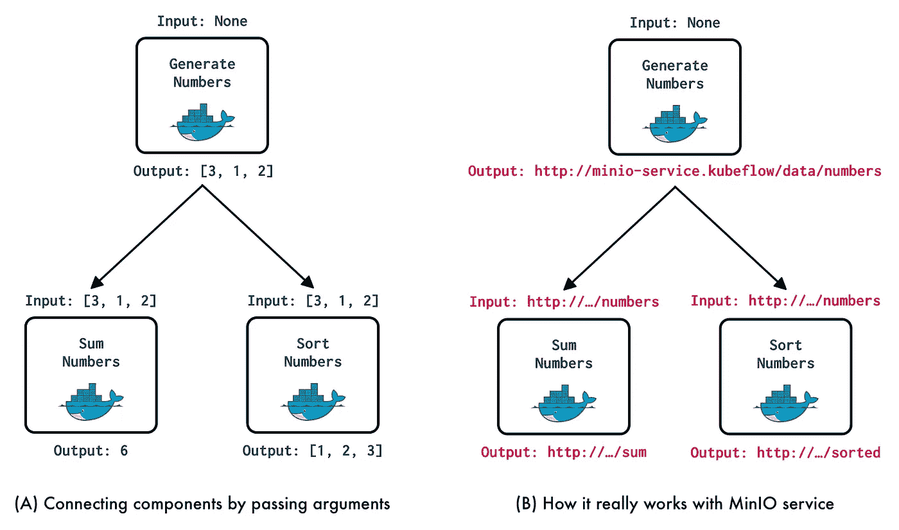
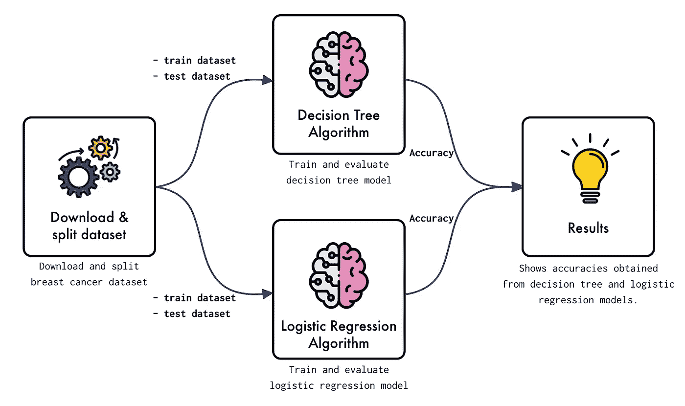
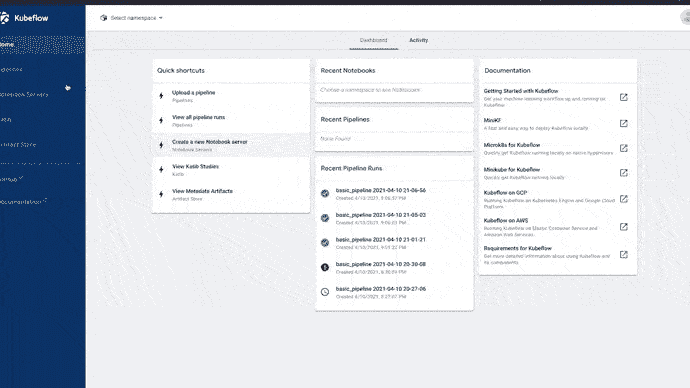
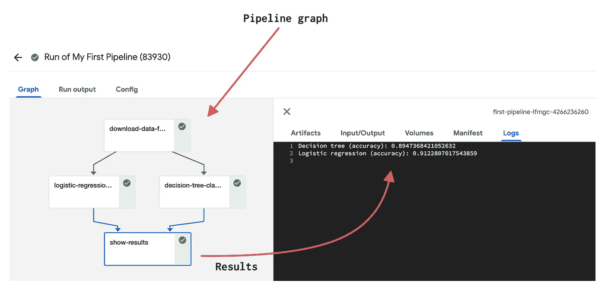

# Kubeflow 管道:如何从零开始构建您的第一个 Kubeflow 管道

> 原文：<https://towardsdatascience.com/kubeflow-pipelines-how-to-build-your-first-kubeflow-pipeline-from-scratch-2424227f7e5?source=collection_archive---------1----------------------->

## [实践教程](https://towardsdatascience.com/tagged/hands-on-tutorials)

## 如何设计、建造和运行 Kubeflow 管道的分步指南

图一。Kubeflow Pipelines |作者图片|来自 [freepick](https://www.freepik.es/flaticon) 、[平面图标](https://www.flaticon.es/autores/flat-icons)的图标

Kubeflow [ [1](https://www.kubeflow.org/) ]是一个平台，它提供了一套工具来开发和维护机器学习生命周期，并在 kubernetes 集群之上工作。在它的一套工具中，我们找到了 Kubeflow 管道。*kube flow Pipelines*[[2](https://www.kubeflow.org/docs/components/pipelines/overview/pipelines-overview/)]是一个扩展，允许我们原型化、自动化、部署和调度机器学习工作流。这样的工作流由一组组件组成，这些组件仅仅是独立的功能，而这些功能又存在于 docker 容器中。然而，当您第一次使用 kubeflow 时，理解如何设计、构建和连接这些组件以创建和部署 kubeflow 管道变得很复杂，这就是为什么在本博客中，我们将通过理解其组件以及它们如何相互作用来了解如何创建 *Kubeflow 管道*，因此本博客将分为以下几个部分:

*   **什么是 Kubeflow 管道？**
*   **建立您的第一条 Kubeflow 管道**

> 如果你想知道如何在你的本地机器上安装和配置 kubeflow，我推荐你看一下这篇文章: [Kubeflow:如何在你的本地机器上安装和启动 kube flow](/kubeflow-how-to-install-and-launch-kubeflow-on-your-local-machine-e0d7b4f7508f)

我们开始吧！

# 什么是 Kubeflow 管道？

*Kubeflow Pipelines* 是 Kubeflow 扩展，它提供了创建机器学习工作流的工具。基本上，这些工作流是以图形形式设计的任务链，并且被表示为有向无环图(Dag)。图中的每个节点称为一个组件，该组件代表 docker 容器中的一个独立任务。在图 2 中，我们可以看到一个管道组件的可视化描述。

图二。*管道组件*。在(A)中，我们可以看到一个基于 python 函数的组件，它位于自定义 docker 容器中。在(B)中，我们可以看到一个由装饰器从[kfp . components](https://www.kubeflow.org/docs/components/pipelines/sdk/build-component/)| Image by author 生成的组件

Kubeflow Pipelines 基于 Argo Workflows [ [3](https://github.com/argoproj/argo-workflows) ]，这是一个用于 kubernetes 的容器本地工作流引擎。一般来说，Kubeflow 管道由[ [4](https://www.amazon.com.mx/Kubeflow-Machine-Learning-Lab-Production/dp/1492050121) ]组成:

*   **Python SDK** :允许你使用 Kubeflow 管道*领域特定语言* (DSL)创建和操作管道及其组件。
*   **DSL 编译器**:它允许你将 python 代码中定义的管道转换成反映在 YAML 文件中的静态配置。
*   **管道服务:**从静态配置或 YAML 文件创建管道运行。
*   **Kubernetes 资源:**管道服务连接到 kubernetes API，以便定义运行 YAML 文件中定义的管道所需的资源。
*   工件存储:K ubeflow 管道存储元数据和工件。实验、作业、运行和指标等元数据存储在 MySQL 数据库中。诸如管道包、大规模度量和视图之类的工件存储在诸如 MinIO server [ [5](https://min.io/) ]之类的工件存储中。

此外，Kubeflow Pipelines 提供了一个 UI 和一个客户端 API 来管理管道、组件、实验、运行和工件。

Kubeflow 管道建设的一个基本要素是组件之间的连接。这个连接是通过第三个服务的实现来实现的，默认情况下是 MinIO。基本上每个组件的每个`input`和`output`被表示为存储在 MinIO 中的一个工件，这个工件将被一个 URI 定义和引用，该定义和引用指示这些`input`或`output`将被分别读取或写入的位置。在图 3 中，我们可以看到如何使用 MinIO 服务进行组件通信的可视化描述

图 3。组件连接|作者图片

在上一个图像中，在左侧，我们可以看到组件之间的连接是如何通过每个元素的`inputs`和`outputs`进行的。从右边我们观察它是如何真正发生的，也就是说，每个进入或离开组件的工件都存储在一个存储服务中，比如 MinIO，所以作为`input`或`output`值传递的是这个工件的引用。我们将在下一节构建第一个管道时详细了解这一点。

现在我们已经了解了 Kubeflow 管道是什么，它的组件以及它们如何相互作用，让我们创建并自动化一个管道，它涵盖了构建 Kubeflow 管道的大部分基础知识，所以让我们开始吧！

# 建造你的第一条库巴流管道

在这个例子中，我们将为众所周知的*乳腺癌*数据集建立一个解决*分类问题*的管道。该管道将由 4 个组件组成，涵盖以下任务:下载和分割数据集，训练和验证两个分类模型(*决策树*和*逻辑回归*)，并最终显示结果。在图 4 中，您可以看到本例中将要构建的管道架构的可视化描述。

图 4。管道架构|作者图片|来自[自由选择](https://www.freepik.es/flaticon)、[平面图标](https://www.flaticon.es/autores/flat-icons)的图标

该示例将分为以下步骤:

*   **流程描述**
*   **组件:下载 _ 数据**
*   **组件:决策树和逻辑回归**
*   **组件:显示结果**
*   **编译并运行**

所以让我们开始吧。

> 如果你想访问完整的项目，我给你留下了资源库的链接:[https://github.com/FernandoLpz/Kubeflow_Pipelines](https://github.com/FernandoLpz/Kubeflow_Pipelines)

## -流程描述

首先，我们将为管道中的每个组件创建一个容器。出于实用和可解释的目的，组件`download_data`、`decision_tree`和`logistic_regression`将是手工构建的 docker 容器，其映像将被托管在 Docker Hub [6]上。组件`show_results`将是由`kfp.components`的扩展`@func_to_container_op`生成的容器(我们将在后面看到)。然后，将为每个 docker 容器生成一组`yaml`清单。稍后，我们将生成 *python 脚本* t，其目标是定义管道图。最后，我们将编译管道，将其托管在 *Kubeflow 管道*中并运行管道！

所以，让我们从构建组件及其各自的`yaml`文件的过程开始。

## -组件:下载数据

该组件的目标是下载和分割数据集。正如我们已经提到的，我们将使用的数据集是众所周知的*乳腺癌*，它是作为 *scikit-learn* 的扩展而发现的。那么，组件将如下所示:

代码片段 1。下载 _ 数据. py

如我们所见，在第 12 行和第 13 行，我们分别下载和分割数据集。接下来有趣的事情发生了，我们生成一个名为`data`的`dict`类型的结构(第 23 行)来托管训练集和测试集。然后我们将这个结构转换成一个`json`类型的对象，最后我们在`args.data`参数中定义的文件中转储这个对象。这个转储数据对象的过程是能够向其他组件(决策树和逻辑回归模型)公开生成的数据(在本例中是训练和测试数据集)的关键。关键是将我们的数据保存在一个文件中，在这种情况下，我们将它设为`json`类型(这是推荐的),但它可以是任何格式。

嗯，一旦我们有了`python script,`，我们需要生成`Dockerfile`来生成我们将上传到 DockerHub 的图像。在这种情况下，我们的图像非常简单，看起来像这样:

代码片段 2。download_data.py 组件的 Dockerfile

一旦`Dockerfile`准备好了，我们就开始构建映像并上传到容器注册中心。

很好，我们几乎为我们的`download_data`组件准备好了一切，我们唯一缺少的是`yaml`清单，它旨在描述我们组件的行为以及定义这样的组件需要的`inputs`和`outputs`的类型。因此，`download_data`组件的清单如下所示:

代码片段 4。下载 _ 数据. yaml

正如我们所看到的，在第 5 行中，我们定义了组件的输出，在本例中，它被定义为名称`Data`，类型为`LocalPath`。请务必注意，数据类型是指组件输出的内容，在这种情况下，因为它是包含定型和测试数据集的结构，所以数据类型是存储该文件的位置。然而，不同的目的有不同的数据类型(例如`String`、`Float`、`Integer`等)，对于数据类型，建议看一下文档[7]。在第 9 行中，我们引用了将从 DockerHub 中提取的图像(此时我们假设图像已经构建好并上传到容器注册中心)。最后，从第 10 行到第 14 行，我们引用了图像的使用，这种情况下只接收一个参数，即数据。

很好，到目前为止，我们已经看到了如何构建组成`download_data`组件的每个元素。在下图中，我们可以看到该组件生成过程的可视化描述。

图 5。构建 download_data 组件的过程|作者图片|来自[自由选择](https://www.freepik.es/flaticon)、[平面图标](https://www.flaticon.es/autores/flat-icons)的图标

开发`decision_trees`和`logisti_regression`组件的过程实际上与`dowload_data`相同，唯一的区别在于参数的定义，因为这些组件接收由`download_data`下载的数据集所在的路径作为输入，所以让我们看看我们是如何做到这一点的。

## -组件:决策树和逻辑回归

`decision_tree`和`logistic_regression`组件的构造实际上是相同的，唯一不同的是要实现的模型，因此出于实用目的，我们将只展示如何为`decision_tree`组件实现。

`decision_tree.py`模块如下:

代码片段 5。决策树组件

首先，我们来看看第 44 行和第 45 行。正如我们所看到的，我们定义了两个参数`data`和`accuracy`。`data`参数指的是存储由`download_data`组件生成的数据集的路径，而`accuracy`参数指的是我们将保存在该组件中获得的精度的路径。正如我们在第 50 行中观察到的，生成了将这种准确性存储为文件的路径。接下来要做的就是读取数据集作为 json 对象的文件(第 12–19 行)，训练模型，评估模型，并在由`args.accuracy`参数定义的路径中保存精度(第 38 行)，就这样！

现在，我们必须为该组件创建 docker 文件，如下所示:

代码片段 6。决策树组件的 docker 文件

最后，我们只需要在`yaml`清单中定义`decision_tree`组件的使用，如下所示:

代码片段 7。决策树. yaml

要考虑两件事。第一个是我们正在定义一个输入和输出变量，它们分别对应于`data`和`accuracy`。第二个是将输入参数分别定义为`data`和`accuracy`的`InputPath`和`OutputPath`。

一旦定义了清单，`decision_tree`组件就准备好了(正如我们所讨论的，`logistic_regression`组件的构造方式与`decision_tree`相同)。

好了，现在让我们继续构建最后一个组件，开始吧！

## -组件:显示结果

`show_results`组件的目的是显示从`decision_tree`和`logistic_regression`组件获得的精度。这个组件也将被定义在一个容器中，但是，与`download_data`、`decision_tree`和`logistic_regression`组件相比，`show_results`组件将使用`kfp.componentes`的`@func_to_container_op`扩展被转换成一个容器。当要开发的任务不需要多个依赖项，或者要解决的任务不像该组件那样非常广泛时，该扩展非常有用，因此，该组件如下所示:

代码片段 8。显示结果组件

因为这个组件没有在容器注册表中定义，所以我们不需要`yaml`清单。在这种情况下，`@func_to_container_op`扩展负责为我们定义这样一个清单。

太棒了，到目前为止，我们已经创建了管道的每个组件，我们只需要生成 python 脚本来定义组件之间的交互，从而能够执行管道，让我们开始吧！

## -编译并运行

最后，我们生成定义管道架构的脚本，也就是说，组件将如何交互。那么，这样的文件将如下所示:

代码片段 9。构建管道

主要功能称为`first_pipeline()`，由`dsl.pipeline()`修饰。这个主要功能定义了组件将如何集成。因此，在第 17、18 和 19 行中，组件`download`、`decision_tree`和`logistic_regression`从已经创建的`yaml`清单中加载。在第 22 行，执行`download_task`。稍后，在第 26 和 27 行中，通过将`download_task`的输出作为输入参数来执行任务`decision_tree_task`和`logistic_regression_task`。最后，在第 31 行，通过将来自`decision_tree_task`和`logistic_regression_task`的输出作为输入来执行任务`show_results`。

移动到 Kubeflow 管道 UI 之前的最后一步是编译前面的脚本，该脚本将生成一个`yaml`清单(称为`FirstPipeline.yaml`),该清单将被上传到 Kubeflow 管道服务，以便运行管道。在图 6 中，你可以看到一个关于如何上传和运行你的`FirstPipeline.yaml`文件的可视化描述。

图 6。上传和运行管道

在图 7 中，您可以看到组件`show_restuls`的输出。

图 7。结果

> 如果你想访问完整的项目，我给你留下了资源库的链接:【https://github.com/FernandoLpz/Kubeflow_Pipelines】T4

太好了，我们已经到了教程博客的结尾！

# 结论

在这篇博客中，我们已经看到了什么是 Kubeflow 管道及其组件。为了向读者展示创建 Kubeflow 管道的实用方法，我们还开发了一个分步管道。

虽然在这篇博客中，我们看到了一个基本管道的开发，但是建议读者看一下文档，因为它在创建和部署 Kubeflow 管道时提供了多种选择和可能性。

# 参考

[1] [Kubeflow](https://www.kubeflow.org/)

[2] [库伯流管道](https://www.kubeflow.org/docs/components/pipelines/overview/pipelines-overview/)

[3] [Argo 工作流程](https://github.com/argoproj/argo-workflows)

[4] [机器学习的 Kubeflow:从实验室到生产](https://www.amazon.com.mx/Kubeflow-Machine-Learning-Lab-Production/dp/1492050121)

[5] [迷你电脑](https://min.io/)

[6] [码头工人中心](https://hub.docker.com/)

[7] [创建可重用组件](https://www.kubeflow.org/docs/components/pipelines/sdk/component-development/)