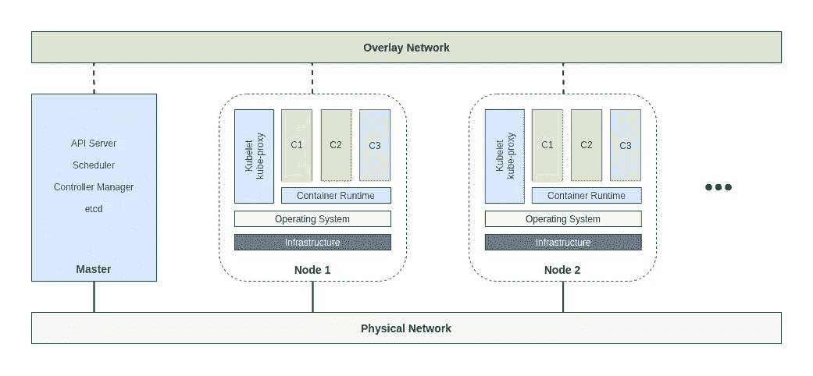

# Kubernetes 101:集群架构

> 原文：<https://towardsdatascience.com/kubernetes-101-cluster-architecture-d79995785563?source=collection_archive---------19----------------------->

## 他们说一张照片胜过一千(或一百万)个字

Marc-Olivier Jodoin 在 [Unsplash](https://unsplash.com/s/photos/architecture?utm_source=unsplash&utm_medium=referral&utm_content=creditCopyText) 上拍摄的照片

在上一篇文章中，我们将 Kubernetes 定义为一个容器编排引擎，它有助于确保每个容器都在它应该在的地方，并且容器之间可以相互通信。

 [## Kubernetes 101:你为什么要关心？

towardsdatascience.com](/kubernetes-101-why-should-you-care-6793a09a096a) 

合乎逻辑的下一步是看到一个高层次的概念视图，看看系统由哪些组件组成，以及它们是如何相互连接的。这个故事展示了 Kubernetes 集群的每个组件和概念架构的整体情况。

> [学习率](https://www.dimpo.me/newsletter?utm_source=medium&utm_medium=article&utm_campaign=kubernetes_architecture)是我每周给那些对 AI 和 MLOps 世界好奇的人发的简讯。你会在每周五收到我关于最新人工智能新闻、研究、回购和书籍的更新和想法。订阅[这里](https://www.dimpo.me/newsletter?utm_source=medium&utm_medium=article&utm_campaign=kubernetes_architecture)！

# 库伯内特建筑

Kubernetes 集群由一组工作机组成。我们称这些机器为[节点](https://kubernetes.io/docs/concepts/architecture/nodes/)。每个集群至少有一个 worker 节点，我们在那里托管封装应用程序工作负载组件的 [Pods](https://kubernetes.io/docs/concepts/workloads/pods/) 。

另一方面，我们有[控制平面](https://kubernetes.io/docs/reference/glossary/?all=true#term-control-plane)。把它想象成我们集群中的主节点。控制平面管理集群中的工作节点和单元。

Kubernetes 的概念建筑——作者图片

## 节点

让我们从下往上开始；什么是节点？节点是我们运行工作负载的物理或虚拟机。在 Kubernetes 中，我们在集群上操作，集群是由一个或多个工作节点组成的组。然而，这些节点不仅仅是简单的设备。

每个节点都包含运行 pod 和容器所需的服务:

*   **一个容器运行时**，如`containerd`或`CRI-O`，用于管理其主机系统的完整容器生命周期，从映像传输到容器执行和监控，从低级存储到网络附件等等。
*   **一个** `**kubelet**`，运行在每个节点上的主节点代理确保 Kubernetes 调度的容器在该节点上运行并保持健康。
*   **一个** `**kube-proxy**`，运行在各个节点上的网络代理，维护网络规则。这些规则允许传入的请求从集群内部或外部的网络会话到达 pod。

## 制导机

节点是我们的应用程序发生奇迹的地方。然而，手动管理所有的容器是不可能的；这就是 Kubernetes 控制平面发挥作用的地方。

Kubernetes 控制平面负责管理 pod 的生命周期并处理所有细节。让我们来看看它的组成部分:

*   **API 服务器**是 Kubernetes 的联系点。它处理每个对象的数据验证和配置。它是 Kubernetes 的核心和灵魂，所有其他组件都通过它进行通信。
*   **“etcd”**是一个键值存储，记录集群的所有重要信息:环境配置、应用程序应该如何运行等等。
*   **调度器**监控节点并跟踪所有可用资源，以确保 pod 到达能够处理它的节点。
*   **控制器管理器**封装了核心 Kubernetes 逻辑。CM 确保所有部分都正常工作。如果没有，它将采取措施使系统达到期望的状态。
*   **云控制管理器**与云提供商(如 GCP、AWS、Azure 等)对话。)并传达集群的需求。如果您在自己的场所运行 Kubernetes，那么集群没有云控制器管理器。

# 序

Kubernetes 集群的设计基于三个原则。Kubernetes 集群应该是安全的、易于使用的和可扩展的。这个故事演示了我们如何将 Kubernetes 集群可视化为两个部分:控制平面和节点。

然后，我们更深入地探讨了什么去哪里，控制平面如何编排一切，以及工作节点如何负责执行应用程序。

我们现在已经准备好在下一篇文章中动手运行我们的第一个工作负载。

# 关于作者

我叫[迪米特里斯·波罗普洛斯](https://www.dimpo.me/?utm_source=medium&utm_medium=article&utm_campaign=kubernetes_architecture)，我是一名为[阿里克托](https://www.arrikto.com/)工作的机器学习工程师。我曾为欧洲委员会、欧盟统计局、国际货币基金组织、欧洲央行、经合组织和宜家等主要客户设计和实施过人工智能和软件解决方案。

如果你有兴趣阅读更多关于机器学习、深度学习、数据科学和数据运算的帖子，请关注我的 [Medium](https://towardsdatascience.com/medium.com/@dpoulopoulos/follow) 、 [LinkedIn](https://www.linkedin.com/in/dpoulopoulos/) 或 Twitter 上的 [@james2pl](https://twitter.com/james2pl) 。

所表达的观点仅代表我个人，并不代表我的雇主的观点或意见。