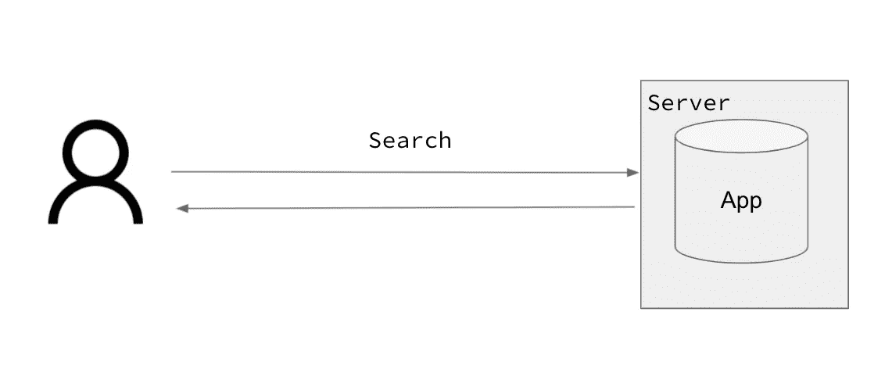

# Kubernetes 面向数据科学家的实用介绍

> 原文：<https://towardsdatascience.com/kubernetes-practical-intro-for-data-scientists-739c263efa06?source=collection_archive---------4----------------------->

## 是的，这又是一篇“k8s 入门”的文章。这个世界不需要它，你也没有要求它，然而我已经在某个地方有了它的要点，所以我想:“为什么不呢”？

我最近为纽约市数据科学院现场演示了这个教程，它是由 T2 在这里录制的。为了方便起见，我把幻灯片和要点改编成了这篇文章。对于感兴趣的人，[我也将在 2022-23](https://info.nycdatascience.com/waitinglistforupcomingclass?hs_preview=CfYnYAcl-80863152231)在生产课上教机器学习！


我和孩子们一起整理 k8s 的东西——作者图片

这篇文章有两个部分，一个高层次的概述和一个实际操作部分，在这个部分中，您可以在您的笔记本电脑上部署一个 ML 模型到 k8s。如果你只是想要本地入门的代码，请看[要点](https://gist.github.com/kylegallatin/ca308e0d697b94c5e02b29823b6a38ff)或者浏览这篇文章的第二部分！

# 概观

第一部分概述了 Kubernetes 的一些高级知识，这些知识将为实用部分增添色彩。

## 学习目标

在这篇文章结束时，你应该能够:

*   理解人们为什么使用 Kubernetes
*   理解为什么人们不使用 Kubernetes
*   从高层次描述一些基本的构建模块
*   在本地 Kubernetes 集群上部署一个简单的 ML 应用程序

我们将不涵盖:

*   Kubernetes 内部架构
*   集群设置和管理
*   或者任何超出我能力范围的东西

## 什么是 Kubernetes？

> [*Kubernetes*](https://kubernetes.io/docs/concepts/overview/what-is-kubernetes/)*，也称为 K8s，是一个用于自动化部署、扩展和管理容器化应用程序的开源系统*—[K8s 网站](https://kubernetes.io/docs/concepts/overview/what-is-kubernetes/)

好吗？但这到底意味着什么呢？为了解释为什么我们可能想要使用 Kubernetes，让我们看一个简单的例子，在没有它的情况下部署和管理一个应用程序*。*

## **在没有 Kubernetes 的情况下部署和管理应用**

这是一个非常简单的工作流程:

1.  您构建了一个简单的应用程序来搜索新闻文章
2.  您将搜索应用程序部署到一台远程服务器上
3.  用户访问该应用程序以获得搜索结果和查找文章

当 1 个用户访问应用程序时，一切正常。



不幸的是，这是作者的图像

但是当 50 个用户访问应用程序时，单个实例就会过载！


作者图片

如果我们需要升级应用程序，它会使搜索不可用。


作者图片

## 我们需要 Kubernetes 的一些原因

还有很多例子，但是正如您所看到的，部署应用程序只是战斗的一小部分。大规模自动管理应用程序要困难得多。我们需要:

*   根据工作负载扩展应用程序
*   无需应用程序停机即可进行更改
*   将用户流量分配给我们应用程序的多个实例

Kubernetes 是**声明性的**，这意味着我们告诉它我们想要发生什么，Kubernetes(在一定程度上)为我们做了。这与像 Python 这样的**命令式**编程形成了对比，在 Python 中，每一行代码我们都显式地改变程序的状态。

然而，你并不总是需要 k8s。事实上，在许多情况下，这可能是矫枉过正。查看我以前在[上的一篇文章，比较和对比不同的 ML 部署策略](/5-different-ways-to-deploy-your-machine-learning-model-with-aws-bd676ab5f8d4)。

## Kubernetes 物件 101

Kubernetes 对象是 Kubernetes 生态系统中的持久实体。他们定义了应用程序如何在集群上运行。我们将看看:

*   分离舱
*   部署
*   服务
*   入口

## 分离舱

Pods 是您可以在 Kubernetes 中部署的最小可部署计算单元。它们是容器化应用程序的典型实例。基本上，运行 Docker 容器。


作者图片

## 部署

部署为一个或多个 pod 提供了声明式定义，使扩展应用程序变得容易。


作者图片

## 服务

服务提供了对部署中的 pod 的查找。这是应用程序的许多实例的抽象层。


作者图片

## 入口

Ingresses 为请求提供了进入集群的入口，因此您可以向外界公开应用程序。


作者图片

今天我们将向您展示如何在 Kubernetes 上部署应用程序。你只需要在本地安装 Docker Desktop 并启用 Kubernetes。

# 实际的

这部分是动手操作，请使用代码示例和要点进行操作。

## 设置

1.  安装 [Docker 桌面](https://www.docker.com/products/docker-desktop)
2.  通过进入首选项-> Kubernetes ->启用 Kubernetes 来启用 K8s

## 用 Docker 测试我们的应用

要在 Kubernetes 上部署一个应用程序，我们首先需要确保它能在本地与 Docker 一起工作。在这里使用示例 fastapi 应用程序:[https://github.com/kylegallatin/fast-bad-ml](https://github.com/kylegallatin/fast-bad-ml)

```
# clone repo
git clone git@github.com:kylegallatin/fast-bad-ml.git
cd fast-bad-ml# build and run app with docker 
docker build -t ml-app .
docker run -p 5000:5000 -it ml-app
```

确保可以在 [http://localhost:5000/](http://localhost:5000/) 到达 app，在[http://localhost:5000/predict 进行预测？feature _ 1 = 0&feature _ 2 = 1&feature _ 3 = 2](http://localhost:5000/predict?feature_1=0&feature_2=1&feature_3=2)。

这是一个简单的 ML 应用程序，采用 3 个特征并返回一个二元预测。

## 验证 Kubernetes 正在使用 Docker Desktop

当您使用 Docker Desktop 启用 Kubernetes 时，它会为您安装 Kubernetes CLI `kubectl`并为您的本地集群进行配置。为了确保它的工作，确保你已经安装了`kubectl`。

```
kubectl version
```

现在，我们可以看一些库伯内特的例子。

```
# ensure your using the docker-desktop cluster
kubectl config use-context docker-desktop# check the "nodes" for your cluster (for docker desktop it's just 1)
kubectl get nodes# check the namespaces (logical separation of resources)
kubectl get ns # check the pods running in a given namespace
kubectl get pods -n kube-system
```

## 集群设置

我们的集群有一个快速设置步骤，即安装 nginx 入口控制器。这将把流量路由到我们的应用程序，并使 URL 在集群之外可用。

```
kubectl apply -f [https://raw.githubusercontent.com/kubernetes/ingress-nginx/controller-v0.46.0/deploy/static/provider/cloud/deploy.yaml](https://raw.githubusercontent.com/kubernetes/ingress-nginx/controller-v0.46.0/deploy/static/provider/cloud/deploy.yaml)
```

通过在浏览器中转到 [http://localhost:80](http://localhost/) 来验证安装。您应该会看到 404 —未找到。这看起来很糟糕，但实际上意味着事情正在按预期进行！


作者图片

# 为我们的应用程序编写对象定义

要为您的容器化应用程序创建 Kubernetes 资源，您需要编写 Kubernetes 对象定义。通常这是使用 YAML(另一种标记语言)或 JSON 来完成的。我们将使用 YAML 来定义我们今天学习的资源。

部署将定义 pod:

服务将为我们所有的 pod 副本提供一个抽象层。

Ingress 将允许用户从集群外部访问我们的应用程序:

我们可以直接从之前克隆的`fast-bad-ml`存储库中将这些应用到我们的集群中:

```
kubectl apply -f deployment.yaml  
kubectl apply -f service.yaml
kubectl apply -f ingress.yaml
```

要验证它是否工作，请访问 [http://localhost:80](http://localhost/) 。为了进行预测，我们可以使用[http://localhost:80/predict？feature _ 1 = 0&feature _ 2 = 1&feature _ 3 = 2](http://localhost/predict?feature_1=0&feature_2=1&feature_3=2)会是这样的！


作者图片

## 摘要

我们刚刚创建了一个应用程序，为它制作了一个 Docker 映像，并在本地机器上将该应用程序部署到 Kubernetes。

要在云中做到这一点，您可以使用 K8s 服务，如 EKS(在 AWS 上)或 GKE(在 GCP 上)，并在那里应用这些相同的 Kubernetes 对象，让它们在云中大规模运行。祝你好运！