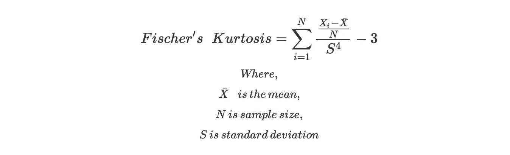

# 峰度——如何向一个 10 岁的孩子解释

> 原文：<https://towardsdatascience.com/kurtosis-how-to-how-to-explain-to-a-10-year-old-a3224e615860?source=collection_archive---------22----------------------->

## 制造不太直观的概念，直观的


照片由[алексарцибашев](https://unsplash.com/@lxrcbsv?utm_source=medium&utm_medium=referral)在 [Unsplash](https://unsplash.com?utm_source=medium&utm_medium=referral)

峰度是描述统计学中的核心概念之一，也是数学中标准化矩的一部分。这个概念本身虽然简单，但却常常因为与之相关的模糊定义而被曲解和误解。在这篇文章中，我将尝试用非常简单的术语解释峰度背后的直觉及其特征，就像我向一个 10 岁的孩子传达它一样。

如果你是第一次听到峰度这个词，这个故事将有助于理解它背后的核心概念。如果你很了解它，也许想向你的侄子或侄女(或者不了解统计的人)解释一下，这将有所帮助

## **故事是这样的:**

想象你和父母去杂货店购物。因为他们忙得不可开交，所以他们让你每只胳膊上提两、五公斤的袋子。你勉强同意，并在每个手臂携带每个 5 公斤的袋子。

现在，你会注意到一些事情。袋子离你的身体越近，就越容易携带。你的手臂离身体越远，就越难控制重量。


作者图片

在这个特殊的例子中，你离你的身体越远，它就越难，峰度就越高。在上面的例子中，与你的重心的距离与峰度的直觉(以及管理权重的难度)成正比，或者为了简单起见，可以说与峰度相等。

现在，如果我们将重量从 5 公斤增加到 10 公斤，然后增加到 15 公斤，从容易到中等到困难的难度也迅速增加，峰度值也迅速增加。

现在用一个正态分布的概率密度函数代替上面例子中的你自己。因为你的大部分体重都集中在非常靠近你的重心的地方，所以你的皮尔逊峰度为 3，或者费希尔峰度为 0。

## 我们学到了什么:

用非常简单的术语来说，峰度是分布的两端的权重。在上面的例子中，离你的重心越远的重量越难处理/管理

费希尔峰度比较了分布相对于正态分布的重尾程度(不考虑其均值和标准差)。正的 Fisher 峰度意味着分布具有显著的异常值，而负的 Fisher 峰度意味着概率密度的分布比正态分布更加均匀

费希尔峰度为 0 或非常接近于 0 的分布称为中峰度分布。正态分布属于这个范畴。

均匀或平顶的分布具有负的费希尔峰度，也称为平峰度分布。例如:均匀分布

具有高正费希尔峰度的分布称为细峰分布。细尾分布是“重尾分布”,会受到异常值的影响，可能需要根据使用情况进行处理或加工。例如:利维分布，拉普拉斯分布等。

## **计算峰度的公式:**



作者图片

将-3 分量添加到皮尔逊峰度，使其以正态分布为中心，因此也被称为“过度峰度”

## Python 实现

峭度可以通过 scipy 软件包方便地计算。下面是计算各种重要分布峰度的参考代码

```
import scipy.stats as stats
from scipy.stats import kurtosisdistribution_names = ['uniform', 'norm', 'laplace', 'levy']
for distribution_name in distribution_names:
    if distribution_name == 'uniform':
        distribution = getattr(stats, distribution_name)(loc=-2, scale=4)
    else:
        distribution = getattr(stats, distribution_name)
    sample_data = distribution.rvs(size=1000)
    kurtosis_value = kurtosis(sample_data, fisher=True) # notice the fisher param
    print(f"kurtosis value of the {distribution_name} distribution is {round(kurtosis_value, 2)}")
```

## **输出:**

正如所料，与其他分布相比，levy 分布(众所周知的异常值重分布)的峰度值非常高。正态分布的值不完全为零，因为它不是从连续分布中提取的。如果您随意调整样本大小，sample_data 的大小越大，就越接近于零。如果我们将数据集大小增加到 10⁸，我们会得到下面的结果

你可能也注意到了，当样本量增加时，重尾分布的峰度会爆炸。

## **进一步解读:**

1.  Python Scipy 文档:[https://docs . Scipy . org/doc/Scipy/reference/generated/Scipy . stats . Kurt osis . html](https://docs.scipy.org/doc/scipy/reference/generated/scipy.stats.kurtosis.html)
2.  数学中的矩:[https://en . Wikipedia . org/wiki/Moment _(数学)](https://en.wikipedia.org/wiki/Moment_(mathematics))

如果您喜欢这篇文章的直观性和简单性，您可能也会喜欢下面统计学概念的一些其他简化版本:

1.  [特征向量&特征值——如何向一个 10 岁的孩子解释](/eigenvectors-eigenvalues-how-to-explain-it-to-a-10-year-old-3150fdba6acd)
2.  [熵，由 Sundaresh Chandran 在《走向数据科学》中简单解释](/entropy-how-to-explain-to-a-10-year-old-7bcc5315291b)

请留下掌声/评论，以防你觉得有用。