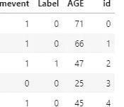
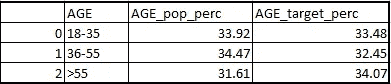
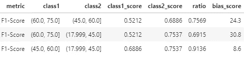

# 用 Python 代码识别 ML 模型中的标签偏差

> 原文：<https://towardsdatascience.com/label-bias-identification-in-ml-model-using-python-code-a0fec9febaa6?source=collection_archive---------24----------------------->

## 如何识别机器学习模型中的偏差


照片由[克里斯蒂安·卢](https://unsplash.com/@christianlue)拍摄

机器学习领域正在不断发展，这导致了其需求和重要性的显著上升。机器学习模型的应用现在无处不在——在我们的日常生活中，从网飞的电影推荐到亚马逊的产品推荐。从雇佣新员工到金融产品审批决策，现在都是通过机器学习模型自动完成的。人们认为，通过改进的机器学习算法分析的大量数据可以在没有人工干预的情况下实时指导更好的决策和智能行动。

然而，机器学习模型的这种广泛使用导致了风险——偏见的风险。仅举几个例子:

亚马逊终止 AI 雇佣和招聘，就是一个展品 AI 不可能公平的例子；该算法优先选择男性候选人，而不是女性。这是因为亚马逊的系统是用 10 年来收集的数据训练的，这些数据主要来自男性候选人。

这种自动化的决策过程可能会导致社会歧视。其中的关键原因是有偏见的训练数据——正如上面亚马逊招聘人工智能的例子所强调的那样。因此，最重要的是确保机器学习模型预测的结果不偏向任何特定的保护类变量，如性别、种族、国籍。

我想在这里强调两个关键指标，这将有助于确定模型结果中是否存在任何偏差。

a)完全不同的影响——当选择过程对不同的群体产生非常不同的结果时，就会出现这种情况。衡量的方法之一是查看特定受保护类别变量在目标群体中相对于总体人口的分布。我们将使用双样本 Kolmogorov-Smirnov 检验来检验两个样本是否来自同一个分布。零假设是 H0:两个样本都来自同一分布的总体。

b)机会均等——分类器在受保护人群中的真实阳性率应与整个人群中的真实阳性率相等。这里我们将使用 F1 统计来计算偏差。

方法:让我们考虑目标是预测更有可能获得房屋贷款的客户。已经开发了分类器模型，并且已经对属于训练数据集的所有客户进行了评分。让我们假设分数范围从 100 到 1000，任何分数大于 600 的人都是目标人群的一部分。现在的目标是确定在这个目标人群中是否存在任何关于年龄和性别这两个受保护阶层变量的偏见。

在我们的例子中，数据 **df** 看起来像下面这样——id、事件(实际目标变量)、标签(目标的预测值)和年龄



示例数据

```
#code for Continuous variable like - age**def** bias_dist_test(data_df,var):
    col_name=var+str('_bucket')
    data_df[col_name] = pd.qcut(data_df[var], q=3)
    data_df2 = data_df.groupby([col_name]).agg({'id': 'count'}).reset_index()
    data_df2[col_name + str('_pop_perc')] = round(100 * data_df2['id']  / data_df2['id'].sum(),2)
    data_df_target=data_df.loc[data_df['score']>600]
    data_df_target2 = data_df_target.groupby([col_name]).agg({'id': 'count'}).reset_index()
    data_df_target2[col_name + str('_target_perc')] = round(100 * data_df_target2['id']  / data_df_target2['id'].sum(),2)
    bias_data_fin=pd.merge(data_df2,data_df_target2,on=col_name,how='left')
    bias_data_fin1=bias_data_fin[[col_name,col_name + str('_pop_perc'),col_name + str('_target_perc')]]
    a,p=stats.ks_2samp(bias_data_fin[col_name + str('_pop_perc')], bias_data_fin[col_name + str('_target_perc')])
    **if** p <.1:
        print("Distribution of "+ var +" is similar with 90**% c**onfidence level between the population and target base and Model is not biased ")
    **else** :
        print("Distribution of "+ var +" is different between the population and target base and Model is biased ")
    **return** bias_data_fin1# Call the function -
bias_dist_test(df,'AGE')
```



年龄分布相似，人群和目标人群之间的置信水平为 90%,模型没有偏差

从上表可以明显看出，目标人口和总人口的年龄分布非常相似。
接下来，为了衡量机会均等关键绩效指标，首先将为各个受保护类别变量创建不同的类别，然后计算 F1 分数。一旦 F1 分数被计算出来，这些分数的比率将被计算用于不同的类，然后将创建一个 1 比率的指数。该指数被称为偏差分数，较高的值表示模型有偏差。

```
def bias_check(main_data, var, target,predicted_target):
    # Initialize the empty bias matrix
    bias_df = pd.DataFrame(columns = ["metric", "class1", "class2", "class1_score", "class2_score", "ratio", "bias_score"])
    col_name=var+str('_bucket')
    main_data[col_name] = pd.qcut(main_data[var], q=3)
    class_grp = main_data[col_name].unique().tolist()
    # Generate list of all combinations of classes:
    class_bucket_perm = list(combinations(class_grp, 2))

    for s in class_bucket_perm:
        # Create subset for each class
        class1_grp = main_data[main_data[col_name] == s[0]]
        class2_grp = main_data[main_data[col_name] == s[1]]init_df = {"metric" : ['F1-Score'],
                    "class1" : [s[0]] ,
                    "class2" : [s[1]] ,
                    "class1_score" : [round(f1_score(class1_grp[target], class1_grp[predicted_target]), 4)],
                    "class2_score" : [round(f1_score(class2_grp[target], class2_grp[predicted_target]), 4)]}metric_df = pd.DataFrame(init_df, columns = ["metric", "class1", "class2", "class1_score", "class2_score"])metric_df["ratio"] = round(metric_df[["class1_score", "class2_score"]].min(axis = 1) 
                                 / metric_df[["class1_score", "class2_score"]].max(axis = 1), 4)

        metric_df["bias_score"] = round(abs(1-metric_df["ratio"]) * 100, 1)bias_df = pd.concat([bias_df, metric_df])
        bias_score= max(bias_df["bias_score"])return bias_df,bias_score#Call the function -
bias_df,bias_score=bias_check(df, 'AGE', 'mevent','Label')
```



不同年龄段的 F1 得分

从上表中可以看出，F1 分数在不同年龄段之间并不十分接近——1 类和 2 类代表不同的年龄段组合。在这里，我创建了 3 个年龄区间，然后检查这些区间的 F1 分数并进行比较。在此基础上，我们创建了一个偏差分数，即 1 类和 2 类 F1 分数之比。
根据经验，最大偏差分数< 10 可被视为模型中无偏差，10–25 可被视为需要更多调查，而> 25 可被视为模型中存在偏差。