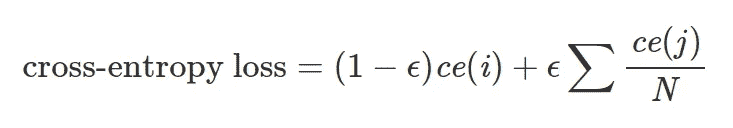
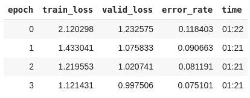

# 标签平滑是另一个正则化技巧

> 原文：<https://towardsdatascience.com/label-smoothing-as-another-regularization-trick-7b34c50dc0b9?source=collection_archive---------17----------------------->

## 什么是标签平滑，如何在 PyTorch 中实现

由[戴夫](https://unsplash.com/@johnwestrock?utm_source=unsplash&utm_medium=referral&utm_content=creditCopyText)在 [Unsplash](https://unsplash.com/s/photos/smooth?utm_source=unsplash&utm_medium=referral&utm_content=creditCopyText) 上拍摄的照片

**过拟合和概率校准是训练深度学习模型时出现的两个问题。**深度学习中有很多正则化技术来解决过拟合；体重下降、提前停止和辍学是其中最受欢迎的一些。另一方面，Platt 的标度和保序回归用于模型校准。

但是有没有一种方法可以同时对抗过度适应和过度自信呢？

**标签平滑是一种正则化技术，它扰动目标变量，使模型的预测更不确定。**它被视为一种正则化技术，因为它抑制了输入到 softmax 函数中的最大对数比其他对数大得多。此外，作为一个副作用，最终的模型得到了更好的校准。

在这个故事中，我们定义了标签平滑，实现了使用这种技术的交叉熵损失函数，并评估了它的性能。如果您想了解更多关于模型校准的信息，请参考下面的故事。

 [## 分类器校准

### 分类任务模型校准的原因、时间和方式

towardsdatascience.com](/classifier-calibration-7d0be1e05452) 

> [学习率](https://www.dimpo.me/newsletter?utm_source=medium&utm_medium=article&utm_campaign=label_smooth)是为那些对 AI 和 MLOps 的世界感到好奇的人准备的时事通讯。你会在每周五收到我关于最新人工智能新闻和文章的更新和想法。在这里订阅！

# 标签平滑

假设我们有一个多类分类问题。在这样的问题中，目标变量通常是一个热点向量，其中我们在正确的类的位置有`1`，在其他地方有`0`。这是一项不同于二元分类或多标签分类的任务，二元分类中只有两个可能的类，多标签分类中一个数据点中可以有多个正确的类。因此，多标记分类问题的一个例子是，如果您必须检测图像中存在的每个对象。

> 标签平滑少量改变目标向量`ε`。**因此，我们不是让我们的模型预测正确的类别的** `**1**` **，而是让它预测正确的类别的** `**1-ε**` **和所有其他类别的** `**ε**` **。**

标签平滑少量改变目标向量`ε`。因此，我们不是要求我们的模型预测正确的类的 `**1**` **，而是要求它预测正确的类的** `**1-ε**` **和所有其他类的** `**ε**` **。**于是，带标签平滑的交叉熵损失函数被转化为下面的公式。

在这个公式中，`ce(x)`表示`x`(如`-log(p(x))`)的标准交叉熵损失，`ε`为小正数，`i`为正确类别，`N`为类别数。

**直观上，标签平滑将正确类别的 logit 值限制为更接近其他类别的 logit 值**。以这种方式，它被用作正则化技术和对抗模型过度自信的方法。

# PyTorch 实现

PyTorch 中标签平滑交叉熵损失函数的实现非常简单。对于这个例子，我们使用作为 [fast.ai 课程](https://youtu.be/vnOpEwmtFJ8?t=1258)的一部分开发的代码。

首先，让我们使用一个辅助函数来计算两个值之间的线性组合:

接下来，我们实现一个新的损失函数作为 PyTorch `nn.Module`。

我们现在可以在代码中删除这个类。对于这个例子，我们使用标准的 fast.ai [pets 示例](https://github.com/fastai/course-v3/blob/master/nbs/dl1/lesson1-pets.ipynb)。

我们将数据转换为模型可以使用的格式，选择 ResNet 架构，并以优化标签平滑交叉熵损失为目标。四个时期后，结果总结如下。

我们得到 7.5%的错误率，这对于十行左右的代码来说是可以接受的，在大多数情况下，我们使用默认设置。

有许多事情我们可以调整，使我们的模型表现得更好。不同的优化器、超参数、模型架构等。例如，您可以在下面的故事中了解如何进一步发展 ResNet 架构。

 [## Pytorch 中从头开始的 xResNet

### 从你的 ResNet 架构中挤出一点额外的东西。

towardsdatascience.com](/xresnet-from-scratch-in-pytorch-e64e309af722) 

# 结论

过拟合和概率校准是在训练深度学习模型时出现的两个问题。深度学习中有很多正则化技术来解决过拟合；体重下降、提前停止和辍学是其中最受欢迎的一些。另一方面，Platt 的标度和保序回归用于模型校准。

在这个故事中，我们研究了标签平滑，这是一种试图对抗过度拟合和过度自信的技术。我们看到了何时使用它以及如何在 PyTorch 中实现它。然后，我们训练了一个最先进的计算机视觉模型，用十行代码识别不同品种的猫和狗。

模型正则化和校准是两个重要的概念。更好地理解对抗方差和过度自信的工具，会让你成为更好的深度学习实践者。

# 关于作者

我叫[迪米特里斯·波罗普洛斯](https://www.dimpo.me/?utm_source=medium&utm_medium=article&utm_campaign=label_smooth)，我是一名为[阿里克托](https://www.arrikto.com/)工作的机器学习工程师。我曾为欧洲委员会、欧盟统计局、国际货币基金组织、欧洲央行、经合组织和宜家等主要客户设计和实施过人工智能和软件解决方案。

如果你有兴趣阅读更多关于机器学习、深度学习、数据科学和数据运算的帖子，请关注我的 [Medium](https://towardsdatascience.com/medium.com/@dpoulopoulos/follow) 、 [LinkedIn](https://www.linkedin.com/in/dpoulopoulos/) 或 Twitter 上的 [@james2pl](https://twitter.com/james2pl) 。

所表达的观点仅代表我个人，并不代表我的雇主的观点或意见。