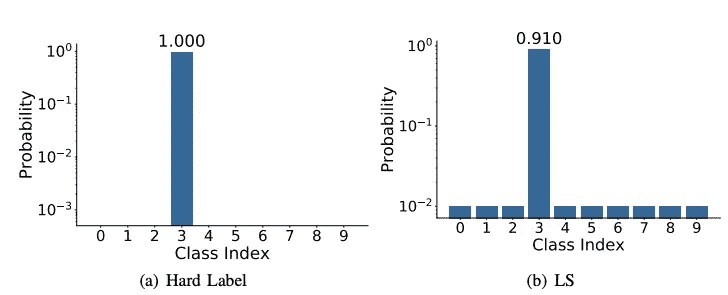

# 标注平滑-使您的模型不那么(过于)自信

> 原文：<https://towardsdatascience.com/label-smoothing-make-your-model-less-over-confident-b12ea6f81a9a?source=collection_archive---------16----------------------->

## 解决机器学习中过度自信的直观解释。

> 艺术家的某种死亡是过度自信——罗宾·特罗沃

还记得那次 ***你关掉了谷歌地图*** 因为你非常自信知道去目的地的路，但结果却是因为施工道路被关闭了..毕竟你不得不使用谷歌地图。那是你过于自信了。如何解决对机器的过度自信？有时，很容易把一件事和另一件事混淆。因此，对某些你 100%有信心的事情，最好少一点信心。

来源: [unsplash](https://unsplash.com/s/photos/car)

标签平滑可以防止网络变得过于自信，并已被用于许多最先进的模型，包括图像分类、语言翻译和语音识别。标签平滑是一个简单而有效的正则化工具，可以对标签进行操作。

通过谈论机器学习中的过度自信，我们主要是在谈论硬标签。

**软标签**:软标签是一个带有某种概率/可能性的分数。例如:(0.1 0.2 0.8)

**硬标签**:硬标签通常是这两个类之一的一部分。它本质上是二进制的(0 或 1)

对于二进制交叉熵损失，我们通过在均匀分布和硬标签之间应用加权平均来将硬标签转换成软标签。标签平滑通常用于提高鲁棒性和改善分类问题。

来源:[深入研究标签平滑](https://arxiv.org/pdf/2011.12562.pdf)

标签平滑是输出分布正则化的一种形式，它通过软化训练数据中的基本事实标签来防止神经网络的过度拟合，以试图惩罚过度自信的输出。

标签平滑背后的直觉不是让模型知道特定的输入仅导致特定的输出 ***。这与过度适应有关，但与过度自信关系更大。我们可以将硬标签转换为 ie，而不是像上面显示的那样将 100%的概率分配给某个类别索引。100%到 91%,把剩下的 9%的不确定性交给其他完全没有信心的阶层。这不会损害模型性能，同时提供了更高的泛化能力。***

Tensorflow 只需将指定为参数，就可以更容易地实现交叉熵损失的 label_smoothing。

您可以使用以下公式执行标注平滑:

`new_labels = original_labels * (1 – label_smoothing) + label_smoothing / num_classes`

示例:假设您有三个 label_smoothing factor 为 0.3 的类。

那么，根据上面的公式，new_labels 将是:

***=[0 1 2]*(1–0.3)+(0.3/3)***

***=[0 1 2]*(0.7)+0.1 =[0.1 0.8 1.5]***

## 现在，新标签将是[**0.1 0.8 1.5]**而不是[0 1 2]

如你所见，模型变得不太自信，带有极度自信的标签。这正是我们想要避免的。现在，由于不正确的预测而给予模型的惩罚将略低于使用**硬**标签，这将导致更小的梯度。

## 参考资料:

[1][https://ai . stack exchange . com/questions/9635/about-the-definition-of-soft-label-and-hard-label](https://ai.stackexchange.com/questions/9635/about-the-definition-of-soft-label-and-hard-label)

[2] [标签平滑什么时候有帮助？](https://arxiv.org/pdf/1906.02629.pdf)

[3] [深入研究标签平滑](https://arxiv.org/pdf/2011.12562.pdf)