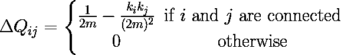

# 用复杂网络标注数据

> 原文：<https://towardsdatascience.com/labeling-data-with-complex-networks-c630d884327e?source=collection_archive---------28----------------------->

## 如何使用复杂的基于网络的半监督方法来标记您的数据


米卡·鲍梅斯特在 [Unsplash](https://unsplash.com/s/photos/data?utm_source=unsplash&utm_medium=referral&utm_content=creditCopyText) 上的照片

可用数据的数量正在快速增长，一方面，这对机器学习模型和实践者来说是极好的，因为这将允许在该领域开发新的解决方案。另一方面，这些数据中的大部分没有被标记，并且标记过程通常是昂贵和麻烦的[1]。

面对大多数机器学习解决方案都局限于监督学习范式的事实，这带来了一个大问题:如何处理如此大量的未标记数据？

为了解决这个问题，半监督范式被创造出来。它的重点是试图用一小组已标记的数据和大量未标记的数据来进行预测。

在这篇文章中，我们将会看到一个半监督学习工具:标签传播。我们将学习如何使用复杂网络和 sknet 库将标签传播到未标记的数据中。

# 复杂网络上的模块化

为了使用复杂网络传播标签，我们必须首先理解什么是模块性度量，以及它如何与网络上的社区检测相关联。

社区是图中的一个区域，其内部紧密相连，但与网络的其他区域稀疏相连。检测这样的社区提出了一个无监督的 NP 完全问题，并且可以从传统机器学习的角度被视为一个聚类问题。

模块化测量是一种量化网络划分好坏的方法。它基本上测量与没有社区结构的随机网络相比，所发现的社区在多大程度上呈现这种密集/稀疏连接特征。

使用模块化，无监督算法进行社区检测。对我们有用的算法是模块化贪婪算法。

# 模块化贪婪算法

该算法试图通过首先将每个节点设置为一个社区本身，然后在每一步将它们合并，来找到网络内部的社区结构。

被选择合并的社区将会产生更大的模块化增量。因此，对于每一步，我们选择在该点上最大化的合并，我们正在处理一个贪婪的算法。

为了使用这种算法，称为模块性增量矩阵的矩阵定义如下:



模块化增量矩阵方程

在该矩阵上，Qij 表示在社区 I 和 j 被合并的情况下模块性的增量。

# 标签传播算法

模块性标签传播算法严重依赖于上面的贪婪模块性算法。这里的想法是，我们可以使用它来传播我们的标签到未标记的数据，以某种方式在我们的网络中生成内聚的组。

因此，算法背后的基本思想如下:

*   我们从网络中的 L 个标记节点开始
*   网络的每个节点被定义为一个社区
*   在每一步，我们使用模块化增量矩阵来合并最大化模块化的社区
*   如果合并是不可能的(我们很快就会知道为什么)，我们就去矩阵中第二高的条目，等等
*   我们不断重复，直到网络上没有节点是未标记的

很简单，对吧？现在，让我们看看为什么有些合并是不可能的。

给定两个节点，我们有与它们的标签相关的四种不同的可能性:两个都已经被标记但是具有不同的标签，两个都是未标记的，一个是未标记的或者两个都被标记了相同的标签。

对于前两种情况，我们不能合并，因为我们要么改变一些标签，这是我们不能做的，要么不传播任何标签。在后两种情况下，可能会发生合并，因为我们正在传播一个标签，或者只是从相同的标签加入一个社区。

这样，预计我们将结束所有的实例标记。

# 在 sknet 中使用标签传播器

为了实现这个算法，我们将使用 *sknet* 库，它专注于在复杂网络中实现机器学习算法。为此，让我们从安装库开始:

```
pip install scikit-net
```

现在安装了库，让我们导入所需的库。此外，我们还将导入 Iris 数据集，用于传播我们的标签:

```
from sklearn.datasets import load_iris
from sknet.network_construction import KNNConstructor
from sknet.semi_supervised import ModularityLabelPropagationX, y = load_iris(return_X_y = True)
y[10:30] = np.nan
y[70:90] = np.nan
y[110:130] = np.nan
```

请注意，我们将一些 Iris 实例设置为 NaN，这是算法知道哪些标签丢失的方式。

现在，我们必须告诉算法如何将这种表格数据转换为复杂网络。为此，我们将使用一个 KNNConstructor，它使用 K-Nearest-Neighbors 算法来创建图形。如果你想了解更多，可以查看[我之前的帖子](/using-complex-networks-to-improve-machine-learning-methods-fe2c034f6de3)或者看[库](https://tnanukem.github.io/scikit-net/main/user_guide/index.html#transformation-methods)的文档。

```
knn_c = KNNConstructor(k=5, sep_comp=False)
```

这里需要注意的是，我们将参数`set_comp`设为 False。此参数控制是否应该将数据标签插入到单独的组件中。因为我们想要传播我们的标签，我们不能在不同的标签之间没有边，因为那将把 nan 只连接到他们自己。

最后，我们将实例化传播器，并使其适合数据:

```
propagator = ModularityLabelPropagation()
propagator.fit(X, y, constructor=knn_c)
```

然后，用户可以通过以下方式访问生成的标签:

```
propagator.generated_y
```

如果我们查看整个代码，我们只有:

```
from sklearn.datasets import load_iris
from sknet.network_construction import KNNConstructor
from sknet.semi_supervised import ModularityLabelPropagation
X, y = load_iris(return_X_y = True)
knn_c = KNNConstructor(k=5, sep_comp=False)
y[10:20] = np.nan
y[70:80] = np.nan
y[110:120] = np.nan
propagator = ModularityLabelPropagation()
propagator.fit(X, y, constructor=knn_c)
propagator.generated_y
```

当然，有些标签是不正确的。和每一个机器学习算法一样，不会有 100%准确的解。但是，这种方法为标注数据提供了一个很好的起点。

如果你想进一步了解这个算法，请查阅参考文献[1]。

# 关于 sknet 库的更多信息

sknet 是一个在复杂网络中实现机器学习算法的库，并允许将数据从一种数据类型转换为其他几种数据类型。它旨在帮助研究人员和实践者开发新的解决方案，并改进现有的机器学习方法。

希望你喜欢并测试 lib！

[1] Silva，T.C .，赵，L .复杂网络中模块性测度指导下的半监督学习(2012)，神经计算.78.30–37.10.1016/j.neucom.2011.04.042