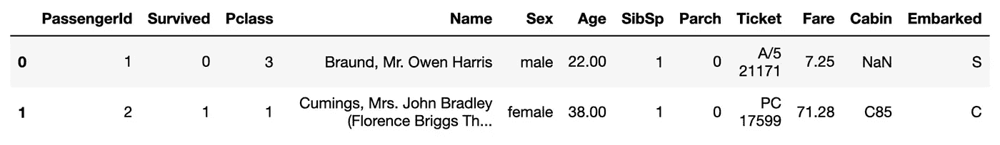
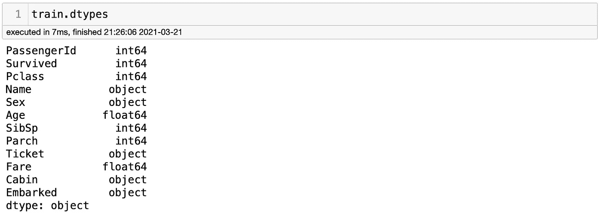
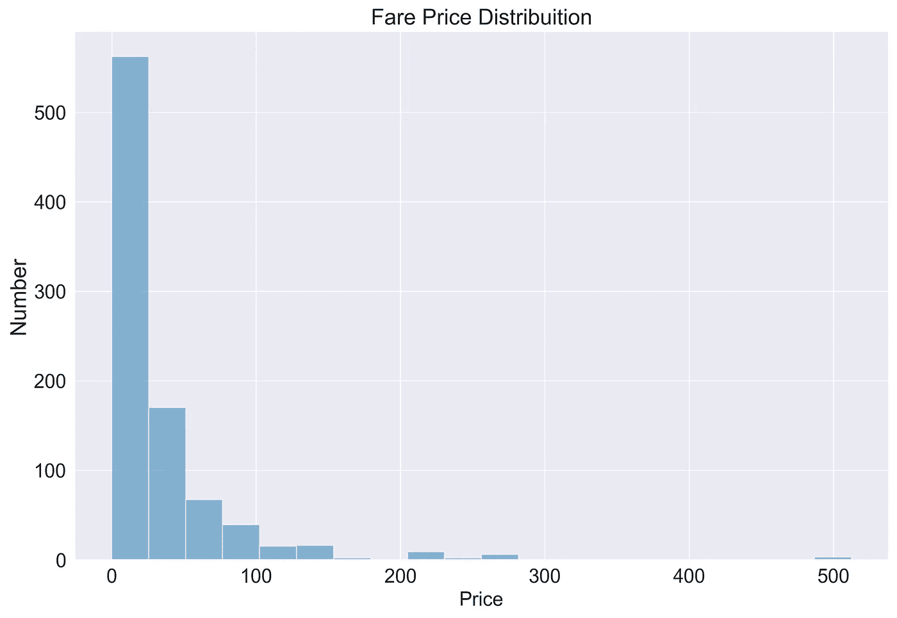

# 拉姆达函数 101:从零到英雄

> 原文：<https://towardsdatascience.com/lambda-functions-101-from-zero-to-hero-81b066cb82b7?source=collection_archive---------20----------------------->

## 大蟒

## 了解如何对熊猫使用 lambda 函数——一起编码


图片由 Vlada Karpovich 提供。来源:[像素](https://www.pexels.com/photo/woman-sitting-on-the-floor-using-a-laptop-4050299/)

当我开始学习 Python 时，我记得当我读到 Lambda 函数部分时，我感到多么失落。我尝试阅读相关文章和观看相关视频，但花了一段时间才最终学会如何为我的数据科学项目创建复杂的 Lambda 函数。互联网上的文章最大的问题之一是，它们解释了它是如何工作的，它们展示了一个很容易理解的简单例子，但在现实生活中，它永远不会像它们展示给我们的那样简单。为此，在本文中，我将解释如何在您的数据科学项目中使用 lambda 函数。我将解释如何构建和读取它们。

**什么是 lambda 函数？**

Python 编程中的 Lambda 函数是一个没有名字的函数。它通常是一个小而有限的单行函数，就像任何其他函数一样，它可以在一个表达式中有多个参数。你还困惑吗？不再害怕。我们把它应用到一个项目中，会更容易理解它的工作原理。我将使用著名的[泰坦尼克号数据集](https://www.kaggle.com/c/titanic)。我们会用`lambda`做一些数据清理和数据工程。你可以在这里找到完整的笔记本。

首先，让我们导入所有我们需要的包。我将使用`pyforest`在一行代码中导入`pandas`、`seaborn`和`matplotlib`。我在[这个博客](/how-to-import-all-python-libraries-with-one-line-of-code-2b9e66a5879f)里讲过`pyforest`。然后，我将导入我们将使用的数据集。你可以在这里找到数据集。这个项目的主要目标是创建一个机器学习模型，预测乘客是否在泰坦尼克号上幸存。在这篇博客中，我不会把重点放在模型上，但我会带着这个目标研究数据集。

```
import pyforest
train = pd.read_csv('train.csv')
```

让我们检查一下现有的数据集，看看我们能做些什么。我用`train.head(2)`检查了前 2 行。



似乎我们的数据集中有一些分类值和数值。让我们使用`train.dtypes`仔细检查一下，这样我们就可以看到数据类型



我们可以看到`Sex`列是一个对象。对于机器学习，我们应该使用数值，这是我们第一次使用`lambda`的机会。我将解决 1 个男性和 2 个女性。这是一项简单的任务，我们可以这样做。

```
train['Sex'] = train['Sex'].apply(lambda x: 1 if x == 'male' else 2)
```

好吧，这是怎么回事？我们分批去吧。我没有创建新的列，而是将数值寻址到现有的`Sex`列。出于这个原因，我使用`train['Sex'] =`。如果我要创建一个新列，我应该使用不在数据集中的列的名称。然后，我写下我感兴趣的值所在的列的名称。在这种情况下，是同一个`train['Sex']`列。到目前为止，我们有`train['Sex'] = train['Sex']`。下一步是使用`apply()`，它允许用户传递一个函数，然后**将**应用到 Pandas 系列的每一个值。

在里面`apply()`我们将编写我们的 lambda 函数，这里是乐趣所在。我们分批去吧。首先，我们来检查一下`lambda x:`部分。这里，我们初始化 lambda 并命名一个变量，我们将使用它来调用一个确定列中的每个单元格。`x`代表`Sex`列中的每个值。你可以写任何字母或单词；用`x`只是约定俗成。现在，让我们检查一下`1 if x == 'male' else 2`部分。这部分的意思是:*如果 x 等于‘男’字，把 x 变成 1；如果不是，就把 x 变成 2* 。你能看到这里发生了什么吗？让我们再分解一次。以下是每一部分应该如何阅读。

```
# Apply function to this columns
train['Sex'] =# This is the columns where the values I'm looking for are
train['Sex'].apply()# Calling lambda function
lambda x: # Turn value into 1 if value is equal to 'male'
1 if x == 'male' # If value is not equal to 'male', then turn value into 2
else 2
```

我也可以这样写，它会以同样的方式工作:

```
train['Sex'] = train['Sex'].apply(lambda x: 1 if x == 'male' else 2 if x == 'female')
```

你可以把上面这个例子理解为*如果 x 等于‘男性’，就把 x 变成 1。然而，如果 x 等于“女性”，则将 x 变成 2*现在有意义吗？我们可以看一个更复杂的例子，确保你能理解。

现在让我们继续关注`Fare`列。我把它画出来，这样我们就可以看到票价分布。它可能有机会进行一些功能工程。



作者创造的形象

我们可以清楚地看到，大多数门票都不到 100 英镑(我假设票价以英镑为单位)。他们大多数不到 50 岁，极少数超过 100 岁。200 多甚至 500 的门票少之又少。我们可以利用这些数字创造新的价值。我将为这些票创建类别。第一个是给那些多付了 200 美元的人的。另一个给那些支付了 100 到 200 英镑的人，等等。我假设员工没有支付任何费用，所以我将为那些支付 0 的员工创建一个类别。这是我的 lambda 函数:

```
train['fare_category'] = train['Fare'].apply(
                        lambda x: 1 if x >= 200 
                        else 2 if x >= 100 and x < 200
                        else 3 if x >= 50 and x < 100
                        else 4 if x < 50 and x > 0
                        else 5)
```

这是一个很大的信息量，但不要担心，让我们分部分进行。我正在使用`Fare`列中的值创建一个名为`fare_category`的新特性。然后，我启动了这个函数，就像 a 在第一个例子中做的那样。以下是你阅读一切的方法:

```
# Turn x into 1 if x is equal or greater than 200
lambda x: 1 if x >= 200 # Then, turn x into 2 if x is equal or greater than 100 and less than 200
else 2 if x >= 100 and x < 200 # Then, turn x into 3 if x is equal or greater than 50 and less than 100
else 3 if x >= 50 and x < 100 # Then, turn x into 50 if x is less than 50 and greater than 0
else 4 if x < 50 and x > 0 # Then, turn x into 5 for all the other instances
else 5
```

我知道，这太多了，但我希望这有意义。这是最难的了。`lambda`功能没有做的这么长，有时候用普通的`functions`会更好。不过，我觉得`lambda`函数可以让你的代码更干净，更易读。

**最终想法**

如果你到了这一步，恭喜你！你只是向成为一名伟大的程序员迈进了一步。我真的希望我能很容易地解释清楚。最好的学习方法是练习。出于这个原因，我建议你用我给你的这些例子来玩一玩，也许你可以创造更多。让我知道我是否能帮助你。