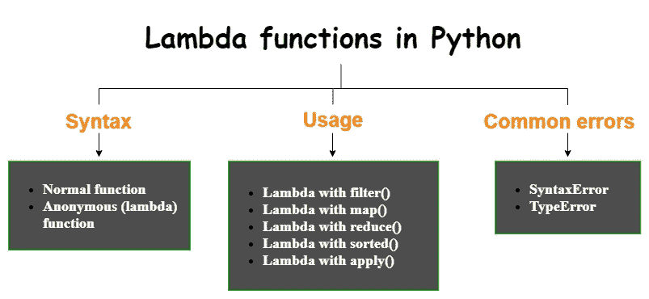
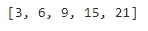
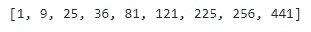
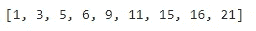
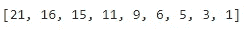
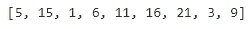
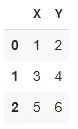
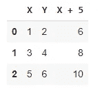
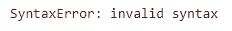
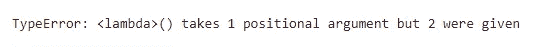

# Python 中如何使用 Lambda 函数？

> 原文：<https://towardsdatascience.com/lambda-functions-in-python-15b60ff4207d?source=collection_archive---------20----------------------->

## 语法、用法和常见错误的快速概述


劳拉·奥克尔在 [Unsplash](https://unsplash.com/?utm_source=unsplash&utm_medium=referral&utm_content=creditCopyText) 上的照片

如果你是 Python 编程的新手，你可能不熟悉 Lambda 函数。不过，你可能听说过它们。这是学习更多 Lambda 函数的时候了。这篇文章是关于 Python lambda 函数的，为了方便起见，分为 3 个部分——**语法**、**用法**和**常见错误**。



包含的主题(作者图片)

# 句法

Python 函数的两种主要类型是:

*   **普通功能—** 用`def`关键字定义，有一个用户自定义名称。
*   **匿名函数—** 用`lambda`关键字定义，没有用户定义的名称。

让我给你看一些例子。

以下示例显示了一个 ***普通函数*** 的定义，该函数在给定半径的情况下返回圆的周长:

```
import mathdef circle_circum(radius):
  return 2 * math.pi * radius
```

这里，**circle _ circun**是函数的名字。是用户给的。**半径**为自变量。使用此函数时，我们应该为此参数提供一个有效值。假设我们要计算一个半径为 5 cm 的圆的周长。然后，我们可以看到下面的函数调用:

```
circle_circum(5)
```

这会返回 31.4159，这是以厘米为单位的周长。

同样的函数可以用 Lambda 来定义。以下示例向您展示了超常规函数的 ***lambda 函数*** 的定义:

```
import mathlambda radius: 2 * math.pi * radius
```

这里我们使用`lambda`关键字，而不是`def`关键字。没有用户定义的函数名和`return`关键字。你也可以在这里看到**半径**参数。

尽管上面的 Lambda 函数本身没有任何用户定义的名称，但它可以被赋予一个用户定义的名称:

```
cir = lambda radius: 2 * math.pi * radius
```

这里， **cir** 是分配给 Lambda 函数的用户自定义名称。我们可以用它来调用函数。

```
cir(5)
```

这也返回 31.4159。但是，我不建议以这种方式使用 Lambda 函数。这不是一个好的做法。在这种情况下，您可以使用普通的函数定义。

让我再给你看几个例子。下面的例子向您展示了一个 ***普通函数*** 的定义，该函数在给定长度和宽度的情况下返回矩形的面积。这一次，我们使用两个参数—长度和宽度。

```
def rect_area(length, width):
  return length * width
```

与此等效的 Lambda 函数为:

```
lambda length, width: length * width
```

因此，Lamda 函数的一般语法是:

```
lambda <arguments>: <single expression>
```

**语法解释:**一个 Lambda 函数可以有零个或者多个参数。当有许多参数时，每个参数用逗号(**、**)分隔。一个 Lamba 函数只能有一个表达式，该表达式是该函数根据自变量的定义。表达式和参数名称由冒号( **:** )分隔。所有这些都应该写成单行的语句。

**注意:**带有零(无)参数的 Lambda 函数也是可能的。看起来像是:

```
lambda: x - y
```

要使用此函数，应在 Lambda 函数之前定义 **x** 和 **y** 。

# 使用

λ函数是优选的:

*   当您希望一次性使用该函数时。
*   当函数定义中只有一个表达式时。
*   当你想用几行代码写出清晰的语法时。

然而，这并不合适:

*   当你需要反复重用函数的时候。
*   当函数定义中有许多或复杂的表达式时。

Lambda 函数经常与 **filter()** ， **map()** ， **reduce()** ， **sorted()** 和 **apply()** 函数一起使用。

## 带过滤器的λ()

**filter()** 函数是 Python 内置函数。它选择给定可迭代的元素(例如，列表、元组等)。)满足应用于每个元素的函数定义。语法是:

```
filter(function, iterable)
```

我们可以使用一个 Lamba 函数作为 **filter()** 函数中的函数参数。

以下示例向您展示了 **filter()** 函数如何从满足 lambda 函数中定义的给定 iterable 中选择 3 的倍数。

```
iterable = [1, 3, 5, 6, 9, 11, 15, 16, 21]list(filter(lambda x: x % 3 == 0, iterable))
```



(图片由作者提供)

## 带有映射的 Lambda()

**map()** 函数也是 Python 内置函数。它将给定 iterable 的元素转换成新值。语法是:

```
map(function, iterable)
```

我们可以使用一个 Lamba 函数作为 **map()** 函数中的函数参数。

以下示例向您展示了如何使用 **map()** 函数来计算给定 iterable 中元素的平方(新值)。

```
iterable = [1, 3, 5, 6, 9, 11, 15, 16, 21]list(map(lambda x: x ** 2, iterable))
```



(图片由作者提供)

## 带 reduce()的 Lambda

**reduce()** 函数不是 Python 的内置函数。它在 **functools** 模块中，需要额外的导入。它将给定 iterable 的元素简化为一个值。语法是:

```
reduce(function, iterable)
```

我们可以使用一个 Lamba 函数作为 **reduce()** 函数中的函数参数。

```
# First import the reduce function
from functools import reduceiterable = [1, 3, 5, 6, 9, 11, 15, 16, 21]reduce(lambda x, y: x + y, iterable)
```

这将返回 87，这是 iterable 中所有元素的总和。如果你想得到所有元素的乘积，将 Lambda 函数定义改为`lambda x, y: x * y`

```
reduce(lambda x, y: x * y, iterable)
```

这返回 44906400！

## 带有排序()的 Lambda

**sorted()** 函数也是 Python 内置函数。它可用于按升序或降序(反向)对 iterable 的元素进行排序。语法是:

```
sorted(iterable, key, reverse)
```

默认，`reverse=False`。如果我们将它设置为`True`，排序将以相反的顺序进行。自定义排序也可以使用可选的**键**参数。**键**参数接受一个函数。我们可以为此使用 Lamba 函数。

正常排序的示例如下:

```
iterable = [1, 5, 3, 9, 6, 11, 16, 21, 15]sorted(iterable) # Ascending order
```



(图片由作者提供)

```
iterable = [1, 5, 3, 9, 6, 11, 16, 21, 15]sorted(iterable, reverse=True) # Descending (reverse) order
```



(图片由作者提供)

自定义排序的一个示例是:

```
iterable = [1, 5, 3, 9, 6, 11, 16, 21, 15]sorted(iterable, key=lambda x: x % 5)
```



(图片由作者提供)

这里，iterable 中的每个元素都根据除以 5 后的余数进行排序。这个标准是由关键论点中的 Lamda 函数给出的。

## 带应用的 Lambda()

**apply()** 是熊猫系列或 DataFrame 对象的方法。它沿数据帧或系列的轴(行或列)应用函数。一般语法是:

```
pandas.DataFrame.apply(function, axis) # For a DataFramepandas.Series.apply(function) # For a Series
```

为了说明这一点，我们使用下面的数据框架。

```
import pandas as pddf = pd.DataFrame([[1, 2], [3, 4], [5, 6]],
                  columns=['X', 'Y'])
df
```



(图片由作者提供)

然后，我们考虑 **X** 列，将该列中的每个元素加 5，得到一个名为 **X+5** 的新列。然后，我们在原始数据帧的末尾添加新列。lambda 函数可用于定义一个函数，该函数为 **X** 列中的每个元素加 5。

```
df.insert(loc=2, column='X + 5',
          value=df['X'].apply(lambda x: x + 5))
df
```



(图片由作者提供)

# 常见错误

如果没有正确使用 Lambda 函数，可能会出现错误。以下是常见的错误类型:

## 语法错误

当您遗漏了每个参数之间的逗号，或者当您遗漏了分隔表达式和参数名称的冒号，或者当您没有在一行中编写 Lambda 函数时，就会发生这种情况。

```
iterable = [1, 3, 5, 6, 9, 11, 15, 16, 21]reduce(lambda x y: x + y, iterable) # Missing the commareduce(lambda x, y x + y, iterable) # Missing the colonreduce(lambda x y: x +
       y, iterable)    # Using multiple lines
```

在每种情况下，都会出现以下错误信息。



(图片由作者提供)

## 类型错误

当表达式中包含的参数名称比 arguments 部分中给出的多时，就会发生这种情况。

```
iterable = [1, 3, 5, 6, 9, 11, 15, 16, 21]reduce(lambda x: x + y, iterable)
```

在这种情况下，将出现以下错误消息。



(图片由作者提供)

## 交付 0%抄袭内容的承诺

没错，以上内容有 0%抄袭！在发布之前，我已经用语法检查过了。为了保证唯一性，我做了这个 0%抄袭的内容。

## 我总是传递标题和副标题中承诺的内容

写一对有意义的标题和副标题增强了上下文的 ***值*** 。交付标题和副标题中承诺的内容是我的责任。

编写独特的内容，在上下文和外观上为读者增加价值，这是我自己的责任，定义如下:

[](https://rukshanpramoditha.medium.com/10-best-practices-that-i-always-follow-to-make-medium-a-better-place-for-readers-e48c6bc27126) [## 我一直遵循的让媒体成为读者更好的地方的 10 个最佳实践

### 这是一个重要的指南，可以帮助你在内容和外观上为读者增加价值

rukshanpramoditha.medium.com](https://rukshanpramoditha.medium.com/10-best-practices-that-i-always-follow-to-make-medium-a-better-place-for-readers-e48c6bc27126) 

下次再见，祝大家学习愉快！同时，你可以在以下网址阅读我的其他帖子:

【https://rukshanpramoditha.medium.com 

特别感谢 Unsplash 网站上的**劳拉·奥克尔**，为我提供了这篇文章的封面图片。作者对本帖中包含的书面内容、代码示例、其他图片和内容链接拥有版权。

**鲁克山普拉莫地塔
2021–07–05**