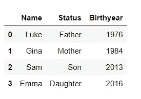
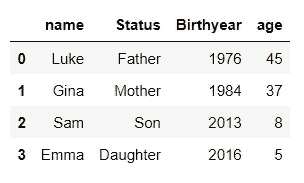
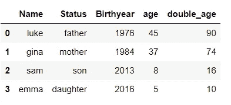
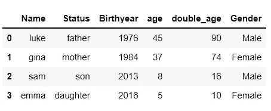
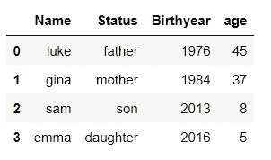
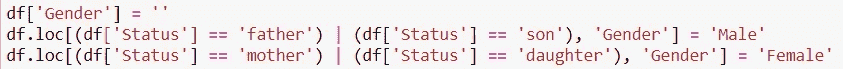

# Python 中的 Lambda 函数及其实例

> 原文：<https://towardsdatascience.com/lambda-functions-with-practical-examples-in-python-45934f3653a8?source=collection_archive---------0----------------------->

## 如何、何时使用以及何时不使用 Lambda 函数


照片由 [**Pixabay**](https://www.pexels.com/@pixabay?utm_content=attributionCopyText&utm_medium=referral&utm_source=pexels) 发自 [**Pexels**](https://www.pexels.com/photo/battle-black-blur-board-game-260024/?utm_content=attributionCopyText&utm_medium=referral&utm_source=pexels)

## 介绍

当我第一次遇到 python 中的 lambda 函数时，我非常害怕，以为它们是为高级 Pythonistas 准备的。初学 python 的教程称赞这种语言的可读语法，但 lambdas 肯定看起来不太用户友好。

然而，一旦我理解了一般的语法并检查了一些简单的用例，使用它们就不那么可怕了。

## 句法

简单地说，lambda 函数就像任何普通的 python 函数一样，只是在定义它时没有名称，它包含在一行代码中。

```
lambda argument(s): expression
```

lambda 函数计算给定参数的表达式。你给函数一个值(参数)，然后提供操作(表达式)。关键字`lambda`必须在前面。完整的冒号(:)分隔参数和表达式。

在下面的示例代码中，x 是参数，x+x 是表达式。

```
#Normal python function
def a_name(x):
    return x+x#Lambda function
lambda x: x+x
```

在我们进入实际应用程序之前，让我们提一下 python 社区认为 lambda 函数好与不好的一些技术细节。

**优点**

*   适用于易于理解的简单逻辑运算。这也使得代码可读性更好。
*   当您需要一个只使用一次的功能时，这种方法很好。

**缺点**

*   他们只能表演一个表情。在一个 lambda 函数中不可能有多个独立的操作。
*   对于在普通的`def` 函数中跨越多行的操作(例如嵌套的条件操作)是不好的。如果您需要一两分钟来理解代码，请使用命名函数。
*   不好是因为你不能像在普通的`def`函数中那样写一个文档串来解释所有的输入、操作和输出。

在本文的最后，我们将看看常用的代码示例，其中 Lambda 函数是不被鼓励的，即使它们看起来是合法的。

但是首先，让我们看看什么情况下使用 lambda 函数。注意，我们在 python 类中经常使用 lambda 函数，这些 python 类接受一个函数作为参数，例如 map()和 filter()。这些也被称为[高阶](https://www.geeksforgeeks.org/higher-order-functions-in-python/)函数。

## 1.标量值

这是当你对单个值执行 lambda 函数的时候。

```
(lambda x: x*2)(12)###Results
24
```

在上面的代码中，创建了函数，然后立即执行。这是一个立即调用函数表达式或[生命](https://developer.mozilla.org/en-US/docs/Glossary/IIFE)的例子。

## 2.列表

**过滤器()。这是一个 Python 内置的库，只返回那些符合特定标准的值。语法是`filter(function, iterable)`。iterable 可以是任何序列，比如 list、set 或 series 对象(更多内容见下文)。**

下面的例子过滤了一个列表中的`even`号。请注意，filter 函数返回一个“Filter object ”,您需要用一个列表封装它以返回值。

```
list_1 = [1,2,3,4,5,6,7,8,9]
filter(lambda x: x%2==0, list_1)### Results
<filter at 0xf378982348>list(filter(lambda x: x%2==0, list_1))###Results
[2, 4, 6, 8]
```

**地图()。这是另一个内置的 python 库，语法是`map(function, iterable).`**

这将返回一个修改后的列表，其中原始列表中的每个值都根据函数进行了更改。下面的示例对列表中的每个数字进行立方。

```
list_1 = [1,2,3,4,5,6,7,8,9]
cubed = map(lambda x: pow(x,3), list_1)
list(cubed)###Results
[1, 8, 27, 64, 125, 216, 343, 512, 729]
```

## 3.系列对象

一个[系列对象](https://jakevdp.github.io/PythonDataScienceHandbook/03.01-introducing-pandas-objects.html#The-Pandas-Series-Object)是一个数据框中的一列，或者换句话说，是一个带有相应索引的值序列。Lambda 函数可以用来操作 Pandas [数据帧](https://www.geeksforgeeks.org/python-pandas-dataframe/)中的值。

让我们创建一个关于家庭成员的虚拟数据框架。

```
import pandas as pddf = pd.DataFrame({
    'Name': ['Luke','Gina','Sam','Emma'],
    'Status': ['Father', 'Mother', 'Son', 'Daughter'],
    'Birthyear': [1976, 1984, 2013, 2016],
})
```



**Lambda 用**[**Apply()**](https://pandas.pydata.org/pandas-docs/stable/reference/api/pandas.DataFrame.apply.html)**功能通过熊猫。**该函数对列中的每个元素进行操作。

为了得到每个成员的当前年龄，我们从当前年份中减去他们的出生年份。在下面的 lambda 函数中，x 是指出生年份列中的一个值，表达式为`2021(current year) minus the value`。

```
df['age'] = df['Birthyear'].apply(lambda x: 2021-x)
```



**Lambda 带有** [**Python 的滤镜()**](https://pandas.pydata.org/docs/reference/api/pandas.DataFrame.filter.html) **功能。这需要两个参数；一个是带有条件表达式的 lambda 函数，两个是 iterable，对我们来说是一个 series 对象。它返回满足条件的值列表。**

```
list(filter(lambda x: x>18, df['age']))###Results
[45, 37]
```

**Lambda 带有**[**Map()**](https://pandas.pydata.org/pandas-docs/stable/reference/api/pandas.Series.map.html)**功能的熊猫。** Map 的工作方式与 apply()非常相似，它根据表达式修改列的值。

```
#Double the age of everyonedf['double_age'] = 
df['age'].map(lambda x: x*2)
```



我们还可以执行**条件运算**，即根据一定的标准返回不同的值。

如果状态值是父亲或儿子，下面的代码返回“男性”，否则返回“女性”。注意`apply`和`map`在这种情况下是可以互换的。

```
#Conditional Lambda statementdf['Gender'] = df['Status'].map(lambda x: 'Male' if x=='father' or x=='son' else 'Female')
```



## 4.数据帧对象上的 Lambda

我通常在特定的列(series 对象)上使用 Lambda 函数，而不是整个数据框，除非我想用一个表达式修改整个数据框。

例如，将所有值四舍五入到小数点后 1 位，在这种情况下，所有列都必须是 float 或 int 数据类型，因为 round()不能处理字符串。

```
df2.apply(lambda x:round(x,1))##Returns an error if some 
##columns are not numeric
```

在下面的示例中，我们在数据帧上使用 apply，并在 Lambda 函数中选择要修改的列。注意，我们*必须*在这里使用`axis=1`,以便表达式按列应用。

```
#convert to lower-casedf[['Name','Status']] = 
df.apply(lambda x: x[['Name','Status']].str.lower(), axis=1)
```



## 不鼓励的用例

1.  **给 Lambda 函数命名。在 python 风格指南中，这是不被鼓励的，因为 Lambda 创建了一个不应该被存储的匿名函数。相反，如果您想存储函数以供重用，请使用普通的`def`函数。**

```
#Bad
triple = lambda x: x*3#Good
def triple(x):
     return x*3
```

2.**传递 Lambda 函数内部的函数。对于 Lambda 来说，不需要使用像`abs`这样只有一个数字参数的函数，因为你可以直接将函数传递给 map()或 apply()。**

```
#Bad
map(lambda x:abs(x), list_3)#Good
map(abs, list_3)#Good
map(lambda x: pow(x, 2), float_nums)
```

理想情况下，lambda 函数中的函数应该有两个或更多的参数。例如`pow(number,power)`和`round(number,ndigit).`你可以试验各种[内置的](https://docs.python.org/3/library/functions.html) python 函数，看看在这种情况下哪些需要 Lambda 函数。我在[这个笔记本](https://github.com/suemnjeri/medium-articles/blob/main/Lambda%20functions%20in%20python.ipynb)里已经这么做了。

3.**当多行代码可读性更高时使用 Lambda 函数**。一个例子是在 lambda 函数中使用 if-else 语句。我在本文前面使用了下面的例子。

```
#Conditional Lambda statementdf['Gender'] = df['Status'].map(lambda x: 'Male' if x=='father' or x=='son' else 'Female')
```

使用下面的代码可以获得相同的结果。我更喜欢这种方式，因为您可以拥有无限的条件，并且代码简单易懂。更多关于矢量化条件[的信息，请点击](/you-dont-always-have-to-loop-through-rows-in-pandas-22a970b347ac)。



## 结论

许多不喜欢 Lambdas 的程序员通常认为，你可以用更容易理解的[列表理解](https://treyhunner.com/2015/12/python-list-comprehensions-now-in-color/)、[内置](https://docs.python.org/3/library/functions.html)函数和标准库来代替它们。生成器表达式(类似于列表理解)也是 map()和 filter()函数的方便替代。

无论您是否决定在代码中包含 Lambda 函数，您都需要了解它们是什么以及如何使用它们，因为您不可避免地会在其他人的代码中遇到它们。

在 [my GitHub](https://github.com/suemnjeri/medium-articles/blob/main/Lambda%20functions/Lambda%20functions%20in%20python.ipynb) 中查看这里使用的代码。感谢您的阅读！

参考资料:

*   [https://www . analyticsvidhya . com/blog/2020/03/what-are-lambda-functions-in-python/](https://www.analyticsvidhya.com/blog/2020/03/what-are-lambda-functions-in-python/)
*   [在 Python 中过度使用 lambda 表达式](https://treyhunner.com/2018/09/stop-writing-lambda-expressions/)