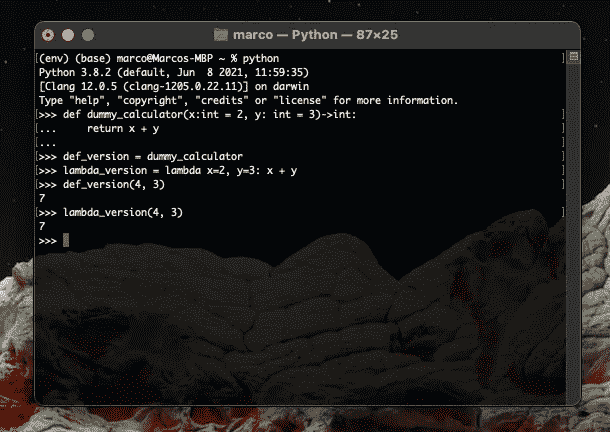
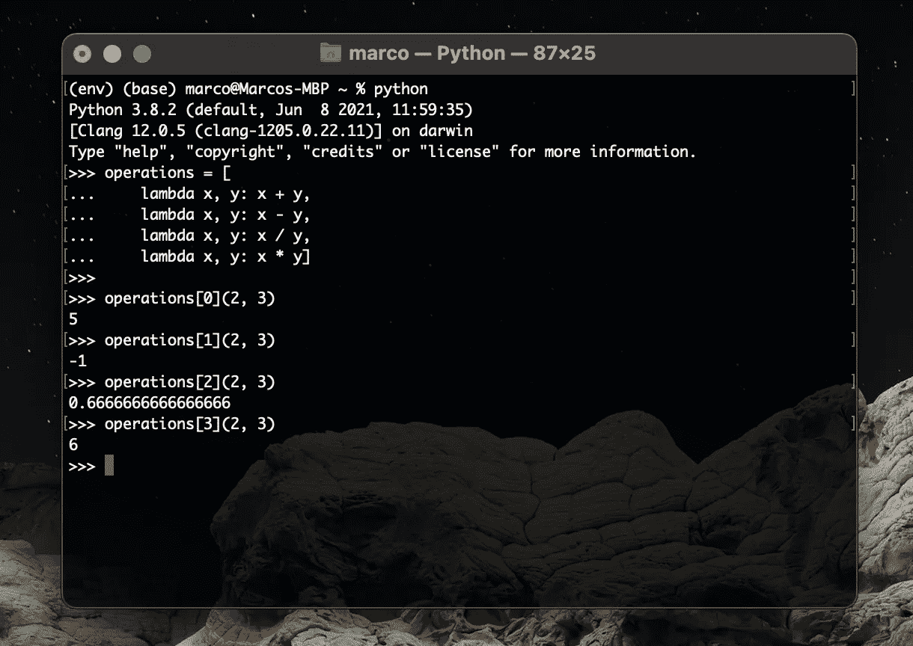
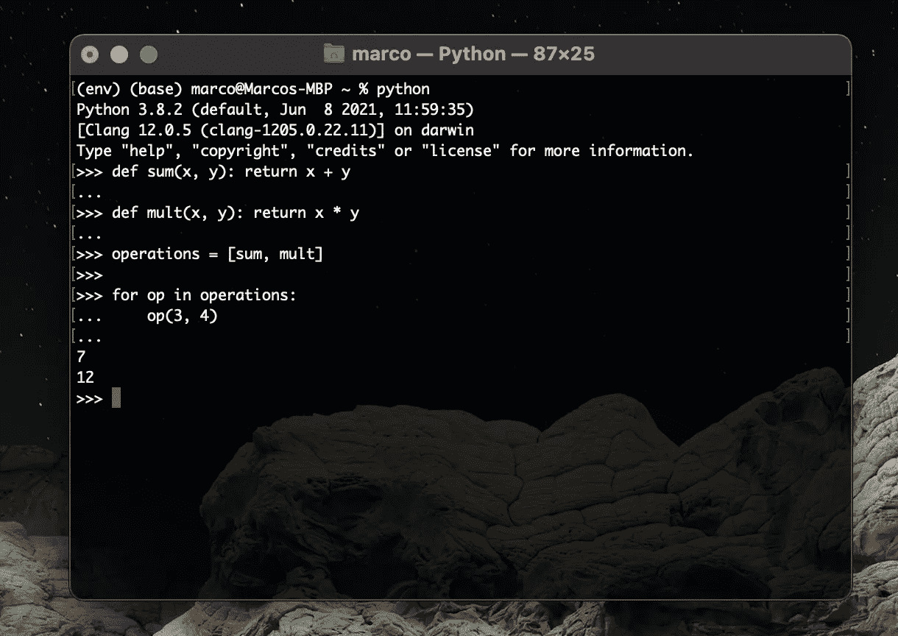
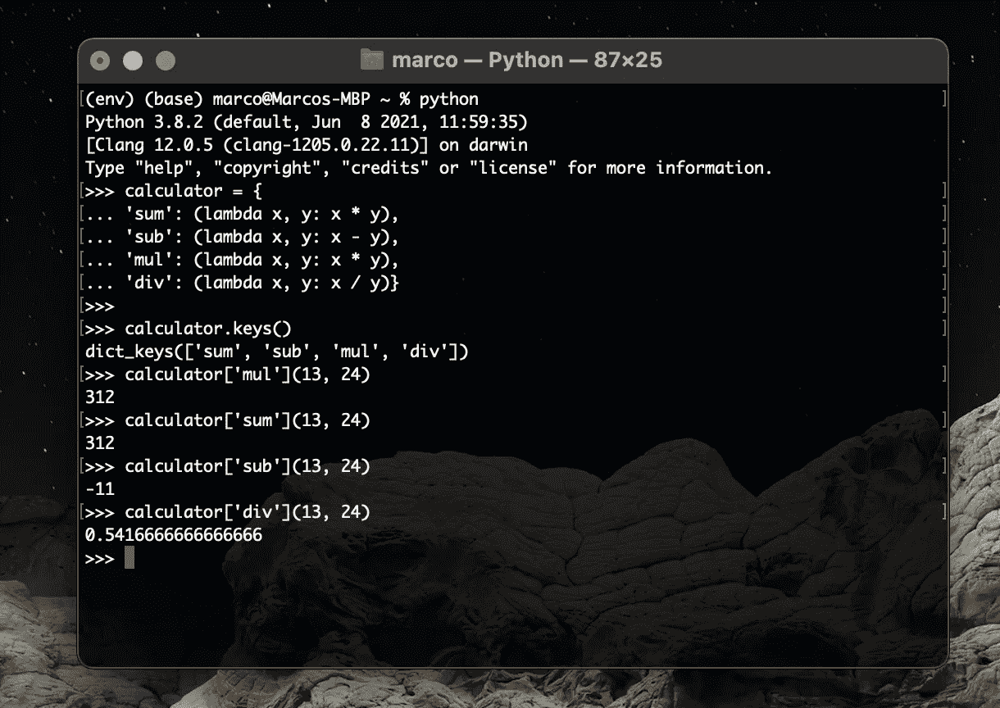
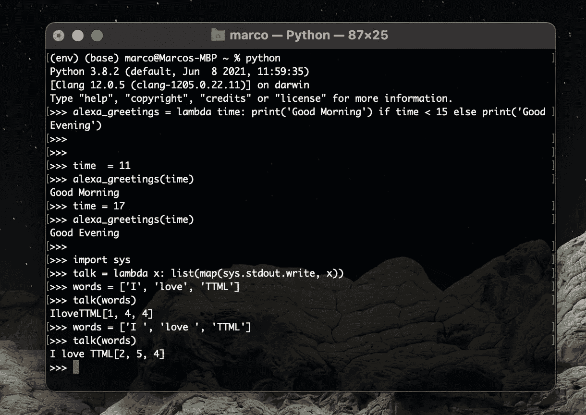
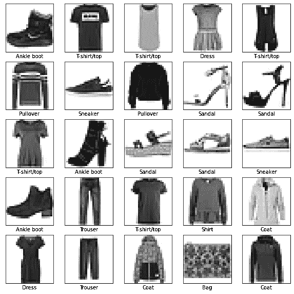
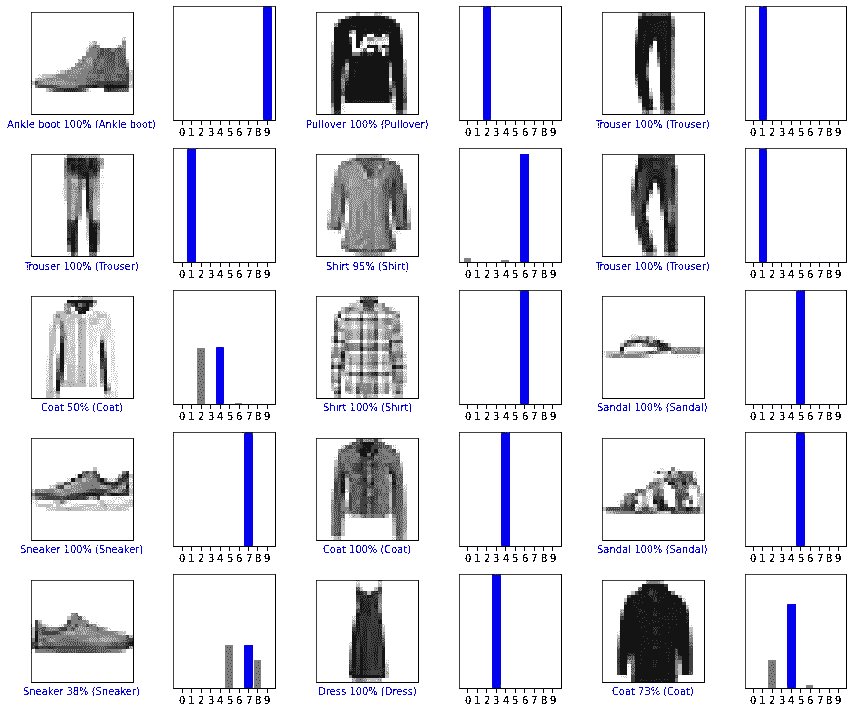

# 定制模型的 Lambda 层

> 原文：<https://towardsdatascience.com/lambda-layers-for-custom-models-df96401c6281?source=collection_archive---------19----------------------->

## 张量流神经网络中的实用和定制操作

在开发不同复杂度的人工智能算法时，有时需要对可用数据执行**特定操作**。在此背景下，我们将使用 Tensorflow 2。x，特别是 Keras API。这个工作环境提供了广泛的数学运算、数据处理和图层，但可能需要执行特定的和**原** **运算**。在另一篇文章中，我们已经谈到了**定制层**以及这些工具如何让我们创建适合我们应用的完全原创的模型。但是，我们并不总是需要定义一个真正的原始层，尤其是当要执行的**操作**是**简单**和**直接**时。例如，我们正在考虑预处理操作、数据大小调整、后处理…

 [## Tensorflow 中的自定义图层

### 增强 Tensorflow 体验创建您自己的层

towardsdatascience.com](/custom-layers-in-tensorflow-4dbd7c194b6e) 

*请记住，您可能总是在自定义图层和 Lambda 图层中仅使用 TensorFlow 操作，以从算法中获得最佳性能，并从 TensorFlow 的图形功能中受益。*

## 在这篇文章中

我们将介绍 **lambda** **函数**的概念，它在 Python 语言中的用途，它的潜力和典型应用。我们将从理论的角度，然后在应用案例中，看到如何在 Tensorflow 中创建一个**λ****层**。我提醒你 ***关注我的*** [***中的***](https://medium.com/@marcosanguineti) ***简介*** 来支持我的工作，你可以在我的 [YouTube](https://www.youtube.com/channel/UCExkeDZ9WC0tg9aoFMsNF0w) 频道和 [GitHub](https://github.com/GitMarco27/TMML) repo 中找到它的所有使用代码和插图。

## Python Lambda 函数:匿名函数

如果你熟悉 Python 编程，你可能知道 ***def*** 语句对于**函数** **对象**的定义。然而，这种说法还有另外一种表达方式:λ。这个名字乍一看可能令人害怕(这个名字本身来源于 lambda calculus，一种符号逻辑)，但是在 Python 中，**只是一个关键字**，它允许您引入**快速表达式作为快捷方式**。

就像 **def** 语句一样，这个表达式创建了一个您稍后会调用的函数，但是在本例中，**它返回函数**，而没有在实际的作用域中给它赋值。正因如此，我们通常将 lambda 函数称为****函数*** 。*

*lambda 函数的主要应用与函数的**内联**定义有关，在实际作用域中没有给函数本身指定名称。*

**

*照片由[沙哈达特·拉赫曼](https://unsplash.com/@hishahadat?utm_source=medium&utm_medium=referral)在 [Unsplash](https://unsplash.com?utm_source=medium&utm_medium=referral) 上拍摄*

*lambda 语句的应用非常简单:我们使用 lambda 单词，后跟一个或多个参数。*

> ***x，y，z: f(x，y，z)***

**其中 ***x，y，z*** 是 lambda 函数参数， ***f*** 是所需的表达式，使用参数本身。我们可以发现与 **def** 语句有很强的关系。但是，让我们关注一下不同之处，这在某些情况下很有用:**

1.  *****lambda 函数是一个表达式，而不是语句*** :语句 **def** 将新函数赋给头中的名字，函数 **lambda** 返回结果。记住: **lambda** 返回值(新函数)。**
2.  *****lambda 函数的主体是一个表达式，而不是语句块***:**lambda**表达式主体(f)可以被认为是带有 **def** 语句的标准函数中的返回语句。由于这个原因， **lambda** 函数也不太通用，因为它的主体仅限于单个表达式，没有有用的逻辑语句(if，for…)。**

**我们可以注意到 **def** 和 **lambda** 主要做相同的工作。以下示例向您展示了如何使用两种策略生成相同的 *dummy_calculator* 函数。 ***默认*** 处理**λ**参数就像在 **def** 中一样。**

****

**def 与 Lamba 对比—作者图片**

****lambda** 函数遵循作用域查找规则，就像一个函数在另一个函数中一样，它引入了一个局部作用域，这个局部作用域在封闭函数中、在模块中以及显然在内置作用域中看到名字。**

## **为什么我应该使用 lambda 函数？**

> ****总结** : lambdas 函数是一种函数速记。你只需要在使用它的代码中嵌入一个函数定义。但是，请记住，它们绝对是可选的解决方案，但是可以成为嵌入小段代码的强大解决方案。**

**使用 **lambda** 函数可以生成另一个有趣的 Python 代码结构，即**跳转表**:列出了用户要求的时间/地点将执行的动作/字典。让我们看看下面的例子:**

****

**跳转表示例—按作者排序的图像**

**这个简单的例子允许我引入另一个概念: **lambda** 函数也可以用在 **def** 语句在语法上不合法的地方。给出的代码显示了嵌入在列表文字中的可调用函数列表。我不能用 **def** 语句这样做:它们是语句，不是表达式。**

****

**带有 def 语句的跳转表—作者图片**

**您可以通过生成一个字典来增强这个解决方案，在这个字典中，每个嵌套的 **lambdas** 函数生成一个您稍后将调用的函数，从而创建一个通用的多路分支工具。**

****

**兰姆达斯词典—作者图片**

**为了完整起见，我们再提醒另一个重要的方面: ***代码接近度。*** 如果你的函数必须在单一上下文中使用，那么创建一个 **lambda** 可能是一个好的解决方案。同时， **def** 语句要求在实际作用域中为新函数指定一个名称，但是这些名称可能会与其他名称冲突。**

## **兰姆达斯不是一个限制**

**正如我之前所说的，函数的主体必须是一个表达式，而不是一段代码。这看起来像是对表达式本身复杂性的严格限制。实际上，通过利用 Python 语法提供的一些可能性，可以创建更复杂的逻辑表达式，即使它们包含在一个表达式中。我们甚至可以用一行简单的代码来创建循环和迭代，让我们来看看下面的代码:**

****

**带有 lambda 函数的 if 语句和循环—作者图片**

## **Lambda 函数和 Python 咒语**

**正如蒂姆·彼得斯的《Python 之禅》中所述:**

> **漂亮总比难看好。显性比隐性好。简单比复杂好。复杂总比复杂好。扁平的比嵌套的好。疏比密好。可读性很重要。**

**由于这个原因， **lambda** 函数通常局限于简单的表达式和小块的内联代码。对于更大的逻辑，最好使用 **def** 语句。**

## **张量流中的λ函数**

**在 Tensorflow 中，一个 [Lambda](https://www.tensorflow.org/api_docs/python/tf/keras/layers/Lambda) layer *“将任意表达式包装为一个层对象”。***

> **`Lambda`层的存在是为了在构建`Sequential`和功能 API 模型时，任意表达式都可以用作`Layer`。`Lambda`图层最适合简单操作或快速实验。对于更高级的用例，请遵循本指南[中](https://www.tensorflow.org/guide/keras/custom_layers_and_models)`[tf.keras.layers.Layer](https://www.tensorflow.org/api_docs/python/tf/keras/layers/Layer)`的子类化。**

**请记住:Lamba 层有一些重要的(反)序列化限制。**

> **子类化`[tf.keras.layers.Layer](https://www.tensorflow.org/api_docs/python/tf/keras/layers/Layer)`而不是使用`Lambda`层的主要原因是保存和检查模型。`Lambda`通过序列化 Python 字节码来保存层，这从根本上说是不可移植的。它们只能在保存它们的相同环境中加载。子类化的层可以通过覆盖它们的`get_config`方法以更便携的方式保存。依赖于子类层的模型通常也更容易可视化和推理。**

** [## TMML/010_Lambda_Layer.ipynb 在主要的 GitMarco27/TMML

### 3 分钟机器学习。通过在 GitHub 上创建帐户，为 GitMarco27/TMML 的发展做出贡献。

github.com](https://github.com/GitMarco27/TMML/blob/main/Notebooks/010_Lambda_Layer.ipynb) 

这里显示的代码涉及对著名的 fashion-mnist 数据集的简要分析。服装图像是一个图像处理和分类的问题。这些是 28x28 的黑白图像。目标是开发一种算法，能够以尽可能高的准确度自动对它们进行分类。

时尚 MNIST 数据集-作者图片

为了这个任务，我创建了两个非常简单的模型:一个全连接的**密集** **网**和一个**卷积分类器**。本教程的目的是 Lambda 层在人工智能工作流中的应用，所以让我们检查一下它们的应用。

**数据标准化**是最大化我们模型训练有效性的重要工具。一般来说，Python 和 Tensorflow 为我们提供了各种图像标准化和处理的工具，但在这种情况下，我决定使用**Lambda**层来标准化数据。这一层已经使用 python **lambda** 函数作为第一个参数进行了实例化，并且已经在前一层的输出中按照 Keras Functional API 的语法进行了计算。

在第二个应用案例中，我们可以看到如何利用**层**层**层**的实用性来执行扩展数据维度的简单操作，以使其与后续的二维卷积层兼容。

卷积分类器性能—按作者分类的图像

## 结论

我们回顾了 Python 语言中 **lambda** 函数的关键概念，了解了如何在 Tensorflow 中实现模拟层以在我们的工作流中执行一些方便的操作，并了解了一个在著名的多类分类数据集上的有用应用示例。

下次见，马尔科

# 3 分钟机器学习

3 分钟机器学习是一系列与人工智能、深度学习和数据科学相关的教程、视频和文章。你可以在 YouTube 上找到完整的视频集。GitHub [库](https://github.com/GitMarco27/TMML)包含了文章和视频中显示的所有 Google Colab 笔记本。希望这些内容对你有用，或者只是你感兴趣。欢迎任何反馈。

查看其他剧集:

*   [用神经风格转移和张量流生成图像](/images-generation-with-neural-style-transfer-and-tensorflow-a823b0353b06)
*   [猫 VS 狗卷积分类器](/cats-vs-dogs-convolutional-classifier-44ec04c8eb7a)
*   [使用 Keras Functional API 绘制张量流模型](/plot-a-tensorflow-model-with-keras-functional-api-f2db639dbbd8)
*   [预测建筑物能源性能的神经网络](/neural-network-for-predicting-the-energy-performance-of-a-building-5c2bf5820ebe)
*   [tensor flow 中的自定义图层](/custom-layers-in-tensorflow-4dbd7c194b6e)
*   [tensor flow 中的自定义损失函数](/custom-loss-function-in-tensorflow-eebcd7fed17a)**