# LambdaNetworks:高效、准确，但也是可访问的？CIFAR-10 的再现性项目

> 原文：<https://towardsdatascience.com/lambdanetworks-efficient-accurate-but-also-accessible-a-reproducibility-project-with-cifar-10-3429d8ece677?source=collection_archive---------36----------------------->

## LambdaNetworks 胜过 attention 和 CNN。这是否适用于小型和低维数据集？

洛伦佐·埃雷拉在 [Unsplash](https://unsplash.com?utm_source=medium&utm_medium=referral) 上的照片

我们介绍了我们使用更小和更低维度的 CIFAR-10 数据集复制 LambdaNetworks 的实现和结果，LambdaNetworks 是由 Irwan Bello 在 Google Brain 开发的一种新的机器学习架构。

这个再现性项目的作者是[joséIgnacio de alv ear cárdenas](https://www.linkedin.com/in/jose-ignacio-de-alvear-cardenas/)和 [Wesley A.J.G. de Vries](https://www.linkedin.com/in/wesleyajgdevries/) ，代尔夫特理工大学航空航天工程硕士研究生。我们实现 LambdaNetworks 的源代码可以在 [GitHub](https://github.com/joigalcar3/LambdaNetworks) 中找到。我们还有一张总结这篇文章的海报[在这里](https://github.com/joigalcar3/LambdaNetworks/blob/main/Poster.pdf)。如果你对代尔夫特大学学生的其他复制品感兴趣，可以在这个[链接](https://reproducedpapers.org/)找到。

这篇文章的结构如下:

1.  [简介](#d4ff)
2.  [现有的 LambdaNetworks 论文评审和再现性项目](#31bc)
3.  [本再现性项目的目标](#443c)
4.  [为什么要λ层？](#b6fc)
5.  【LambdaNetworks 解释
    5.1 [内容λ](#f060)
    5.2[位置λ](#5951)
    5.3[λ应用于查询](#e96f)
    5.4 [多查询λ层](#ed77)
6.  [约束、数据集和参数](#6520)
    6.1 [约束](#ef05)
    6.2 [数据集](#b7a2)
    6.3 [参数](#b975)
7.  [实施细节:ResNet-50](#2566)
    7.1 [数据预处理](#3e7e)
    7.2 [模型准备](#aa7c)
    7.3 [训练和测试](#800f)
8.  [实现细节:lambda networks](#78cf)
    8.1[单 Lambda 层实现](#3a1d)
    8.2 [Lambda 层集成在 ResNet-50 内](#4831)
9.  [结果](#d613)
    9.1 [准确度和模型复杂度](#29ed)
    9.2 [训练时间和吞吐量](#88c4)
    9.3 [学习率敏感度分析](#7f71)
10.  [结论](#ec9d)
11.  [建议](#4a8a)
12.  [作者对 Lambda Networks 论文的看法](#bc3e)

[参考文献](#fba1)

# 1.介绍

Irwan Bello 在[*“LambdaNetworks:Modeling long-range interactions without attention”*](https://arxiv.org/abs/2102.08602)*【1】中提出了一种方法，其中通过将上下文转换为称为 lambdas 的线性函数的层来对远程交互进行建模，以避免使用注意力图。根据 Bello 的原始论文，lambda 层的巨大优势在于，它们比自我关注机制需要更少的计算。这太棒了，因为它不仅能更快地提供结果，还能省钱，并有更好的碳足迹！然而，Bello 仍然使用 32[TPU v3](https://cloud.google.com/tpu)和 200 GB 大小的 ImageNet 分类数据集。因此，我们开始了这个再现性项目，想知道:lambda 层是否可以在保持其吸引人的特性的同时，适用于主流计算机？*

*2021 年，世界不仅要应对新冠肺炎疫情，还要应对 T2 芯片短缺，这也是由于家用电子产品的增加、中国工厂的关闭和加密货币价格的上涨。这使得供应下降到创纪录的低点，价格下降到创纪录的高点。导致研究人员、学者和学生(他们通常都在预算范围内)不再能够利用 COTS(商用现成)GPU 快速构建集群，从而不得不处理更旧、更少、效率更低的硬件。*

*在 2021 年 3 月启动该项目时，没有发布任何官方代码。因此，为了回答上述问题，我们需要尽可能准确地复制 Bello 的论文，同时尝试将其缩小，以便可以在普通的消费者计算机上运行。产生的代码是公开的*

# *2.现有的 LambdaNetworks 论文审查和再现性项目*

*Bello 的论文已于 2021 年 2 月 2 日发表，在撰写本文时已被引用 7 次。这意味着这篇文章是全新的，因此还没有被学术界梳理过。*

*然而，一些研究人员和机器学习社区的成员已经阅读了这篇文章，并提供了这篇论文的评论。*

*   *[Yannic Kilcher](https://www.youtube.com/watch?v=3qxJ2WD8p4w) 在 Bello 发表这篇文章的 4 个月前，已经在 YouTube 上发表了*“LambdaNetworks:建模没有注意力的远程相互作用(论文解释)”*。基尔彻检查了论文的初稿，向听众解释了它们，并向作者提供了建议。*
*   *[Carlos Ledezma](https://www.youtube.com/watch?v=awclKwG0_sM) 发表了一个类似 Kilcher 的视频，但是花了更多的时间来阐明注意力层和 lambda 层结构之间的区别。*
*   *[Myeongjun Kim](https://github.com/leaderj1001/LambdaNetworks) 不仅复制了 lambda 层代码，该社区成员还将其应用于不同的 ResNet 版本和不同的数据集，并进行消融研究。来自上述数据科学家的代码不用于生成我们的代码。然而，我们将简单地将我们的代码与他们的代码进行比较，以了解他们为什么为自己的实现做出特定的选择，并证明我们的代码是正确的。*
*   *王飞用 Pytorch 发布了关于 lambda 层的非官方代码。*

*幸运的是，Bello 已经澄清，他将很快发布与 LambdaNetworks 论文相对应的代码。这很可能会增强每个人对 LambdaNetworks 的理解。*

# *3.这个再现性项目的目标*

*最初，本文的科学目标是复制 Bello 论文表 3 中的两个特定结果，如下所示。这些结果分别是*(何等，2016)* 、*λ层*。这是为了确定我们是否能够在没有先前代码实现的情况下重现这一点。*

*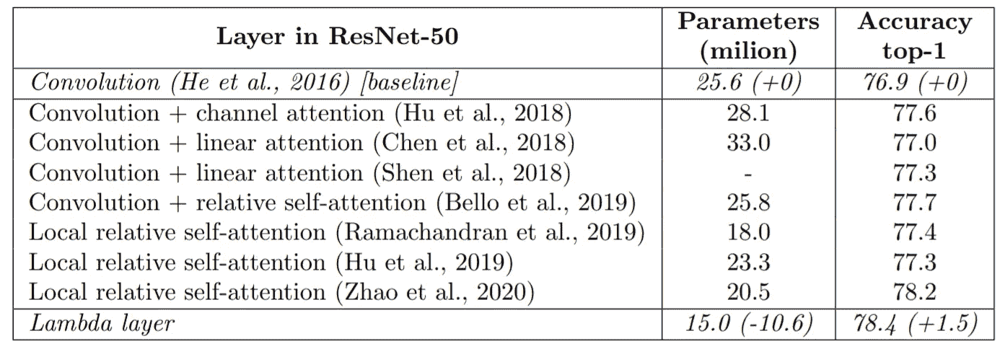*

*在具有 ResNet-50 架构的 ImageNet 上，lambda 层与卷积和注意力机制的比较。benchmark from "[lambda networks:无需关注的远程交互建模](https://arxiv.org/abs/2102.08602)*

*然而，由于 Bello 在他的研究中使用了大量数据集，即 ImageNet，以及他为在合理的时间内获得这些结果而开发的计算资源，即 8–128 TPU v3，这些结果的一对一再现对于普通学生和研究人员来说是不可能的；超出我们作为学生所掌握的资源。因此，范围略有变动。我们的目标不再是在没有公开代码的情况下准确地再现上述结果，而是找出这些结果是否也可以用更小的数据集来实现。*

*这个再现性项目的个人目标是双重的。首先，随着大量正在进行的研究，注意力似乎是目前最先进的。然而，注意力有一些缺点，lambda 层旨在解决这些缺点，同时略微提高准确性。因此，复制 lambda 层有助于社区在未来尽早采用这种潜在的高级算法。此外，它在更小和更低维数据集上的实现证明了该算法的鲁棒性，以及它在资源受限设备(TinyML)上的潜在实现。*

*第二个原因是增强和拓宽了此处展示的可再现性项目作者的深度学习知识和技能，这是代尔夫特理工大学由[Jan van Gemert](https://scholar.google.com/citations?user=JUdMRGcAAAAJ)博士教授的深度学习课程的一部分。为了感受深度学习，不仅要阅读大量的在线资源，还要对一些开创性的论文有亲身体验。在阅读了名为[“注意力是你所需要的全部”](https://arxiv.org/abs/1706.03762) [2]的广受欢迎的论文后，我们对可能跟进的所有论文感到兴奋。从抽象上来说，lambda 层有望成为变形金刚的一大进步，它针对多个弱点，带来更高的性能和更低的计算负载。渴望了解更多关于注意力的知识，并对 lambda 层的潜力感到兴奋，选择这个再现性项目对我们来说是一个显而易见的选择。*

# *4.为什么是 lambda 层？*

*Lambda 层与自我关注机制密切相关，因为它们允许模拟长程互动。然而，自我注意机制有一个很大的缺点，这与它们需要注意图来模拟层激活的相对重要性的事实有关，这需要额外的计算并且渴望 RAM(随机存取存储器)。这使得它们不太适用于严重依赖图像(由像素网格组成)的机器视觉应用，因为对这些像素中的每一个之间的远程交互进行建模需要计算和 RAM。因此，很明显，为了减少任何基于注意力的视觉任务的训练和推理时间，应该解决这个问题。*

*正如 Bello 在他的文章[1]: *中所说的，“我们提出了 lambda 层，它以更低的内存成本对查询和一组结构化的上下文元素之间的长期交互进行建模。Lambda 层将每个可用的上下文转换成称为 lambda 的线性函数，然后直接应用于相应的查询”。**

*[线性注意力机制](https://arxiv.org/abs/2007.14902)【3】提出了一个解决高内存使用率问题的方案。然而，这些方法不捕捉查询和上下文元素之间的位置信息(例如，像素在图像上的位置)。相比之下，Lambda 图层的内存使用率较低，并且可以捕获位置信息。后者甚至导致性能的提高，使得它在 ImageNet 数据集上优于具有线性注意和局部相对自我注意的卷积。*

# *5.LambdaNetworks 解释道*

*LambdaNetworks 优于 Transformers 的主要优点是，计算上下文的所有组件之间基于内容和位置的交互，可以选择是全局的还是局部的，而不产生昂贵的和存储器密集型的注意力图。为了实现这一点，lambda 层有 3 个主要步骤:*

1.  *计算内容 lambda 封装了上下文内容。*
2.  *位置λ的计算，其封装了查询和上下文元素之间的相对位置信息。*
3.  *将内容和位置应用于输出计算的查询。*

*下图提供了完整流程的概览。在下面的小节中，我们将详细解释每一个步骤，不断地引用所呈现的 lambda 层计算图。*

*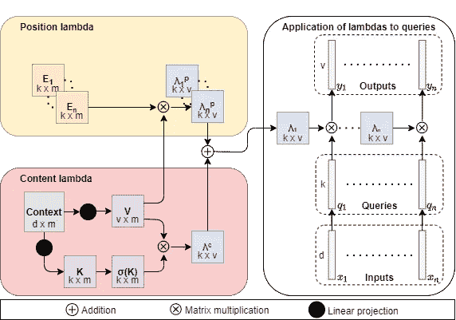*

*λ层的计算图。图片由作者提供，灵感来源[*《lambda networks:无需注意的远程交互建模》*](https://arxiv.org/abs/2102.08602)*

## *5.1 含量λ*

*对于内容λ的计算，使用全局上下文。在单个正方形图像的情况下，全局上下文由所有像素组成。因此，如果图像形状是 d×n×n，n 是沿着图像的宽度和长度的像素数，d 是图像尺寸(在彩色图像的情况下是 3)，则上下文是形状|n|×d，其中|n|=n。当理解上下文的尺寸时，计算图可能会产生误导，因为它显示它是形状|m|×d。与内容λ相比，位置λ使用局部上下文，作者决定根据后者的计算需要来表示尺寸。实际上，首先用全局上下文计算内容λ，然后用局部上下文计算位置λ。不幸的是，这种对λ和不同矩阵维数的顺序计算没有清楚地反映在计算图中。*

*在全局上下文中，值和键的计算如下:*

*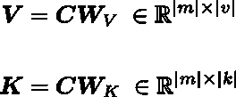*

*然后使用 softmax 沿着|m|维度对键进行规范化，而对值进行批量规范化。最后，从标准化值和密钥的矩阵乘法中获得内容λ。*

*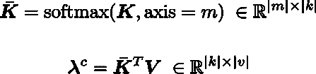*

*这种方法的好处是，内容 lambda 编码了如何独立于每个查询，仅基于上下文内容来转换查询。结果，内容λ在图像的所有查询/像素之间共享。*

## *5.2 位置λ*

*对于内容λ的计算，用户可以通过使|m|等于|n|来选择是使用大小为|m|×d 的局部上下文还是使用全局上下文。出于该再现性项目的目的，由于馈送到λ层的输入的低|n|值，即|n|⊂ [8，4，2，1]，全局上下文用于位置λ的计算。这个小的输入维度是由所使用的数据集(即 CIFAR-10)造成的，其图像比 ImageNet 小 6 倍。与从输入中提取局部上下文所需的额外计算相比，利用这个减少的数据集，从较小的上下文中计算位置λs 所获得的潜在加速是微不足道的。*

*接下来可以观察到，位置λ是值矩阵和位置嵌入之间的乘积的结果。后者是封装了 n 个查询中的每一个与上下文之间的位置关系的 n 个学习|m|×k 矩阵。结果，嵌入是产生 n 个位置λ的|n|×|m|× k 块。*

*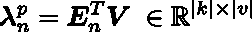*

*由于内容和位置信息的分离，可以在接收相同输入大小的 lambda 层之间共享位置嵌入，从而降低内存占用。位置λ编码查询需要如何仅基于它们相对于其上下文的每个组件的相对位置进行转换。*

## *5.3 应用于查询的 Lambdas*

*一旦计算了内容和位置λ，就有可能通过对两个分量求和来计算将应用于查询的最终λ矩阵。*

*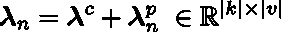*

*此外，查询的计算方式与键和值类似，即通过将线性投影矩阵应用于输入。*

*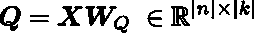*

*一旦计算了查询和它们各自的λ，λ通过计算的λ和从每个像素生成的查询之间的简单矩阵乘法将查询转换成输出；*矩阵中的每一行。**

**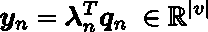**

## **5.4 多重查询λ层**

**在 LambdaNetworks 论文[1]中，观察到值维|v|的减少可以极大地减少计算成本以及空间和时间复杂性。因此，作者决定通过随意操纵它的值来将这些复杂性与这个维度解耦。**

**为此，他建议对应用相同 lambda 的每个(像素)输入使用|h|查询。那么单个(像素)输入的输出是 h 个输出中的每一个的级联结果:**

**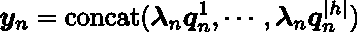**

**因此，|v|现在等于 d/|h|，这将复杂度降低了|h|倍。作者将这种值维度的减少称为多查询 lambda 层。值得注意的是，在 lambdas 的大小之间有一个权衡:**

**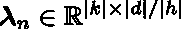**

**，以及查询的大小:**

**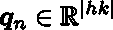**

# **6.约束、数据集和参数**

**在本节中，我们将解释 compute 中的约束如何导致使用不同的数据集，以及 Bello 如何以及为什么从原始论文中调整一些参数。然而，我们想强调的是，为了公平比较，大多数参数都与 Bello 使用的参数完全相同。**

## **6.1 制约因素**

**与 Bello 的设置相比，存在一些计算限制。Bello 作为一名谷歌研究员，在他的研究项目中使用了 32 个 TPUv3 单位的 ImageNet 分类数据集。不幸是，我们没有这台计算机。代尔夫特大学非常慷慨地向我们提供了 50 欧元的谷歌云信用。然而，50 欧元很可能不足以用 200 GB 大小的 ImageNet 来训练该架构几次。根据 Bello 使用的数据集，ImageNet 由 1.3 亿张过滤和平衡的 JFT 图像组成，这些图像带有由 EfficientNet-L2 生成的伪标签，准确率为 88.4%。因此，选择了不同的数据集，即 CIFAR-10。**

**这些数据是在[谷歌 Colab](https://colab.research.google.com/) 和一台高端笔记本电脑上进行训练和测试的，该笔记本电脑配有 2020 年的普通显卡。由于组件的可用性是固定的，本地笔记本电脑提供了可比较的结果作为健全性检查，而 Colab 根据运行时的可用性为客户机分配不同的资源。**

**主要环境是 Google Colab。它可以免费获得，因此被认为是这个项目最合适的候选。在这种环境中，由于资源是在平台的用户之间共享的，所以无法保证资源，因此很难说获得的结果在运行时间方面是否一致。这是因为在 [Nvidia K80、T4、P4 和 P100](https://research.google.com/colaboratory\/faq.html\#usage-limits) 之间，不仅 RAM 的数量会发生变化，而且可用的 GPU 类型也会发生变化。该算法根据具体情况确定最有可能使用的内存量，并为重度用户分配更多内存，最高可达 12 GB。一次会话的最大允许时间为 12 小时。就本项目而言，关键是分配的资源在整个会议期间不发生变化，这使得闭会期间的结果可以可靠地进行比较。**

**第二个培训环境包括一台笔记本电脑，配备 Intel i7–10750h，具有足够的冷却能力，Nvidia Quadro T1000 Max-Q 4 GB DDR5(库存速度)和 16 GB DDR 4 ram，采用单槽配置，库存速度为 2400 MHz。由于完全独立运行，所有结果都是可重复的。**

## **6.2 数据集**

**我们决定使用一个更小的数据集，即 [CIFAR-10](https://www.cs.toronto.edu/~kriz/cifar.html) 。
这是一个包含 10 类 60，000 幅 32x32 彩色图像的数据集，每类 6，000 幅图像，分割成 5:1 的训练测试比率。下面是这些图像的一个例子。**

**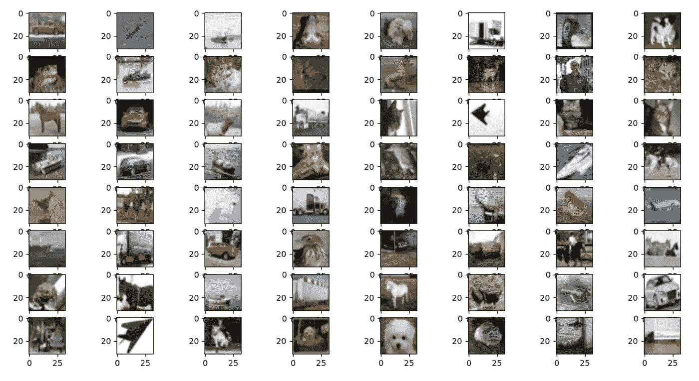**

**CIFAR-10 数据集样本。**

## **6.3 参数**

**为了找出论文作者是如何准确地汇编结果的，查看用于获得结果的初始条件和超参数是很重要的。接下来，我们编译一个列表，列出所有最重要的参数及其相应的定义和值。它们被分成三个表:**

**第一个表包含用户可以轻易改变的参数。它们都可以在我们的代码中的 ***user_input.py*** 中找到。这些参数包括批量大小、输入大小和初始学习速率等。**

**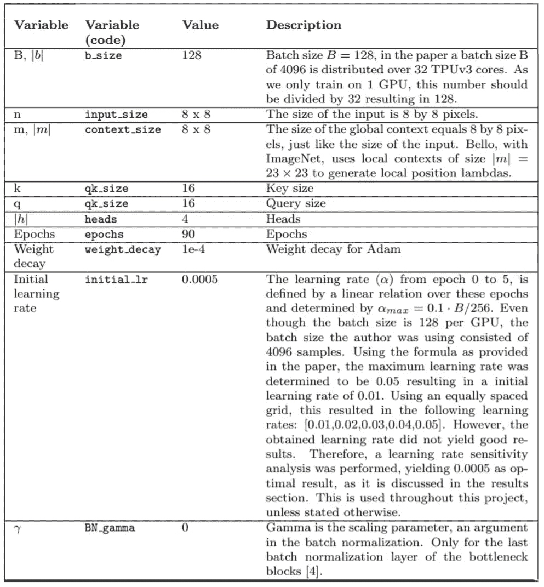**

**第二个表包含在 ResNet-50 和 lambda 层的实现中使用的其他参数。分别在 ***lambda_layer.py*** 、 ***resnet.py*** 和***resnet \ _ lambda . py***中定义。**

****

**第三表包含关于算法实现的更多信息。要了解更多信息，我们希望读者参考代码中的文档。**

**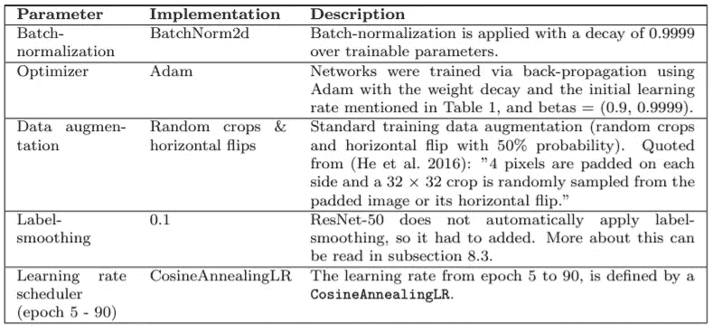**

# **7.实现细节:ResNet-50**

**对于基线实现，我们使用的是由 [Pytorch 团队](https://pytorch.org/hub/pytorch_vision_resnet/)提供的。接下来，我们解释数据预处理步骤、模型准备，并简要讨论训练和测试步骤。**

## **7.1 数据预处理**

**在将数据输入算法之前，需要对其进行预处理。在这里，数据首先被下载、扩充和标准化。为此，原始图像被随机裁剪，通过用四个黑色像素填充所有图像边来保持原始大小。此外，以 50%的概率随机翻转图像，并用均值[0.4914，0.4822，0.4465]和方差[0.2023，0.1994，0.2010]进行归一化；对应于 CIFAR-10 数据沿 3 个图像维度的平均值和方差的值。训练数据集的转换可以在下一个代码片段中观察到。**

**此后，训练和测试数据被馈送到迭代器(数据加载器),并且训练图像的样本被绘制用于视觉验证。**

## **7.2 模型准备**

**在使用预处理的数据执行训练和测试之前，需要创建模型。为此，需要定义损失函数和优化器，以及学习率调度器。**

**对于损失函数或标准的定义，LambdaNetworks 论文的作者提到使用了平滑值为 0.1 的标签平滑。但是，在所选的 ResNet-50 架构实现中，默认情况下这是找不到的。因此，Christian Szegedy 在论文“[反思计算机视觉的初始架构](https://arxiv.org/abs/1512.00567)”[5]中提出的标签平滑必须实现。为此，我们调整了由 [Suvojit Manna](https://gist.github.com/suvojit-0x55aa/0afb3eefbb26d33f54e1fb9f94d6b609) 提出的标签平滑，这导致了如下面的代码片段所示的最终紧凑形式。可以看出，在标签平滑之前应用的损失是与 log softmax 激活的交叉熵。**

**此外，Adam 优化器与超参数(重量衰减、初始学习率等)一起使用。)显示在[参数部分](#b975)。学习率调度器基于线性和余弦学习率调度器的组合。**

**在模型准备中，进一步检查模型是否可以在具有 CUDA 的主机 GPU 中运行，并且在由用户指定的情况下，它用存储在先前运行的用户指定的检查点中的参数来填充模型参数。作为设计选择，该模型每隔 5 个时期自动存储检查点。**

## **7.3 培训和测试**

**一旦定义了模型并预处理了数据，就在 Nvidia Quadro T1000 max-Q 4GB DDR5 上同时执行 90 个时期的训练和测试。在这一过程中，实施了两项措施，以保证顺利分析和比较结果。首先，训练和测试精度、损失和计算时间，以及每个时期的学习率，被存储在日志文本文件中，用于以后的分析。此外，存储精度和损耗信息，以便可以在 Tensorboard 中绘制。**

# **8.实现细节:LambdaNetworks**

## **8.1 单λ层实现**

**尽管本文中提供了一些代码片段，但它假设已经计算了键、值和查询，没有提供层参数初始化，并且不清楚如何定义位置嵌入。为了实现 lambda 层及其在 ResNet-50 架构中的平滑集成，使用 3 个主要方法创建了一个类:**

*****__init__*** :接收输入大小(|n|)、上下文大小(|m|)、值大小(|v|)、输出大小(d)、头数(h)和位置嵌入( ***E*** )作为输入的初始化方法。位置嵌入不是在类中创建的，因此它们可以在多个层中轻松共享。在类之外，嵌入被创建并作为输入提供给不同的 lambda 层。位置嵌入的实例化及其在 lambda 层之外的初始化定义如下:**

**对于键、值和查询的计算，应用单一线性变换而没有偏差。在查询的情况下，线性转换的输出大小为|n|×(kh ),如[多查询部分](#ed77)所述。可以在下面的代码中观察到这些转换:**

**此外，为值和查询实例化了 1D 批处理规范化层，并为键实例化了 softmax 函数:**

**该函数通过调用“ ***reset_params*** ”方法结束，这将在下面解释。**

*****reset_params*** :初始化 lambda 层的学习矩阵，即文中提到的具有相同正态分布的键、值和查询投影矩阵。如前所述，位置嵌入在λ层之外被初始化。**

*****正向*** :神经网络正向传播过程中运行的函数。首先，由于λ层需要将输入图像的高度和宽度压缩成一维，即|n|，输入 x 被整形如下:**

**此外，由于全局上下文用于当前的再现性项目，因此上下文也通过相应地调整输入的大小来获得:**

**下一步是使用 ***__init__*** 中定义的线性变换和归一化来计算关键字、查询和值:**

**最后，通过使用 torch.einsum 函数并遵循[λ网络解释章节](#31ec)中概述的等式，计算λs 和输出。输出在最后被整形，使得它具有与馈送到λ层的输入相同的维数。**

**可以看出，复制 lambda 层所需的所有计算都可以压缩到不到 20 行代码。**

## **8.2 ResNet-50 中的 Lambda 层集成**

**当阅读来自脸书人工智能研究所的[原始 ResNet 论文](https://arxiv.org/abs/1512.03385) [6]时，提出了不同的架构，其主要区别在于层数。从第一列可以看出，ResNet 架构包含 5 个模块( *conv1* 、 *conv2_x* 、 *conv3_x* 、 *conv4_x* 和 *conv5_x* )，在 LambdaNetworks 白皮书中称为 *cx* 级。**

**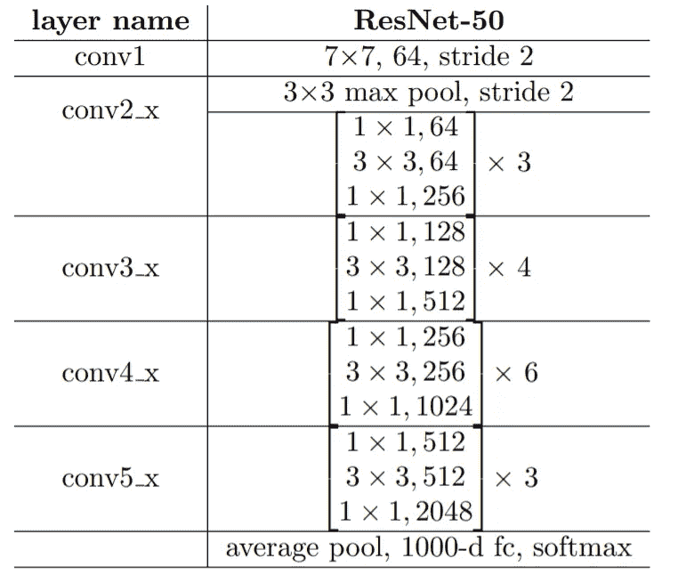**

**来自“[图像识别深度残差学习](https://arxiv.org/abs/1512.03385)的 ResNet-50 架构**

**在 [LambdaNetworks 论文](https://arxiv.org/abs/2102.08602) [1]中指出,(非混合)lambda 网络是通过用 lambda 层替换 ResNet 架构的瓶颈块中的 3×3 卷积而获得的，即 *conv2_x* 、 *conv3_x* 、 *conv4_x* 和 *conv5_x* 。因此，原始 ResNet-50 体系结构中的主要变化可以在瓶颈层的定义中找到，也可以在初始化位置嵌入的 ResNet 的初始化中找到。**

**以下两个代码片段显示了部分原始 ResNet-50 瓶颈层初始化及其在具有集成 lambda 层的 ResNet-50 中的相应代码行。它清楚地显示了 3×3 CNN 层如何被替换为 lambda 层，而其余代码保持不变。**

**此外，从 [lambda 层架构](#31ec)可以看出，lambda 层的输出与其输入具有相同的维度。然而，在最初的 ResNet-50 架构中，一些 3×3 CNN 层通过使用大于 1 的步幅来减小输入图像的大小。为了在基线和λ层实现之间建立公平的比较，在 ResNet-50 架构的那些阶段，也需要在λ层实现中缩小图像，其中原始 3×3 CNN 层使用大于 1 的步幅。为此，在网络的这些阶段，引入了一个平均 2D 池层，其内核大小为 3×3，(1，1)填充和相应的步长。与 1×1 卷积相比，汇集层的好处是网络不需要学习额外的参数。**

**每当对图像进行下采样时，都会生成新的位置嵌入，这些位置嵌入将与下一个 lambda 层共享，直到对图像进行新的下采样。**

**最后，下图显示了没有和有 lambda 层的 ResNet-50 的瓶颈层中的一个层的当前架构。在给出的场景中，该层使用的步幅是 2。在最初的 ResNet-50 中，已经存在由 1×1 卷积构成的下采样块，该下采样块应用于剩余连接，并且增加瓶颈层输入的维度以匹配其输出。现在，前面提到的平均汇集下采样块被添加到瓶颈层的末端。这种下采样的实施导致所需的 GPU RAM 从 5GB 减少到 2GB。**

**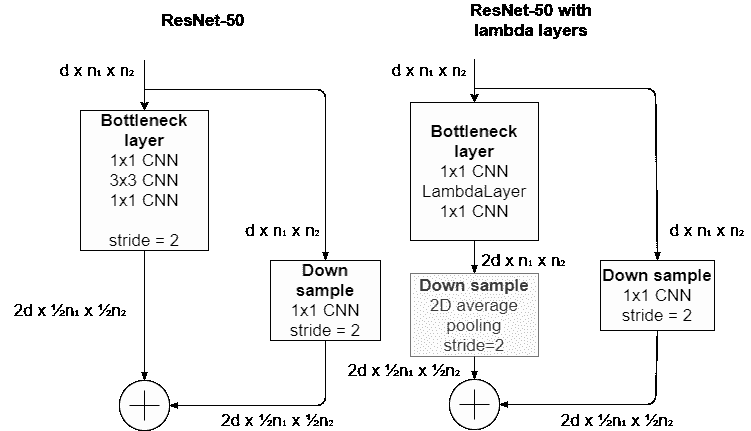**

**该框图显示了在基于 2D 平均池的具有 lambda 层的 ResNet-50 中附加下采样模块的实现。**

# **9.结果**

**原始论文对 lambda 层的主要主张是，与卷积层和注意力层相比，它们具有更好的性能和更高的计算效率。因此，下面两个部分分别比较了原始 ResNet-50 与其带有 lambda 层的修改版本的准确性，以及它们所需的训练计算时间和吞吐量。然后，第三部分提供了对初始学习率执行的简单灵敏度分析，以便将该超参数调整到新的架构-数据集组合。**

**除了使用的初始学习率是 0.0005 之外，所有的结果都是用先前定义的参数和值获得的；因为它被发现是最佳选择。**

## **9.1 准确性和模型复杂性**

**下面两个图表示 ResNet-50 及其 lambda 层修改版本相对于历元数的训练和测试数据分裂的准确度和损失。它显示了前 1 名的准确性，即其顶级类(softmax 之后概率最高的类)与其相应目标相同的数据点的百分比。正如可以观察到的，ResNet-50 的训练和测试精度性能度量高于具有 lambda 层的版本。在测试数据集的情况下，它高出 3.2%。结果，当在较低维度的数据集(如 CIFAR-10)上训练时，lambda 层并不优于卷积层；然而，他们仍然达到了竞争的结果。**

**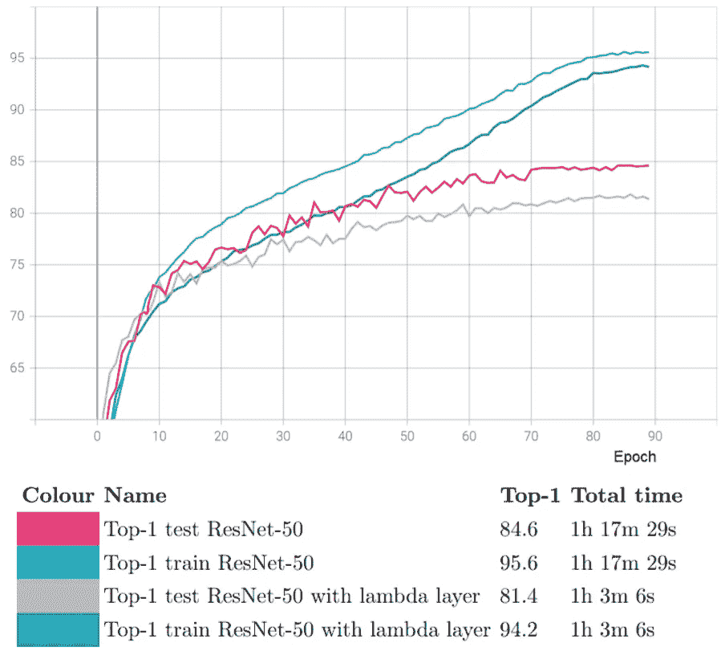**

**前 1 个 vs 时期的精度图**

**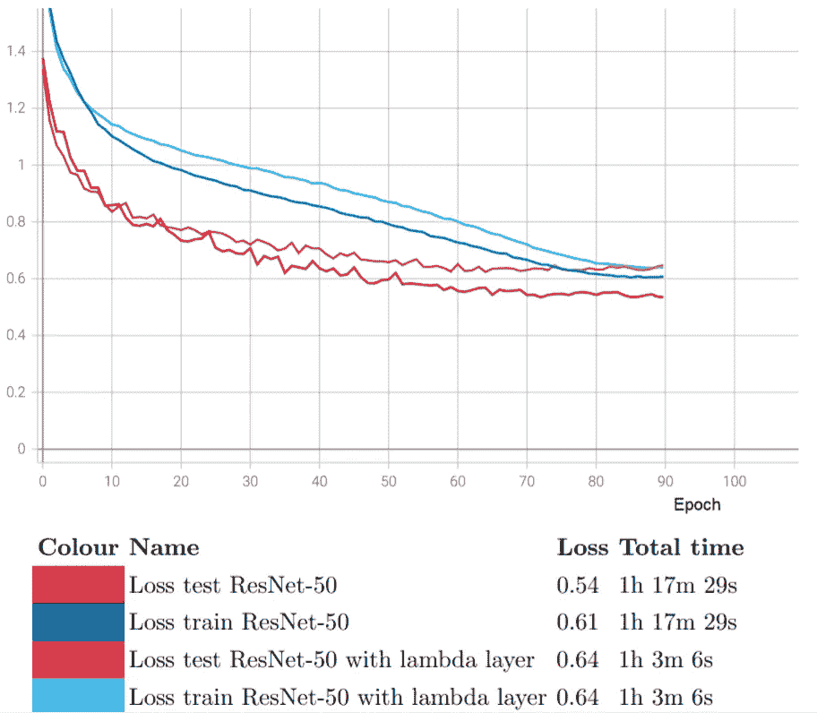**

**损失与时期的损失图**

**在原始的 ImageNet 数据集上，Bello 报告卷积基线的准确率为 76.9%，而 lambda layers 版本的准确率为 78.4%。与在 CIFAR-10 数据集中获得的结果相比，两种体系结构之间的关系已经颠倒。除此之外，据观察，在 CIFAR-10 上，两种架构的精度都有所提高。这个观察暗示了在 10 类而不是 1000 类中对图像进行分类的较低难度。**

**最后，Bello 报道了基线和 lambda 层模型分别具有 25.6 米和 15 米的可训练参数。在我们的例子中，他们分别有 23.5 米和 12.8 米。由于两个模型丢失了大约相同数量的参数，即 2M，我们假设丢失的参数来自借用的 [ResNet-50 实现](https://github.com/pytorch/vision/blob/master/torchvision/models/resnet.py)，而不是来自我们的 lambda 层实现。**

## **9.2 培训时间和吞吐量**

**准确度和损失图还显示了每个模型的训练时间。对于 ResNet-50，这是 1 小时 17 分 29 秒，结果每个时期的平均时间为 51.6 秒。对于具有实现的 lambda 层的 ResNet-50，总运行时间为 1 小时 3 分 6 秒，导致每个时期 42.1 秒。因此，看起来 ResNet-50 的训练和测试时间大约长了 18.5%，而准确性仅增加了 3.2%，并且 lambda 层的实现是有回报的。然而，人们不仅可以访问在时期 90 获得的最终结果，还可以访问中间结果。可以看出，对于基线 ResNet-50，在时期 90 具有λ层的 ResNet-50 的最高测试精度已经达到时期 41 左右。在这种情况下，基线 ResNet-50 的时期 41 转换为大约 35 分 20 秒，因此比其具有 lambda 层的等效物几乎快两倍。**

**当比较不同架构的吞吐量结果时，它们必须运行在相同的平台上。鉴于 Bello 在多个 TPUv3s 上运行他的算法，不可能将这个再现性项目的通量结果与 Bello 的结果进行比较。但是，可以比较 CIFAR-10 上基线和 lambda 层版本之间的吞吐量。在基线的情况下，训练时期平均花费 50.92 秒。假设有 50，000 个训练样本，基线的吞吐量是 981.93 ex/s。在λ层的情况下，训练时期大约花费 38.96 秒。结果，λ层模型具有 1283.26 ex/s 的吞吐量。从这些值可以看出，λ层具有比卷积层更高的吞吐量，即高 31%。**

## **9.3 学习率敏感性分析**

**最后，为了确定在该再现性项目中提出的架构-数据集组合的良好学习速率，初始学习速率( ***initial_lr*** )被修改；然而，学习速率调度器保持不变。结果，前 5 个时期的学习速率被定义为[**]initial _ lr]T7]，2 个⋅**]T9]initial _ lr]t11]，3 个⋅**]t13]initial _ lr]t15]，4 个⋅**]t17]initial _ lr]t19]，5 个⋅**【t21]initial _ lr]并且增加，而后面时期的学习速率遵循 a************

**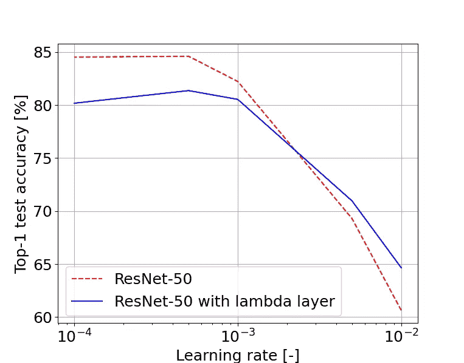**

**对于以下初始学习率，基线和 lambda 模型获得了最高的测试精度:0.01、0.005、0.001、0.0005 和 0.0001。使用 Bello 提出的公式得到了最高的学习率(0.01)，即***initial _ lr***= 0.1⋅b/(256⋅5)，以 b 作为我们 128 个样本的批量。其余的学习率是通过将预先计算的最高学习率连续减半而获得的。对于基线和λ层变体，可以在 **0.0005** 处观察到最大精度。结果可以在下图中看到。**

# **10.结论**

**LambdaNetworks 承诺提供优于卷积和注意力替代方案的性能，以及更低的内存占用和在训练和推理期间的显著加速。更高的准确性主要归因于提取的基于位置和基于上下文的交互的组合，而更低的存储器使用和更高的速度是通过绕过存储器密集型注意力图、在批元素之间共享上下文信息以及在 lambda 层之间共享位置嵌入来实现的。在最初的论文中，Bello 通过在 ImageNet a ResNet-50 上用 lambda 层交换其标准的 3×3 卷积来验证所有这些说法。这种数据集的选择阻碍了论文的可重复性，因为作者使用 32 TPUv3 进行训练，这是一种大多数学生和研究人员远远无法获得的资源。因此，本文介绍的工作通过在低维数据集(即 CIFAR-10)上进行训练来评估 lambda 层的准确性和速度。为此，我们不仅总结了 LambdaNetworks 上的原始论文并介绍了我们的实现，而且还讨论了我们认为对理解或复制它有歧义的那些方面。**

**从再现性项目中，我们可以突出 4 个主要结论:**

1.  **当在 CIFAR-10 这样的低维数据集上训练时，lambda 层并不优于卷积层；然而，他们仍然达到了竞争的结果。**
2.  **在 ImageNet 数据集上，Bello 报告基线准确率为 76.9%，λ层准确率为 78.4%。在 CIFAR-10 上，两种架构的精度都有所提高。这个观察暗示了在 10 个类别中对一幅图像进行分类的难度低于 1000 个类别。**
3.  **λ层具有比卷积层更高的吞吐量，即高 31%。这导致更少的训练时间。**
4.  **两种架构的最佳初始学习率都是 0.0005。**

**这项工作的结果表明，LambdaNetworks 可以应用于较小的低维数据集，其性能与原始论文中提出的性能相当，并且在可承受的计算时间预算内，即几个小时而不是几天。**

**这项工作的下一步是用本地上下文实现位置 lambda，其中| m |≦| n |。先前的再现性尝试为此目的使用了 3D 卷积。然而，得到的相对位置嵌入的维数是|m| × |k|,而不是|n| × |m| × |k|。因此，他们不是为每个像素计算相对位置嵌入，而是为整个输入计算单个位置嵌入。**

**最后，我们希望这项工作将有助于研究界对这种新型架构的讨论和潜在采用，并且我们的实施将加速业界对它的整合。**

# **11.推荐**

**为了对获得训练和测试准确度结果所需的时间得出更合理的结论，这些运行必须执行多次，并通过取其平均值或中值进行后处理。当在(免费的)Google Colab 中执行时，多次运行的重要性增加了，因为计算可用性会随着时间的推移而变化，并且人们无法正确地确定在每个时间点使用了哪个硬件配置。然而，一个会话内的结果是可比较的，但是建议在更稳定的平台上运行该算法，以便获得更准确的运行时间结果。**

**Bello 在 ImageNet 上使用的最大学习速率与我们在 CIFAR-10 上使用的有很大不同。当他使用一个特定的公式来获得最大学习速率时，我们使用一个粗糙的 1D 网格来调整学习速率。比较他的结果和我们的结果的准确性可能不公平。也许他训练过的 ResNet-50 和带有 lambda 层网络的 ResNet-50 的行为与我们的有很大不同，因为我们优化了学习速率。因此，他的人际网络中可能有比显示的更多的潜力。建议进行进一步的研究以找到最佳的学习速率。在这种情况下，观察热重启的调整或取消以及调度程序的类型是否会对准确性产生重大影响也是很有趣的。**

# **12.LambdaNetworks 论文作者的观点**

**这篇关于 LambdaNetworks 的论文承诺，与现有的基于注意力的替代方法相比，在加速训练和推理以及减少内存占用方面取得巨大进步，同时保持或略微提高性能。在此，我们希望向您介绍我们对该论文的看法，其中包括一些使其从现有文献中脱颖而出的方面，以及一些可以改进的地方。**

**总是先有好消息。尽管论文很长，也就是 31 页，但我们很高兴作者在讨论算法时非常完整和详细。Bello 不仅在 lambda 层的部分实现中包含了紧凑的代码片段，还包含了精确再现结果所需的所有信息(本文中已经讨论了模糊性)，甚至包括用于可学习参数的初始化。此外，他还包括一项消融研究，以支持他对建筑的选择。**

**我们也对论文的附录 A 感到非常惊讶。它以“常见问题”的形式提出了读者可以问自己的理论和实践问题。本附录中的一些条目有助于我们更好地理解论文并加以实施。因此，我们认为这是对文件的巨大补充，也是机构群体可以考虑在未来出版物中采用的成功格式。在提交给会议时，作者总是要回答审稿人提出的问题，以使他/她的提交被接受。如果这些问题不会导致最终文档的变化，它们可以作为“问答”附录包含在作者的回复中。**

**虽然这是事实，为复制文件，它包含了所有需要的信息，我们认为，作者提出了太多的变化，他的模型，使其阅读困难，有时令人困惑。因此，我们认为，该文件可能已被分成多份文件。例如，在论文的多个部分，Bello 提到了 ResNet-RS 在挤压和激励下的使用，这是一种与 lambda layers 论文同时发布的架构。这种分散在整篇论文中的信息的结合只会使读者迷失方向，即使对于注意力领域的专家来说也是如此，因为该信息最近才变得可用。此外，LambdaResnets 和带有 lambda 层的 ResNet 体系结构之间的区别不是很清楚。我们认为后者是前者的一个特例，但这在论文中没有明确指明。**

**除此之外，与“[注意力是你所需要的全部](https://arxiv.org/abs/1706.03762)”论文[2]相比，我们对 LambdaNetworks 论文的难度和复杂性感到惊讶。尽管架构和一般概念有许多共同点，但我们发现 LambdaNetworks 的论文更难阅读和可视化。鉴于这种架构的巨大潜力，我们认为可以从 2017 年推动机器学习领域关注的原始论文中吸取一些教训。**

**此外，我们认为原始论文中的图 2 可能非常误导人，因为它没有清楚地反映出全局上下文可用于内容λ，而局部上下文用于位置λ。此外，它没有显示如何从层输入中获得上下文。由于它是唯一显示概念的图形，该图中的模糊性会对研究团体对λ层的接受和传播产生不利影响。**

**总之，尽管该文件有许多含糊之处，但我们已经亲身体验了这一框架的巨大潜力。因此，我们希望作者将他未来的工作建立在 lambda 层的基础上，并通过提供 Google Colab 教程和概念的逐步解释来简化这种新方法的可访问性。通过这里提出的再现性项目和开源实现，我们希望为研究社区和行业提供访问这个新框架的便利。**

# ***参考文献***

**[1] I. Bello， [LambdaNetworks:建模无注意的远程交互](https://arxiv.org/abs/2102.08602) (2021)，学习表征国际会议**

**[2] A. Vaswani，N. Shazeer，N. Parmar，J. Uszkoreit，L. Jones，A. N. Gomez，L. Kaiser 和 I. Polosukhin，[注意力是你所需要的全部](https://arxiv.org/abs/1706.03762) (2017)，神经信息处理系统的进展**

**[3]李，苏，段，郑，[线性注意机制:一种有效的语义切分注意机制](https://arxiv.org/abs/2007.14902) (2020)，arXiv:2007.14902 [cs .简历]**

**[4] S. Ioffe 和 C. Szegedy，[批量标准化:通过减少内部协变量偏移加速深度网络训练](https://arxiv.org/abs/1502.03167) (2015)，第 32 届国际机器学习会议论文集**

**[5] C. Szegedy，V. Vanhoucke，S. Ioffe，J. Shlens 和 Z. Wojna，[重新思考计算机视觉的初始架构](https://arxiv.org/abs/1512.00567) (2016)，2016 年 IEEE 计算机视觉和模式识别会议(CVPR)**

**[6]何国光，张，任，孙，【深度残差学习用于图像识别】 (2016)，2016 年 IEEE 计算机视觉与模式识别会议(CVPR)**