# 基于 Python 的卫星影像土地覆盖分类

> 原文：<https://towardsdatascience.com/land-cover-classification-in-satellite-imagery-using-python-ae39dbf2929?source=collection_archive---------2----------------------->

## 机器学习|遥感

## 使用 K-最近邻(K-NNC)、支持向量机(SVM)和 Python 中的梯度推进分类算法对 Sundarbans 卫星影像进行土地覆盖分类。

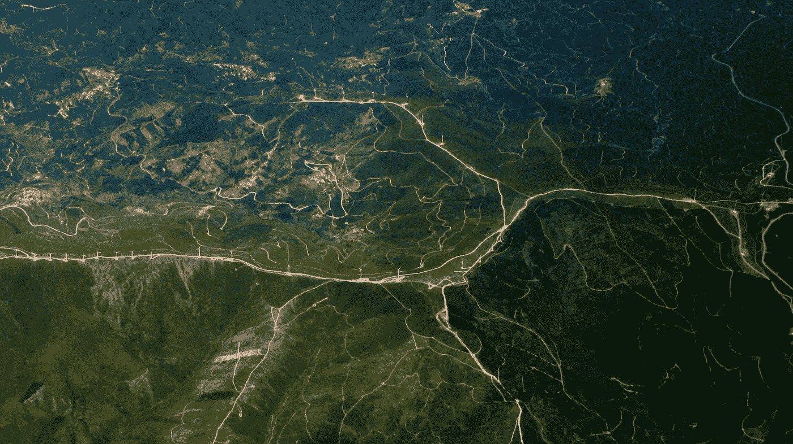

保罗·西莫斯·门德斯在 [Unsplash](https://unsplash.com/?utm_source=unsplash&utm_medium=referral&utm_content=creditCopyText) 上的照片

*本文通过 Python 使用不同的分类算法，帮助读者更好地理解孙德尔本斯卫星数据上的土地覆盖分类。*

# 目录

1.  **孙德尔本斯卫星图像**
2.  **K 近邻分类器(K-NNC)**
3.  **支持向量机(SVM)**
4.  **梯度推进分类器**
5.  **结论**
6.  **参考文献**

*让我们开始吧……*

# 孙德尔本斯卫星图像

来源:谷歌地图

孙德尔本斯是孟加拉湾恒河、布拉马普特拉河和梅克纳河汇合形成的三角洲中最大的红树林区之一。孙德尔本斯森林横跨印度和孟加拉国，面积约为 10，000 平方公里，其中 40%位于印度，是许多珍稀和全球濒危野生物种的家园。上面的谷歌地图显示了孙德尔本斯地区。在本文中，我们将使用 2020 年 1 月 27 日使用 *Sentinel-2* 卫星获得的 *Sundarbans* 卫星数据的一部分。

让我们开始编码吧..,

## 读出数据

让我们使用 rasterio 读取 12 个波段，并使用 numpy.stack()方法将它们堆叠成一个 n 维数组。堆叠后的结果数据具有形状(12，954，298)。使用 *loadmat* 方法从 *scipy.io* 包中读取卫星图像的地面实况。地面的真相有 6 类，包括水，植物，树木，裸地，等等

## 数据可视化

这些 Sundarbans 数据有多个波段，包含从可见光到红外的数据。所以对人类来说很难将数据可视化。通过创建 RGB 合成图像，可以更容易有效地理解数据。要绘制 RGB 合成图像，您将绘制红色、绿色和蓝色波段，分别为波段 4、3 和 2。由于 Python 使用从零开始的索引系统，所以需要从每个索引中减去值 1。因此，红色波段的指数为 3，绿色为 2，蓝色为 1。

如果像素亮度值偏向零值，我们创建的合成图像有时会很暗。这种类型的问题可以通过拉伸图像中的像素亮度值来解决，使用自变量`stretch=True`将这些值扩展到潜在值的整个 0-255 范围，以增加图像的视觉对比度。此外，`str_clip`参数允许您指定想要截取多少数据尾部。数字越大，数据将被拉伸或变亮的越多。

让我们看看绘制 RGB 合成图像以及应用拉伸的代码。

让我们使用*eathpy . plot*包*中的 *plot_bands* 方法来可视化地面真相。*

下图显示了孙德尔本斯卫星数据的合成图像和地面实况。

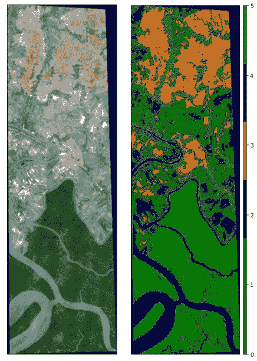

作者图片

正如我们所讨论的，数据包含 12 个波段。让我们用 EarhPy 包来可视化每个波段。`plot_bands()`该方法采用带和图的堆栈以及自定义标题，这可以通过使用`title=`参数将每个图像的唯一标题作为标题列表传递来完成。

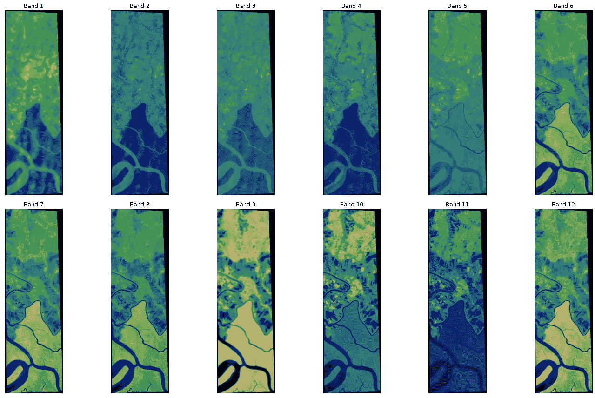

乐队的可视化-作者提供的图像

## 预处理

标准化是另一种**缩放**技术，其中数值以平均值为中心，偏差为一个单位**标准**。这意味着属性的平均值变为零，结果分布有一个单位**标准**偏差。缩放后的数据以 30:70 的比例分为训练数据和测试数据。下面的代码用于缩放和分割数据。

# **K 近邻分类器(K-NNC)**

k 近邻分类器是机器学习中广泛使用的分类器之一。这种方法的主要目的是同一类的数据实例在特征空间中应该更接近。

让我们考虑一个有 n 个数据点的数据集，表示为`f(x1, y1), (x2, y2)... (xi, yi)...(xn, yn)`。其中`xi` 和`yi` 分别是特征向量和对应的类别标签。对于新的数据点`p`，类别标签可以通过具有`k`值的 k-NNC 来预测，其中`k`是相邻数据点的数量，如下所示:

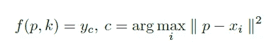

K-KNC，作者图片

我们将使用 scikit 学习包来实现 k-NNC。下面的代码 K-NNC 实例用`n_neighbors`作为 6，并拟合训练数据，预测测试数据的标签，显示准确性，并打印分类报告，其中包括精度，召回和每类的 F1 分数。K-NNC 在测试数据上显示了 98.94%的准确率**。**

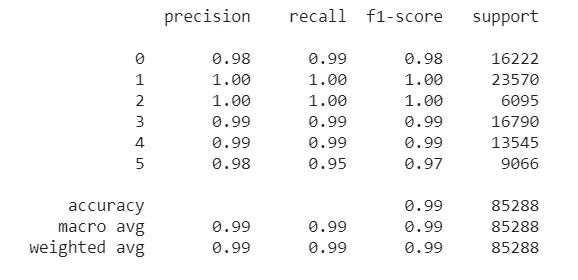

K-NNC 分类报告-作者图片

让我们来可视化 K-NNC 的分类图，下面的代码用于预测 Sundarbans 数据的标签，并使用 earthpy 包中的`plot_bands()`方法绘制数据。

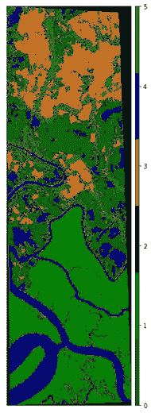

使用 K-NNC 的分类地图-按作者分类的图像

# 支持向量机(SVM)

支持向量机(SVM)是一种监督学习方法，它从一组已标记的训练数据中生成输入-输出映射函数。映射函数可以是分类函数，即输入数据的类别，也可以是回归函数。

对于分类，诸如径向基函数(RBF)、多项式、Sigmoid 等非线性核函数通常用于将输入数据变换到高维特征空间，在该空间中，输入数据与原始输入空间相比变得更加可分。然后创建最大利润超平面。由此产生的模型仅依赖于类边界附近的训练数据的子集。

下面的代码用于创建一个正则化参数`C`为 3 和 RBF 核的 SVM 实例。拟合数据，预测测试数据的标签，并打印准确性和分类报告。

支持向量机(SVM)算法在测试数据上显示出 99.88%的准确率。分类报告如下所示:

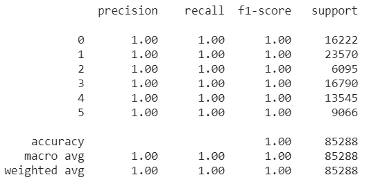

作者图片

让我们来可视化 SVM 的分类地图，下面的代码用于预测 Sundarbans 数据的标签，并使用 earthpy 包中的`plot_bands()`方法绘制数据。

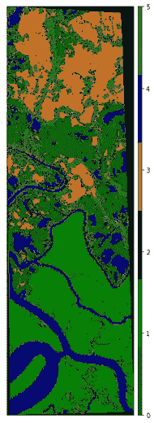

使用 SVM 的孙德尔本斯分类地图-图片由作者提供

# **梯度推进分类器**

梯度推进是一种因其预测速度和准确性而备受关注的技术，尤其是对于大型复杂数据。梯度推进是一种机器学习推进。它依赖于直觉，即最佳可能的下一个模型，当与先前的模型结合时，最小化整体预测误差。关键思想是为下一个模型设定目标结果，以最小化误差。

今天我们将使用 **lightGBM** ，它是一个梯度推进框架，利用了基于树的学习算法。LightGBM 之所以被称为“ **Light** ，是因为它的计算能力和给出结果的速度更快。运行需要**更少的内存，并且**可以处理大量数据**。它是竞赛中使用最广泛的算法之一，因为该算法的目的是获得良好的结果精度。**

下面的代码用于创建一个`lightgbm`的实例，参数包括学习速度、最大深度、类的数量等

`lightbgm`分类器对测试数据显示了 **98.55%** 的准确率，分类报告如下所示。

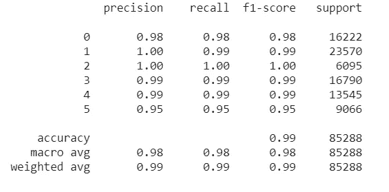

作者图片

让我们形象化使用`lightgbm`分类器生成的分类图。以下代码用于预测 Sundarbans 数据的标签，并使用 earthpy 包中的`plot_bands()`方法绘制数据。

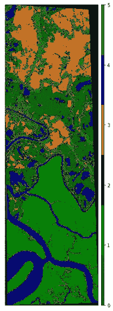

使用 lightgbm 分类器的孙德尔本斯分类图-图片由作者提供

# 结论

本文展示了如何使用 Python 实现 K-NNC、SVM 和 LightGBM 分类器对孙德尔本斯卫星数据进行土地覆盖分类。与 K-最近邻分类器(K-NNC)和 LightGBM 分类器相比，支持向量机表现出更好的性能。下图显示了上述三个分类器的分类图。

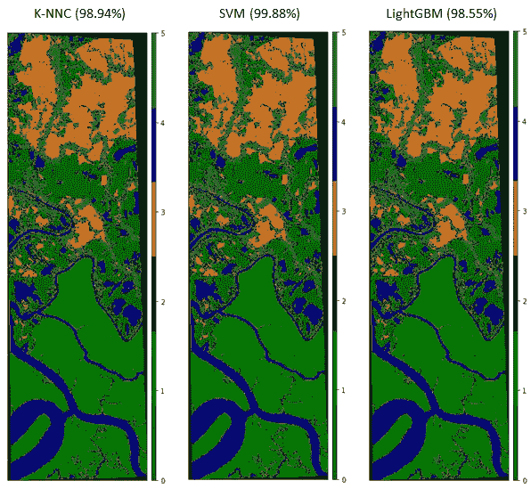

基于准确率的分类器比较——按作者分类的图像

本文中使用的代码可以从下面的 GitHub 库获得。

 [## syamkakarla 98/卫星图像分析

### 此时您不能执行该操作。您已使用另一个标签页或窗口登录。您已在另一个选项卡中注销，或者…

github.com](https://github.com/syamkakarla98/Satellite_Imagery_Analysis) 

快乐学习✨

# 更多来自作者

 [## 利用卫星影像和 Python 进行野火探测

### 卫星图像与计算机视觉相遇:使用 Python 在澳大利亚进行野火探测的教程

towardsdatascience.com](/wildfire-detection-using-satellite-imagery-with-python-d534d74d0505)  [## 使用 Detectron2 对自定义数据进行字符识别和分段

### 利用迁移学习的力量

towardsdatascience.com](/character-recognition-and-segmentation-for-custom-data-using-detectron2-599de82b393c)  [## PySpark 初学者指南

### 第 1 章:使用美国股票价格数据介绍 PySpark

towardsdatascience.com](/beginners-guide-to-pyspark-bbe3b553b79f)  [## 超光谱图像分析—入门

### 使用 Python 进行高光谱图像分析的演练。

towardsdatascience.com](/hyperspectral-image-analysis-getting-started-74758c12f2e9) 

# 参考

 [## 使用 Python 进行卫星影像分析的综合指南

### 使用 Python 分析卫星图像的不同方法和机器学习技术，以及实践教程和…

towardsdatascience.com](/comprehensive-guide-to-satellite-imagery-analysis-using-python-1b4153bad2a)  [## 基于 Python 的 K-Means 聚类的卫星影像地面实况标注

### 使用 Python 的 K-Means 聚类算法对卫星影像进行地面实况标注的简单教程

towardsdatascience.com](/ground-truth-labeling-of-satellite-imagery-using-k-means-clustering-with-python-b4ab02e1314f)  [## sk learn . neighbors . kneighborsclassifier-scikit-learn 0 . 24 . 1 文档

### 实现 k-最近邻投票的分类器。了解更多信息。参数 n_neighborsint，默认值=5…

scikit-learn.org](https://scikit-learn.org/stable/modules/generated/sklearn.neighbors.KNeighborsClassifier.html)  [## sk learn . SVM . SVC-sci kit-learn 0 . 24 . 1 文档

### c-支持向量分类。该实现基于 libsvm。拟合时间至少与…成二次比例

scikit-learn.org](https://scikit-learn.org/stable/modules/generated/sklearn.svm.SVC.html)  [## 欢迎阅读 LightGBM 的文档！-light GBM 3.1.1.99 文档

### 编辑描述

lightgbm.readthedocs.io](https://lightgbm.readthedocs.io/en/latest/#)