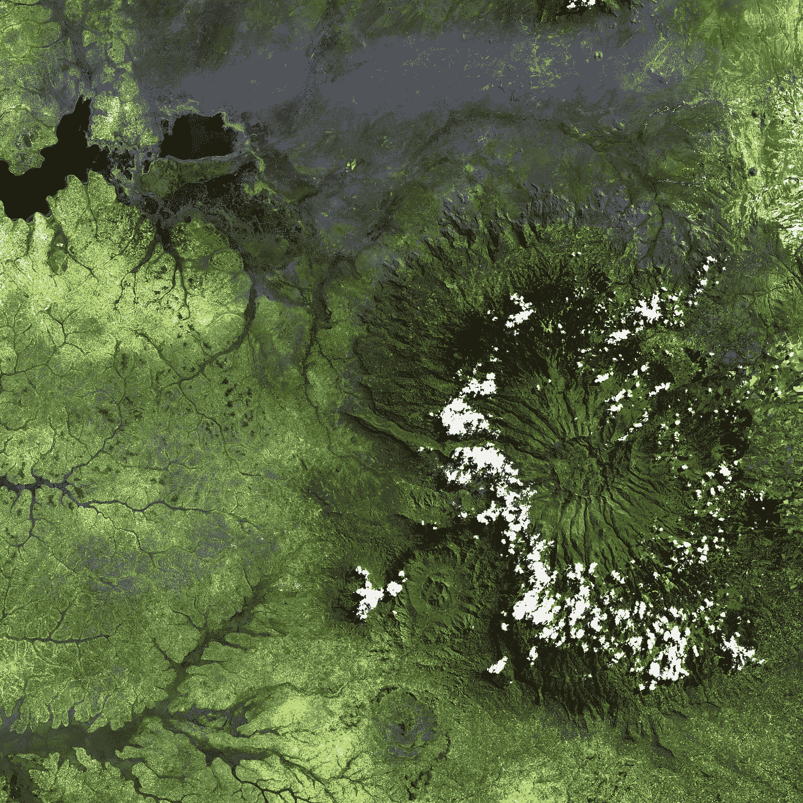
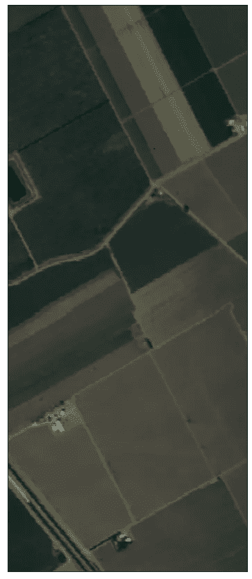
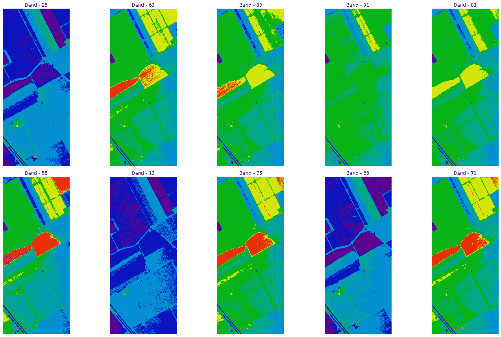
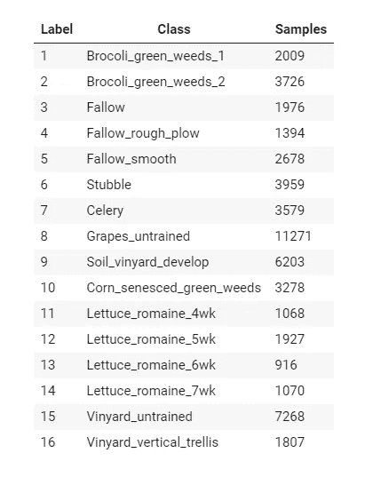
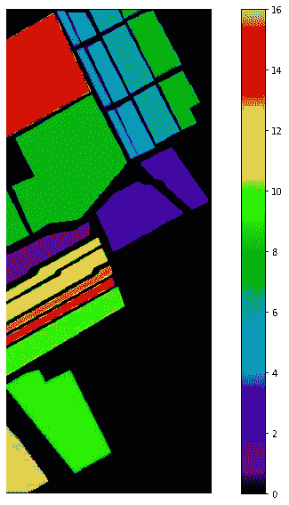
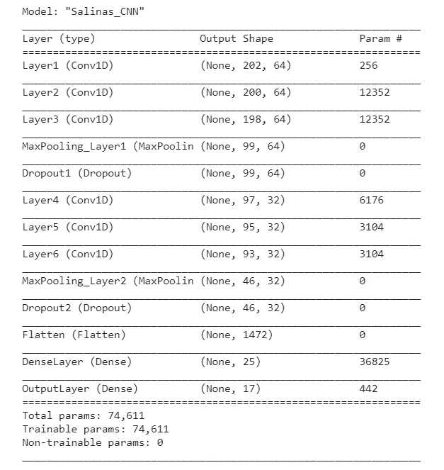
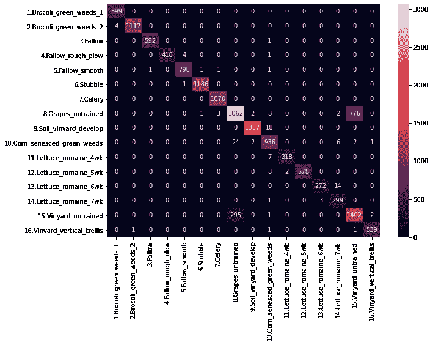
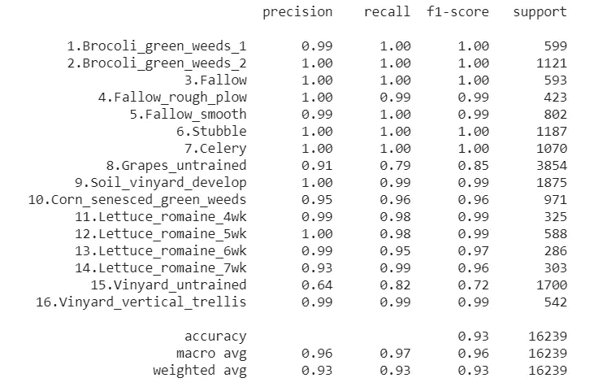

# 利用卷积神经网络对卫星图像进行土地覆盖分类

> 原文：<https://towardsdatascience.com/land-cover-classification-of-satellite-imagery-using-convolutional-neural-networks-91b5bb7fe808?source=collection_archive---------4----------------------->

## 深度学习|遥感

## 使用卷积神经网络对卫星影像进行土地覆盖分类的 Python 实践教程。

美国地质勘探局在 [Unsplash](https://unsplash.com/s/photos/satellite-imagery?utm_source=unsplash&utm_medium=referral&utm_content=creditCopyText) 上拍摄的照片

利用遥感数据进行土地覆盖分类的任务是对光谱特征相似的像素或对象进行分类，并将其分配到指定的分类类别，如森林、草原、湿地、荒地、耕地和建筑区。各种技术已被应用于土地覆盖分类，包括传统的统计算法和最近的机器学习方法，如随机森林和支持向量机等

> *本文涵盖了使用卷积神经网络(CNN)对卫星影像进行土地覆盖分类的 Python 实践教程。*

# 目录

1.  **简介**
2.  **卷积神经网络**
3.  **萨利纳斯恒指**
4.  **CNN 的实现**
5.  **培训**
6.  **结果**
7.  **结论**
8.  **参考文献**

让我们开始吧，✨

# 介绍

卫星图像有着广泛的应用，它融入了人类生活的方方面面。特别是*遥感*经过多年的发展，已经解决了不同领域的很多问题。在*遥感*中，高光谱遥感器被广泛用于监测具有高光谱分辨率的地球表面。

**高光谱成像**是遥感中的一项重要技术，它收集从可见光到近红外波长范围内的电磁波谱。超光谱成像传感器通常提供来自地球表面同一区域的数百个窄光谱带。在高光谱图像(HSI)中，每个像素可以被看作一个高维向量，其条目对应于特定波长的光谱反射率。

由于具有分辨细微光谱差异的优势，高光谱遥感已被广泛应用于各种领域，如 C *rop 分析*，G *生态制图*，M *矿产勘探*，*国防研究、城市调查、军事监视、洪水跟踪、*等。

使用下面的文章和研究论文来更好地理解高光谱图像。

 [## 超光谱图像分析—入门

### 使用 Python 进行高光谱图像分析的演练。

towardsdatascience.com](/hyperspectral-image-analysis-getting-started-74758c12f2e9)  [## 使用 EarthPy 对卫星图像进行探索性数据分析

### 在本文中，我们将使用 EarthPy 来处理卫星图像，并进行探索性数据分析(EDA)…

towardsdatascience.com](/exploratory-data-analysis-eda-on-satellite-imagery-using-earthpy-c0e186fe4293)  [## 超光谱遥感应用简介

### 植被指数叶面积指数高光谱数据悬浮泥沙含量土地类这些…

link.springer.com](https://link.springer.com/chapter/10.1007/978-3-662-47456-3_9) 

# 卷积神经网络(CNN)

深度学习是机器学习的一个子集，通过合成多个非线性变换来产生高级抽象。在深度学习算法中，卷积神经网络(CNN)在计算机视觉和遥感领域，尤其是图像分类领域，已经获得了广泛的应用。

卷积神经网络(CNN)是一种基于人工神经网络使用卷积乘法的深度学习方法。近年来，细胞神经网络在土地覆盖分类中得到了广泛的应用，表现出了显著的性能。典型的 CNN 由卷积层、汇集层和全连接层组成。

给定 HSI(1-D CNN 的向量)的一个像素，几个具有特定窗口大小的滤波器扫描图像(或向量)以在卷积层创建特征图。训练过滤器以提取输入数据的重要特征。池图层通过从给定窗口中提取代表值(如平均值或最大值)来减小要素地图的空间大小。

这一过程被广泛用于通过避免过拟合问题同时显著降低计算成本来使 CNN 模型更加稳健。完全连接的图层使用先前图层的要素生成分类或回归的最终结果。此外，放弃是一种广泛使用的正则化方法，以缓解过拟合问题。Dropout 通过将连接的权重设置为零来随机丢弃层之间的一些连接。Dropout 可以应用于任何上述层。

# 萨利纳斯恒指

加州萨利纳斯山谷上空的 224 波段 [AVIRIS 传感器](http://aviris.jpl.nasa.gov/)采集到萨利纳斯 HSI。其特点是空间分辨率高(3.7 米像素)。覆盖的区域包括 512 行乘以 217 个样本。与印度松树场景一样，我们丢弃了 20 个吸水带。该图像仅作为 at 传感器辐射数据提供。它包括蔬菜、裸露的土壤和葡萄园。下面是*萨利纳斯* HSI 的 RGB 合成图像。

萨利纳斯 HSI 的 RGB 合成图像—作者提供的图像

下图显示了 Salinas HSI 数据的 10 个波段。

萨利纳斯 HSI 的乐队——作者图片

Salinas HSI 包含 16 个类别，如西兰花、绿色杂草、休闲、残茬、芹菜、葡萄、葡萄园、玉米、莴苣等。下图显示了有关类别的信息以及样本数量。

类别描述—按作者分类的图像

salinas HSI 数据的基本事实如下所示，HSI 的光谱样本不包含被定义为*零(0)* 的信息，它们必须在分析前被丢弃，并以*黑*色显示。

萨利纳斯·希的地面真相——作者的形象

# **实施 CNN**

让我们建立一个具有不同层的一维 CNN，例如卷积、最大池、漏失和密集层。

CNN 模型的架构如下所示:

CNN 模型摘要—作者图片

# 培养

让我们从加载数据开始，salinas 数据在*中可用。mat* 格式。以下代码用于加载数据，并将数据转换为 pandas 数据帧，以便进一步处理。

下面的代码将数据标准化，并以 70:30 的比例将数据分成训练和测试。

用于训练 DNN 的优化器、损失和回调的简要说明。

## Adam 优化器

*Adam* 是一种优化算法，可用于替代经典的随机梯度下降程序，根据训练数据迭代更新网络权重。使用 *adam* 优化器的优点是:

*   易于实现。
*   计算效率高。
*   内存需求小。
*   对梯度的对角重标度不变。
*   非常适合在数据和/或参数方面很大的问题。
*   适用于非静止目标。
*   适用于非常嘈杂和/或稀疏梯度的问题。
*   超参数有直观的解释，通常需要很少的调整。

## 范畴交叉熵

[交叉熵](https://en.wikipedia.org/wiki/Cross_entropy)是用于多类分类问题的默认损失函数。在这种情况下，它适用于多类分类，其中目标值位于集合{0，1，3，…，n}中，每个类都分配有一个唯一的整数值。数学上是最大似然推理框架下的首选损失函数。首先要评估的是损失函数，只有在你有充分理由的情况下才会改变。

交叉熵将计算一个分数，该分数总结了问题中所有类的实际和预测概率分布之间的平均差异。分数被最小化，并且完美的交叉熵值是 0。

在编译模型时，可以通过指定'*categorial _ cross entropy*'将交叉熵指定为 Keras 中的损失函数。

不同的回调如模型检查点，提前停止，张量板。

## 复试

**提前停止:**一种减少神经网络过拟合的技术是使用提前停止。如果没有真正学到任何东西，提前停止可以通过终止训练过程来防止模型过度训练。这是非常灵活的——您可以控制要监控什么指标，它需要改变多少才能被视为“仍在学习”,以及在模型停止训练之前它可以连续失败多少个时期。

**ModelCheckpoint:** 这个回调会在每次成功的历元之后将你的模型保存为一个检查点文件(以`hdf5 or h5`格式)到磁盘。您实际上可以将输出文件设置为基于 epoch 动态命名。您也可以将损失值或准确度值作为日志文件名的一部分。

以下代码用于训练 CNN 模型。

## 图表

训练期间的准确度和损失图的代码如下所示， *X 轴*代表*时期*，而 *Y 轴*代表*百分比。*

# 结果

训练后的 CNN 模型有 92.40%的准确率，让我们看看**混淆矩阵——**一种表格表示，通常用于描述分类模型(或“分类器”)在一组真实值已知的测试数据上的性能。

输出如下所示:

混淆矩阵-作者图片

分类报告如下所示:

分类报告—按作者分类的图像

# 结论

本文正式介绍了高光谱图像及其应用，卷积神经网络(CNN)在 Salinas HSI 土地覆盖分类中的实现，并以*分类报告*、*混淆矩阵*的形式解释结果。

> 详细的实践教程可以通过下面的 GitHub 链接获得。

 [## syamkakarla 98/超光谱 _ 图像 _ 分析 _ 简化

### 使用 python 进行简单的高光谱图像分析，还实现了不同的机器学习技术。…

github.com](https://github.com/syamkakarla98/Hyperspectral_Image_Analysis_Simplified/tree/master/1D_CNN) 

# 更多来自作者

 [## 使用 EarthPy 对卫星图像进行探索性数据分析

### 在本文中，我们将使用 EarthPy 来处理卫星图像，并进行探索性数据分析(EDA)…

towardsdatascience.com](/exploratory-data-analysis-eda-on-satellite-imagery-using-earthpy-c0e186fe4293)  [## 利用深度神经网络对高光谱图像进行土地覆盖分类

### 使用深度学习(DL)对使用 Python 的高光谱影像进行土地覆盖分类。

towardsdatascience.com](/land-cover-classification-of-hyperspectral-imagery-using-deep-neural-networks-2e36d629a40e)  [## 高光谱图像土地覆盖分类自动编码器第一部分

### 使用 Python 使用自动编码器对高光谱图像进行土地覆盖分类的演练。

towardsdatascience.com](/autoencoders-for-land-cover-classification-of-hyperspectral-images-part-1-c3c847ebc69b)  [## PySpark 初学者指南

### 第 1 章:使用美国股票价格数据介绍 PySpark

towardsdatascience.com](/beginners-guide-to-pyspark-bbe3b553b79f) 

# 参考

 [## 高光谱遥感场景

### 收集者:M . graa，MA Veganzons，B . ayer di 在这里你可以找到一些公开的高光谱信息…

www.ehu.eus](http://www.ehu.eus/ccwintco/index.php/Hyperspectral_Remote_Sensing_Scenes)  [## Plotly Python 图形库

### Plotly 的 Python 图形库制作出交互式的、出版物质量的图形。如何制作线图的示例…

plotly.com](https://plotly.com/python/)  [## keras:Python 深度学习 API

### Keras 是为人类设计的 API，不是为机器设计的。Keras 遵循减少认知负荷的最佳实践:it…

keras.io](https://keras.io/)