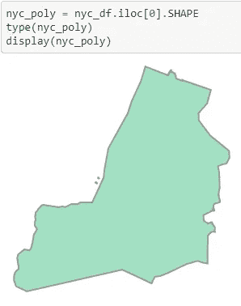
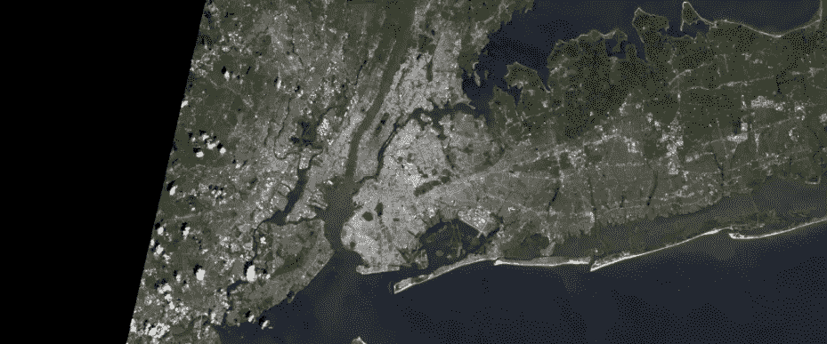
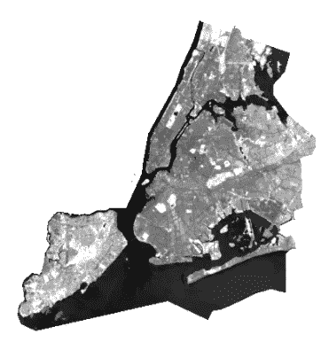
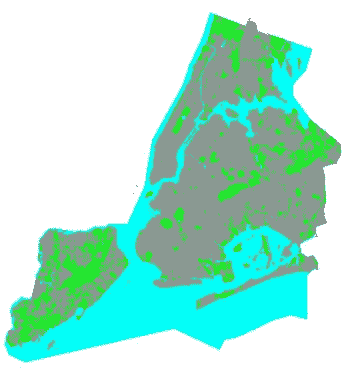
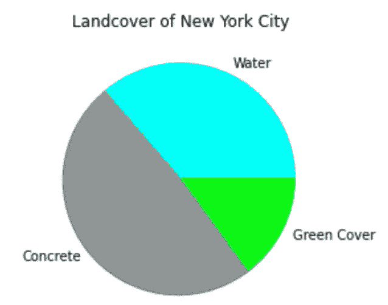

# 使用 Python 和 ArcGIS 进行土地覆盖分析

> 原文：<https://towardsdatascience.com/landcover-analysis-using-python-and-arcgis-74223a2c508a?source=collection_archive---------27----------------------->

## 在 Jupyter 笔记本中创建数据地图或执行空间分析


美国地质调查局提供的陆地卫星图像

ArcGIS 是地质统计分析的顶级平台之一。将 ArcGIS 库与 python 结合使用，您将能够分析 shapefiles、显示 Landsat 卫星影像、创建数据地图，以及在 Jupyter 笔记本中完成更多工作！使用这个库可以创建无限数量的数据科学项目，但对于本文，我将重点关注一个简单的 NDVI(归一化差异植被指数)分析。

在我们开始之前，确保你已经安装了所有必要的库，在 ESRI 的网站上查看 [arcpy，了解更多你需要的东西。以下是我在分析中使用的所有库:](https://pro.arcgis.com/en/pro-app/latest/arcpy/get-started/what-is-arcpy-.htm)

```
**import** **pandas** **as** **pd**
**from** **datetime** **import** datetime
**from** **IPython.display** **import** Image
**from** **IPython.display** **import** HTML
**import** **matplotlib.pyplot** **as** **plt
import sys
import** **arcgis**
**from** **arcgis.gis** **import** GIS
**from** **arcgis.raster.functions** **import** apply, clip, remap, colormap
**from** **arcgis.geometry** **import** lengths, areas_and_lengths, project
**from** **arcgis.geometry** **import** Point, Polyline, Polygon, Geometry
**from** **arcgis.geocoding** **import** geocode
**from** **arcgis.features** **import** FeatureLayer
```

# **1。定义你的区域**

这部分完全取决于你，对于这个项目，我将使用纽约市。选择区域后，您需要找到与该位置相关的要素图层文件。通常，这可以通过使用 ESRI 的 RESTful API 找到，下面是我如何找到 NYC 的 FeatureLayer:

```
nyc_fl = FeatureLayer('https://gisservices.its.ny.gov/arcgis/rest/services/NYS_Civil_Boundaries/FeatureServer/4')
ny_df = pd.DataFrame.spatial.from_layer(nyc_fl)
nyc_df = ny_df.iloc[32:33]
```

这给了我一个地理数据框架，我挑出了覆盖纽约县的第 32 行。在我确定了面积之后，我只是把空间部分转换成一个 shapefile。



作者图片

# 2.获取卫星图像

这就是我们如何定义我们的要素图层的土地覆盖。NDVI 分析的工作原理是基于卫星图像的每个像素分析颜色。最简单的方法是使用 ESRI 的陆地卫星图像:

```
landsat_item = gis.content.search('title:Multispectral Landsat', 'Imagery Layer', outside_org=**True**)[0]
landsat = landsat_item.layers[0]
```

然后，您可以使用 Landsat 项目，定义理想的云量百分比(尽可能保持低的百分比)并设置开始和结束日期:

```
selected = landsat.filter_by(where="(Category = 1) AND (cloudcover <=0.05)",time=[datetime(2020, 4, 1), datetime(2020, 6, 30)],                              geometry=arcgis.geometry.filters.intersects(area['extent'])) df = selected.query(out_fields="AcquisitionDate, GroupName, CloudCover, DayOfYear",                   order_by_fields="AcquisitionDate").sdf df['AcquisitionDate'] = pd.to_datetime(df['AcquisitionDate'], unit='ms')
```



美国地质调查局提供的陆地卫星图像

# 3.添加 NDVI 滤镜并创建一个剪辑

现在你有了你的卫星图像，你可以应用“NDVI 原始数据”函数来计算每个像素的 NDVI

```
nyc_colorized = apply(nyc_image, 'NDVI Raw')
```

然后，您可以使用我们之前定义的 shapefile 来获得您所在区域的完美剪辑

```
nyc_clip = clip(nyc_colorized,nyc_poly)
nyc_clip.extent = area['extent']
```



作者图片

# 4.颜色变换

NDVI 值的范围从-1 到 1，由你决定如何对你的土地覆盖进行分类，但是我建议[阅读更多关于这个值代表什么的](https://gisgeography.com/ndvi-normalized-difference-vegetation-index/)。对于这个项目，我将土地覆盖分为三组:水，混凝土和植被。

```
masked = colormap(remap(nyc_clip, 
                        input_ranges=[-1,0,     *# water*
                                     -0.1, 0.4, *# Concrete*
                                     0.4, 1],   *# Vegetation, Trees* 
                        output_values=[1, 2, 3]),
                        colormap=[[1, 1, 255, 248], [2, 144, 148, 148], [3,14,247,22]], astype='u8')
```



作者图片

# 4.分析

现在你有了你的色彩映射表，你可以分析它了！

```
xpixel = (nyc_clip.extent['xmax'] - nyc_clip.extent['xmin']) / 800
ypixel = (nyc_clip.extent['ymax'] - nyc_clip.extent['ymin']) / 400

full_res = masked.compute_histograms(nyc_clip.extent,
                                   pixel_size={'x':xpixel, 'y': ypixel})
total_pix = 0
hist = full_res['histograms'][0]['counts'][0:]
**for** x **in** hist[1:]:
    total_pix += xcolors=['#0EF716','#01FFF8','#909494']
labels =[ (hist[1]/sum(hist)), (hist[2]/sum(hist)), (hist[3]/sum(hist)) ]
plt.pie(hist, labels=['', 'Water', 'Concrete', 'Green Cover'],colors=colors,
        shadow=**True**)
plt.title('Landcover of New York City')
plt.show()
```



作者图片

这只是一个项目想法，但我希望你能以此为灵感，创造出更好的东西。想知道您所在位置的土地覆盖在这些年里发生了怎样的变化？更改开始和结束日期以创建多个色彩映射表。想知道云量如何影响精确度吗？提高云量百分比，比较两者。想要在简历中添加一个独特的、以空间为重点的数据科学项目吗？考虑将 ArcGIS 与 python 结合使用！

感谢您的阅读！

完整笔记本:[https://github . com/Bench-amble/geo/blob/main/NYC _ land cover . ipynb](https://github.com/Bench-amblee/geo/blob/main/nyc_landcover.ipynb)