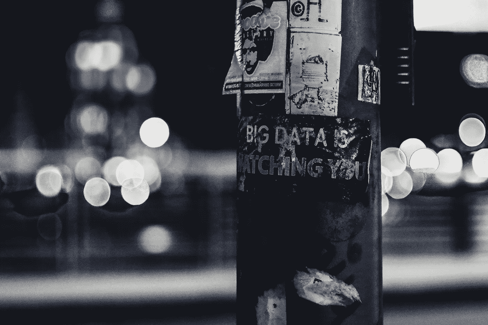

# 监管大型技术的前景

> 原文：<https://towardsdatascience.com/landscape-for-regulating-big-tech-438c06411801?source=collection_archive---------56----------------------->

## [使用公共卫生技术的注意事项](https://towardsdatascience.com/tagged/tech-for-public-health) |第四部分

这是“将技术用于公共健康的预防措施”系列的第四篇文章，讨论了美国即将出台的监管大型技术的立法，并引用了欧盟的例子。

[ev](https://unsplash.com/@ev?utm_source=unsplash&utm_medium=referral&utm_content=creditCopyText) 在 [Unsplash](https://unsplash.com/s/photos/law?utm_source=unsplash&utm_medium=referral&utm_content=creditCopyText) 上的照片

皮尤研究中心揭示，大多数美国人对公司在使用和保护个人数据方面的正当行为缺乏信心。在这个系列中，我们强调了大型科技公司已经并将继续验证这些担忧的几种方式。第一篇[帖子](/precautions-in-using-tech-for-public-health-part-i-technology-is-not-neutral-ff533acbf7e)介绍了新兴技术，以及它们在公共卫生和医疗保健中的使用如何具有歧视性和剥削性，第二篇[帖子](https://anghan.medium.com/precautions-in-using-tech-for-public-health-part-ii-factoring-climate-change-as-an-output-of-265c6afa0e1a)关注技术如何产生电子废物(e-waste)和碳排放，这些废物也危害人类和环境，第三篇[帖子](/precautions-in-using-tech-for-public-health-part-iii-shifting-the-power-dynamics-of-data-987b027c3ede)强调了医疗科技公司如何利用其用户的敏感数据。

虽然之前的博客强调了公共卫生领域的具体问题，但数据和技术可以以多种方式影响人们的健康和福祉。例如，执法部门使用的[面部识别技术(FRTs)](https://www.wired.com/story/defending-black-lives-means-banning-facial-recognition/) 和刑事法律系统使用的[风险评估工具](https://www.technologyreview.com/2019/10/17/75285/ai-fairer-than-judge-criminal-risk-assessment-algorithm/)都显示出种族偏见。这导致了错误的逮捕和不必要的黑人入狱率不成比例。使用首次登记税的非常真实的影响进一步加剧了这些人口由于生活在支持白人至上的社会结构中而已经面临的压力；[“风化”理论](https://www.ncbi.nlm.nih.gov/pmc/articles/PMC1470581/)和[“少数群体压力”模型](https://www.ncbi.nlm.nih.gov/pmc/articles/PMC2072932/)假定，边缘化群体以偏见和歧视的形式经历更大的压力，最终导致更大的健康差距。持续的监视和始终存在的歧视和暴力威胁导致[警惕性增加和慢性压力](https://www.ncbi.nlm.nih.gov/pmc/articles/PMC4434586/)，这可能导致[高血压风险增加、睡眠质量下降和许多其他负面健康后果](https://www.ncbi.nlm.nih.gov/pmc/articles/PMC6532404/)。此外，社会和社区环境的破坏影响了[健康社会决定因素](https://www.healthypeople.gov/2020/topics-objectives/topic/social-determinants-of-health)中的其他潜在因素。少数群体的错误逮捕和不必要的监禁的增加与获得稳定就业和住房的机会减少相一致，这最终会影响一系列与个人福祉相关的因素，如生活条件、食物获取和学校教育质量。因此，需要进行广泛的监督，让各组织对其技术开发和人民数据的使用负责，并限制政府使用歧视性技术。

**国际监管范例**

在实施数据保护和环境法规方面，欧盟(EU)走在了美国的前面，但它仍在努力实施问责机制。[通用数据保护条例(GDPR)](https://gdpr.eu/) 于 2018 年颁布，是一部数据保护法，通过让处理数据的组织对其使用数据负责来保护欧盟公民的隐私。该法律要求组织采取措施来证明他们符合 GDPR 法规。这包括但不限于为员工指定数据保护责任、维护关于数据使用的文档以及实施技术和组织安全措施。该法规可以对违反其限制的组织处以巨额罚款，无论该组织位于何处。然而，这些[罚款还没有被证明是有效的。](https://www.wired.co.uk/article/gdpr-fines)

欧盟还采取了更广泛的措施来回收过时的电子产品，并减少制造这些电子产品时使用的有害材料的数量。2003 年制定的[废弃电气和电子设备(WEEE)指令](https://ec.europa.eu/environment/waste/weee/index_en.htm)就是为了解决这些问题而提出的。欧盟最近更新了这些指令，让成员国对电子垃圾的正确回收更加负责。此外，被发现非法出口废物的成员国将被处以巨额罚款。然而，研究表明，尽管采取了这些严格的措施，欧洲产生的许多电子垃圾最终仍然被错误地管理或在欧洲境内非法交易。

[修复权运动](https://www.ifixit.com/Right-to-Repair/Intro)致力于减轻技术对环境的影响，尤其是电子产品。这一运动的目标是通过要求公司向公众和修理厂公开他们的零件、工具和修理信息，来阻止因修理过于困难而导致的“一次性文化”。今年年初，T2 将开始给电子产品贴上可修复指数的标签。这一举措与[奥地利决定](https://repair.eu/news/austria-makes-repair-more-affordable/)降低可修复服务的税收并为消费者维修提供补贴相一致。这些行动旨在确保消费者优先考虑更容易修复的物品，因此，更持久，这最终可能导致垃圾填埋场的电子垃圾减少。虽然这些措施提高了透明度，但减少电子垃圾的责任不应该仅仅落在消费者身上，还应该迫使企业停止生产计划淘汰的产品。

**联邦层面的考虑**

美国正在采取必要的措施来安装保护措施，以保护美国人的数据。在联邦层面的政策方面，有 2020 年的[国家人工智能倡议法案](https://thehill.com/opinion/technology/531680-landmark-artificial-intelligence-legislation-should-become-law)，该法案提出了人工智能(AI)研究和发展的国家战略。这一新的潜在法律将通过授权国家科学基金会(NSF)和国家标准与技术研究所(NIST)在相应领域，解决培训人工智能熟练劳动力和人工智能系统培训数据标准的需求。此外，参议员艾米·克洛布查尔(Amy Klobuchar)提出了[竞争和反垄断执法改革法案](https://www.klobuchar.senate.gov/public/index.cfm/news-releases?ID=A4EF296B-9072-4244-90AF-54FE43BB0876)，该法案更新并加强了合并法，并为美国联邦贸易委员会(FTC)和司法部的反垄断部门提供了更多资源来执行监管。[谷歌的三起诉讼](https://www.wired.com/story/google-antitrust-lawsuits-explainer/)和针对其他大型科技公司的案件可能会进一步支持新反垄断法的论点，因为它们的反竞争行为和对人们数据的深远访问暴露了这些过时法规的局限性。电子前沿基金会(EFF)发布了一份全面的备忘录，其中包括反垄断改革和保护消费者隐私的建议。虽然手头的任务很艰巨，但拜登政府也有颁布这些法规的紧迫感。

在这些提议的改变之前，还有其他一些监管新兴技术的使用和保护美国人数据的著名提议。例如，纽约州众议员 Yvette Clark 的团队推出了 2019 年的[算法问责法案，该法案要求大公司评估并纠正其机器学习系统中与偏见和歧视有关的问题，并像最近提议的变化一样，将监管权力置于联邦贸易委员会](https://www.congress.gov/bill/116th-congress/house-bill/2231)的[权力之下。2019 年两党](https://www.technologyreview.com/2019/04/15/1136/congress-wants-to-protect-you-from-biased-algorithms-deepfakes-and-other-bad-ai/)[减少在线用户欺骗体验(绕道)法案](https://www.theverge.com/2019/4/9/18302199/big-tech-dark-patterns-senate-bill-detour-act-facebook-google-amazon-twitter?_hsenc=p2ANqtz-___QLmnG4HQ1A-IfP95UcTpIXuMGTCsRP6yF2OjyXHH-66cuuwpXO5teWKx1dOdk-xB0b9)将禁止平台设计用户界面，误导用户在同意让公司访问他们的个人数据之前做出知情决定。最后，参议员谢罗德·布朗的 2020 年[数据问责和透明法案](https://www.banking.senate.gov/newsroom/minority/brown-releases-new-proposal-that-would-protect-consumers-privacy-from-bad-actors)旨在通过创建一个机构来监控公司的数据收集行为，防止大型科技公司商品化个人数据，并给予美国人法律工具来追究这些公司的责任，从而“结束侵入性数据收集”。

像在法国和奥地利一样，维修权利运动在美国也越来越受欢迎。2020 年 8 月，[民主党人在国会提出一项法案，在疫情的推动下，阻止制造商对医疗设备的限制。这项法律将通过提高维修的便利性和降低维修成本来抑制有计划的报废和电子垃圾的产生。除了这种努力，在加速化石燃料开采和“非能源政策”分析的标准实践中，应该有对人工智能使用的监管。](https://www.nytimes.com/2020/10/23/climate/right-to-repair.html?smid=tw-nytclimate&smtyp=cur)[“非能源政策”](https://medium.com/@AINowInstitute/ai-and-climate-change-how-theyre-connected-and-what-we-can-do-about-it-6aa8d0f5b32c)指不明确涉及或披露气候或能源使用，但仍有严重气候影响的政策。走向数字化健康记录的运动是“非能源政策”的一个例子，有必要考虑其能源和气候影响。

除了政策，其他关键的技术专家、学者和活动家也提出了其他形式的联邦层面的问责制。目前的监管机构，如 FTC，可能没有能力处理与监管人工智能相关的社会、技术和法律挑战。当食品药品监督管理局(FDA)正在更新其作为医疗设备的[软件的监管框架](https://www.fda.gov/medical-devices/software-medical-device-samd/artificial-intelligence-and-machine-learning-software-medical-device#regulation)以包括人工智能和机器学习软件时，Joy Buolamwini 和他的同事们提议建立一个[类似于 FDA 的新联邦办公室](https://global-uploads.webflow.com/5e027ca188c99e3515b404b7/5ed1145952bc185203f3d009_FRTsFederalOfficeMay2020.pdf)。虽然他们白皮书的重点是对首次公开募股的监管，但他们对新联邦办公室的核心主张也适用于更通用的人工智能技术。此外，凯茜·奥尼尔博士提议为数据科学家发放[许可证，类似于临床医生和律师。这项工作将涉及标准化的课程和道德标准的制定。任何不道德的违规行为都将导致许可证被吊销，这让数据科学家不必在被解雇或保护公众之间做出选择。这些保障措施可以加强防止伤害和保护人民所需的监督。](https://www.bloomberg.com/opinion/articles/2020-12-07/what-if-data-scientists-had-licenses-like-lawyers)

**正在执行的国家级法规**

在州一级保护人们的数据也取得了一些进展。加州效仿欧盟，于 2018 年颁布了[加州消费者隐私法(CCPA)](https://iapp.org/resources/article/california-consumer-privacy-act-of-2018/) ，而伊利诺伊州自 2008 年以来已经有了[生物识别信息隐私法(BIPA)](http://www.ilga.gov/legislation/ilcs/ilcs3.asp?ActID=3004&ChapterID=57) 。CCPA 管理企业对个人信息的访问、删除和共享。BIPA 规定，如果企业有意收集或披露个人的生物识别信息，必须征得个人同意，安全存储这些生物识别信息，并及时销毁生物识别信息。《BIPA》是美国唯一一部允许个人就侵犯生物识别特征造成的损害提起诉讼的法律。目前，[华盛顿](https://jedii.tech/wa-privacy-legislation-2021/)有几个法案提供类似的保护人们的数据，并禁止国家机构部署歧视性的自动决策系统。尽管取得了这些进步，但仍有需要改进的地方。例如，CCPA 允许公司向选择退出或拒绝分享数据的人收取费用。正如我们在欧盟看到的那样，任何形式的立法都需要实施问责机制来实现变革。

**对创可贴的保障和承诺**

我们需要强有力的法规来限制大技术的进入和权力，而不是把技术的责任完全放在用户身上，否则我们就会面临大技术统治我们的风险。内华达州的立法提案说明了这种替代现实，该提案授权科技公司在其所在地周围的土地上组建政府。“经济发展”的潜力听起来可能很诱人，但治理应该建立在保护人民健康和福祉的基础上，而不是建立在大型科技公司首席执行官认为“正确”的反应和突发奇想上。科技公司已经证明，他们没有能力通过证明以牺牲安全为代价、为了利润而开发和滥用人们的数据以及推卸对其有害行为的责任来进行治理。权力整合的威胁强调了政府和大型科技公司分离的必要性。我们这个系列的最后一篇文章将深入挖掘科技行业中长期压迫的系统性问题，列出技术专家可以用来消除这些问题的资源，并探索专注于正义、自治和主权的其他努力。

[1] Teachout，Z. 2020。把他们分开。圣马丁出版集团:所有要点书籍。

*这篇文章是“将科技用于公共卫生的注意事项”系列的第四篇——查看该系列的第一篇*</precautions-in-using-tech-for-public-health-part-i-technology-is-not-neutral-ff533acbf7e>**[*第二篇*](/precautions-in-using-tech-for-public-health-part-ii-factoring-climate-change-as-an-output-of-265c6afa0e1a) *和* [*第三篇*](/precautions-in-using-tech-for-public-health-part-iii-shifting-the-power-dynamics-of-data-987b027c3ede) *。***

***本博客系列由*[*Priya Govil*](https://medium.com/@priya.govil)*合著。韩瑜和普里亚·戈维尔是健康研究院的工作人员。本博客系列中反映的观点是作者的观点，不一定代表 AcademyHealth 的官方立场。***