# 了解朗之万动力学背后的数学概念

> 原文：<https://towardsdatascience.com/langevin-dynamics-29bbb9407b47?source=collection_archive---------9----------------------->

## 物理学(一如既往)丰富了

[图像的来源](https://images.unsplash.com/photo-1520391508-2acb23f8f7bd?ixid=MnwxMjA3fDB8MHxwaG90by1wYWdlfHx8fGVufDB8fHx8&ixlib=rb-1.2.1&auto=format&fit=crop&w=675&q=80)

在这篇文章中，我的目标是总结一篇由**马克斯·韦林**和**伊惠德**撰写的相当“老”[的论文](http://www.stats.ox.ac.uk/~teh/research/compstats/WelTeh2011a.pdf)。它提出了 ***随机梯度朗之万动力学***(***SGLD***)的概念。如今[是](https://arxiv.org/pdf/2006.09011.pdf?fbclid=IwAR3Qd20kXF2SWX8w_rEJrmQUw49J-1Kasi5iKIpLzt5PFpjt_2mgVSkgorg) [越来越多地使用](https://arxiv.org/pdf/1912.03263.pdf) [的一种方法。](https://arxiv.org/pdf/1907.05600.pdf?fbclid=IwAR1-NOzSZvko16JA2ncyKETiRpgJvQJYv2dhoihksDhddjAd2-2q3gx0A4w)

我的动机是展示推动 SGLD 前进的数学概念。对于那些可能觉得乏味的人，你可以简单地采用方法论，忽略严谨的部分

# 时代思潮ˌ时代精神

正如我提到的，这篇论文是大约 10 年前写的。与今天相比，那个时期的 ML 既相似又不同:

*   相似的——网络和现代计算提供的大量数据极大地促进了人工智能的发展，许多研究人员对它产生了热情
*   **不同的**——DL 还不常见

因此，ML 研究主题略有不同:

研究人员认为神经网络是一种有前途的工具，但仍然只是另一种工具，如决策树或朴素贝叶斯。贝叶斯方法(对于理解作者的动机是必不可少的)在大量的学术培训中是强制性的。

为了对 21 世纪第一个十年的 ML 研究有一个更广阔的视野，我推荐阅读诸如[杜达](https://www.amazon.com/Pattern-Classification-Pt-1-Richard-Duda/dp/0471056693?)或[主教](http://users.isr.ist.utl.pt/~wurmd/Livros/school/Bishop%20-%20Pattern%20Recognition%20And%20Machine%20Learning%20-%20Springer%20%202006.pdf?)的书籍

作为一个轶事，主要作者，Max Welling 是该学院的贝叶斯研究员，并就此主题撰写了论文。但 DL 来到了小镇，2013 年他发表了一篇论文 [***自动编码变分贝叶斯***](https://arxiv.org/pdf/1312.6114.pdf) 成为了 VAE 的基础。说明 DL 吞并了大家。

## 数学工具

为了更好地理解这篇论文，我们必须熟悉一些数学工具:

*   贝叶斯方法
*   大都会黑斯廷斯
*   随机优化
*   朗之万方程

我将简要描述这些工具

## 贝叶斯方法

显然，这是一个出现在许多领域的广泛话题。然而，贝叶斯问题很容易描述。我们有一组观察值(实验的图像、数字或分类结果)，表示为**x。**我们假设观察值由分布 ***P*** 生成，其形状(例如高斯或均匀)已知，但其超参数*未知。*

*因此，我们的目标是找到 ***H.*** 在更正式的术语中，我们有贝叶斯公式:*

*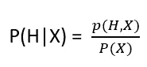*

*因为*

*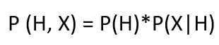*

*我们有*

*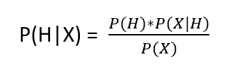*

*如您所见，分母独立于 ***H.*** 此外，我们可以注意到 P(X)通常很难处理，例如，当您希望估计概率以获得单个观察值时，请考虑 GMM。*

*我们可以重写*

*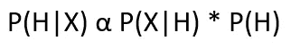*

*   *P(H) - **先验分布**超参数的分布(正如我们所相信的)*
*   *P(X|H)- **似然，**获取观测值的概率假设超参数值集*
*   *P(H|X) — **后验分布***

*因此，贝叶斯问题是关于寻找**后验分布**，其中我们假设:*

*   *后牙有一定的形状*
*   *超参数是从之前的给定**中提取的***

## *例子*

*   *当我们研究高斯分布时，我们通常假设均值本身来自高斯分布，标准差来自某个伽玛分布*
*   *一个二元序列，我们假设它有一个二项式分布，其中它的 P 是从贝塔分布中抽取的。*

*提供最优后验分布的解我们称之为**最大后验估计(MAP)***

*对于熟悉 MLE 解决方案的读者来说，MAP 与 MLE 的区别仅在于前者。*

## *大都会黑斯廷斯*

*我曾经写过一篇关于这种[方法](https://medium.com/nerd-for-tech/metropolis-hastings-review-2dfeb0c3d0eb)(吹牛的权利)的文章，显然网络上有更好的来源。这是一种 MCMC 采样方法，通常用于寻找后验分布，因为它依赖于马尔可夫链收敛特性来获得所需的参数。*

*   *在每一步中，我们从一个**提议函数**中抽取一个样本，通常它的参数取决于前一个样本。这个函数往往是“简单的”:比如高斯*
*   ***接受\拒绝步骤**——我们将新样本与其“前一个”样本进行比较，如果新样本的得分更大，我们就接受它，否则我们仍然使用前一个样本。*

*这是一个无偏差的算法，但有一个巨大的方差(许多其他采样算法)。这种算法的主要缺点是必须对整个数据进行多次迭代，也就是说，不能使用复杂的技巧，如使用小批量。*

## *随机优化*

*由 [Robbins & Monro](https://projecteuclid.org/journals/annals-of-mathematical-statistics/volume-22/issue-3/A-Stochastic-Approximation-Method/10.1214/aoms/1177729586.full) 在 50 年代早期发表的一种算法提供了对以下问题的解决方案:*

*设***f***a*函数和 **b** a 实数并且有解**

**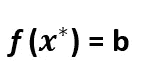**

**我们不能直接测量 ***f*** 的值，但是我们可以测量一个函数 ***g*** 使得**

**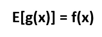**

**下面的公式收敛到所需的解:**

**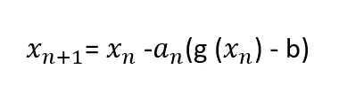**

**对于条件:**

**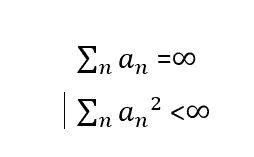**

**如果我们尝试将贝叶斯方法的小节与这一部分联系起来，我们可以猜测随机优化是一种寻找地图解的好方法**

## **朗之万方程**

**朗之万方程描述了作用在花粉粒上的力，它是布朗在 1827 年开始的研究的一个发展**

**可以这样写:**

**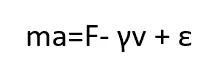**

**在哪里**

****m-质量****

****a-加速度****

****垂直速度****

****F 力****

****ε-均值为 0 且方差与时间成比例的随机项****

**由于质量很小，LHS 可以忽略不计。众所周知，速度是位置的时间导数，力是势梯度。**

**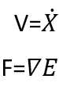**

**朗之万方程变成了:**

**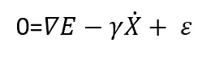**

**现在让我们对时间导数做一些离散化:**

**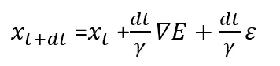**

**如果我们忽略最后一项，我们得到了每个数据科学家都见过一次的东西。**

## **有意思吗？**

**是的。从物理学上我们知道，方程的稳态解允许从后验分布中取样。我暗示过贝叶斯方法因缺乏小批量技术而遭受损失**

**如果我们有一个工具:**

*   **可以用一种很好的“可分级”的方式来写(对于小批量来说，分级很好)**
*   **知道在哪里汇合**

**也许我们能够找到一种很好的方法来进行贝叶斯研究。**

**在我们前进之前，人们还可以注意到**

****

**可以认为是 Metropolis Hastings 的均值方差对:**

**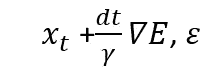**

**这将问题修改为“我们知道它可能工作，我们只需要研究接受\拒绝机制”**

# **让我们造纸吧**

## **第一部分**

**正如我在**时代精神**一节中所描述的，作者们在这段时间对 ML 进行了高水平的调查。他们提到了大量的数据，这些数据提高了对好的 ML 的需求，以及在这个领域确实发生的进步。根据作者的观点(他们是对的)，ML 无处不在:视觉、语言和语音处理。这一进展提高了对具有两个重要特性的算法的需求:**

*   **它们可以在最优化问题中表现出稳健的收敛性**
*   **他们能很好地处理大量的数据**

****随机优化**两者皆有，这是一种优化算法，因为它依赖于误差测量，可以用于小批量。**

**现在作者开始讨论贝叶斯方法。这些方法在“ML 进步党”里是没有的。他们既不擅长在线处理，也不擅长处理大量数据。乍一看，人们可以说这是告别的时候了。不再需要贝叶斯方法。然而，这些方法具有两个重要的特性:**

*   **他们处理得很好**
*   **他们可以量化模型不确定性**

**由于我们处理的是巨大的数据集，过度拟合几乎总是一个问题，而且随着模型变得越来越复杂，评估其风险的需求就变得不可避免。因此不要放弃贝叶斯方法。**

## **论文的想法**

**让我们结合随机优化和朗之万动力学来使用贝叶斯方法。前者将把我们带到 MAP 解，后者将建议一个稳定的后验采样机制。**

## **第二部分**

**在这一节中，作者描述了贝叶斯问题的随机优化的实现。**

**回想一下, **X** 是观察数据，表示参数设置为**

**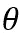**

**优化问题的更新步骤是:**

**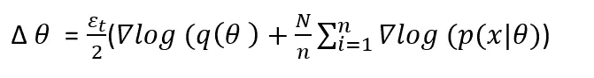**

**其中 N 是小批量的大小，N 是数据量。爱普西龙满足罗宾斯和门罗条件。这样的解收敛于映射。这是一个很好的解决方案，但它不提供不确定性估计，并且明显容易过度拟合。下一步是针对朗之万方程修改随机优化**

**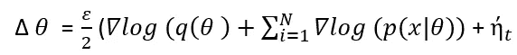**

**对于**问**的先验。最后一项是零均值噪声项，也是要研究的方差。注意这个方程是朗之万方程的离散形式(它是一个**随机微分方程** - **SDE** )，它的解是一个后验分布。我们还不知道这种离散化是否保持了所需的收敛性。然而，我们知道，由于这个解类似于 Metropolis Hastings，如果我们很好地控制ε的减少，我们可以得到满足要求的低拒绝率。**

**可以看出，从数据科学的角度来看，该论文简单地建议**

**“做 SGD 的时候，简单加高斯噪声，仔细检查方差就行了”。**

## **第三节**

**所以我们讨论了朗之万离散方程**

****

**现在，我们希望检查它是否适用于小批量解决方案。也就是说，它可以近似为**

**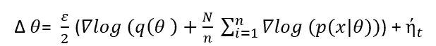**

**其中:**

****

****注:在论文中，写的是****

**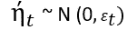**

****这是一个错误。****

**现在我们可以将随机优化与朗之万动力学结合起来**

*   **我们构建满足 R&B 条件的ε序列(例如，递减为**

**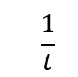**

*   **在运行的早期，随机部分占主导地位，我们简单地将它添加为零均值项(如 R&B 所允许的)**
*   **系统走向地图解决方案**
*   **当我们接近地图时:**

**1.两个相邻步骤之间的比率收敛到 1(因此废品率变为 0)**

**2.ε衰变，因此梯度部分被忽略，朗之万项起支配作用。**

**这是为什么呢？由于我们正在接近地图，梯度项变得很小，这意味着我们可以在它周围创建一个嘈杂的步骤，这提供了大部分的波动(简单地说，因为我们是在固定点附近)**

**在这个阶段，我们可以简单地从朗之万方程开始采样，通过 MH 和物理学知道我们是从后验采样。**

**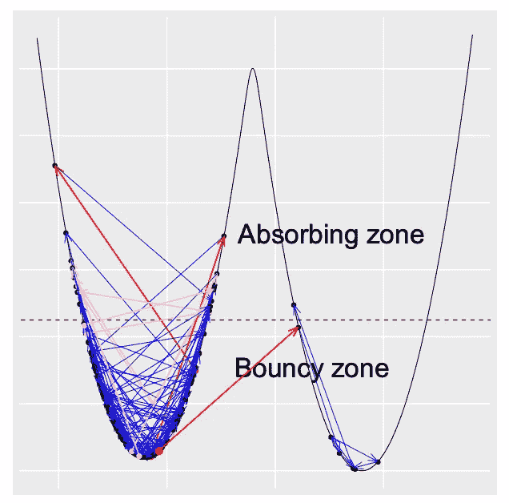**

**图像[来源](https://paperswithcode.com/media/methods/Screen_Shot_2020-11-04_at_9.08.22_PM_qx9FEwa.png)**

## **让我们严格-选修**

**我们现在希望证明小批量解收敛于离散解。**

**即:**

**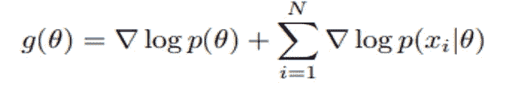**

**遵循这个**

**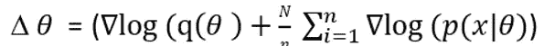****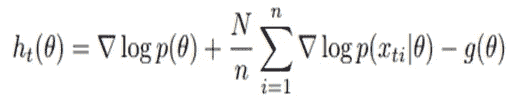**

**我们可以采用“批量”朗之万方程:**

**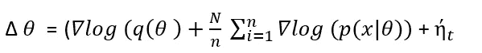**

**并重写为:**

**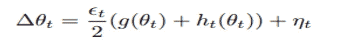**

**其中:**

**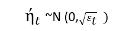**

**第一项的方差是**

**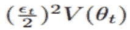**

**对于有限 v。**

**当ε衰减到 0 时，朗之万方差遵循ε大小，而随机项具有ε平方大小的方差。因此，朗之万项成为主导。**

**最后一部分使用马尔可夫性质表明样本收敛于所需的后验分布，**

## **第四节**

**如上所述，我们经常使用贝叶斯问题的抽样算法(即寻找后验)。我们展示了一个抽样，它提出了两个问题:**

*   **转变点是什么时候**
*   **MC 估计量的期望值是什么**

## **过渡时间**

**跃迁时间是朗之万方程开始支配的点，我们可以假设它的输出很好地反映了所需的后验分布。因为梯度对于不同的方向可能具有不同的比例。我们引入一个矩阵 M 来缩放梯度方向(人们可以把 M 看作是对**批量标准化**的模拟)。我们可以将更新步骤编写如下:**

**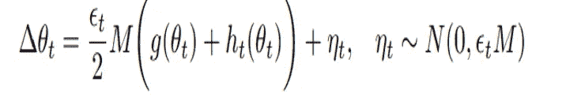**

**回想一下，随机项的方差是**

**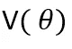**

**根据 CLT 公式，我们预计 h 在 g 附近的误差服从正态分布。在一系列非常简单的计算中，我们得到这个方差大约是**

**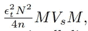**

**其中 Vs 是经验协方差矩阵。我们希望 M 的条件是**

**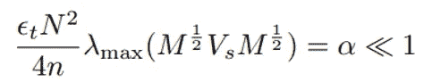**

**其中λ是λ的最大特征值，这意味着我们需要选择一个遵循α条件的步长，以验证我们是否达到了朗之万机制。**

## **后验预期**

**我们生成一系列样本**

**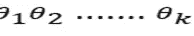**

**这个序列的预期表现为它是从一个后验分布中抽取的，*我们有***

***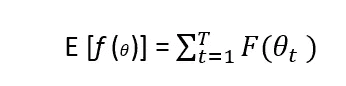***

***由于ε衰变，我们期望一种不同于常规马尔可夫链的方式:这里我们可能在终止阶段有更强的相关性。我们希望减少这种情况，因此我们可以给 MC 估计量增加权重***

***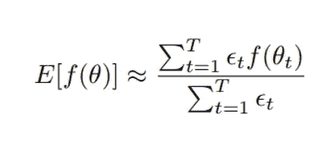***

# ***例子***

## ***高斯的***

***让我们采样如下:***

***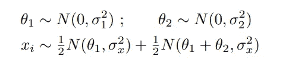******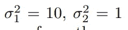******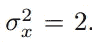***

***获得的图***

***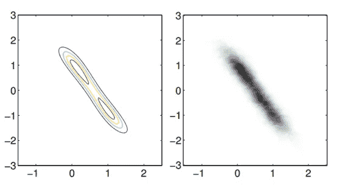***

***摘自[论文](http://www.stats.ox.ac.uk/~teh/research/compstats/WelTeh2011a.pdf)***

***该图比较了真实后验数据和样本数据***

***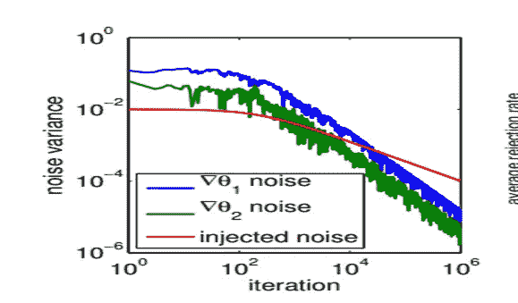***

***摘自[论文](http://www.stats.ox.ac.uk/~teh/research/compstats/WelTeh2011a.pdf)***

***这个图表显示了相变***

## ***逻辑回归***

***我们提出了逻辑回归问题，并用 SGLD 解决了这个问题***

***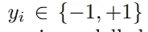******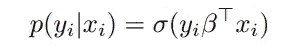******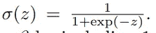***

***β参数具有标度=1 的拉普拉斯先验分布***

***我们有***

***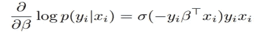***

***在 **a9a** 数据集上进行试验，获得了以下图形:***

***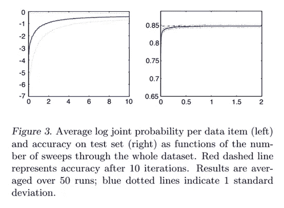***

***来自[论文](http://www.stats.ox.ac.uk/~teh/research/compstats/WelTeh2011a.pdf)的图表***

# ***摘要***

***这个算法被描述为“每计算单位最精确的”(不确定是否仍然正确)。进一步研究的主要动机是开发用于 MCMC 的小批量梯度方法。作者强调需要一个连贯的理论来描述一些细节，如收敛速度和接受拒绝步骤。显然，SGLD 有望成为动力系统和衍生采样方法(如 HMC)的兼容工具***

## ***今天用在哪里？***

***有很多文章，比如在文章开头提到的那些，人们以不同的方式将噪声项添加到梯度中。***

***SGLD 经常被讨论的一个话题是 BNN，在那里后验分布是训练目标。因此，为此目的使用小批量的概念是有吸引力的，它是与变分推理一起使用的常用工具。***

## ***承认***

***这篇文章是一个惊人的[项目](https://www.facebook.com/hashtag/deepnightlearners)**#**[**deep night learners**](https://www.linkedin.com/groups/9024733/)**的一部分，该项目由迈克·埃尔里克森和阿夫拉哈姆·拉维夫领导，在以色列进行。*****

*****此外，我还要感谢 Amit Miller 和 Uri Itai，感谢他们进行了大量讨论并提供了相关文件。*****